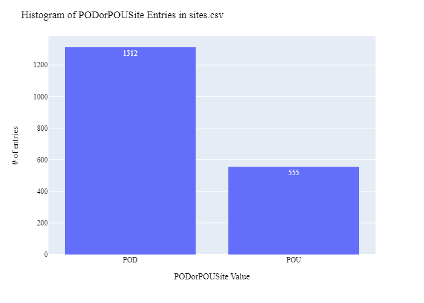
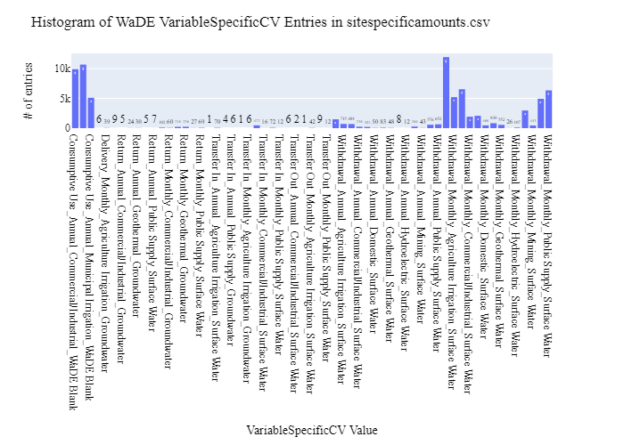
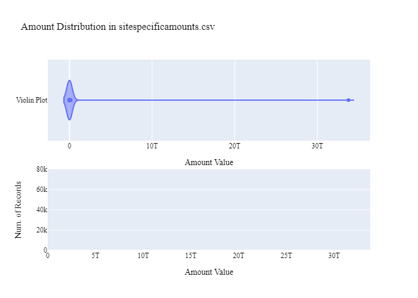

# "XX" Site-Specific Public Supply Time Series Data Preparation for WaDE
This readme details the process that was applied by the staff of the [Western States Water Council (WSWC)](http://wade.westernstateswater.org/) to extracting site-specific public supply time series data made available by the [("XX")](""), for inclusion into the Water Data Exchange (WaDE) project.  WaDE enables states to share data with each other and the public in a more streamlined and consistent way.  WaDE is not intended to replace the states data or become the source for that data but rather to enable regional analysis to inform policy decisions and for planning purposes. 

## Overview of Source Data Utilized
The following data was used for water allocations...

Name | Description | Download Link | Metadata Glossary Link
---------- | ---------- | ------------ | ------------
"put input files name here" | "put description here" | [link]("link to download here) | [link]("link to Metadata here) / or not provided

Input files used are as follows...
- "put input files name here"
 

## Storage for WaDE 2.0 Source and Processed Water Data
The 1) raw input data shared by the state / state agency / data provider (excel, csv, shapefiles, PDF, etc), & the 2) csv processed input data ready to load into the WaDE database, can both be found within the WaDE sponsored Google Drive.  Please contact WaDE staff if unavailable or if you have any questions about the data.
- "XX" Site-Specific Public Supply Time Series Data: [link]("put WaDE Google Doc link here")

## Summary of Data Prep
The following text summarizes the process used by the WSWC staff to prepare and share "XX"'s site-specific public supply time series data for inclusion into the Water Data Exchange (WaDE 2.0) project.  For a complete mapping outline, see *XXssps_Public Supply Water Use Schema Mapping to WaDE.xlsx*.  Several WaDE csv input files will be created in order to extract the "XX"'s site-specific public supply time series data from the above mentioned input.  Each of these WaDE csv input files was created using the [Python](https://www.python.org/) native language, built and ran within [Jupyter Notebooks](https://jupyter.org/) environment.  Those python files include the following...

- **1_XXssps_PreProcessAllocationData.ipynb**: used to pre-processes the native date into a WaDE format friendly format.  All datatype conversions occur here.
- **2_XXssps_CreateWaDEInputFiles.ipynb**: used to create the WaDE input csv files: methods.csv, variables.csv, organizations.csv, watersources.csv, sites.csv, sitespecificamounts.csv, podsitetopousiterelationships.csv.
- **3_XXssps_WaDEDataAssessmentScript.ipynb**: used to evaluate the WaDE input csv files.

***
### 0) Code File: 1_XXssps_PreProcessAllocationData.ipynb
Purpose: Pre-process the state agency's input data files and merge them into one master file for simple dataframe creation and extraction.

#### Inputs: 
- "put input files name here"

#### Outputs:
 - Pssps_xxMain.zip

#### Operation and Steps:
- "fill in description of what to do for pre-processing steps here"

***
## Code File: 2_XXssps_CreateWaDEInputFiles.ipynb
Purpose: generate WaDE csv input files (methods.csv, variables.csv, organizations.csv, watersources.csv, sites.csv, sitespecificamounts.csv, podsitetopousiterelationships.csv).

#### Inputs:
- Pssps_xxMain.zip

#### Outputs:
- methods.csv  `Create by hand.`
- variables.csv  `Create by hand.`
- organizations.csv  `Create by hand.`
- watersources.csv
- sites.csv
- sitespecificamounts.csv
- podsitetopousiterelationships.csv

## 1) Method Information
Purpose: generate legend of granular methods used on data collection.

#### Operation and Steps:
- Generate single output dataframe *outdf*.
- Populate output dataframe with *WaDE Method* specific columns.
- Assign state info to the *WaDE Method* specific columns (this was hardcoded by hand for simplicity).
- Assign method UUID identifier to each (unique) row.
- Perform error check on output dataframe.
- Export output dataframe *methods.csv*.

#### Sample Output (WARNING: not all fields shown):
MethodUUID | ApplicableResourceTypeCV | MethodTypeCV
---------- | ---------- | ------------
- "copy paste markdown table values here"

## 2) Variables Information
Purpose: generate legend of granular variables specific to each state.

#### Operation and Steps:
- Generate single output dataframe *outdf*.
- Populate output dataframe with *WaDE Variable* specific columns.
- Assign state info to the *WaDE Variable* specific columns (this was hardcoded by hand for simplicity).
- Assign variable UUID identifier to each (unique) row.
- Perform error check on output dataframe.
- Export output dataframe *variables.csv*.

#### Sample Output (WARNING: not all fields shown):
VariableSpecificUUID | AggregationIntervalUnitCV | AggregationStatisticCV | AmountUnitCV
---------- | ---------- | ------------ | ------------
- "copy paste markdown table values here"

## 3) Organization  Information
Purpose: generate organization directory, including names, email addresses, and website hyperlinks for organization supplying data source.

#### Operation and Steps:
- Generate single output dataframe *outdf*.
- Populate output dataframe with *WaDE Organizations* specific columns.
- Assign state info to the *WaDE Organizations* specific columns (this was hardcoded by hand for simplicity).
- Assign organization UUID identifier to each (unique) row.
- Perform error check on output dataframe.
- Export output dataframe *organizations.csv*.

#### Sample Output (WARNING: not all fields shown):
OrganizationUUID | OrganizationName | OrganizationContactName | OrganizationWebsite
---------- | ---------- | ------------ | ------------
- "copy paste markdown table values here"

## 4) Water Source Information
Purpose: generate a list of water sources specific to a water right.

#### Operation and Steps:
- Read the input file and generate single output dataframe *outdf*.
- Populate output dataframe with *WaDE WaterSources* specific columns.
- Assign agency info to the *WaDE WaterSources* specific columns.  See *XXssps_Public Supply Water Use Schema Mapping to WaDE.xlsx* for specific details.  Items of note are as follows...
    - *WaterSourceUUID* = ""
    - *WaterQualityIndicatorCV* = ""
    - *WaterSourceName* = ""
    - *WaterSourceNativeID* = ""
    - *WaterSourceTypeCV* = ""
- Consolidate output dataframe into water source specific information only by dropping duplicate entries, drop by WaDE specific *WaterSourceName* & *WaterSourceTypeCV* fields.
- Assign water source UUID identifier to each (unique) row.
- Perform error check on output dataframe.
- Export output dataframe *WaterSources.csv*.

#### Sample Output (WARNING: not all fields shown):
WaterSourceUUID | WaterQualityIndicatorCV | WaterSourceName | WaterSourceNativeID | WaterSourceTypeCV
---------- | ---------- | ------------ | ------------ | ------------
- "copy paste markdown table values here"

Any data fields that are missing required values and dropped from the WaDE-ready dataset are instead saved in a separate csv file (e.g. *watersources_missing.csv*) for review.  This allows for future inspection and ease of inspection on missing items.  Mandatory fields for the water sources include the following...
- WaterSourceUUID
- WaterQualityIndicatorCV
- WaterSourceTypeCV

## 5) Site Information
Purpose: generate a list of sites information.

#### Operation and Steps:
- Read the input file and generate single output dataframe *outdf*.
- Populate output dataframe with *WaDE Site* specific columns.
- Assign agency info to the *WaDE Site* specific columns.  See *XXssps_Public Supply Water Use Schema Mapping to WaDE.xlsx* for specific details.  Items of note are as follows...
    - *SiteUUID* = ""
    - *WaterSourceUUIDs* = Extract *WaterSourceUUID* from waterSources.csv input csv file. See code for specific implementation of extraction.
    - *CoordinateAccuracy* = ""
    - *CoordinateMethodCV* = ""
    - *Country* = ""
    - *EPSGCodeCV* = ""
    - *Geometry* = ""
    - *GNISCodeCV* = ""
    - *HUC12* = ""
    - *HUC8* = ""
    - *Latitude* = ""
    - *Longitude* = ""
    - *NHDNetworkStatusCV* = ""
    - *NHDProductCV* = ""
    - *PODorPOUSite* = ""
    - *SiteName* = ""
    - *SiteNativeID* = ""
    - *SiteTypeCV* = ""
    - *StateCV* = ""																			
    - *USGSSiteID* = ""
- Consolidate output dataframe into site specific information only by dropping duplicate entries, drop by WaDE specific *SiteNativeID*, *SiteName*, *SiteTypeCV*, *Longitude* & *Latitude* fields.
- Assign site UUID identifier to each (unique) row.
- Perform error check on output dataframe.
- Export output dataframe *sites.csv*.

#### Sample Output (WARNING: not all fields shown):
SiteUUID | WaterSourceUUID | Latitude | Longitude | PODorPOUSite | SiteName | SiteTypeCV
---------- | ---------- | ------------ | ------------ | ------------ | ------------ | ------------
- "copy paste markdown table values here"

Any data fields that are missing required values and dropped from the WaDE-ready dataset are instead saved in a separate csv file (e.g. *sites_missing.csv*) for review.  This allows for future inspection and ease of inspection on missing items.  Mandatory fields for the sites include the following...
- SiteUUID 
- CoordinateMethodCV
- EPSGCodeCV
- SiteName

## 6) SiteSpecificAmounts Information
Purpose: generate master sheet of site-specific amount information to import into WaDE 2.0.

#### Operation and Steps:
- Read the input files and generate single output dataframe *outdf*.
- Populate output dataframe with *WaDE site-specific amount* specific columns.
- Assign agency info to the *WaDE site-specific amount* specific columns.  See *XXssps_Public Supply Water Use Schema Mapping to WaDE.xlsx* for specific details.  Items of note are as follows...
    - Extract *MethodUUID*, *VariableSpecificUUID*, *OrganizationUUID*, *WaterSourceUUID*, & *SiteUUID* from respective input csv files. See code for specific implementation of extraction.
    - *Amount* = ""
    - *AssociatedNativeAllocationIDs* = ""
    - *BeneficialUseCategory* = ""
    - *CommunityWaterSupplySystem* = ""
    - *CropTypeCV* = ""
    - *CustomerTypeCV* = ""
    - *DataPublicationDate* = ""
    - *DataPublicationDOI* = ""
    - *Geometry* = ""
    - *IrrigatedAcreage* = ""
    - *IrrigationMethodCV* = ""
    - *PopulationServed* = ""
    - *PowerGeneratedGWh* = ""
    - *PowerType* = ""
    - *PrimaryUseCategory* = ""
    - *ReportYearCV* = ""
    - *SDWISIdentifier* = ""
    - *TimeframeEnd* = ""
    - *TimeframeStart* = ""
																						
- Perform error check on output dataframe.
- Export output dataframe *sitespecificamounts.csv*.

#### Sample Output (WARNING: not all fields shown):
- "copy paste markdown table values here"

Any data fields that are missing required values and dropped from the WaDE-ready dataset are instead saved in a separate csv file (e.g. *sitespecificamounts_missing.csv*) for review.  This allows for future inspection and ease of inspection on missing items.  Mandatory fields for the site-specific amount include the following...
- MethodUUID
- VariableSpecificUUID
- OrganizationUUID
- SiteUUID
- BeneficialUseCategory
- Amount
- DataPublicationDate

### 7) POD -To- POU Site Relationships
Purpose: generate linking element between POD and POU sites that share the same WaDE CommunityWaterSupplySystem entry in sitespecificamounts.csv
Note: podsitetopousiterelationships.csv output only needed if both POD and POU data is present,  `otherwise produces empty file.`

#### Operation and Steps:
- Read the sites.csv & sitespecificamounts.csv input files.
- Create three temporary dataframes: one for sitespecificamounts, & two for site info that will store POD and POU data separately.
- For the temporary POD dataframe...
  - Read in site.csv data from sites.csv with a _PODSiteUUID_ field = POD only.
  - Create _PODSiteUUID_ field = _SiteUUID_.
- For the temporary POU dataframe
  - Read in site.csv data from sites.csv with a _PODSiteUUID_ field = POU only.
  - Create _POUSiteUUID_ field = _SiteUUID_.
- For the temporary sitespecificamounts dataframe, explode _SiteUUID_ field to create unique rows.
- Left-merge POD & POU dataframes to the sitespecificamounts dataframe via _SiteUUID_ field.
- Consolidate sitespecificamounts dataframe by grouping entries by _CommunityWaterSupplySystem_ filed.
- Explode the consolidated sitespecificamounts dataframe again using the _PODSiteUUID_ field, and again for the _POUSiteUUID_ field to create unique rows.
- Perform error check on sitespecificamounts dataframe (check for NaN values)
- If sitespecificamounts is not empty, export output dataframe _podsitetopousiterelationships.csv_.

***
## Source Data & WaDE Complied Data Assessment
The following info is from a data assessment evaluation of the completed data...

Dataset | Num of Source Entries (rows)
---------- | ---------- 
**"{name of data}"** | "fill value here"

Dataset  | Num of Identified PODs | Num of Identified POUs | Num of Identified Water Use Records
---------- | ------------ | ------------ | ------------
**Compiled WaDE Data** | "fill value here" | "fill value here" | "fill value here"

Assessment of Removed Source Records | Count | Action
---------- | ---------- | ----------
"what was removed" | "count of entries removed" | "action taken (il.e., removed from sites.csv)"input

**Figure 1:** Distribution of POD vs POU Sites within the sites.csv

**Figure 2:** Distribution Sites by WaterSourceTypeCV within the sites.csv

**Figure 3:** Distribution of VariableSpecificCV WaDE Values within the sitespecificamounts.csv

**Figure 4:** Distribution of Identified Beneficial Uses within the sitespecificamounts.csv

**Figure 5:** Distribution & Range of Amount (CFS) within the sitespecificamounts.csv

**Figure 6:** Map of Identified Points within the sites.csv

**Figure 7:** Map of Identified Polygons within the sites.csv

***
## Staff Contributions
Data created here was a contribution between the [Western States Water Council (WSWC)](http://wade.westernstateswater.org/) and the [("XX")]("").

WSWC Staff
- Ryan James <rjames@wswc.utah.gov>

"XX" Staff
- asdf
