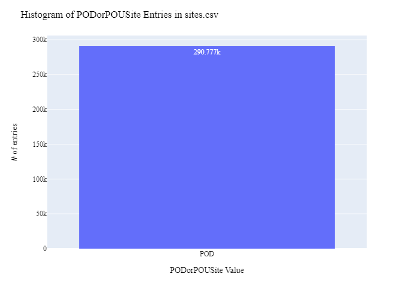
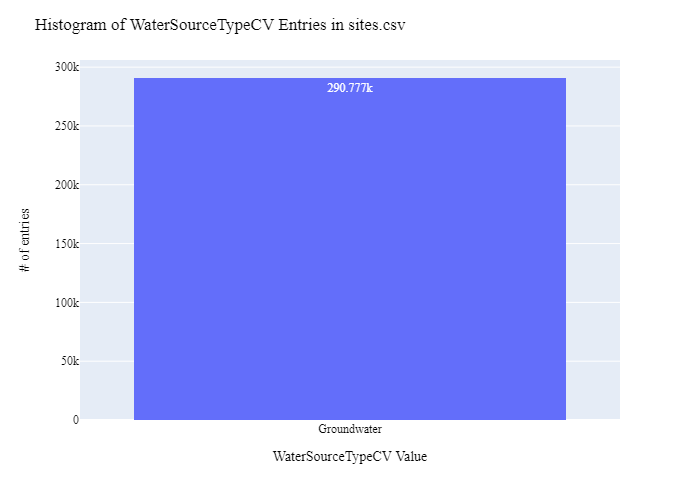
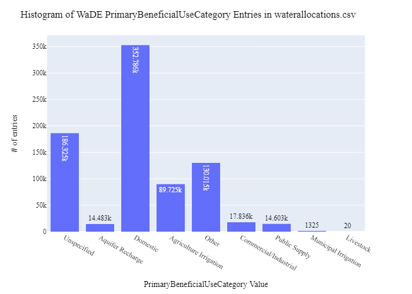
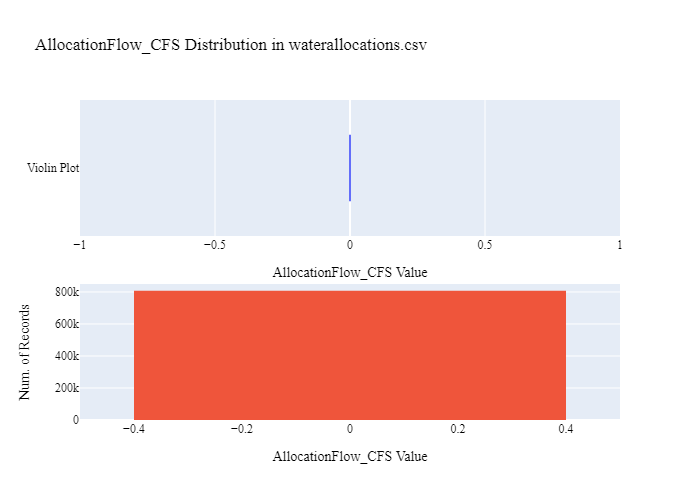
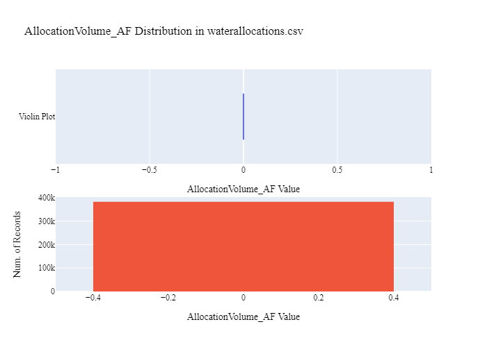
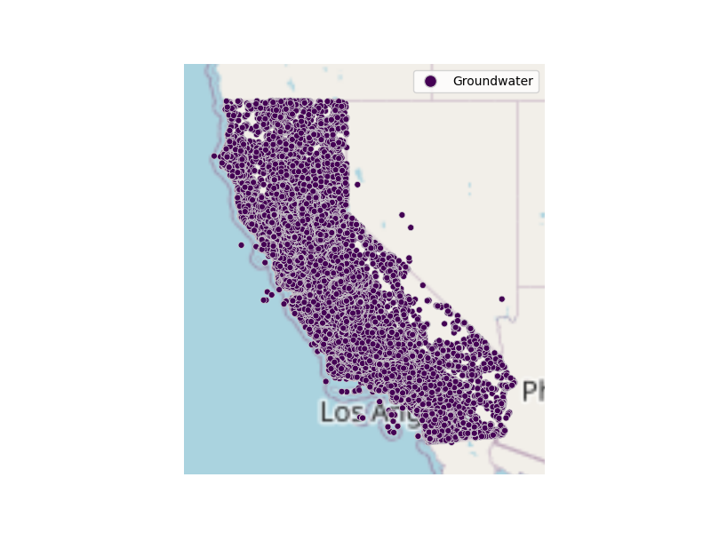
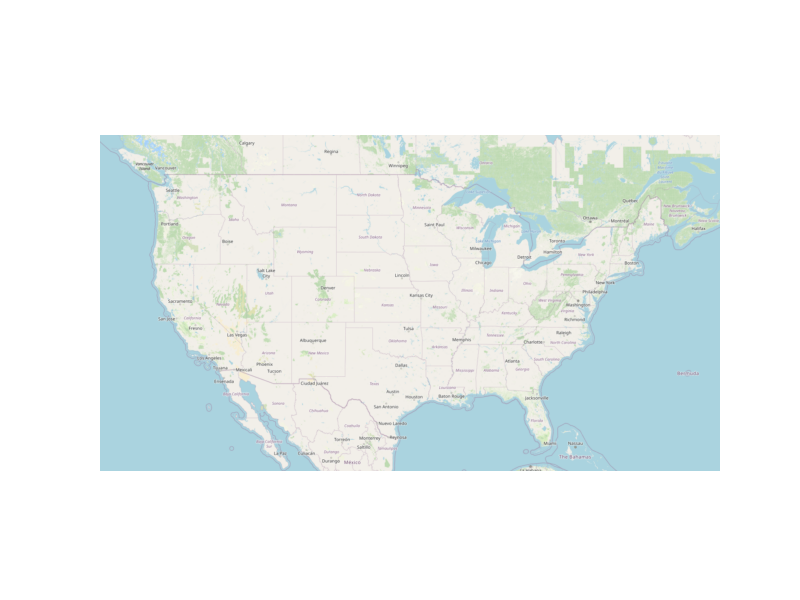

# California Department of Water Resources (CADWR) Water Rights (Allocation) Data Preparation for WaDE
This readme details the process that was applied by the staff of the [Western States Water Council (WSWC)](http://wade.westernstateswater.org/) to extracting water rights data made available by the [California Department of Water Resources (CADWR)](https://water.ca.gov/), for inclusion into the Water Data Exchange (WaDE) project.  WaDE enables states to share data with each other and the public in a more streamlined and consistent way. WaDE is not intended to replace the states data or become the source for that data but rather to enable regional analysis to inform policy decisions and for planning purposes. 

## Overview of Source Data Utilized
The following data was used for water allocations...

Name | Description | Download Link | Metadata Glossary Link
---------- | ---------- | ------------ | ------------
**WellCompletionReports** | Well Completion Report | [link](https://data.cnra.ca.gov/dataset/well-completion-reports/resource/8da7b93b-4e69-495d-9caa-335691a1896b) | Visit download site for Data Dictionary Download
**WellCompletionReportPDFLinks** | WCRLink Report | [link](https://data.cnra.ca.gov/dataset/well-completion-reports/resource/bff565b3-b3b4-4727-b10b-e09e0012ec3b) | Visit download site for Data Dictionary Download

## Storage for WaDE 2.0 Source and Processed Water Data
The 1) raw input data shared by the state / state agency / data provider (excel, csv, shapefiles, PDF, etc), & the 2) csv processed input data ready to load into the WaDE database, can both be found within the WaDE sponsored Google Drive.  Please contact WaDE staff if unavailable or if you have any questions about the data.
- California Department of Water Resources (CADWR) Allocation Data: "{https web link address to the WaDE google doc where we are storing the data}"

## Summary of Data Prep
The following text summarizes the process used by the WSWC staff to prepare and share water rights data for inclusion into the Water Data Exchange (WaDE 2.0) project.  For a complete mapping outline, see *CADWRwr_Allocation Schema Mapping to WaDE.xlsx*.  Several WaDE csv input files will be created in order to extract the water rights data from the above mentioned input.  Each of these WaDE csv input files was created using the [Python](https://www.python.org/) native language, built and ran within [Jupyter Notebooks](https://jupyter.org/) environment.  Those python files include the following...

- **1_CADWRwr_PreProcessAllocationData.ipynb**: used to pre-processes the native date into a WaDE format friendly format.  All datatype conversions occur here.
- **2_CADWRwr_CreateWaDEInputFiles.ipynb**: used to create the WaDE input csv files: methods.csv, variables.csv, organizations.csv, watersources.csv, sites.csv, waterallocations.csv, podsitetopousiterelationships.csv.
- **3_CADWRwr_WaDEDataAssessmentScript.ipynb**: used to evaluate the WaDE input csv files.

***
## Code File: 1_CADWRwr_PreProcessAllocationData.ipynb
Purpose: Pre-process the input data files and merge them into one master file for simple dataframe creation and extraction.

#### Inputs: 
- WellCompletionReports.zip
- WellCompletionReportPDFLinks.zip

#### Outputs:
 - Pwr_caMain.zip

#### Operation and Steps:
Using Jupyter Notebook in Python(which is what this is written in and with) is a simple way to run this operation.
- Note: Groundwater use does not fall under prior appropriation in CA.  So we will not add all required WaDE water allocation information (i.e., priority date).
- Read in the input file. Create temporary POD dataframes.
- Generate WaDE specific field WaterSourceTypeCV from CADWR source field (see preprocessed code for specific dictionary used).
- Merge left that output with WellCompletionReportPDFLinks.csv based on **WCRNNUMBER** input.
- Generate WaDE specific field SiteNativeID from WaDE Latitude, Longitude, SiteTypeCV & SiteName fields. Used to identify unique sites.
- Generate WaDE specific field WaterSourceNativeID from WaDE WaterSourceName & WaterSourceTypeCV fields. Used to identify unique sources of water.
- Inspect output dataframe for additional errors / datatypes.
- Export output dataframe as new csv file, Pwr_caMain.zip.

***
## Code File: 2_UTwr_CreateWaDEInputFiles.ipynb
Purpose: generate WaDE csv input files (methods.csv, variables.csv, organizations.csv, watersources.csv, sites.csv, waterallocations.csv, podsitetopousiterelationships.csv).

#### Inputs:
- Pwr_caMain.zip

#### Outputs:
- methods.csv  `Create by hand.`
- variables.csv  `Create by hand.`
- organizations.csv  `Create by hand.`
- watersources.csv
- sites.csv
- waterallocations.csv
- podsitetopousiterelationships.csv

## 1) Method Information
Purpose: generate legend of granular methods used on data collection.

#### Operation and Steps:
- Generate single output dataframe *outdf*.
- Populate output dataframe with *WaDE Method* specific columns.
- Assign agency info to the *WaDE Method* specific columns (this was hardcoded by hand for simplicity).
- Assign method UUID identifier to each (unique) row.
- Perform error check on output dataframe.
- Export output dataframe *methods.csv*.

#### Sample Output (WARNING: not all fields shown):
|    | MethodUUID   | ApplicableResourceTypeCV   | DataConfidenceValue   | DataCoverageValue   | DataQualityValueCV   | MethodName              | MethodNEMILink                                           | MethodTypeCV    | WaDEDataMappingUrl                                                                                               |
|---:|:-------------|:---------------------------|:----------------------|:--------------------|:---------------------|:------------------------|:---------------------------------------------------------|:----------------|:-----------------------------------------------------------------------------------------------------------------|
|  0 | CADWRwr_M1   | Groundwater                |                       |                     |                      | Well Completion Reports | https://data.cnra.ca.gov/dataset/well-completion-reports | Legal Processes | https://github.com/WSWCWaterDataExchange/MappingStatesDataToWaDE2.0/tree/master/California/WaterAllocation_CADWR |

## 2) Variables Information
Purpose: generate legend of granular variables specific to each state.

#### Operation and Steps:
- Generate single output dataframe *outdf*.
- Populate output dataframe with *WaDE Variable* specific columns.
- Assign agency info to the *WaDE Variable* specific columns (this was hardcoded by hand for simplicity).
- Assign variable UUID identifier to each (unique) row.
- Perform error check on output dataframe.
- Export output dataframe *variables.csv*.

#### Sample Output (WARNING: not all fields shown):
|    | VariableSpecificUUID   |   AggregationInterval | AggregationIntervalUnitCV   | AggregationStatisticCV   | AmountUnitCV   | MaximumAmountUnitCV   |   ReportYearStartMonth | ReportYearTypeCV   | VariableCV   | VariableSpecificCV   |
|---:|:-----------------------|----------------------:|:----------------------------|:-------------------------|:---------------|:----------------------|-----------------------:|:-------------------|:-------------|:---------------------|
|  0 | CADWRwr_V1             |                     1 | Year                        | Average                  | CFS            | CFS                   |                     11 | WaterYear          | Allocation   | Allocation           |

## 3) Organization Information
Purpose: generate organization directory, including names, email addresses, and website hyperlinks for organization supplying data source.

#### Operation and Steps:
- Generate single output dataframe *outdf*.
- Populate output dataframe with *WaDE Organizations* specific columns.
- Assign agency info to the *WaDE Organizations* specific columns (this was hardcoded by hand for simplicity).
- Assign organization UUID identifier to each (unique) row.
- Perform error check on output dataframe.
- Export output dataframe *organizations.csv*.

#### Sample Output (WARNING: not all fields shown):
|    | OrganizationUUID   | OrganizationContactEmail        | OrganizationContactName   | OrganizationName                         | OrganizationPhoneNumber   | OrganizationPurview   | OrganizationWebsite   | State   |
|---:|:-------------------|:--------------------------------|:--------------------------|:-----------------------------------------|:--------------------------|:----------------------|:----------------------|:--------|
|  0 | CADWRwr_O1         | Jennifer.Stricklin@water.ca.gov | Jennifer Stricklin        | California Department of Water Resources | Not Supplied              | Water Planning        | https://water.ca.gov/ | CA      |

## 4) Water Source Information
Purpose: generate a list of water sources specific to a water right.

#### Operation and Steps:
- Read the input file and generate single output dataframe *outdf*.
- Populate output dataframe with *WaDE WaterSources* specific columns.
- Assign agency info to the *WaDE WaterSources* specific columns.  See *XXwr_Allocation Schema Mapping_WaDE.xlsx* for specific details.  Items of note are as follows...
    - *WaterSourceUUID* = "CADWRwr_WS" + counter on unique water source entries
    - *WaterQualityIndicatorCV* = "Fresh"
    - *WaterSourceName* = ""
    - *WaterSourceNativeID* = ""
    - *WaterSourceTypeCV* = "Groundwater
- Consolidate output dataframe into water source specific information only by dropping duplicate entries, drop by WaDE specific *WaterSourceName* & *WaterSourceTypeCV* fields.
- Assign water source UUID identifier to each (unique) row.
- Perform error check on output dataframe.
- Export output dataframe *WaterSources.csv*.

#### Sample Output (WARNING: not all fields shown):
|    | WaterSourceUUID   | Geometry   | GNISFeatureNameCV   | WaterQualityIndicatorCV   | WaterSourceName   | WaterSourceNativeID   | WaterSourceTypeCV   |
|---:|:------------------|:-----------|:--------------------|:--------------------------|:------------------|:----------------------|:--------------------|
|  0 | CADWRwr_WSwadeId1 |            |                     | Fresh                     | WaDE Blank        | wadeId1               | Groundwater         |

Any data fields that are missing required values and dropped from the WaDE-ready dataset are instead saved in a separate csv file (e.g. *watersources_missing.csv*) for review.  This allows for future inspection and ease of inspection on missing items.  Mandatory fields for the water sources include the following...
- WaterSourceUUID
- WaterQualityIndicatorCV
- WaterSourceTypeCV

## 5) Site Information
Purpose: generate a list of sites information.

#### Operation and Steps:
- Read the input file and generate single output dataframe *outdf*.
- Populate output dataframe with *WaDE Site* specific columns.
- Assign agency info to the *WaDE Site* specific columns.  See *XXwr_Allocation Schema Mapping_WaDE.xlsx* for specific details.  Items of note are as follows...
    - *SiteUUID* = "CADWRwr_S" + counter on unique site entries
    - *WaterSourceUUIDs* = Extract *WaterSourceUUID* from waterSources.csv input csv file. See code for specific implementation of extraction.
    - *CoordinateAccuracy* = **LLACCURACY** input.
    - *CoordinateMethodCV* = "Digitized"
    - *Country* = **COUNTYNAME** input.
    - *EPSGCodeCV* = "4326"
    - *Geometry* = ""
    - *GNISCodeCV* = ""
    - *HUC12* = ""
    - *HUC8* = ""
    - *Latitude* = **DECIMALLATITUDE** input.
    - *Longitude* = **DECIMALLONGITUDE** input.
    - *NHDNetworkStatusCV* = ""
    - *NHDProductCV* = ""
    - *PODorPOUSite* = "POD"
    - *SiteName* = **OWNERASSIGNEDWELLNUMBER** input.
    - *SiteNativeID* = ""
    - *SiteTypeCV* = "Well"
    - *StateCV* = "CA"																			
    - *USGSSiteID* = ""
- Consolidate output dataframe into site specific information only by dropping duplicate entries, drop by WaDE specific *SiteNativeID*, *SiteName*, *SiteTypeCV*, *Longitude* & *Latitude* fields.
- Assign site UUID identifier to each (unique) row.
- Perform error check on output dataframe.
- Export output dataframe *sites.csv*.

#### Sample Output (WARNING: not all fields shown):
|    | SiteUUID             | RegulatoryOverlayUUIDs   | WaterSourceUUIDs   | CoordinateAccuracy   | CoordinateMethodCV   | County   |   EPSGCodeCV | GNISCodeCV   | HUC12   | HUC8   |   Latitude |   Longitude | NHDNetworkStatusCV   | NHDProductCV   | PODorPOUSite   |   SiteName | SiteNativeID   | SitePoint   | SiteTypeCV   | StateCV   | USGSSiteID   |
|---:|:---------------------|:-------------------------|:-------------------|:---------------------|:---------------------|:---------|-------------:|:-------------|:--------|:-------|-----------:|------------:|:---------------------|:---------------|:---------------|-----------:|:---------------|:------------|:-------------|:----------|:-------------|
|  0 | CADWRwr_SwadeId53592 |                          | CADWRwr_WSwadeId1  | WaDE Blank           | Digitized            | Humboldt |         4326 |              |         |        |     40.552 |     -124.63 |                      |                | POD            |         10 | wadeId53592    |             | Well         | CA        |              |

Any data fields that are missing required values and dropped from the WaDE-ready dataset are instead saved in a separate csv file (e.g. *sites_missing.csv*) for review.  This allows for future inspection and ease of inspection on missing items.  Mandatory fields for the sites include the following...
- SiteUUID 
- CoordinateMethodCV
- EPSGCodeCV
- SiteName

## 6) AllocationsAmounts Information
Purpose: generate master sheet of water allocations to import into WaDE 2.0.

#### Operation and Steps:
- Read the input files and generate single output dataframe *outdf*.
- Populate output dataframe with *WaDE Water Allocations* specific columns.
- Assign agency info to the *WaDE Water Allocations* specific columns.  See *XXwr_Allocation Schema Mapping_WaDE.xlsx* for specific details.  Items of note are as follows...
    - Extract *MethodUUID*, *VariableSpecificUUID*, *OrganizationUUID*, & *SiteUUID* from respective input csv files. See code for specific implementation of extraction.
    - *AllocationApplicationDate* = ""
    - *AllocationAssociatedConsumptiveUseSiteIDs* = ""
    - *AllocationAssociatedWithdrawalSiteIDs* = ""
    - *AllocationBasisCV* = ""
    - *AllocationChangeApplicationIndicator* = ""
    - *AllocationCommunityWaterSupplySystem* = ""
    - *AllocationCropDutyAmount* = ""
    - *AllocationExpirationDate* = ""
    - *AllocationFlow_CFS* = ""
    - *AllocationLegalStatusCV* = ""
    - *AllocationNativeID* = **WCRNUMBER** input.
    - *AllocationOwner* =  ""
    - *AllocationPriorityDate* = ""
    - *AllocationSDWISIdentifierCV* = ""
    - *AllocationTimeframeEnd* = ""
    - *AllocationTimeframeStart* = ""
    - *AllocationTypeCV* = "Correlative Rights"
    - *AllocationVolume_AF* = ""
    - *BeneficialUseCategory* = **PLANNEDUSEFORMERUSE** input.
    - *CommunityWaterSupplySystem* = ""
    - *CropTypeCV* = ""
    - *CustomerTypeCV* = ""
    - *DataPublicationDate* = "{use today's date}"
    - *DataPublicationDOI* = ""
    - *ExemptOfVolumeFlowPriority* = "1", we want this data to be exempt from certain wade checks.
    - *GeneratedPowerCapacityMW* = ""
    - *IrrigatedAcreage* = ""
    - *IrrigationMethodCV* = ""
    - *LegacyAllocationIDs* = **LEGACYLOGNUMBER** input.
    - *OwnerClassificationCV* = ""
    - *PopulationServed* = ""
    - *PowerType* = ""
    - *PrimaryBeneficialUseCategory* = ""
    - *WaterAllocationNativeURL* = **WCRLink** input.																					
- Consolidate output dataframe into water allocations specific information only by grouping entries by *AllocationNativeID* filed.
- Perform error check on output dataframe.
- Export output dataframe *waterallocations.csv*.

#### Sample Output (WARNING: not all fields shown):
|    | AllocationUUID       | MethodUUID   | OrganizationUUID   | SiteUUID              | VariableSpecificUUID   | AllocationApplicationDate   | AllocationAssociatedConsumptiveUseSiteIDs   | AllocationAssociatedWithdrawalSiteIDs   | AllocationBasisCV   | AllocationChangeApplicationIndicator   | AllocationCommunityWaterSupplySystem   | AllocationCropDutyAmount   | AllocationExpirationDate   |   AllocationFlow_CFS | AllocationLegalStatusCV   | AllocationNativeID   | AllocationOwner   | AllocationPriorityDate   | AllocationSDWISIdentifierCV   | AllocationTimeframeEnd   | AllocationTimeframeStart   | AllocationTypeCV   |   AllocationVolume_AF | BeneficialUseCategory   | CommunityWaterSupplySystem   | CropTypeCV   | CustomerTypeCV   | DataPublicationDate   | DataPublicationDOI   |   ExemptOfVolumeFlowPriority | GeneratedPowerCapacityMW   |   IrrigatedAcreage | IrrigationMethodCV   |   LegacyAllocationIDs | OwnerClassificationCV   | PopulationServed   | PowerType   | PrimaryBeneficialUseCategory   | WaterAllocationNativeURL                                            |
|---:|:---------------------|:-------------|:-------------------|:----------------------|:-----------------------|:----------------------------|:--------------------------------------------|:----------------------------------------|:--------------------|:---------------------------------------|:---------------------------------------|:---------------------------|:---------------------------|---------------------:|:--------------------------|:---------------------|:------------------|:-------------------------|:------------------------------|:-------------------------|:---------------------------|:-------------------|----------------------:|:------------------------|:-----------------------------|:-------------|:-----------------|:----------------------|:---------------------|-----------------------------:|:---------------------------|-------------------:|:---------------------|----------------------:|:------------------------|:-------------------|:------------|:-------------------------------|:--------------------------------------------------------------------|
|  0 | CADWRwr_WRWCR0000001 | CADWRwr_M1   | CADWRwr_O1         | CADWRwr_SwadeId222171 | CADWRwr_V1             |                             |                                             |                                         | WaDE Blank          |                                        |                                        |                            |                            |                    0 | WaDE Blank                | WCR0000001           | WaDE Blank        |                          |                               |                          |                            | Correlative Rights |                     0 | Unknown                 |                              |              |                  | 04/09/2024            |                      |                            1 |                            |                  0 |                      |                433054 | Private                 |                    |             | Unspecified                    | https://cadwr.app.box.com/v/WellCompletionReports/file/463742370123 |

Any data fields that are missing required values and dropped from the WaDE-ready dataset are instead saved in a separate csv file (e.g. *waterallocations_missing.csv*) for review.  This allows for future inspection and ease of inspection on missing items.  Mandatory fields for the water allocations include the following...
- MethodUUID
- VariableSpecificUUID
- OrganizationUUID
- SiteUUID
- AllocationPriorityDate
- BeneficialUseCategory
- AllocationAmount or AllocationMaximum
- DataPublicationDate

### 7) POD Site -To- POU Polygon Relationships
Purpose: generate linking element between POD and POU sites that share the same water right.
Note: podsitetopousiterelationships.csv output only needed if both POD and POU data is present,  `otherwise produces empty file.`

#### Operation and Steps:
- Read the sites.csv & waterallocations.csv input files.
- Create three temporary dataframes: one for waterallocations, & two for site info that will store POD and POU data separately.
- For the temporary POD dataframe...
  - Read in site.csv data from sites.csv with a _PODSiteUUID_ field = POD only.
  - Create _PODSiteUUID_ field = _SiteUUID_.
- For the temporary POU dataframe
  - Read in site.csv data from sites.csv with a _PODSiteUUID_ field = POU only.
  - Create _POUSiteUUID_ field = _SiteUUID_.
- For the temporary waterallocations dataframe, explode _SiteUUID_ field to create unique rows.
- Left-merge POD & POU dataframes to the waterallocations dataframe via _SiteUUID_ field.
- Consolidate waterallocations dataframe by grouping entries by _AllocationNativeID_ filed.
- Explode the consolidated waterallocations dataframe again using the _PODSiteUUID_ field, and again for the _POUSiteUUID_ field to create unique rows.
- Perform error check on waterallocations dataframe (check for NaN values)
- If waterallocations is not empty, export output dataframe *podsitetopousiterelationships.csv*.

***
## Source Data & WaDE Complied Data Assessment
The following info is from a data assessment evaluation of the completed data...

Dataset | Num of Source Entries (rows)
---------- | ---------- 
**WellCompletionReports** | 1,074,973

Dataset  | Num of Identified PODs | Num of Identified POUs | Num of Identified Water Right Records
---------- | ------------ | ------------ | ------------
**Compiled WaDE Data** | 290,777 | 0 | 807,118

Assessment of Removed Source Records | Count | Action
---------- | ---------- | ----------
Incomplete or bad entry for Latitude     |4,128 | removed from sites.csv input
Incomplete or bad entry for County       |2,040 | removed from sites.csv input
Unused Site Record                       |1,629 | removed from sites.csv input
Incomplete or bad entry for SiteName      |382 | removed from sites.csv input
Incomplete or bad entry for Longitude      |15 | removed from sites.csv input
Incomplete or bad entry for SiteUUID                    |80,011 | removed from waterallocations.csv input
Incomplete or bad entry for WaterAllocationNativeURL     |4,310 | removed from waterallocations.csv input

**Figure 1:** Distribution of POD vs POU Sites within the sites.csv

**Figure 2:** Distribution Sites by WaterSourceTypeCV within the sites.csv

**Figure 3:** Distribution of Identified Water Right Records by WaDE Categorized Primary Beneficial Uses within the waterallocations.csv

**Figure 4a:** Range of Priority Date of Identified Water Right Records within the waterallocations.csv
<!--  -->
- No Priority Data value provided

**Figure 4b:** Cumulative distribution of Priority Date of Identified Water Right Records within the waterallocations.csv
<!--  -->
- No Priority Data value provided

**Figure 5:** Distribution & Range of Flow (CFS) of Identified Water Right Records within the waterallocations.csv
<!--  -->
- No Flow (CFS) value provided

**Figure 6:** Distribution & Range of Volume (AF) of Identified Water Right Records within the waterallocations.csv
<!--  -->
- No Volume (AF) value provided

**Figure 7:** Map of Identified Points within the sites.csv

**Figure 8:** Map of Identified Polygons within the sites.csv
<!--  -->
- No POU provided

***
## Staff Contributions
Data created here was a contribution between the [Western States Water Council (WSWC)](http://wade.westernstateswater.org/) and the [California Department of Water Resources (CADWR)](https://water.ca.gov/).

WSWC Staff
- Adel Abdallah (Project Manager) <adelabdallah@wswc.utah.gov>
- Ryan James (Data Analysis) <rjames@wswc.utah.gov>

California Department of Water Resources (CADWR) Staff
- Jennifer Stricklin <Jennifer.Stricklin@water.ca.gov>

