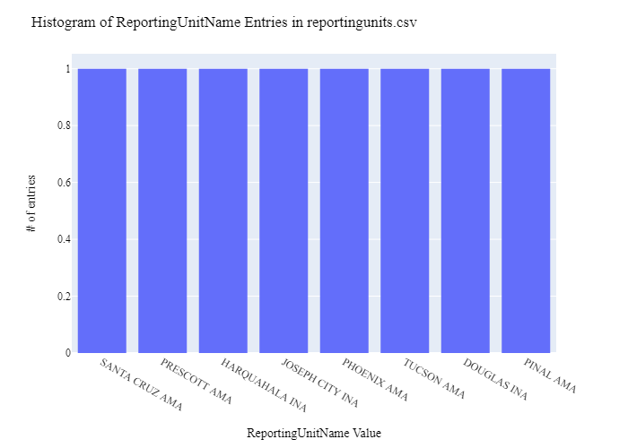
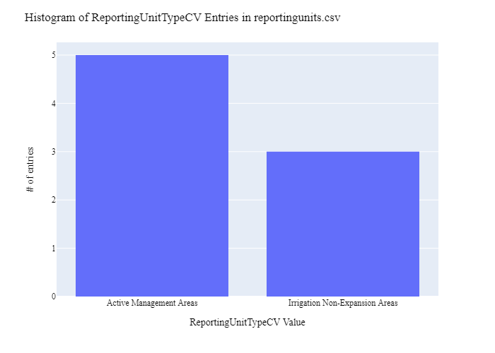
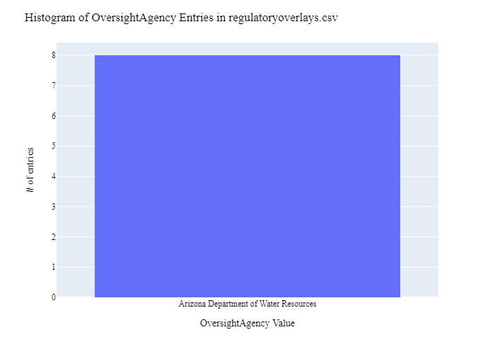
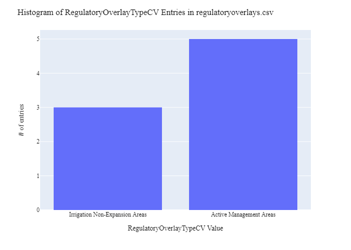
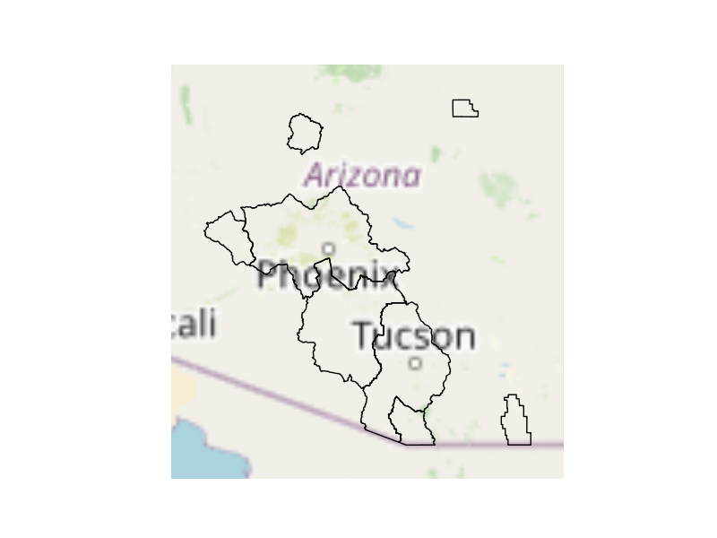
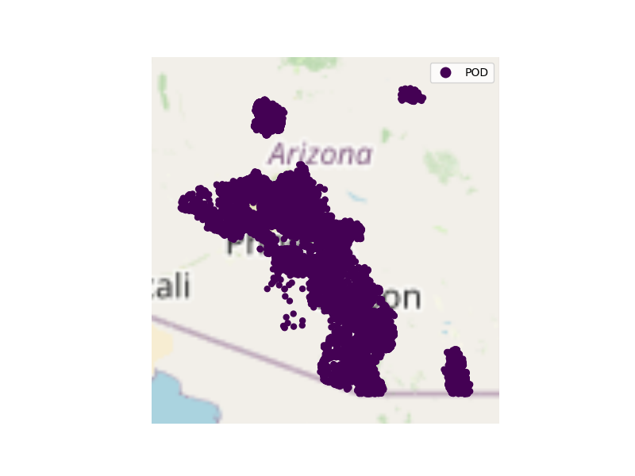

# Arizona Department of Water ResourcesRegulatory Overview Data Preparation for WaDE
This readme details the process that was applied by the staff of the [Western States Water Council (WSWC)](http://wade.westernstateswater.org/) to extracting regulatory overlay area data, made available by the [Arizona Department of Water Resources](https://new.azwater.gov/), for inclusion into the Water Data Exchange (WaDE) project.  WaDE enables states to share data with each other and the public in a more streamlined and cost-effective way.

## Overview of Source Data Utilized
The following data was used for water allocations...

Name | Description | Download Link | Metadata Glossary Link
---------- | ---------- | ------------ | ------------
**Active Management Areas** | Active Management Areas | [link]("https://gisdata2016-11-18t150447874z-azwater.opendata.arcgis.com/datasets/ama-and-ina-1/explore?location=34.124542%2C-111.970823%2C7.57") | [link]("https://new.azwater.gov/ama")
**Irrigation Non-Expansion Areas** | Irrigation Non-Expansion Areas | Same as above | Same as above

Unique files were created to be used as input.  Input files used are as follows...
- AMA_and_INA2.shp

## Storage for WaDE 2.0 Source and Processed Water Data
The 1) raw input data shared by the state / state agency / data provider (excel, csv, shapefiles, PDF, etc), & the 2) csv processed input data ready to load into the WaDE database, can both be found within the WaDE sponsored Google Drive.  Please contact WaDE staff if unavailable or if you have any questions about the data.
- Arizona Department of Water Resources Regulatory Data: "ttps://drive.google.com/drive/folders/1qdaghaotHrMdXsX-B9SX2EaPNJSqrLU4

## Summary of Data Prep
The following text summarizes the process used by the WSWC staff to prepare and share the state's water rights data for inclusion into the Water Data Exchange (WaDE 2.0) project.  For a complete mapping outline, see *AZre_RegulatoryInfo Schema Mapping to WaDE.xlsx*. Several WaDE csv input files will be created in order to extract the water rights data from the above mentioned input.  Each of these WaDE csv input files was created using the [Python](https://www.python.org/) native language, built and ran within [Jupyter Notebooks](https://jupyter.org/) environment.  Those python files include the following...

- **1_AZre_PreProcessRegulatoryData.ipynb**: used to pre-processes the native date into a WaDE format friendly format.  All datatype conversions occur here.
- **2_AZre_CreateWaDEInputFiles.ipynb**: used to create the WaDE input csv files: date.csv, organization.csv, reportingunits.csv, regulatoryoverlays.csv, regulatoryreportingunits.csv, sites.csv, etc.
- **3_AZre_WRSiteRegulatoryID.ipynb**: used to pair regulatory overlay information to water allocation information using an overlay on water allocation site information within the boundaries of the regulation.
- **4_AZre_WaDEDataAssessmentScript.ipynb**: used to evaluate the WaDE input csv files.

***
## Code File: 1_AZre_PreProcessRegulatoryData.ipynb
Purpose: Pre-process the input data files and merge them into one master file for simple dataframe creation and extraction.

#### Inputs: 
- AMA_and_INA2.shp

#### Outputs:
 - Pre_azMain.zip
 - P_Geometry.zip

#### Operation and Steps:
- Import raw data
- Separate AMA and INA data into separate dataframes
- Rename elements to fit the WaDE database.
- Map and align shapefile to fit WaDE system. 
- Repeat for all datasets
- Combine all dataframes into one table
- Export output dataframe as new csv file, *Pre_azMain.csv* for tabular data and *P_Geometry.csv* for geometry data.

***
## Code File: 2_AZwr_CreateWaDEInputFiles.ipynb
Purpose: generate WaDE csv input files (date.csv, organizations.csv, reportingunits.csv, regulatoryoverlays.csv, regulatoryreportingunits.csv, sites.csv).

#### Inputs:
- Pre_azMain.zip
- P_Geometry.zip

#### Outputs:
- date.csv  `Create by hand.`
- organizations.csv  `Create by hand.`
- reportingunits.csv
- regulatoryoverlays.csv 
- regulatoryreportingunits.csv

## 1) Date Information
Purpose: generate legend of granular date used on data collection.

#### Operation and Steps:
- Generate single output dataframe *outdf*.
- Populate output dataframe with *WaDE Date* specific columns.
- Assign agency info to the *WaDE Date* specific columns (this was hardcoded by hand for simplicity).
- Perform error check on output dataframe.
- Export output dataframe *methods.csv*.

#### Sample Output (WARNING: not all fields shown):
Date | Year 
---------- | ---------- 
10/13/2023 | 2023

## 2) Organization Information
Purpose: generate organization directory, including names, email addresses, and website hyperlinks for organization supplying data source.

#### Operation and Steps:
- Generate single output dataframe *outdf*.
- Populate output dataframe with *WaDE Organizations* specific columns.
- Assign agency info to the *WaDE Organizations* specific columns (this was hardcoded by hand for simplicity).
- Assign organization UUID identifier to each (unique) row.
- Perform error check on output dataframe.
- Export output dataframe *organizations.csv*.

#### Sample Output (WARNING: not all fields shown):
OrganizationUUID | OrganizationContactEmail | OrganizationContactName | OrganizationName | OrganizationPhoneNumber | OrganizationPurview | OrganizationWebsite | State
---------- | ---------- | ------------ | ------------ | ------------ | ------------ | ------------ | ------------
AZre_O1 | nlmast@azwater.gov | Natalie Mast | Arizona Department of Water Resources | 602-771-4646 | Water conservation, and planning | https://new.azwater.gov/ | AZ 

### 3) Reporting Unit Information
Purpose: generate a list of polygon areas associated with the state agency regulatory overlay area data.

#### Operation and Steps:
- Read the input file and generate single output dataframe *outdf*.
- Populate output dataframe with *WaDE ReportingUnits* specific columns.
- Assign state agency data info to the *WaDE ReportingUnits* specific columns.  See *AZre_RegulatoryInfo Schema Mapping to WaDE.xlsx* for specific details.  Items of note are as follows...
    - *ReportingUnitUUID* = "AZre_RU + OBJECTID"
    - *EPSGCodeCV* = 4326.
    - *ReportingUnitName* = "BASIN_NAME"
    - *ReportingUnitNativeID* = "OBJECTID"
    - *ReportingUnitProductVersion* = ""
    - *ReportingUnitTypeCV* = "Active Management Areas"
    - *ReportingUnitUpdateDate* = "1/10/2023"
    - *StateCV* = "AZ"
    - *Geometry* = ""
- Consolidate output dataframe into site specific information only by dropping duplicate entries, drop by WaDE specific *ReportingUnitName*, *ReportingUnitNativeID* & *ReportingUnitTypeCV* fields.
- Assign reportingunits UUID identifier to each (unique) row.
- Perform error check on output dataframe.
- Export output dataframe *sites.csv*.

#### Sample Output (WARNING: not all fields shown):
ReportingUnitUUID | EPSGCodeCV | ReportingUnitName | ReportingUnitNativeID | ReportingUnitProductVersion | ReportingUnitTypeCV | ReportingUnitUpdateDate | StateCV | Geometry 
---------- | ---------- | ------------ | ------------ | ------------ | ------------ | ------------ | ------------ | ------------  
AZre_RU + OBJECTID | 4326 | BASIN_NAME | OBJECTID | xx | Active Management Area | 1/10/2023 | AZ | xx

Any data fields that are missing required values and dropped from the WaDE-ready dataset are instead saved in a separate csv file (e.g. *reportingunits_missing.csv*) for review.  This allows for future inspection and ease of inspection on missing items.  Mandatory fields for the reportingunits include the following...
- ReportingUnitUUID
- ReportingUnitName
- ReportingUnitNativeID
- ReportingUnitTypeCV
- StateCV

### 4) Regulatory Overlays Information
Purpose: generate master sheet of regulatory overlay area information to import into WaDE 2.0.

#### Operation and Steps:
- Read the input files and generate single output dataframe *outdf*.
- Populate output dataframe with *WaDE Water Regulatory Overlays* specific columns.
- Assign state agency data info to the *WaDE Water Regulatory Overlays* specific columns.  See *AZre_RegulatoryInfo Schema Mapping to WaDE.xlsx* for specific details.  Items of note are as follows...
    - *RegulatoryOverlayUUID* = AZre_RO + OBJECTID
    - *OversightAgency* = Arizona Department of Water Resources
    - *RegulatoryDescription* = "To safeguard the health, safety and economic welfare of the public by protecting, conserving and enhancing Arizona's water supplies in a bold, thoughtful and innovative manner."
    - *RegulatoryName* = BASIN_NAME
    - *RegulatoryOverlayNativeID* = OBJECTID
    - *RegulatoryStatusCV* = Active
    - *RegulatoryStatue* = ""
    - *RegulatoryStatuteLink* = ""
    - *StatutoryEffectiveDate* = Effective_Date
    - *RegulatoryOverlayTypeCV* = Active Management Area
    - *WaterSourceTypeCV* = ""
- Perform error check on output dataframe.
- Export output dataframe *regulatoryoverlays.csv*.

#### Sample Output (WARNING: not all fields shown):
RegulatoryOverlayUUID| OversightAgency | RegulatoryDescription | RegulatoryName | RegulatoryOverlayNativeID | RegulatoryStatusCV | RegulatoryStatute | RegulatoryStatuteLink | StatutoryEffectiveDate | StatutoryEndDate | RegulatoryOverlayTypeCV | WaterSourceTypeCV
---------- | ---------- | ------------ | ------------ | ------------ | ------------ | ------------ | ------------ | ------------ | ------------ | ------------ | ------------
AZre_RO + OBJECTID | Arizona Department of Water Resources | To safeguard the health, safety and economic welfare of the public by protecting, conserving and enhancing Arizona's water supplies in a bold, thoughtful and innovative manner. | BASIN_NAME | OBJECTID | Active | - | - | Effective_Date | xx | Active Management Area | Groundwater

Any data fields that are missing required values and dropped from the WaDE-ready dataset are instead saved in a separate csv file (e.g. *regulatoryoverlays_missing.csv*) for review.  This allows for future inspection and ease of inspection on missing items.  Mandatory fields for the water regulatory overlays include the following...
- RegulatoryOverlayUUID
- OversightAgency
- RegulatoryDescription
- RegulatoryName
- RegulatoryStatusCV
- StatutoryEffectiveDate

### 5) Regulatory Reporting Units Information 
Purpose: generate master sheet of regulatory overlay area information and how it algins with reporting unit area information.

#### Operation and Steps:
- Read the input file and generate single output dataframe *outdf*.
- Populate output dataframe with *WaDE Regulatory Reportingunits* specific columns.
- Assign state agency data info to the *WaDE Regulatory Reportingunits* specific columns.  See *AZre_RegulatoryInfo Schema Mapping to WaDE.xlsx* for specific details.  Items of note are as follows...
    - *DataPublicationDate* = use date of file creation
    - *OrganizationUUID* = pull from organization.csv
    - *RegulatoryOverlayUUID* = pull form regulatoryoverlay.csv
    - *ReportingUnitUUID* = pull from reportingunit.csv
- Consolidate output dataframe into site specific information only by dropping duplicate entries, drop by WaDE specific *ReportingUnitName*, *ReportingUnitNativeID* & *ReportingUnitTypeCV* fields.
- Assign reportingunits UUID identifier to each (unique) row.
- Perform error check on output dataframe.
- Export output dataframe *regulatoryreportingunits.csv*.

#### Sample Output (WARNING: not all fields shown):
DataPublicationDate | OrganizationUUID | RegulatoryOverlayUUID | ReportingUnitUUID 
---------- | ---------- | ------------ | ------------ 
xx | xx | xx | xx

Any data fields that are missing required values and dropped from the WaDE-ready dataset are instead saved in a separate csv file (e.g. *regulatoryreportingunits_missing.csv*) for review.  This allows for future inspection and ease of inspection on missing items.  Mandatory fields for the regulatory reportingunits include the following...
- DataPublicationDate
- OrganizationUUID
- RegulatoryOverlayUUID
- ReportingUnitUUID

***
## Source Data & WaDE Complied Data Assessment
The following info is from a data assessment evaluation of the completed data...

Dataset | Num of Source Entries (rows) 
---------- | ----------
**"AMAs and INAs"** | 8

Dataset | Num of Identified Reporting Units | Num of Identified Regulatory Overlays
---------- | ---------- | ------------
**Compiled WaDE Data** | 8 | 8

Assessment of Removed Source Records | Count | Action
---------- | ---------- | ----------
- | 0 | Removed from WaDE

**Figure 1:** Distribution of Reporting Unit Name within reportingunits.csv

**Figure 2:** Distribution of Reporting Unit Type within reportingunits.csv

**Figure 3:** Distribution of Oversight Agency within the regulatoryoverlays.csv

**Figure 4:** Distribution of Regulatory Overlay Type within the regulatoryoverlays.csv

**Figure 5:** Map of Regulatory Areas (i.e., Reporting Unit)

**Figure 6:** Map of identified water rights within the Regulatory Areas Polygons within the sites.csv

***
## Staff Contributions
Data created here was a contribution between the [Western States Water Council (WSWC)](http://wade.westernstateswater.org/) and the [Arizona Department of Water Resources](https://new.azwater.gov/).

WSWC Staff
- Adel Abdallah (Project Manager) <adelabdallah@wswc.utah.gov>
- Ryan James (Data Analysis) <rjames@wswc.utah.gov>

Arizona Department of Water Resources Staff
- "Natalie Mast" <"nlmast@azwater.gov">
