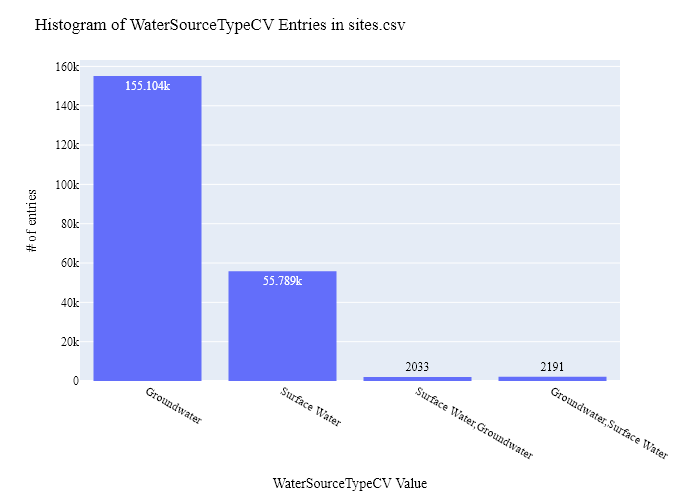
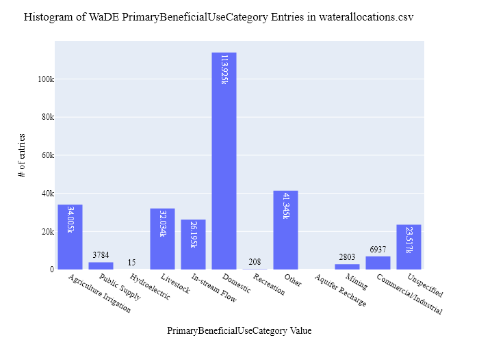
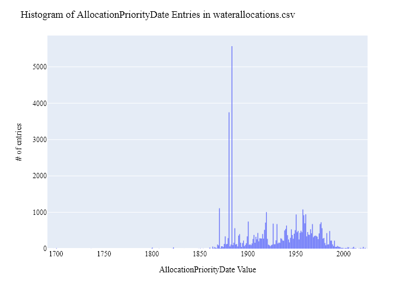
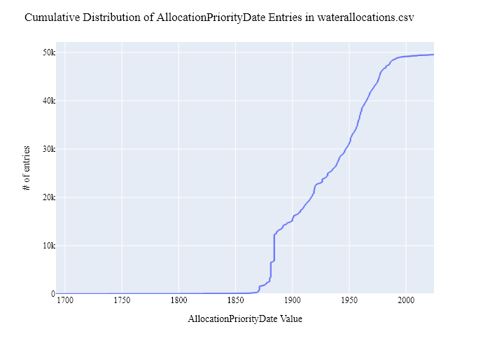
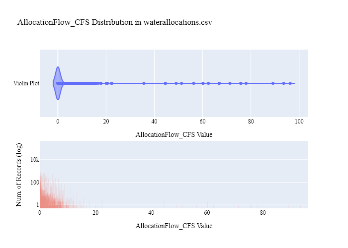
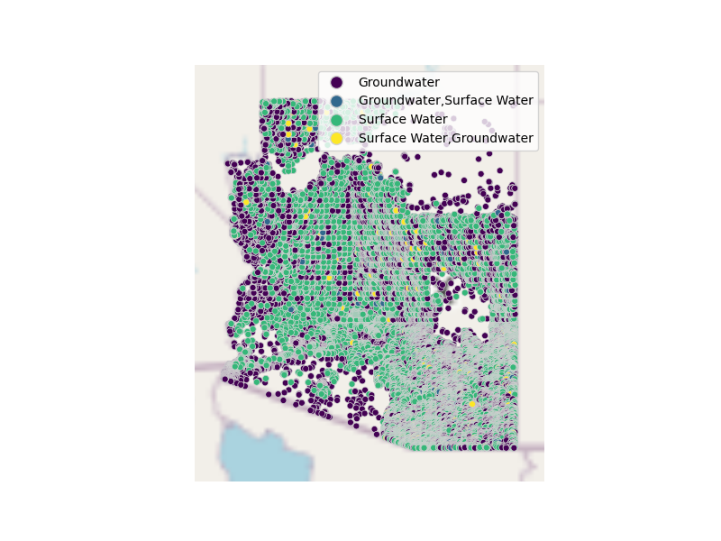

# ADWR Water Rights (Allocation) Data Preparation for WaDE
This readme details the process that was applied by the staff of the [Western States Water Council (WSWC)](http://wade.westernstateswater.org/) to extracting water rights data made available by the [Arizona Department of Water Resources (ADWR)](https://www.azwater.gov/), for inclusion into the Water Data Exchange (WaDE) project.  WaDE enables states to share data with each other and the public in a more streamlined and consistent way. WaDE is not intended to replace the states data or become the source for that data but rather to enable regional analysis to inform policy decisions and for planning purposes. 

## Overview of Source Data Utilized
The following data was used for water allocations...

Name | Description | Download Link | Metadata Glossary Link
---------- | ---------- | ------------ | ------------
**SW QUERY BY SURFACE WATERSHEDS** | surface water right data (SW QUERY BY SURFACE WATERSHEDS).  Downloaded used all washed under the 'ACTIVE' status. | [link](https://infoshare.azwater.gov/docushare/dsweb/View/Collection-86) | not provided
**Fillings POD** | location information related to the SW QUERY BY SURFACE WATERSHEDS data. | [link](https://gisdata2016-11-18t150447874z-azwater.opendata.arcgis.com/datasets/3d5679bf2e614028bee5de1ffab6659f_0/explore?location=34.241472%2C-112.338377%2C16.70) | not provided
**Fillings POU** | location information related to the SW QUERY BY SURFACE WATERSHEDS data. | [link](https://gisdata2016-11-18t150447874z-azwater.opendata.arcgis.com/datasets/d8e37678a27548a29a2d12dad971ca98_0/explore?location=33.909970%2C-112.265366%2C15.88) | not provided
**Well Registry** | groundwater water right data.  Contains use and location info. | [link](https://gisdata2016-11-18t150447874z-azwater.opendata.arcgis.com/datasets/34c92af536ec4047aeaf9d93053dc317_0/explore?location=34.532192%2C-111.899570%2C13.60&showTable=true) | not provided

## Storage for input data shared by the state / state agency / data provider (excel, csv, shapefiles, PDF, etc), & the 2) csv processed input data ready to load into the WaDE database, can both be found within the WaDE sponsored Google Drive.  Please contact WaDE staff if unavailable or if you have any questions about the data.
- Arizona Allocation Data: [link](https://drive.google.com/drive/folders/1PTvL2OH-po4MXKupardY0vJWhnLnG089)

## Summary of Data Prep
The following text summarizes the process used by the WSWC staff to prepare and share water rights data for inclusion into the Water Data Exchange (WaDE 2.0) project.  For a complete mapping outline, see *AZwr_Allocation Schema Mapping to WaDE.xlsx*.  Several WaDE csv input files will be created in order to extract the water rights data from the above mentioned input.  Each of these WaDE csv input files was created using the [Python](https://www.python.org/) native language, built and ran within [Jupyter Notebooks](https://jupyter.org/) environment.  Those python files include the following...

- **1_AZwr_PreProcessAllocationData.ipynb**: used to pre-processes the native date into a WaDE format friendly format.  All datatype conversions occur here.
- **2_AZwr_CreateWaDEInputFiles.ipynb**: used to create the WaDE input csv files: methods.csv, variables.csv, organizations.csv, watersources.csv, sites.csv, waterallocations.csv, podsitetopousiterelationships.csv.
- **3_AZwr_WaDEDataAssessmentScript.ipynb**: used to evaluate the WaDE input csv files.

***
## Code File: 1_AZwr_PreProcessAllocationData.ipynb
Purpose: Pre-process the state agency's input data files and merge them into one master file for simple dataframe creation and extraction.

#### Inputs: 
 - SW QUERY BY SURFACE WATERSHEDS
 - Fillings.shp
 - Well Registry

#### Outputs:
 - Pwr_azMain.csv

#### Operation and Steps:
- Read the input files and generate temporary input dataframes for groundwater and surface water.  Processes outline consist of combining the two datasets into one workable dataframe. 
- Specific for surface water data...
    - Read in SW QUERY BY SURFACE WATERSHEDS csv files, concatenate into one long dataframe.
    - Clean **REG. NO'** field by removing excess 0 markers.  Used to match with **FILENO** in Fillings.shp input.
    - For amount data, separate value and unit info out from the **QUANTITY** field.
    - TEMP FIX: Drop the following unknown measurement of units for the following terms: 'ACRES', 'Amount Required for Maintenance', 'Feet', 'MIT - Miners Inches Total', 'Miners Inches Per Annum',  'XX - Unknown Code at Load time', 'None',  '',  " ".
    - Units with CFS include 'Cubic Feet Per Second', Acre-Feet Per Annum (converted to CFS by / 723.968), 'Gallons Per Annum' (converted to CFS by / 235905662.34).
    - Units with AF include 'Acre-Feet', 'Acre-Feet Total', 'CFT - Cubic Feet Total' (converted to AF by / 43559.9), 'Gallons' (converted to AF by / 325850.943).
    - Convert **X_UTMNAD83** and **Y_UTMNAD83** input fields to match WGS84 projection and create *latitude* and *longitude* values.
- Concatenate groundwater and surface water data into single output dataframe.
- For this ADWR, drop non-active AllocationLegalStatusCV values specific to: "INACTIVE - WITHDRAWN", "INACTIVE - CONSOLIDATED", "INACTIVE - AMENDED", "INACTIVE - CANCELLED", "INACTIVE - REJECTED", "INACTIVE - PARTIAL T&S", "INACTIVE - RELINQUISHED", "INACTIVE - FULL T&S", "INACTIVE - INACTIVE", "INACTIVE - FULL ASSIGNMENT", "INACTIVE - PARTIAL ASSIGNMENT"
- Inspect output dataframe for additional errors / datatypes.
- Export output dataframe as new csv file, *Pwr_azMain.csv*.

***
## Code File: 2_UTwr_CreateWaDEInputFiles.ipynb
Purpose: generate WaDE csv input files (methods.csv, variables.csv, organizations.csv, watersources.csv, sites.csv, waterallocations.csv, podsitetopousiterelationships.csv).

#### Inputs:
- Pwr_xxMain.zip
- P_Geometry.zip

#### Outputs:
- methods.csv  `Create by hand.`
- variables.csv  `Create by hand.`
- organizations.csv  `Create by hand.`
- watersources.csv
- sites.csv
- waterallocations.csv
- podsitetopousiterelationships.csv

## 1) Method Information
Purpose: generate legend of granular methods used on data collection.

#### Operation and Steps:
- Generate single output dataframe *outdf*.
- Populate output dataframe with *WaDE Method* specific columns.
- Assign agency info to the *WaDE Method* specific columns (this was hardcoded by hand for simplicity).
- Assign method UUID identifier to each (unique) row.
- Perform error check on output dataframe.
- Export output dataframe *methods.csv*.

#### Sample Output (WARNING: not all fields shown):
|    | MethodUUID   | ApplicableResourceTypeCV   | DataConfidenceValue   | DataCoverageValue   | DataQualityValueCV   | MethodName                  | MethodNEMILink                                                                     | MethodTypeCV    | WaDEDataMappingUrl                                                                                       |
|---:|:-------------|:---------------------------|:----------------------|:--------------------|:---------------------|:----------------------------|:-----------------------------------------------------------------------------------|:----------------|:---------------------------------------------------------------------------------------------------------|
|  0 | AZwr_M1      | Groundwater                |                       |                     |                      | Arizona Water Rights Method | https://new.azwater.gov/sites/default/files/media/Arizona%20Groundwater_Code_1.pdf | Legal Processes | https://github.com/WSWCWaterDataExchange/MappingStatesDataToWaDE2.0/tree/master/Arizona/WaterAllocations |

## 2) Variables Information
Purpose: generate legend of granular variables specific to each state.

#### Operation and Steps:
- Generate single output dataframe *outdf*.
- Populate output dataframe with *WaDE Variable* specific columns.
- Assign agency info to the *WaDE Variable* specific columns (this was hardcoded by hand for simplicity).
- Assign variable UUID identifier to each (unique) row.
- Perform error check on output dataframe.
- Export output dataframe *variables.csv*.

#### Sample Output (WARNING: not all fields shown):
|    | VariableSpecificUUID   |   AggregationInterval | AggregationIntervalUnitCV   | AggregationStatisticCV   | AmountUnitCV   | MaximumAmountUnitCV   |   ReportYearStartMonth | ReportYearTypeCV   | VariableCV   | VariableSpecificCV   |
|---:|:-----------------------|----------------------:|:----------------------------|:-------------------------|:---------------|:----------------------|-----------------------:|:-------------------|:-------------|:---------------------|
|  0 | AZwr_V1                |                     1 | Year                        | Average                  | CFS            | AFY                   |                     11 | WaterYear          | Allocation   | Allocation           |

## 3) Organization Information
Purpose: generate organization directory, including names, email addresses, and website hyperlinks for organization supplying data source.

#### Operation and Steps:
- Generate single output dataframe *outdf*.
- Populate output dataframe with *WaDE Organizations* specific columns.
- Assign agency info to the *WaDE Organizations* specific columns (this was hardcoded by hand for simplicity).
- Assign organization UUID identifier to each (unique) row.
- Perform error check on output dataframe.
- Export output dataframe *organizations.csv*.

#### Sample Output (WARNING: not all fields shown):
|    | OrganizationUUID   | OrganizationContactEmail   | OrganizationContactName   | Unnamed: 3   | OrganizationName                      | OrganizationPhoneNumber   | OrganizationPurview   | OrganizationWebsite                         | State   |
|---:|:-------------------|:---------------------------|:--------------------------|:-------------|:--------------------------------------|:--------------------------|:----------------------|:--------------------------------------------|:--------|
|  0 | AZwr_O1            | lmwilliams@azwater.gov     | Lisa Williams             |              | Arizona Department of Water Resources | 602-771-8500              | The Arizona Department of Water Resources is the steward of Arizona’s water future and ensures long-term, reliable water supplies to support the continued economic prosperity of the State.                       | https://www.azwater.gov/ | AZ      |

## 4) Water Source Information
Purpose: generate a list of water sources specific to a water right.

#### Operation and Steps:
- Read the input file and generate single output dataframe *outdf*.
- Populate output dataframe with *WaDE WaterSources* specific columns.
- Assign agency info to the *WaDE WaterSources* specific columns.  See *XXwr_Allocation Schema Mapping_WaDE.xlsx* for specific details.  Items of note are as follows...
    - *WaterSourceUUID* = "AZwr_WS" + counter
    - *WaterQualityIndicatorCV* = "Fresh"
    - *WaterSourceName* = ""
    - *WaterSourceNativeID* = ""
    - *WaterSourceTypeCV* = *Groundwater* for gw, & *Surface Water* for sw.
- Consolidate output dataframe into water source specific information only by dropping duplicate entries, drop by WaDE specific *WaterSourceName* & *WaterSourceTypeCV* fields.
- Assign water source UUID identifier to each (unique) row.
- Perform error check on output dataframe.
- Export output dataframe *WaterSources.csv*.

#### Sample Output (WARNING: not all fields shown):
|    | WaterSourceUUID   | Geometry   | GNISFeatureNameCV   | WaterQualityIndicatorCV   | WaterSourceName   | WaterSourceNativeID   | WaterSourceTypeCV   |
|---:|:------------------|:-----------|:--------------------|:--------------------------|:------------------|:----------------------|:--------------------|
|  0 | AZwr_WSwId1       |            |                     | Fresh                     | WaDE Blank        | wId1                  | Surface Water       |

Any data fields that are missing required values and dropped from the WaDE-ready dataset are instead saved in a separate csv file (e.g. *watersources_missing.csv*) for review.  This allows for future inspection and ease of inspection on missing items.  Mandatory fields for the water sources include the following...
- WaterSourceUUID
- WaterQualityIndicatorCV
- WaterSourceTypeCV

## 5) Site Information
Purpose: generate a list of sites information.

#### Operation and Steps:
- Read the input file and generate single output dataframe *outdf*.
- Populate output dataframe with *WaDE Site* specific columns.
- Assign agency info to the *WaDE Site* specific columns.  See *XXwr_Allocation Schema Mapping_WaDE.xlsx* for specific details.  Items of note are as follows...
    - *SiteUUID* = "AZwr_S" + counter
    - *WaterSourceUUIDs* = Extract *WaterSourceUUID* from waterSources.csv input csv file. See code for specific implementation of extraction.
    - *CoordinateAccuracy* = ""
    - *CoordinateMethodCV* = ""
    - *Country* = **COUNTY** for both gw and sw data.
    - *EPSGCodeCV* = "4326"
    - *Geometry* = ""
    - *GNISCodeCV* = ""
    - *HUC12* = ""
    - *HUC8* = ""
    - *Latitude* = derived from **Y_UTMNAD83**, converted to EPSG:4326 decimal.
    - *Longitude* = derived from **X_UTMNAD83**, converted to EPSG:4326 decimal.
    - *NHDNetworkStatusCV* = ""
    - *NHDProductCV* = ""
    - *PODorPOUSite* = **POU_POD** for sw, just "POD" for gw
    - *SiteName* = ""
    - *SiteNativeID* = **CADASTRAL**
    - *SiteTypeCV* = "Well" for gw
    - *StateCV* = "AZ"																			
    - *USGSSiteID* = ""
- Consolidate output dataframe into site specific information only by dropping duplicate entries, drop by WaDE specific *SiteNativeID*, *SiteName*, *SiteTypeCV*, *Longitude* & *Latitude* fields.
- Assign site UUID identifier to each (unique) row.
- Perform error check on output dataframe.
- Export output dataframe *sites.csv*.

#### Sample Output (WARNING: not all fields shown):
|    | SiteUUID              | RegulatoryOverlayUUIDs   | WaterSourceUUIDs   | CoordinateAccuracy   | CoordinateMethodCV   | County   |   EPSGCodeCV | GNISCodeCV   | HUC12   | HUC8   |   Latitude |   Longitude | NHDNetworkStatusCV   | NHDProductCV   | PODorPOUSite   | SiteName   | SiteNativeID    | SitePoint   | SiteTypeCV   | StateCV   | USGSSiteID   |
|---:|:----------------------|:-------------------------|:-------------------|:---------------------|:---------------------|:---------|-------------:|:-------------|:--------|:-------|-----------:|------------:|:---------------------|:---------------|:---------------|:-----------|:----------------|:------------|:-------------|:----------|:-------------|
|  0 | AZwr_SPODA01001001BAB |                          | AZwr_WSwId2        | WaDE Blank           | WaDE Blank           | Maricopa |         4326 |              |         |        |    33.4648 |    -112.215 |                      |                | POD            | WaDE Blank | PODA01001001BAB |             | Well         | AZ        |              |

Any data fields that are missing required values and dropped from the WaDE-ready dataset are instead saved in a separate csv file (e.g. *sites_missing.csv*) for review.  This allows for future inspection and ease of inspection on missing items.  Mandatory fields for the sites include the following...
- SiteUUID 
- CoordinateMethodCV
- EPSGCodeCV
- SiteName

## 6) AllocationsAmounts Information
Purpose: generate master sheet of water allocations to import into WaDE 2.0.

#### Operation and Steps:
- Read the input files and generate single output dataframe *outdf*.
- Populate output dataframe with *WaDE Water Allocations* specific columns.
- Assign agency info to the *WaDE Water Allocations* specific columns.  See *XXwr_Allocation Schema Mapping_WaDE.xlsx* for specific details.  Items of note are as follows...
    - Extract *MethodUUID*, *VariableSpecificUUID*, *OrganizationUUID*, & *SiteUUID* from respective input csv files. See code for specific implementation of extraction.
    - *AllocationApplicationDate* = ""
    - *AllocationAssociatedConsumptiveUseSiteIDs* = ""
    - *AllocationAssociatedWithdrawalSiteIDs* = ""
    - *AllocationBasisCV* = ""
    - *AllocationChangeApplicationIndicator* = ""
    - *AllocationCommunityWaterSupplySystem* = ""
    - *AllocationCropDutyAmount* = ""
    - *AllocationExpirationDate* = ""
    - *AllocationFlow_CFS* = **PUMPRATE** for gw, **QUANTITY** for sw, see *1_AZwr_PreProcessAllocationData.ipynb* for specifics.
    - *AllocationLegalStatusCV* = **STATUS** for sw.
    - *AllocationNativeID* = **PROGRAM** + **REGISTRY_I** for gw, **FILE_NO** for sw.
    - *AllocationOwner* =  **OWNER_NAME** for gw, **NAME** for sw.
    - *AllocationPriorityDate* = **PRIOR_DATE** for sw, left blank for gw.
    - *AllocationSDWISIdentifierCV* = ""
    - *AllocationTimeframeEnd* = "12/31"
    - *AllocationTimeframeStart* = "01/01"
    - *AllocationTypeCV* = ""
    - *AllocationVolume_AF* = **QUANTITY** for sw, see *1_AZwr_PreProcessAllocationData.ipynb* for specifics.
    - *BeneficialUseCategory* = **WATER_USE**
    - *CommunityWaterSupplySystem* = ""
    - *CropTypeCV* = ""
    - *CustomerTypeCV* = ""
    - *DataPublicationDate* = "{use today's date}"
    - *DataPublicationDOI* = ""
    - *ExemptOfVolumeFlowPriority* = ""
    - *GeneratedPowerCapacityMW* = ""
    - *IrrigatedAcreage* = ""
    - *IrrigationMethodCV* = ""
    - *LegacyAllocationIDs* = ""
    - *OwnerClassificationCV* = ""
    - *PopulationServed* = ""
    - *PowerType* = ""
    - *PrimaryBeneficialUseCategory* = ""
    - *WaterAllocationNativeURL* = "https://app.azwater.gov/WellRegistry/Detail.aspx?RegID" + **REGISTRY_I** for gw, blank for sw.
- Consolidate output dataframe into water allocations specific information only by grouping entries by *AllocationNativeID* filed.
- Perform error check on output dataframe.
- Export output dataframe *waterallocations.csv*.

#### Sample Output (WARNING: not all fields shown):
|    | AllocationUUID      | MethodUUID   | OrganizationUUID   | SiteUUID                                    | VariableSpecificUUID   | AllocationApplicationDate   | AllocationAssociatedConsumptiveUseSiteIDs   | AllocationAssociatedWithdrawalSiteIDs   | AllocationBasisCV   | AllocationChangeApplicationIndicator   | AllocationCommunityWaterSupplySystem   | AllocationCropDutyAmount   | AllocationExpirationDate   |   AllocationFlow_CFS | AllocationLegalStatusCV   | AllocationNativeID   | AllocationOwner   | AllocationPriorityDate   | AllocationSDWISIdentifierCV   | AllocationTimeframeEnd   | AllocationTimeframeStart   | AllocationTypeCV   |   AllocationVolume_AF | BeneficialUseCategory   | CommunityWaterSupplySystem   | CropTypeCV   | CustomerTypeCV   | DataPublicationDate   | DataPublicationDOI   |   ExemptOfVolumeFlowPriority | GeneratedPowerCapacityMW   |   IrrigatedAcreage | IrrigationMethodCV   | LegacyAllocationIDs   | OwnerClassificationCV   | PopulationServed   | PowerType   | PrimaryBeneficialUseCategory   | WaterAllocationNativeURL   |
|---:|:--------------------|:-------------|:-------------------|:--------------------------------------------|:-----------------------|:----------------------------|:--------------------------------------------|:----------------------------------------|:--------------------|:---------------------------------------|:---------------------------------------|:---------------------------|:---------------------------|---------------------:|:--------------------------|:---------------------|:------------------|:-------------------------|:------------------------------|:-------------------------|:---------------------------|:-------------------|----------------------:|:------------------------|:-----------------------------|:-------------|:-----------------|:----------------------|:---------------------|-----------------------------:|:---------------------------|-------------------:|:---------------------|:----------------------|:------------------------|:-------------------|:------------|:-------------------------------|:---------------------------|
|  0 | AZwr_WR330000070000 | AZwr_M2      | AZwr_O1            | AZwr_SPOUA01015026AA0,AZwr_SPODA01015026AA0 | AZwr_V1                |                             |                                             |                                         | WaDE Blank          |                                        |                                        |                            |                            |                    0 | ACTIVE - ACTIVE           | 33-000007.0000       | Heron, Jr         | 1921-04-25               |                               | 12/31                    | 01/01                      | WaDE Blank         |                     0 | Irrigation,Recreation   |                              |              |                  | 03/18/2024            |                      |                            0 |                            |                  0 |                      |                       | Private                 |                    |             | Agriculture Irrigation         |                            |

Any data fields that are missing required values and dropped from the WaDE-ready dataset are instead saved in a separate csv file (e.g. *waterallocations_missing.csv*) for review.  This allows for future inspection and ease of inspection on missing items.  Mandatory fields for the water allocations include the following...
- MethodUUID
- VariableSpecificUUID
- OrganizationUUID
- SiteUUID
- AllocationPriorityDate
- BeneficialUseCategory
- AllocationAmount or AllocationMaximum
- DataPublicationDate

### 7) POD Site -To- POU Polygon Relationships
Purpose: generate linking element between POD and POU sites that share the same water right.
Note: podsitetopousiterelationships.csv output only needed if both POD and POU data is present,  `otherwise produces empty file.`

#### Operation and Steps:
- Read the sites.csv & waterallocations.csv input files.
- Create three temporary dataframes: one for waterallocations, & two for site info that will store POD and POU data separately.
- For the temporary POD dataframe...
  - Read in site.csv data from sites.csv with a _PODSiteUUID_ field = POD only.
  - Create _PODSiteUUID_ field = _SiteUUID_.
- For the temporary POU dataframe
  - Read in site.csv data from sites.csv with a _PODSiteUUID_ field = POU only.
  - Create _POUSiteUUID_ field = _SiteUUID_.
- For the temporary waterallocations dataframe, explode _SiteUUID_ field to create unique rows.
- Left-merge POD & POU dataframes to the waterallocations dataframe via _SiteUUID_ field.
- Consolidate waterallocations dataframe by grouping entries by _AllocationNativeID_ filed.
- Explode the consolidated waterallocations dataframe again using the _PODSiteUUID_ field, and again for the _POUSiteUUID_ field to create unique rows.
- Perform error check on waterallocations dataframe (check for NaN values)
- If waterallocations is not empty, export output dataframe *podsitetopousiterelationships.csv*.

***
## Source Data & WaDE Complied Data Assessment
The following info is from a data assessment evaluation of the completed data...

Dataset | Num of Source Entries (rows)
---------- | ---------- 
**SW QUERY BY SURFACE WATERSHEDS**  | 360,539
**Well Registry**  | 232,746

Dataset  | Num of Identified PODs | Num of Identified POUs | Num of Identified Water Right Records
---------- | ------------ | ------------ | ------------
**Compiled WaDE Data** | 167,750 | 50,277 | 286,956

Assessment of Removed Source Records | Count | Action
---------- | ---------- | ----------
Unused Site Record                       |4368 | removed from sites.csv input
Incomplete or bad entry for County       |1599 | removed from sites.csv input
Incomplete or bad entry for Latitude      |515 | removed from sites.csv input
Incomplete or bad entry for Longitude     |82 | removed from sites.csv input
Incomplete or bad entry for AllocationPriorityDate    |2786 | removed from waterallocations.csv input
Incomplete or bad entry for SiteUUID                  |2482 | removed from waterallocations.csv input
Incomplete or bad entry for Flow                        |18 | removed from waterallocations.csv input
Incomplete or bad entry for Volume                      |16 | removed from waterallocations.csv input

**Figure 1:** Distribution of POD vs POU Sites within the sites.csv

**Figure 2:** Distribution Sites by WaterSourceTypeCV within the sites.csv

**Figure 3:** Distribution of Identified Water Right Records by WaDE Categorized Primary Beneficial Uses within the waterallocations.csv

**Figure 4a:** Range of Priority Date of Identified Water Right Records within the waterallocations.csv

**Figure 4b:** Cumulative distribution of Priority Date of Identified Water Right Records within the waterallocations.csv

**Figure 5:** Distribution & Range of Flow (CFS) of Identified Water Right Records within the waterallocations.csv

**Figure 6:** Distribution & Range of Volume (AF) of Identified Water Right Records within the waterallocations.csv

**Figure 7:** Map of Identified Points within the sites.csv

**Figure 8:** Map of Identified Polygons within the sites.csv
- No geometry (polygon) data provided.
<!--  -->

***
## Staff Contributions
Data created here was a contribution between the [Western States Water Council (WSWC)](http://wade.westernstateswater.org/) and the [Arizona Department of Water Resources (ADWR)](https://www.azwater.gov/).

WSWC Staff
- Adel Abdallah <adelabdallah@wswc.utah.gov>
- Ryan James <rjames@wswc.utah.gov>

ADWR Staff
- Lisa Williams <lmwilliams@azwater.gov>
- James Dieckhoff <Jdieckhoff@azwater.gov>
- Natalie Mast (AMA Director) <nlmast@azwater.gov>