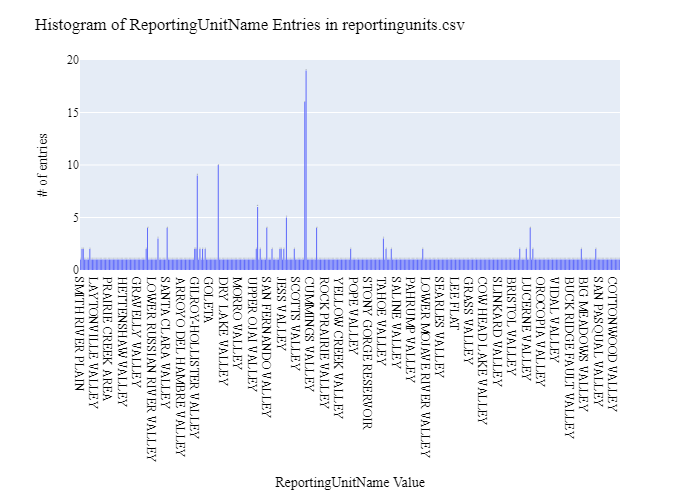
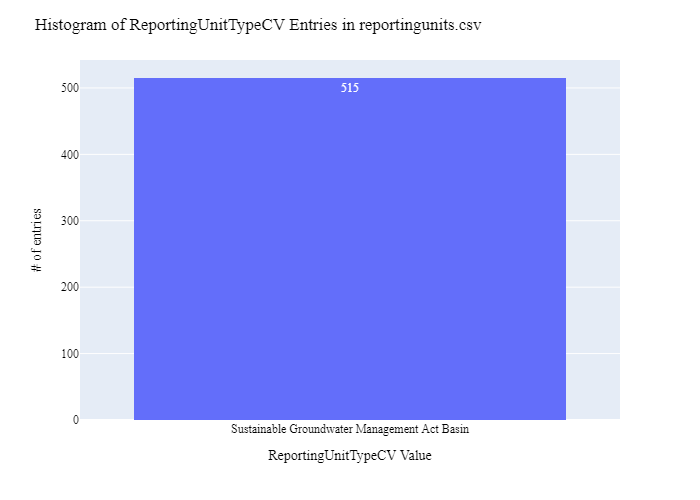
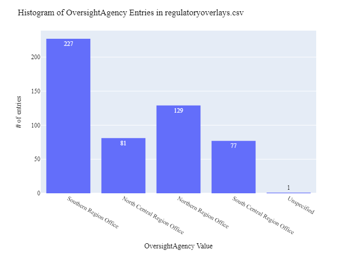
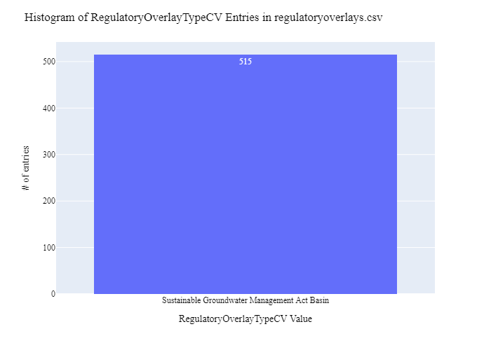
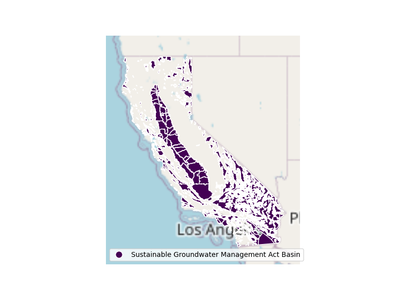

# California Department of Water Resources Overlay Data Preparation for WaDE
This readme details the process that was applied by the staff of the [Western States Water Council (WSWC)](http://wade.westernstateswater.org/) to extracting overlay area data, made available by the [California Department of Water Resources](https://water.ca.gov/), for inclusion into the Water Data Exchange (WaDE) project.  WaDE enables states to share data with each other and the public in a more streamlined and cost-effective way.

## Overview of Source Data Utilized
The following data was used for water allocations...

Name | Description | Download Link | Metadata Glossary Link
---------- | ---------- | ------------ | ------------
**SGMA 2019 Basin Prioritization** | Shape file download of SGMA 2019 Basin Prioritization Feature Service. | [link](https://data.cnra.ca.gov/dataset/sgma-basin-prioritization/resource/b4c5239c-9ec3-4034-9b95-8658c66d55bf) | [link](https://data.cnra.ca.gov/dataset/sgma-basin-prioritization)
**SGMA Basin Prioritization Statewide Summary Table** | SGMA Basin Prioritization Summary Table for all 515 Groundwater Basins. | [link](https://data.cnra.ca.gov/dataset/sgma-basin-prioritization/resource/6347629e-340d-4faf-ae7f-159efbfbcdc9) | [link](https://data.cnra.ca.gov/dataset/sgma-basin-prioritization)

Unique files were created to be used as input.  Input files used are as follows...
- 2019_SGMA_Basins.zip, shp file of basin geometry
- SGMA Basin Prioritization Statewide Summary Table.zip, csv of basin information.

## Storage for WaDE 2.0 Source and Processed Water Data
The 1) raw input data shared by the state / state agency / data provider (excel, csv, shapefiles, PDF, etc), & the 2) csv processed input data ready to load into the WaDE database, can both be found within the WaDE sponsored Google Drive.  Please contact WaDE staff if unavailable or if you have any questions about the data.
- California Department of Water Resources Overlay Data: [link](https://drive.google.com/drive/folders/1OazP2MAU8ALg-tJ_bBUk6VFFPnVUosvH?usp=drive_link)

## Summary of Data Prep
The following text summarizes the process used by the WSWC staff to prepare and share the state's overlay data for inclusion into the Water Data Exchange (WaDE 2.0) project.  For a complete mapping outline, see *CAov_Overlay Info Schema Mapping to WaDE.xlsx*. Several WaDE csv input files will be created in order to extract the overlay data from the above mentioned input.  Each of these WaDE csv input files was created using the [Python](https://www.python.org/) native language, built and ran within [Jupyter Notebooks](https://jupyter.org/) environment.  Those python files include the following...

- **1_CAov_PreProcessRegulatoryData.ipynb**: used to pre-processes the native date into a WaDE format friendly format.  All datatype conversions occur here.
- **2_CAov_CreateWaDEInputFiles.ipynb**: used to create the WaDE input csv files: date.csv, organization.csv, reportingunits.csv, regulatoryoverlays.csv, regulatoryreportingunits.csv, etc.
- **3_CAov_WaDEDataAssessmentScript.ipynb**: used to evaluate the WaDE input csv files.

***
## Code File: 1_CAov_PreProcessRegulatoryData.ipynb
Purpose: Pre-process the input data files and merge them into one master file for simple dataframe creation and extraction.

#### Inputs: 
- 2019_SGMA_Basins.zip
- SGMA Basin Prioritization Statewide Summary Table.zip

#### Outputs:
 - Pov_Main.zip
 - P_Geometry.zip

#### Operation and Steps:
- read in input files, place into temporary dataframes.
- extract values for WaDE specific elements.
- Translate **Region_Office** input out of abbreviation format. "NRO" : "Northern Region Office", "SRO" : "Southern Region Office", "NCRO" : "North Central Region Office", "SCRO" : "South Central Region Office"
- Extract geometry information form shp file.
- Export output dataframe as new csv file, *Pov_Main.csv* for tabular data and *P_Geometry.csv* for geometry data.

***
## Code File: 2_CAov_CreateWaDEInputFiles.ipynb
Purpose: generate WaDE csv input files (date.csv, organizations.csv, reportingunits.csv, regulatoryoverlays.csv, regulatoryreportingunits.csv.

#### Inputs:
- Pov_Main.zip
- P_Geometry.zip

#### Outputs:
- date.csv  `Create by hand.`
- organizations.csv  `Create by hand.`
- reportingunits.csv
- regulatoryoverlays.csv 
- regulatoryreportingunits.csv

## 1) Date Information
Purpose: generate legend of granular date used on data collection.

#### Operation and Steps:
- Generate single output dataframe *outdf*.
- Populate output dataframe with *WaDE Date* specific columns.
- Assign agency info to the *WaDE Date* specific columns (this was hardcoded by hand for simplicity).
- Perform error check on output dataframe.
- Export output dataframe *methods.csv*.

#### Sample Output (WARNING: not all fields shown):
|    | Date      |   Year |
|---:|:----------|-------:|
|  0 | 8/26/2021 |   2021 |

## 2) Organization Information
Purpose: generate organization directory, including names, email addresses, and website hyperlinks for organization supplying data source.

#### Operation and Steps:
- Generate single output dataframe *outdf*.
- Populate output dataframe with *WaDE Organizations* specific columns.
- Assign agency info to the *WaDE Organizations* specific columns (this was hardcoded by hand for simplicity).
- Assign organization UUID identifier to each (unique) row.
- Perform error check on output dataframe.
- Export output dataframe *organizations.csv*.

#### Sample Output (WARNING: not all fields shown):
|    | OrganizationUUID   | OrganizationContactEmail        | OrganizationContactName   | OrganizationName                         | OrganizationPhoneNumber   | OrganizationPurview                                                                                                             | OrganizationWebsite   | State   |
|---:|:-------------------|:--------------------------------|:--------------------------|:-----------------------------------------|:--------------------------|:--------------------------------------------------------------------------------------------------------------------------------|:----------------------|:--------|
|  0 | CAov_O1            | Jennifer.Stricklin@water.ca.gov | Jennifer Stricklin        | California Department of Water Resources | 303-866-3581              | Department of Water Resources California Water Plan program computes applied, net, and depletion water balances for California. | https://water.ca.gov/ | CA      |

### 3) Reporting Unit Information
Purpose: generate a list of polygon areas associated with the state agency overlay area data.

#### Operation and Steps:
- Read the input file and generate single output dataframe *outdf*.
- Populate output dataframe with *WaDE ReportingUnits* specific columns.
- Assign state agency data info to the *WaDE ReportingUnits* specific columns.  See *CAov_Overlay Info Schema Mapping to WaDE.xlsx* for specific details.  Items of note are as follows...
    - *ReportingUnitUUID* = "CAov_RU" + ReportingUnitNativeID
    - *EPSGCodeCV* = 4326.
    - *ReportingUnitName* = **Basin_Name** input.
    - *ReportingUnitNativeID* = **Basin_Subb** input.
    - *ReportingUnitProductVersion* = ""
    - *ReportingUnitTypeCV* = "Sustainable Groundwater Management Act Basin"
    - *ReportingUnitUpdateDate* = "12/18/2019"
    - *StateCV* = "CA"
    - *Geometry* = **geometry** input.
- Consolidate output dataframe into site specific information only by dropping duplicate entries, drop by WaDE specific *ReportingUnitName*, *ReportingUnitNativeID* & *ReportingUnitTypeCV* fields.
- Assign reportingunits UUID identifier to each (unique) row.
- Perform error check on output dataframe.
- Export output dataframe *reportingunits.csv*.

#### Sample Output (WARNING: not all fields shown):
|    | ReportingUnitUUID   |   EPSGCodeCV | ReportingUnitName    | ReportingUnitNativeID   | ReportingUnitProductVersion   | ReportingUnitTypeCV                          | ReportingUnitUpdateDate   | StateCV   |
|---:|:--------------------|-------------:|:---------------------|:------------------------|:------------------------------|:---------------------------------------------|:--------------------------|:----------|
|  1 | CAov_RUca100201     |         4326 | KLAMATH RIVER VALLEY | ca1-002.01              |                               | Sustainable Groundwater Management Act Basin | 12/18/2019                | CA        |

Any data fields that are missing required values and dropped from the WaDE-ready dataset are instead saved in a separate csv file (e.g. *reportingunits_missing.csv*) for review.  This allows for future inspection and ease of inspection on missing items.  Mandatory fields for the reportingunits include the following...
- ReportingUnitUUID
- ReportingUnitName
- ReportingUnitNativeID
- ReportingUnitTypeCV
- StateCV

### 4) Overlays Information
Purpose: generate master sheet of overlay area information to import into WaDE 2.0.

#### Operation and Steps:
- Read the input files and generate single output dataframe *outdf*.
- Populate output dataframe with *WaDE Water Overlays* specific columns.
- Assign state agency data info to the *WaDE Water Overlays* specific columns.  See *CAov_Overlay Info Schema Mapping to WaDE.xlsx* for specific details.  Items of note are as follows...
    - *RegulatoryOverlayUUID* = "CAov_RO" + RegulatoryOverlayNativeID
    - *OversightAgency* = **RO** input, translate abbreviations
    - *RegulatoryDescription* = "Each basin’s priority (e.g., high, medium, low, or very low) determines which provisions of California Statewide Groundwater Elevation Monitoring (CASGEM) and the Sustainable Groundwater Management Act (SGMA) apply.  SGMA requires medium- and high-priority basins to develop groundwater sustainability agencies (GSAs), develop groundwater sustainability plans (GSPs) and manage groundwater for long-term sustainability."
    - *RegulatoryName* = **Basin_Name** input.
    - *RegulatoryOverlayNativeID* = **Basin_Subb** input.
    - *RegulatoryStatusCV* = "Final"
    - *RegulatoryStatue* = **Priority** input
    - *RegulatoryStatuteLink* = "https://water.ca.gov/Programs/Groundwater-Management/Basin-Prioritization"
    - *StatutoryEffectiveDate* = "1/1/2019"
    - *RegulatoryOverlayTypeCV* = "Sustainable Groundwater Management Act Basin"
    - *WaterSourceTypeCV* = "Groundwater"
- Perform error check on output dataframe.
- Export output dataframe *regulatoryoverlays.csv*.

#### Sample Output (WARNING: not all fields shown):
|    | RegulatoryOverlayUUID   | OversightAgency        | RegulatoryDescription                                                                                                                                                                                                                                                                                                                                                                                                               | RegulatoryName    | RegulatoryOverlayNativeID   | RegulatoryStatusCV   | RegulatoryStatute   | RegulatoryStatuteLink                                                     | StatutoryEffectiveDate   | StatutoryEndDate   | RegulatoryOverlayTypeCV                      | WaterSourceTypeCV   |
|---:|:------------------------|:-----------------------|:------------------------------------------------------------------------------------------------------------------------------------------------------------------------------------------------------------------------------------------------------------------------------------------------------------------------------------------------------------------------------------------------------------------------------------|:------------------|:----------------------------|:---------------------|:--------------------|:--------------------------------------------------------------------------|:-------------------------|:-------------------|:---------------------------------------------|:--------------------|
|  1 | CAov_RO6010             | Southern Region Office | Each basin’s priority (e.g., high, medium, low, or very low) determines which provisions of California Statewide Groundwater Elevation Monitoring (CASGEM) and the Sustainable Groundwater Management Act (SGMA) apply.  SGMA requires medium- and high-priority basins to develop groundwater sustainability agencies (GSAs), develop groundwater sustainability plans (GSPs) and manage groundwater for long-term sustainability. | ADOBE LAKE VALLEY | 6-010                       | Final                | Very Low            | https://water.ca.gov/Programs/Groundwater-Management/Basin-Prioritization | 2019-01-01               |                    | Sustainable Groundwater Management Act Basin | Groundwater         |

Any data fields that are missing required values and dropped from the WaDE-ready dataset are instead saved in a separate csv file (e.g. *regulatoryoverlays_missing.csv*) for review.  This allows for future inspection and ease of inspection on missing items.  Mandatory fields for the water overlays include the following...
- RegulatoryOverlayUUID
- OversightAgency
- RegulatoryDescription
- RegulatoryName
- RegulatoryStatusCV
- StatutoryEffectiveDate

### 5) Overlay Reporting Units Information
Purpose: generate master sheet of overlay area information and how it algins with reporting unit area information.

#### Operation and Steps:
- Read the input file and generate single output dataframe *outdf*.
- Populate output dataframe with *WaDE OverlayReportingunits* specific columns.
- Assign state agency data info to the *WaDE OverlayReportingunits* specific columns.  See *CAov_Overlay Info Schema Mapping to WaDE.xlsx* for specific details.  Items of note are as follows...
    - *DataPublicationDate* = use date of file creation
    - *OrganizationUUID* = pull from organization.csv
    - *RegulatoryOverlayUUID* = pull form regulatoryoverlay.csv
    - *ReportingUnitUUID* = pull from reportingunit.csv
- Perform error check on output dataframe.
- Export output dataframe *regulatoryreportingunits.csv*.

#### Sample Output (WARNING: not all fields shown):
|    | DataPublicationDate   | OrganizationUUID   | RegulatoryOverlayUUID   | ReportingUnitUUID   |
|---:|:----------------------|:-------------------|:------------------------|:--------------------|
|  1 | 2024-11-12            | CAov_O1            | CAov_RO7047             | CAov_RUca7047       |

Any data fields that are missing required values and dropped from the WaDE-ready dataset are instead saved in a separate csv file (e.g. *regulatoryreportingunits_missing.csv*) for review.  This allows for future inspection and ease of inspection on missing items.  Mandatory fields for the reportingunits include the following...
- DataPublicationDate
- OrganizationUUID
- RegulatoryOverlayUUID
- ReportingUnitUUID

***
## Source Data & WaDE Complied Data Assessment
The following info is from a data assessment evaluation of the completed data...

Dataset | Num of Source Entries (rows) 
---------- | ----------
**2019_SGMA_Basins** | 515
**SGMA Basin Prioritization Statewide Summary Table** | 515

Dataset | Num of Identified Reporting Units | Num of Identified Overlays
---------- | ---------- | ------------
**Compiled WaDE Data** | 515 | 515

Assessment of Removed Source Records | Count | Action
---------- | ---------- | ----------
...nothing removed| - | -

**Figure 1:** Distribution of Reporting Unit Name within reportingunits.csv

**Figure 2:** Distribution of Reporting Unit Type within reportingunits.csv

**Figure 3:** Distribution of Oversight Agency within the regulatoryoverlays.csv

**Figure 4:** Distribution of Overlay Type within the regulatoryoverlays.csv

**Figure 5:** Map of Overlay Areas (i.e., Reporting Unit)

***
## Staff Contributions
Data created here was a contribution between the [Western States Water Council (WSWC)](http://wade.westernstateswater.org/) and the [California Department of Water Resources](https://water.ca.gov/).

WSWC Staff
- Ryan James (Data Analysis) <rjames@wswc.utah.gov>

California Department of Water Resources Staff
- Jennifer Stricklin <Jennifer.Stricklin@water.ca.gov>
