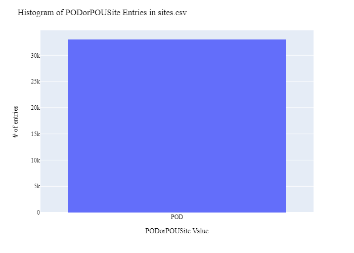
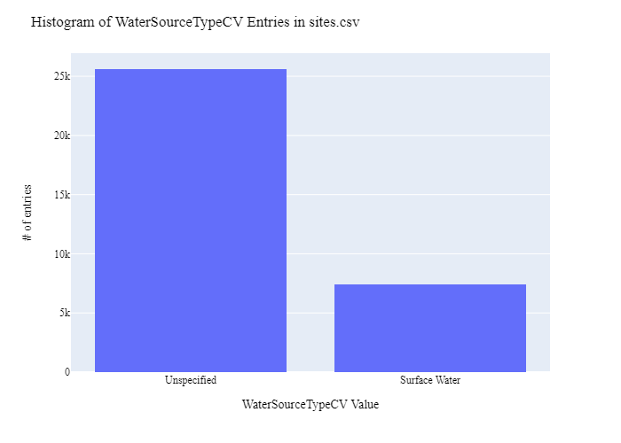
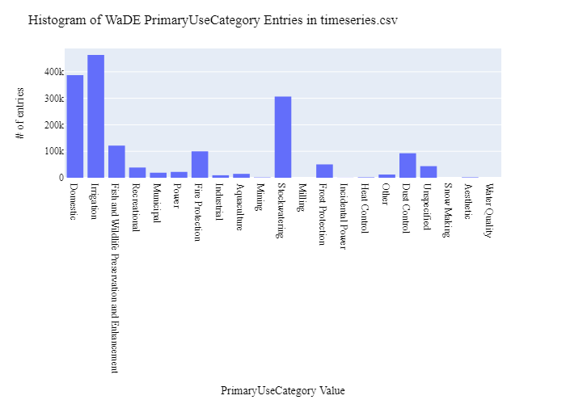
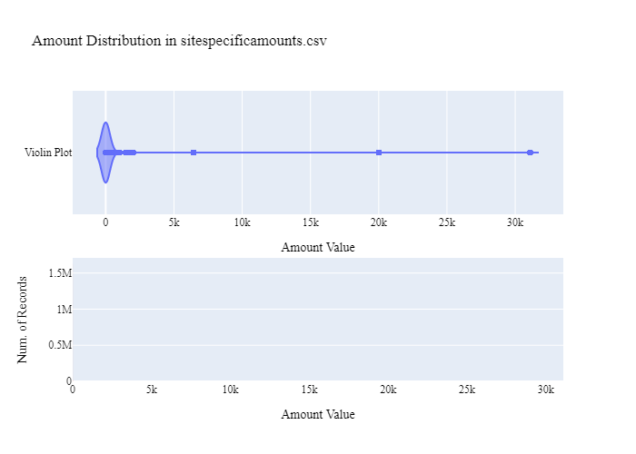
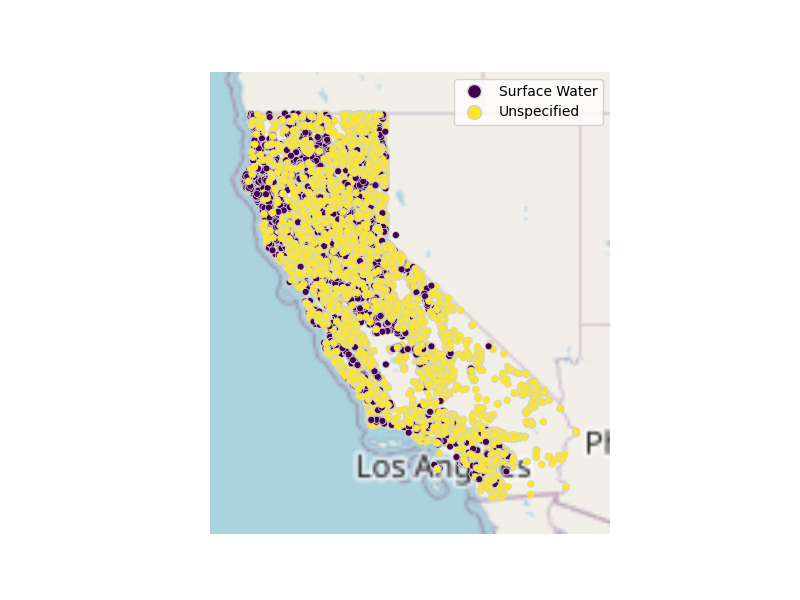

# California State Water Resources Control Board (CSWRCB) Site-Specific Division & Withdrawal Site Data Preparation for WaDE
This readme details the process that was applied by the staff of the [Western States Water Council (WSWC)](http://wade.westernstateswater.org/) to extracting site-specific division & withdrawal site data made available by the [California State Water Resources Control Board (CSWRCB)](https://www.waterboards.ca.gov/), for inclusion into the Water Data Exchange (WaDE) project.  WaDE enables states to share data with each other and the public in a more streamlined and consistent way. WaDE is not intended to replace the states data or become the source for that data but rather to enable regional analysis to inform policy decisions and for planning purposes. 

## Overview of Source Data Utilized
The following data was used for site-specific amount...

Name | Description | Download Link | Metadata Glossary Link
---------- | ---------- | ------------ | ------------
**California Water Rights Water Use Reported 2016-2018** | description of data | [link](https://data.ca.gov/dataset/california-water-rights-water-use-reported/resource/4ae405a4-244b-48b0-9ef6-49468d9082cd) | [link](https://data.ca.gov/dataset/california-water-rights-water-use-reported/resource/3d225ee1-f41d-4ddc-9773-d4d8af8aad44)

The following unique files were created to be used as input.  Input files used are as follows...
- water-rights-water-use-reported-2016-18.zip

## Storage for WaDE 2.0 Source and Processed Water Data
The 1) raw input data shared by the state / state agency / data provider (excel, csv, shapefiles, PDF, etc), & the 2) csv processed input data ready to load into the WaDE database, can both be found within the WaDE sponsored Google Drive.  Please contact WaDE staff if unavailable or if you have any questions about the data.
- California State Water Resources Control BoardSite Specific Data: [link](https://drive.google.com/drive/folders/1FwIs3Y65f2gSjYEip_Av_z_XRaW1gXU0)

## Summary of Data Prep
The following text summarizes the process used by the WSWC staff to prepare and share site-specific division & withdrawal site data for inclusion into the Water Data Exchange (WaDE 2.0) project.  For a complete mapping outline, see *CAsdw_DivisionAndWithdrawlSitesSchema Mapping to WaDE.xlsx*.  Several WaDE csv input files will be created in order to extract the site-specific division & withdrawal site data from the above mentioned input.  Each of these WaDE csv input files was created using the [Python](https://www.python.org/) native language, built and ran within [Jupyter Notebooks](https://jupyter.org/) environment.  Those python files include the following...

- **1_CAssdw_PreProcessDivisionAndWithdrawalSites.ipynb**: used to pre-processes the native date into a WaDE format friendly format.  All datatype conversions occur here.
- **2_CAssdw_CreateWaDEInputFiles.ipynb**: used to create the WaDE input csv files: methods.csv, variables.csv, organizations.csv, watersources.csv, sites.csv, sitespecificamounts.csv
- **3_CAssdw_WaDEDataAssessmentScript.ipynb**: used to evaluate the WaDE input csv files.

***
## Code File: 1_CAssdw_PreProcessDivisionAndWithdrawalSites.ipynb
Purpose: Pre-process the input data files and merge them into one master file for simple dataframe creation and extraction.

#### Inputs: 
- water-rights-water-use-reported-2016-18.zip

#### Outputs:
 - Pssdw_Main.zip
 - P_Geometry.zip

#### Operation and Steps:
- Read in input data and store in temporary dataframe.
- We only want to work with records who **POD_STATUS** = "Active", and whose **WATER_RIGHT_STATUS** does not equal "Inactive" or "Revoked".
- Generate a CFS and a AF value from **USE_DIRECT_DIVERSION_RATE** input field using the  **USE_DIRECT_DIV_RATE_UNITS** input field...
    - CFS values include: Cubic Feet per Second, Gallons per Day (converted to CFS by / 646316.883), Acre-feet per Year (converted to CFS by / 723.968), Gallons per Minute (converted to CFS by / 448.83117).
    - AF values include: Acre-feet, Gallons (converted to AF by / 325850.943).
- Extract key WaDE information from data.
- Any Record with a blank or nan value, replace with a 0 if numeric, or "WaDE Blank" if string or object.
- Inspect output dataframe for additional errors / datatypes.
- Export output dataframe as new csv file, *Pssdw_Main.zip*.

***
## Code File: 2_UTwr_CreateWaDEInputFiles.ipynb
Purpose: generate WaDE csv input files (methods.csv, variables.csv, organizations.csv, watersources.csv, sites.csv, sitespecificamounts.csv).

#### Inputs:
- Pssdw_Main.zip
- P_Geometry.zip

#### Outputs:
- methods.csv  `Create by hand.`
- variables.csv  `Create by hand.`
- organizations.csv  `Create by hand.`
- watersources.csv
- sites.csv
- sitespecificamounts.csv

## 1) Method Information
Purpose: generate legend of granular methods used on data collection.

#### Operation and Steps:
- Generate single output dataframe *outdf*.
- Populate output dataframe with *WaDE Method* specific columns.
- Assign agency info to the *WaDE Method* specific columns (this was hardcoded by hand for simplicity).
- Assign method UUID identifier to each (unique) row.
- Perform error check on output dataframe.
- Export output dataframe *methods.csv*.

#### Sample Output (WARNING: not all fields shown):
MethodUUID | ApplicableResourceTypeCV | MethodName | MethodNEMILink | MethodTypeCV
---------- | ---------- | ------------ | ------------ | ------------
CAssdw_M1 | Surface Water and Groundwater | California Water Rights Method | https://www.waterboards.ca.gov/waterrights/board_info/faqs.html#toc178761079 | Legal Processes

## 2) Variables Information
Purpose: generate legend of granular variables specific to each state.

#### Operation and Steps:
- Generate single output dataframe *outdf*.
- Populate output dataframe with *WaDE Variable* specific columns.
- Assign agency info to the *WaDE Variable* specific columns (this was hardcoded by hand for simplicity).
- Assign variable UUID identifier to each (unique) row.
- Perform error check on output dataframe.
- Export output dataframe *variables.csv*.

#### Sample Output (WARNING: not all fields shown):
VariableSpecificUUID | AggregationInterval | AggregationIntervalUnitCV | AggregationStatisticCV | AmountUnitCV | MaximumAmountUnitCV | ReportYearStartMonth | ReportYearTypeCV | VariableCV | VariableSpecificCV
---------- | ---------- | ------------ | ------------ | ------------ | ------------ | ------------ | ------------ | ------------ | ------------
CAssdw_V2              |                     1 | Annual                      | Unspecified              | CFS            | AF                    |                      1 | CalendarYear       | Water Use    | Water Use_Monthly_Aquaculture_Surface Water |

## 3) Organization Information
Purpose: generate organization directory, including names, email addresses, and website hyperlinks for organization supplying data source.

#### Operation and Steps:
- Generate single output dataframe *outdf*.
- Populate output dataframe with *WaDE Organizations* specific columns.
- Assign agency info to the *WaDE Organizations* specific columns (this was hardcoded by hand for simplicity).
- Assign organization UUID identifier to each (unique) row.
- Perform error check on output dataframe.
- Export output dataframe *organizations.csv*.

#### Sample Output (WARNING: not all fields shown):
OrganizationUUID | OrganizationContactEmail | OrganizationContactName | OrganizationName | OrganizationPhoneNumber | OrganizationPurview | OrganizationWebsite | State
---------- | ---------- | ------------ | ------------ | ------------ | ------------ | ------------ | ------------
CAssdw_O1          | Greg.Gearheart@waterboards.ca.gov | Greg Gearheart            | California State Water Resources Control Board | 916-341-5892              | The Electronic Water Rights Information Management System (eWRIMS) is a computer database developed by the State Water Resources Control Board to track information on water rights in California. | https://www.waterboards.ca.gov/ | CA      |

## 4) Water Source Information
Purpose: generate a list of water sources specific to a site specific.

#### Operation and Steps:
- Read the input file and generate single output dataframe *outdf*.
- Populate output dataframe with *WaDE WaterSources* specific columns.
- Assign agency info to the *WaDE WaterSources* specific columns.  See *XXssdw_DivisionAndWithdrawlSitesSchema Mapping to WaDE.xslx* for specific details.  Items of note are as follows...
    - *WaterSourceUUID* = "CAssdw_WS" + WaterSourceNativeID value.
    - *WaterQualityIndicatorCV* = "Fresh"
    - *WaterSourceName* = **SOURCE_NAME** input.
    - *WaterSourceNativeID* = Not provided, will have to create a WaDE specific version.
    - *WaterSourceTypeCV* = **SOURCE_TYPE** input.
- Consolidate output dataframe into water source specific information only by dropping duplicate entries, drop by WaDE specific *WaterSourceName* & *WaterSourceTypeCV* fields.
- Assign water source UUID identifier to each (unique) row.
- Perform error check on output dataframe.
- Export output dataframe *WaterSources.csv*.

#### Sample Output (WARNING: not all fields shown):
WaterSourceUUID | WaterQualityIndicatorCV | WaterSourceName | WaterSourceNativeID | WaterSourceTypeCV
---------- | ---------- | ------------ | ------------ | ------------
CAssdw_WSwadeId100 | Fresh                     | Natomas Cross Canal | wadeId100             | Unspecified

Any data fields that are missing required values and dropped from the WaDE-ready dataset are instead saved in a separate csv file (e.g. *watersources_missing.csv*) for review.  This allows for future inspection and ease of inspection on missing items.  Mandatory fields for the water sources include the following...
- WaterSourceUUID
- WaterQualityIndicatorCV
- WaterSourceTypeCV

## 5) Site Information
Purpose: generate a list of sites information.

#### Operation and Steps:
- Read the input file and generate single output dataframe *outdf*.
- Populate output dataframe with *WaDE Site* specific columns.
- Assign agency info to the *WaDE Site* specific columns.  See *XXssdw_DivisionAndWithdrawlSitesSchema Mapping to WaDE.xslx* for specific details.  Items of note are as follows...
    - *SiteUUID* = "CAssdw_S" + SiteNativeID value.
    - *WaterSourceUUIDs* = Extract *WaterSourceUUID* from waterSources.csv input csv file. See code for specific implementation of extraction.
    - *CoordinateAccuracy* = ""
    - *CoordinateMethodCV* = **LOCATION_METHOD** input.
    - *Country* = **COUNTY** input.
    - *EPSGCodeCV* = "4326"
    - *Geometry* = ""
    - *GNISCodeCV* = ""
    - *HUC12* = **HUC_12_NUMBER**
    - *HUC8* = **HUC_8_nUMBER**
    - *Latitude* = **LATITUDE**
    - *Longitude* = **LONGITUDE**
    - *NHDNetworkStatusCV* = ""
    - *NHDProductCV* = ""
    - *PODorPOUSite* = "POD"
    - *SiteName* = **POD_NAME** input.
    - *SiteNativeID* = **POD_ID** input.
    - *SiteTypeCV* = **POD_TYPE** input.
    - *StateCV* = "CA"																			
    - *USGSSiteID* = ""
- Consolidate output dataframe into site specific information only by dropping duplicate entries, drop by WaDE specific *SiteNativeID*, *SiteName*, *SiteTypeCV*, *Longitude* & *Latitude* fields.
- Assign site UUID identifier to each (unique) row.
- Perform error check on output dataframe.
- Export output dataframe *sites.csv*.

#### Sample Output (WARNING: not all fields shown):
SiteUUID | RegulatoryOverlayUUIDs | WaterSourceUUIDs | CoordinateAccuracy | CoordinateMethodCV  | County |  EPSGCodeCV | Geometry | GNISCodeCV | HUC12 | HUC8 | Latitude | Longitude | NHDNetworkStatusCV | NHDProductCV | PODorPOUSite | SiteName | SiteNativeID | SitePoint | SiteTypeCV | StateCV | USGSSiteID
---------- | ---------- | ---------- | ------------ | ------------ | ------------ | ------------ | ------------ | ------------ | ------------ | ------------ | ------------ | ------------ | ------------ | ------------ | ------------ | ------------ | ------------ | ------------ | ------------ | ------------ | ------------ 
CAssdw_S20 |                          | CAssdw_WSwadeId65  | WaDE Blank           | DD_NE                | Los Angeles |         4326 |            |              | 1.80701e+11 | 1.80701e+07 |    34.6953 |    -118.508 |                      |                | POD            | WaDE Blank |              2 |             | Point of Direct Diversion | CA        |              

Any data fields that are missing required values and dropped from the WaDE-ready dataset are instead saved in a separate csv file (e.g. *sites_missing.csv*) for review.  This allows for future inspection and ease of inspection on missing items.  Mandatory fields for the sites include the following...
- SiteUUID 
- CoordinateMethodCV
- EPSGCodeCV
- SiteName

## 6) SiteSpecificAmounts Information
Purpose: generate master sheet of site-specific amount information to import into WaDE 2.0.

#### Operation and Steps:
- Read the input files and generate single output dataframe *outdf*.
- Populate output dataframe with *WaDE site-specific amount* specific columns.
- Assign agency info to the *WaDE site-specific amount* specific columns.  See *XXssdw_DivisionAndWithdrawlSitesSchema Mapping to WaDE.xslx* for specific details.  Items of note are as follows...
    - Extract *MethodUUID*, *VariableSpecificUUID*, *OrganizationUUID*, *WaterSourceUUID*, & *SiteUUID*  from respective input csv files. See code for specific implementation of extraction.
    - *Amount* = **USE_DIRECT_DIVERSION_RATE** input, see *1_CAssdw_PreProcessDivisionAndWithdrawalSites.ipynb* for specifics.
    - *AssociatedNativeAllocationIDs* = **APPLICATION_NUMBER** input.
    - *BeneficialUseCategory* = **USE_CODE** input.
    - *CommunityWaterSupplySystem* = ""
    - *CropTypeCV* = ""
    - *CustomerTypeCV* = **PRIMARY_OWNER_ENTITY_TYPE** input.
    - *DataPublicationDate* = ""
    - *DataPublicationDOI* = ""
    - *Geometry* = ""
    - *IrrigatedAcreage* = **USE_NET_ACREAGE** input.
    - *IrrigationMethodCV* = ""
    - *PopulationServed* = **USE_POPULATION** input.
    - *PowerGeneratedGWh* = ""
    - *PowerType* = ""
    - *PrimaryUseCategory* = ""
    - *ReportYearCV* = **YEAR** input.
    - *SDWISIdentifier* = ""
    - *TimeframeEnd* = **MONTH FORMATTED** input.
    - *TimeframeStart* = **MONTH FORMATTED** input.
																						
- Perform error check on output dataframe.
- Export output dataframe *sitespecificamounts.csv*.

#### Sample Output (WARNING: not all fields shown):
MethodUUID   | OrganizationUUID   | SiteUUID       | VariableSpecificUUID   | WaterSourceUUID   |   Amount | AllocationCropDutyAmount   | AssociatedNativeAllocationIDs   | BeneficialUseCategory   | CommunityWaterSupplySystem   | CropTypeCV   | CustomerTypeCV   | DataPublicationDate   | DataPublicationDOI   | Geometry   |   IrrigatedAcreage | IrrigationMethodCV   |   PopulationServed | PowerGeneratedGWh   | PowerType   | PrimaryUseCategory   |   ReportYearCV | SDWISIdentifier   | TimeframeEnd   | TimeframeStart
---------- | ---------- | ---------- | ---------- | ---------- | ---------- | ----------  | ---------- | ---------- | ---------- | ---------- | ---------- | ---------- | ---------- | ---------- | ---------- | ---------- | ---------- | ---------- | ---------- | ---------- | ---------- | ----------  | ----------  | ---------- 
CAssdw_M1    | CAssdw_O1          | CAssdw_S348810 | CAssdw_M1              | CAssdw_WSwadeId2  |        0 |                            | A000016                         | Domestic                |                              |              |                  | 01/08/2024            |                      |            |                  0 |                      |                  0 |                     |             | Domestic             |           2016 |                   | 2016-02-01     | 2016-02-01

Any data fields that are missing required values and dropped from the WaDE-ready dataset are instead saved in a separate csv file (e.g. *sitespecificamounts_missing.csv*) for review.  This allows for future inspection and ease of inspection on missing items.  Mandatory fields for the site-specific amount include the following...
- MethodUUID
- VariableSpecificUUID
- OrganizationUUID
- SiteUUID
- BeneficialUseCategory
- Amount
- DataPublicationDate

***
## Source Data & WaDE Complied Data Assessment
The following info is from a data assessment evaluation of the completed data...

Dataset | Num of Source Entries (rows)
---------- | ---------- 
**California Water Rights Water Use Reported 2016-2018** | 4,889,274

Dataset  | Num of Identified PODs | Num of Identified POUs | Num of Identified site specific Records
---------- | ------------ | ------------ | ------------
**Compiled WaDE Data** | 33,023 | 0 | 1,687,491

Assessment of Removed Source Records | Count | Action
---------- | ---------- | ----------
Unused WaterSource Record   | 433 | removed from watersources.csv input
Incomplete or bad entry for SiteTypeCV   | 2,312 | removed from sites.csv input
Incomplete or bad entry for Latitude     |  557 | removed from sites.csv input
Incomplete or bad entry for SiteName     |    2 | removed from sites.csv input
Incomplete or bad entry for SiteUUID     | 118,878 | removed from sitespecificamounts.csv ...

**Figure 1:** Distribution of POD vs POU Sites within the sites.csv

**Figure 2:** Distribution Sites by WaterSourceTypeCV within the sites.csv

**Figure 3:** Distribution of WaDE Categorized Primary Beneficial Uses within the sitespecificamounts.csv

**Figure 4:** Distribution & Range of Amount (AF) within the sitespecificamounts.csv

**Figure 5:** Map of Identified Points within the sites.csv

**Figure 6:** Map of Identified Polygons within the sites.csv
- No POUs for this data
<!--  -->

***
## Staff Contributions
Data created here was a contribution between the [Western States Water Council (WSWC)](http://wade.westernstateswater.org/) and the [California State Water Resources Control Board (CSWRCB)](https://www.waterboards.ca.gov/).

WSWC Staff
- Adel Abdallah (Project Manager) <adelabdallah@wswc.utah.gov>
- Ryan James (Data Analysis) <rjames@wswc.utah.gov>

California State Water Resources Control BoardStaff
- "{name of staff member that is our point of contact for this data}" <"{point of contacts email"}>
