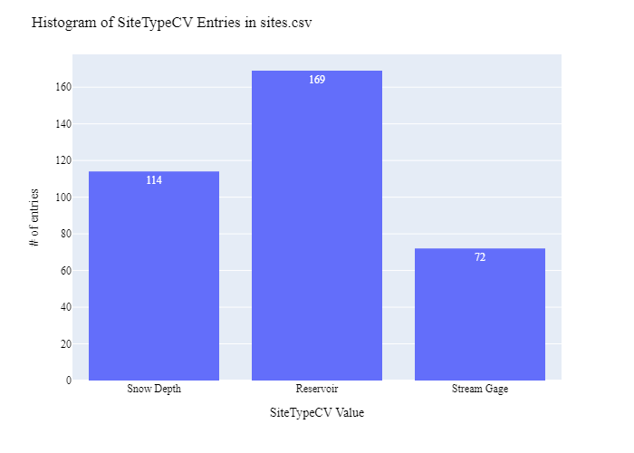
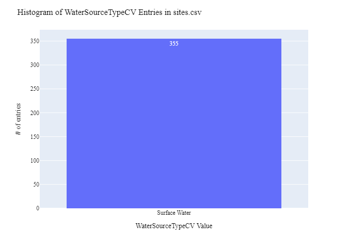
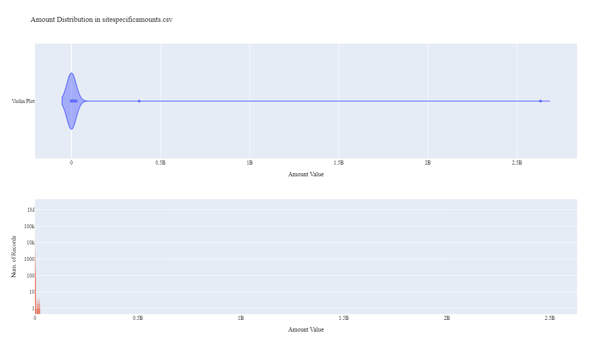
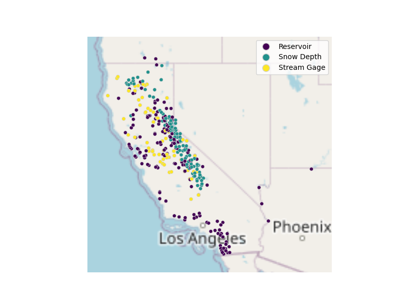

# California Department of Water Resources Water Supply Site Data Preparation for WaDE
This readme details the process that was applied by the staff of the [Western States Water Council (WSWC)](http://wade.westernstateswater.org/) to extracting Water Supply site time series water data made available by the [California Department of Water Resources](https://water.ca.gov/), for inclusion into the Water Data Exchange (WaDE) project.  WaDE enables states to share data with each other and the public in a more streamlined and consistent way. WaDE is not intended to replace the states data or become the source for that data but rather to enable regional analysis to inform policy decisions and for planning purposes. 

## Overview of Source Data Utilized
The following data was used for water allocations...

Name | Description | Download Link | Metadata Glossary Link
---------- | ---------- | ------------ | ------------
**Reservoirs** | Site information for active monthly reservoirs.  Data copy/pasted from website. | [link](https://cdec.water.ca.gov/misc/monthly_res.html) | not provided
**StreamGages** | Snapshot of stream gage site information from the fall of 2020. WaDE is only interested in Active stream gages sites.  Duplicate reservoir sites already noted in **Reservoirs** input were removed.  Shapefile | [link](https://gispublic.waterboards.ca.gov/portal/home/item.html?id=32dfb85bd2744487affe6e3475190093) | not provided
**Timeseries Data** | Site timeseries data for both **Reservoirs** and **StreamGages** inputs.  Retrieved via API and saved to zip file.  WaDE is only interested in daily and monthly timeseries records. | [link](https://cdec.water.ca.gov/queryTools.html) | not provided

Input files used are as follows...
- Reservoirs.zip, zipped csv of reservoir site info
- StreamGages.zip, zipped shp of stream gage site info
- Reservoirs_timeseries.zip, zipped csv of daily and monthly timeseries values for reservoir sites
- StreamGages_timeseries.zip, zipped csv of daily and monthly timeseries value for stream gage sites
 

## Storage for WaDE 2.0 Source and Processed Water Data
The 1) raw input data shared by the state / state agency / data provider (excel, csv, shapefiles, PDF, etc), & the 2) csv processed input data ready to load into the WaDE database, can both be found within the WaDE sponsored Google Drive.  Please contact WaDE staff if unavailable or if you have any questions about the data.
- California Department of Water Resources Site Specific Reservoir and Gage Data: [link](https://drive.google.com/drive/folders/1VTcznMjDIg8F3vk3SAj_Zf_VcJm6Rniq?usp=drive_link)

## Summary of Data Prep
The following text summarizes the process used by the WSWC staff to prepare and share California Department of Water Resources's water supply data for inclusion into the Water Data Exchange (WaDE 2.0) project.  For a complete mapping outline, see *CAwsss_Water Supply Sites Schema Mapping to WaDE.xlsx*.  Several WaDE csv input files will be created in order to extract the California Department of Water Resources's water supply data from the above mentioned input.  Each of these WaDE csv input files was created using the [Python](https://www.python.org/) native language, built and ran within [Jupyter Notebooks](https://jupyter.org/) environment.  Those python files include the following...

- **1_CAwsss_PreProcessWaterSupplySites.ipynb**: used to pre-processes the native date into a WaDE format friendly format.  All datatype conversions occur here.
- **2_CAwsss_CreateWaDEInputFiles.ipynb**: used to create the WaDE input csv files: methods.csv, variables.csv, organizations.csv, watersources.csv, sites.csv, sitespecificamounts.csv.
- **3_CAwsss_WaDEDataAssessmentScript.ipynb**: used to evaluate the WaDE input csv files.

***
### 0) Code File: 1_CAwsss_PreProcessWaterSupplySites.ipynb
Purpose: Pre-process the state agency's input data files and merge them into one master file for simple dataframe creation and extraction.

#### Inputs: 
- Reservoirs.zip
- StreamGages.zip
- Reservoirs_timeseries.zip
- StreamGages_timeseries.zip

#### Outputs:
 - Pwsss_caMain.zip

#### Operation and Steps:
- Read in input data.  Store data in temp DataFrames.  Store by reservoir site info, stream gage site info, reservoir timeseries info, & stream gage timeseries info.
- Inner join timeseries info to respective site info.  Join reservoir via **STATION_ID** & **ID** inputs, join stream gage via  **STATION_ID** & **siteid** inputs.
- Set inputs to WaDE inputs respectively (see below for further detail).
- Review data for errors, check value types.
- Export as Pwsss_caMain.zip.

***
## Code File: 2_CAwsss_CreateWaDEInputFiles.ipynb
Purpose: generate WaDE csv input files (methods.csv, variables.csv, organizations.csv, watersources.csv, sites.csv, sitespecificamounts.csv).

#### Inputs:
- Pwsss_caMain.zip

#### Outputs:
- methods.csv  `Create by hand.`
- variables.csv  `Create by hand.`
- organizations.csv  `Create by hand.`
- watersources.csv
- sites.csv
- sitespecificamounts.csv

## 1) Method Information
Purpose: generate legend of granular methods used on data collection.

#### Operation and Steps:
- Generate single output dataframe *outdf*.
- Populate output dataframe with *WaDE Method* specific columns.
- Assign state info to the *WaDE Method* specific columns (this was hardcoded by hand for simplicity).
- Assign method UUID identifier to each (unique) row.
- Perform error check on output dataframe.
- Export output dataframe *methods.csv*.

#### Sample Output (WARNING: not all fields shown):
|    | MethodUUID   | ApplicableResourceTypeCV   | DataConfidenceValue   | DataCoverageValue   | DataQualityValueCV   | MethodName                                  | MethodNEMILink       | MethodTypeCV               | WaDEDataMappingUrl                                                                                                  |
|---:|:-------------|:---------------------------|:----------------------|:--------------------|:---------------------|:--------------------------------------------|:---------------------|:---------------------------|:--------------------------------------------------------------------------------------------------------------------|
|  0 | CAwsss_M1    | Surface Water              |                       |                     |                      | California Data Exchange Center Query Tools | https://data.ca.gov/ | Water Supply_Site Specific | https://github.com/WSWCWaterDataExchange/MappingStatesDataToWaDE2.0/tree/master/California/WaterSupply_SiteSpecific |

## 2) Variables Information
Purpose: generate legend of granular variables specific to each state.

#### Operation and Steps:
- Generate single output dataframe *outdf*.
- Populate output dataframe with *WaDE Variable* specific columns.
- Assign state info to the *WaDE Variable* specific columns (this was hardcoded by hand for simplicity).
- Assign variable UUID identifier to each (unique) row.
- Perform error check on output dataframe.
- Export output dataframe *variables.csv*.

#### Sample Output (WARNING: not all fields shown):
|    | VariableSpecificUUID   |   AggregationInterval | AggregationIntervalUnitCV   | AggregationStatisticCV   | AmountUnitCV   | MaximumAmountUnitCV   |   ReportYearStartMonth | ReportYearTypeCV   | VariableCV   | VariableSpecificCV                                         |
|---:|:-----------------------|----------------------:|:----------------------------|:-------------------------|:---------------|:----------------------|-----------------------:|:-------------------|:-------------|:-----------------------------------------------------------|
|  0 | CAwsss_V1              |                     1 | Daily                       | Average                  | AF             | AF                    |                      1 | CalendarYear       | Water Supply | Water Supply_Daily_Above Top Of Conservation_Surface Water |

## 3) Organization  Information
Purpose: generate organization directory, including names, email addresses, and website hyperlinks for organization supplying data source.

#### Operation and Steps:
- Generate single output dataframe *outdf*.
- Populate output dataframe with *WaDE Organizations* specific columns.
- Assign state info to the *WaDE Organizations* specific columns (this was hardcoded by hand for simplicity).
- Assign organization UUID identifier to each (unique) row.
- Perform error check on output dataframe.
- Export output dataframe *organizations.csv*.

#### Sample Output (WARNING: not all fields shown):
|    | OrganizationUUID   | OrganizationContactEmail        | OrganizationContactName   | OrganizationName                         | OrganizationPhoneNumber   | OrganizationPurview                                                                                                             | OrganizationWebsite   | State   |
|---:|:-------------------|:--------------------------------|:--------------------------|:-----------------------------------------|:--------------------------|:--------------------------------------------------------------------------------------------------------------------------------|:----------------------|:--------|
|  0 | CAwsss_O1          | Jennifer.Stricklin@water.ca.gov | Jennifer Stricklin        | California Department of Water Resources | 303-866-3581              | Department of Water Resources California Water Plan program computes applied, net, and depletion water balances for California. | https://water.ca.gov/ | CA      |

## 4) Water Source Information
Purpose: generate a list of water sources specific to a water right.

#### Operation and Steps:
- Read the input file and generate single output dataframe *outdf*.
- Populate output dataframe with *WaDE WaterSources* specific columns.
- Assign agency info to the *WaDE WaterSources* specific columns.  See *CAwsss_Water Supply Sites Schema Mapping to WaDE.xlsx* for specific details.  Items of note are as follows...
    - *WaterSourceUUID* = CAwsss_W + native ID input, create one if not provided.
    - *WaterQualityIndicatorCV* = "Fresh"
    - *WaterSourceName* = "WaDE Blank" (not provided)
    - *WaterSourceNativeID* = will auto create one
    - *WaterSourceTypeCV* = "Surface Water"
- Consolidate output dataframe into water source specific information only by dropping duplicate entries, drop by WaDE specific *WaterSourceName* & *WaterSourceTypeCV* fields.
- Assign water source UUID identifier to each (unique) row.
- Perform error check on output dataframe.
- Export output dataframe *WaterSources.csv*.

#### Sample Output (WARNING: not all fields shown):
|    | WaterSourceUUID   | Geometry   | GNISFeatureNameCV   | WaterQualityIndicatorCV   | WaterSourceName   | WaterSourceNativeID   | WaterSourceTypeCV   |
|---:|:------------------|:-----------|:--------------------|:--------------------------|:------------------|:----------------------|:--------------------|
|  0 | CAwsss_WwadeId1   |            |                     | Fresh                     | Wade Blank        | wadeId1               | Surface Water       |

Any data fields that are missing required values and dropped from the WaDE-ready dataset are instead saved in a separate csv file (e.g. *watersources_missing.csv*) for review.  This allows for future inspection and ease of inspection on missing items.  Mandatory fields for the water sources include the following...
- WaterSourceUUID
- WaterQualityIndicatorCV
- WaterSourceTypeCV

## 5) Site Information
Purpose: generate a list of sites information.

#### Operation and Steps:
- Read the input file and generate single output dataframe *outdf*.
- Populate output dataframe with *WaDE Site* specific columns.
- Assign agency info to the *WaDE Site* specific columns.  See *CAwsss_Water Supply Sites Schema Mapping to WaDE.xlsx* for specific details.  Items of note are as follows...
    - *SiteUUID* = CAwsss_s + site native ID input, create one if not provided.
    - *WaterSourceUUIDs* = Extract *WaterSourceUUID* from waterSources.csv input csv file. See code for specific implementation of extraction.
    - *CoordinateAccuracy* = ""
    - *CoordinateMethodCV* = ""
    - *Country* = **County** input for reservoir data, blank for stream gage
    - *EPSGCodeCV* = "4326"
    - *Geometry* = ""
    - *GNISCodeCV* = ""
    - *HUC12* = ""
    - *HUC8* = ""
    - *Latitude* = use provided **Latitude** input for reservoir, create one for stream gage
    - *Longitude* = use provided **Longitude** input for reservoir, create one for stream gage
    - *NHDNetworkStatusCV* = ""
    - *NHDProductCV* = ""
    - *PODorPOUSite* = ""
    - *SiteName* = **Station** input for reservoir, **Station** input for stream gage.
    - *SiteNativeID* = **STATION_ID** input for reservoir, **siteid** input for stream gage.
    - *SiteTypeCV* = "Reservoir" for reservoir, "Stream Gage" for stream gage
    - *StateCV* = "CA"																			
    - *USGSSiteID* = ""
- Consolidate output dataframe into site specific information only by dropping duplicate entries, drop by WaDE specific *SiteNativeID*, *SiteName*, *SiteTypeCV*, *Longitude* & *Latitude* fields.
- Assign site UUID identifier to each (unique) row.
- Perform error check on output dataframe.
- Export output dataframe *sites.csv*.

#### Sample Output (WARNING: not all fields shown):
|    | SiteUUID    | RegulatoryOverlayUUIDs   | WaterSourceUUIDs   | CoordinateAccuracy   | CoordinateMethodCV   | County   |   EPSGCodeCV | GNISCodeCV   | HUC12   | HUC8   |   Latitude |   Longitude | NHDNetworkStatusCV   | NHDProductCV   | PODorPOUSite   | SiteName     | SiteNativeID   | SitePoint   | SiteTypeCV   | StateCV   | USGSSiteID   |
|---:|:------------|:-------------------------|:-------------------|:---------------------|:---------------------|:---------|-------------:|:-------------|:--------|:-------|-----------:|------------:|:---------------------|:---------------|:---------------|:-------------|:---------------|:------------|:-------------|:----------|:-------------|
|  0 | CAwsss_SALM |                          | CAwsss_WwadeId1    | WaDE Blank           | WaDE Blank           | Plumas   |         4326 |              |         |        |     40.218 |    -121.173 |                      |                |                | Lake Almanor | ALM            |             | Reservoir    | CA        |              |

Any data fields that are missing required values and dropped from the WaDE-ready dataset are instead saved in a separate csv file (e.g. *sites_missing.csv*) for review.  This allows for future inspection and ease of inspection on missing items.  Mandatory fields for the sites include the following...
- SiteUUID 
- CoordinateMethodCV
- EPSGCodeCV
- SiteName

## 6) SiteSpecificAmounts Information
Purpose: generate master sheet of site-specific amount information to import into WaDE 2.0.

#### Operation and Steps:
- Read the input files and generate single output dataframe *outdf*.
- Populate output dataframe with *WaDE site-specific amount* specific columns.
- Assign agency info to the *WaDE site-specific amount* specific columns.  See *CAwsss_Water Supply Sites Schema Mapping to WaDE.xlsx* for specific details.  Items of note are as follows...
    - Extract *MethodUUID*, *VariableSpecificUUID*, *OrganizationUUID*, *WaterSourceUUID*, & *SiteUUID* from respective input csv files. See code for specific implementation of extraction.
    - *Amount* = **VALUE** input(s), but remove "BRT" & "ART" inputs.
    - *AssociatedNativeAllocationIDs* = ""
    - *BeneficialUseCategory* = **SENSOR_TYPE** input(s).
    - *CommunityWaterSupplySystem* = ""
    - *CropTypeCV* = ""
    - *CustomerTypeCV* = ""
    - *DataPublicationDate* = use today's date
    - *DataPublicationDOI* = ""
    - *Geometry* = ""
    - *IrrigatedAcreage* = ""
    - *IrrigationMethodCV* = ""
    - *PopulationServed* = ""
    - *PowerGeneratedGWh* = ""
    - *PowerType* = ""
    - *PrimaryUseCategory* = **SENSOR_TYPE** input(s), same as ben use.
    - *ReportYearCV* = **OBS DATE** input(s), extract out year value
    - *SDWISIdentifier* = ""
    - *TimeframeEnd* = **OBS DATE** input(s)
    - *TimeframeStart* = **OBS DATE** input(s)
																						
- Perform error check on output dataframe.
- Export output dataframe *sitespecificamounts.csv*.

#### Sample Output (WARNING: not all fields shown):
|    | MethodUUID   | OrganizationUUID   | SiteUUID    | VariableSpecificUUID   | WaterSourceUUID   |   Amount | AllocationCropDutyAmount   | AssociatedNativeAllocationIDs   | BeneficialUseCategory   | CommunityWaterSupplySystem   | CropTypeCV   | CustomerTypeCV   | DataPublicationDate   | DataPublicationDOI   | Geometry   | IrrigatedAcreage   | IrrigationMethodCV   | PopulationServed   | PowerGeneratedGWh   | PowerType   | PrimaryUseCategory   |   ReportYearCV | SDWISIdentifier   | TimeframeEnd   | TimeframeStart   |
|---:|:-------------|:-------------------|:------------|:-----------------------|:------------------|---------:|:---------------------------|:--------------------------------|:------------------------|:-----------------------------|:-------------|:-----------------|:----------------------|:---------------------|:-----------|:-------------------|:---------------------|:-------------------|:--------------------|:------------|:---------------------|---------------:|:------------------|:---------------|:-----------------|
|  0 | CAwsss_M1    | CAwsss_O1          | CAwsss_SJNN | CAwsss_V31             | CAwsss_WwadeId1   |      820 |                            |                                 | Storage Volume          |                              |              |                  | 09/23/2024            |                      |            |                    |                      |                    |                     |             | Storage Volume       |           1962 |                   | 1962-10-31     | 1962-10-31       |
Num of Record Summary

Any data fields that are missing required values and dropped from the WaDE-ready dataset are instead saved in a separate csv file (e.g. *sitespecificamounts_missing.csv*) for review.  This allows for future inspection and ease of inspection on missing items.  Mandatory fields for the site-specific amount include the following...
- MethodUUID
- VariableSpecificUUID
- OrganizationUUID
- SiteUUID
- BeneficialUseCategory
- Amount
- DataPublicationDate

***
## Source Data & WaDE Complied Data Assessment
The following info is from a data assessment evaluation of the completed data...

Dataset | Num of Source Entries (rows)
---------- | ---------- 
**Reservoirs.zip** | 180
**StreamGages.zip** | 2,597
**Reservoirs_timeseries.zip** | 5,082,260
**StreamGages_timeseries.zip** | 3,250,992

Dataset  | Num of Identified Sites | Num of Identified Time Series Records
**Compiled WaDE Data** | 274 | 4,610,562

Assessment of Removed Source Records | Count | Action
---------- | ---------- | ----------
Negative, blank, or 0 Amount values | 1,656,077 | removed from sitespecificamounts.csv...
Not Unique combination of SiteSpecificAmounts record | 92,460 | removed from sitespecificamounts.csv i...

**Figure 1:** Distribution of Site Type Sites within the sites.csv

**Figure 2:** Distribution Sites by WaterSourceTypeCV within the sites.csv

**Figure 3:** Distribution of Primary Beneficial Uses within the sitespecificamounts.csv

**Figure 4:** Distribution & Range of Amount (unknown unit) within the sitespecificamounts.csv

**Figure 5:** Map of Identified Points within the sites.csv

***
## Staff Contributions
Data created here was a contribution between the [Western States Water Council (WSWC)](http://wade.westernstateswater.org/) and the [California Department of Water Resources](https://water.ca.gov/).

WSWC Staff
- Ryan James <rjames@wswc.utah.gov>

California Department of Water Resources Staff
- Jennifer Stricklin <Jennifer.Stricklin@water.ca.gov>
