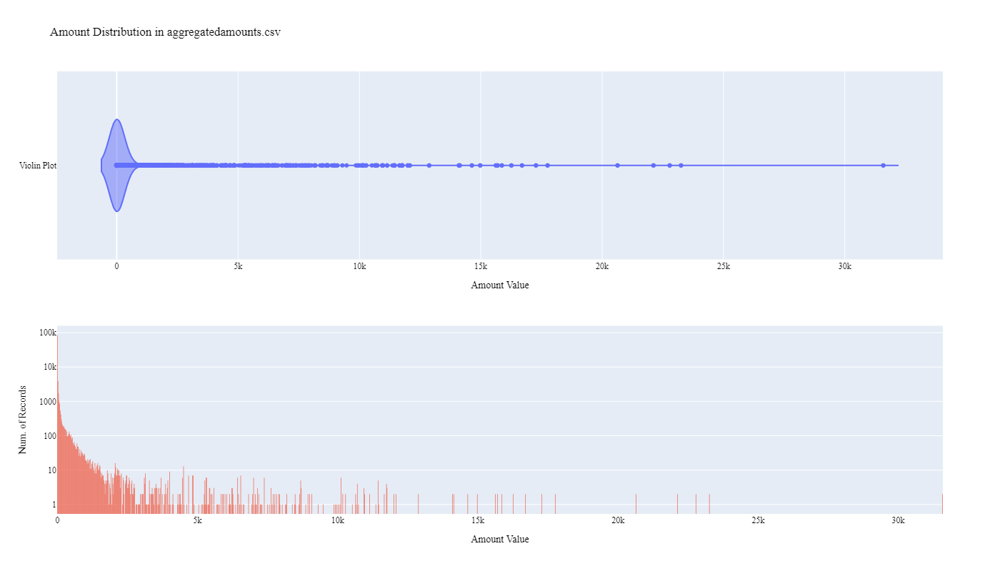

# California Department of Water Resources Aggregated Water Use Data Preparation for WaDE
This readme details the process that was applied by the staff of the [Western States Water Council (WSWC)](http://wade.westernstateswater.org/) to extracting aggregated water use data made available by the [California Department of Water Resources](https://water.ca.gov/), for inclusion into the Water Data Exchange (WaDE) project.   WaDE enables states to share data with each other and the public in a more streamlined and consistent way.  WaDE is not intended to replace the states data or become the source for that data but rather to enable regional analysis to inform policy decisions and for planning purposes. 

## Overview of Data Utilized
The following data was used for water allocations...

Name | Description | Download Link | Metadata Glossary Link
---------- | ---------- | ------------ | ------------
**Water Plan Water Balance Data** | aggregated time series water budget files csv for HR, PA, and DAU regions.  Data used was for the years 2002-2016.  In total there are 45 separate csv files (15 HR, 15 PA, & 15 DAU). | [link]((https://data.cnra.ca.gov/dataset/water-plan-water-balance-data) ) | not provided
 **Water_Plan_Planning_Areas-shp** | files were used to extract geometry, create shape files, and were obtained from the DWR Atlas. | [link]((https://atlas-dwr.opendata.arcgis.com/datasets/a911dd793cae48f1a3662e08f4811382_0?geometry=-152.647%2C31.071%2C-85.894%2C43.276)) | not provided
**Hydrologic_Regions-shp** | files were used to extract geometry, create shape files, and were obtained from the DWR Atlas. | [link](https://atlas-dwr.opendata.arcgis.com/datasets/2a572a181e094020bdaeb5203162de15_0) | not provided
**DAUCO-shp** | files were used to extract geometry, create shape files, and were provided with previous WaDE 1.0 correspondence in the past between the CDWR and the WSWC.  DAUCO is more granular than the actual county shape (see below Figure 1) | not provided | not provided

## Storage for WaDE 2.0 Source and Processed Water Data
The 1) raw input data shared by the state / state agency / data provider (excel, csv, shapefiles, PDF, etc), & the 2) csv processed input data ready to load into the WaDE database, can both be found within the WaDE sponsored Google Drive.  Please contact WaDE staff if unavailable or if you have any questions about the data.
- California Department of Water Resources Aggregated Water Use Time Series Data: [link](https://drive.google.com/drive/folders/1bSCO5A2Rl82aQB0QsjIRsAepafs2jNDY?usp=drive_link)

## Summary of Data Prep
The following text summarizes the process used by the WSWC staff to prepare and share aggregated water use data for inclusion into the Water Data Exchange (WaDE 2.0) project.  For a complete mapping outline, see *CAwuag_Aggregated Water Use Schema Mapping to WaDE.xlsx*.  Several WaDE csv input files will be created in order to extract the water rights data from the above mentioned input.  Each of these WaDE csv input files was created using the [Python](https://www.python.org/) native language, built and ran within [Jupyter Notebooks](https://jupyter.org/) environment.  Those python files include the following...

- **1_CAwuag_PreProcessAggregatedWaterUseData.ipynb**: used to pre-processes the native date into a WaDE format friendly format.  All datatype conversions occur here.
- **2_CAwuag_CreateWaDEInputFiles.ipynb**: used to create the WaDE input csv files: methods.csv, variables.csv, organizations.csv, watersources.csv, reportingunits.csv, aggregatedamounts.csv
- **3_CAwuag_WaDEDataAssessmentScript.ipynb**: used to evaluate the WaDE input csv files.

***
## Code File: 1_CAwuag_PreProcessAggregatedWaterUseData.ipynb
Purpose: Pre-process the input data files and merge them into one master file for simple dataframe creation and extraction.

#### Inputs: 
 - A-DWR-WaterBalance-Level2-DP-1000-2002-2016-DAUCO.zip, combined timeseries info for Detailed Analysis Units by County (DAU) from 2002-2016.
 - CA-DWR-WaterBalance-Level2-DP-1000-2002-2016-HR.zip, combined timeseries info for Hydrologic Regions (HR) from 2002-2016.
 - CA-DWR-WaterBalance-Level2-DP-1000-2002-2016-PA.zip, combined timeseries info for Planning Areas (PA) from 2002-2016.
 - WaDECADAU.zip, shp file for geometry boundaries related to Detailed Analysis Units by County (DAU) records.
 - Hydrologic_Regions.zip, shp file for geometry boundaries related to Hydrologic Regions (HR) records.
 - Water_Plan_Planning_Areas.zip, shp file for geometry boundaries related to Planning Areas (PA) records

#### Outputs:
 - Pwuag_ccMain.zip
 - P_Geometry.zip

#### Operation and Steps:
- Import timeseries and geometry boundary data into temporary DataFrames by DAU, HR, & PA records.
- For WaDE (09/24/2024) we are only interested in "Applied Water Use" & "Depletion" timeseries records in **CategoryC** inputs.  Remove all other records from timeseries inputs.
- For HR timeseries records, assign WaDE *ReportingUnitNativeID* value using provided dictionary of **HR** input names to a id number.
- For DAU, HR, & PA timeseries records, extract key information for WaDE input DataFrames.
- Combine WaDE DAU, HR, & PA records into single output DataFrame.
- Check data types and clean data.
- For DAU, HR, & PA shp file data, extract *ReportingUnitNativeID* & *geometry* inputs.  Combine into single output DataFrame.
- Export data as Pwuag_ccMain.zip for records and P_Geometry.zip as geometry boundary information.

***
## Code File: 2_CAwuag_CreateWaDEInputFiles.ipynb
Purpose: generate WaDE csv input files (methods.csv, variables.csv, organizations.csv, watersources.csv, reportingunits.csv, aggregatedamounts.csv).

#### Inputs:
- Pwuag_ccMain.zip
- P_Geometry.zip

#### Outputs:
- methods.csv  `Create by hand.`
- variables.csv  `Create by hand.`
- organizations.csv  `Create by hand.`
- watersources.csv
- reportingunits.csv
- aggregatedamounts.csv

## 1) Method Information
Purpose: generate legend of granular methods used on data collection.

#### Operation and Steps:
- Generate single output dataframe *outdf*.
- Populate output dataframe with *WaDE Method* specific columns.
- Assign state info to the *WaDE Method* specific columns (this was hardcoded by hand for simplicity).
- Assign method UUID identifier to each (unique) row.
- Perform error check on output dataframe.
- Export output dataframe *methods.csv*.

#### Sample Output (WARNING: not all fields shown):
|    | MethodUUID   | ApplicableResourceTypeCV            | DataConfidenceValue   | DataCoverageValue   | DataQualityValueCV   | MethodName                    | MethodNEMILink                                                 | MethodTypeCV   | WaDEDataMappingUrl                                                                                                 |
|---:|:-------------|:------------------------------------|:----------------------|:--------------------|:---------------------|:------------------------------|:---------------------------------------------------------------|:---------------|:-------------------------------------------------------------------------------------------------------------------|
|  0 | CAwuag_M1    | Surface Ground Reuse Recycled Water |                       |                     |                      | Water Plan Water Balance Data | https://data.cnra.ca.gov/dataset/water-plan-water-balance-data | Computed       | https://github.com/WSWCWaterDataExchange/MappingStatesDataToWaDE2.0/tree/master/California/WaterUse_AggregatedArea |
## 2) Variables Information
Purpose: generate legend of granular variables specific to each state.

#### Operation and Steps:
- Generate single output dataframe *outdf*.
- Populate output dataframe with *WaDE Variable* specific columns.
- Assign state info to the *WaDE Variable* specific columns (this was hardcoded by hand for simplicity).
- Assign variable UUID identifier to each (unique) row.
- Perform error check on output dataframe.
- Export output dataframe *variables.csv*.

#### Sample Output (WARNING: not all fields shown):
|    | VariableSpecificUUID   |   AggregationInterval | AggregationIntervalUnitCV   | AggregationStatisticCV   | AmountUnitCV   | MaximumAmountUnitCV   |   ReportYearStartMonth | ReportYearTypeCV   | VariableCV        | VariableSpecificCV                                           |
|---:|:-----------------------|----------------------:|:----------------------------|:-------------------------|:---------------|:----------------------|-----------------------:|:-------------------|:------------------|:-------------------------------------------------------------|
|  0 | CAwuag_V1              |                     1 | Annual                      | Cumulative               | AFY            | AFY                   |                      1 | CalendarYear       | Applied Water Use | Applied Water Use_Annual_Agriculture_Surface And Groundwater |

## 3) Organization  Information
Purpose: generate organization directory, including names, email addresses, and website hyperlinks for organization supplying data source.

#### Operation and Steps:
- Generate single output dataframe *outdf*.
- Populate output dataframe with *WaDE Organizations* specific columns.
- Assign state info to the *WaDE Organizations* specific columns (this was hardcoded by hand for simplicity).
- Assign organization UUID identifier to each (unique) row.
- Perform error check on output dataframe.
- Export output dataframe *organizations.csv*.

#### Sample Output (WARNING: not all fields shown):
|    | OrganizationUUID   | OrganizationContactEmail        | OrganizationContactName   | OrganizationDataMappingURL                                                                 | OrganizationName                         | OrganizationPhoneNumber   | OrganizationPurview                                                                                                             | OrganizationWebsite   | State   |
|---:|:-------------------|:--------------------------------|:--------------------------|:-------------------------------------------------------------------------------------------|:-----------------------------------------|:--------------------------|:--------------------------------------------------------------------------------------------------------------------------------|:----------------------|:--------|
|  0 | CAwuag_O1          | Jennifer.Stricklin@water.ca.gov | Jennifer Stricklin        | https://github.com/WSWCWaterDataExchange/MappingStatesDataToWaDE2.0/tree/master/California | California Department of Water Resources | 303-866-3581              | Department of Water Resources California Water Plan program computes applied, net, and depletion water balances for California. | https://water.ca.gov/ | CA      |

## 4) Water Source Information
Purpose: generate a list of water sources specific to a water right.

#### Operation and Steps:
- Read the input file and generate single output dataframe *outdf*.
- Populate output dataframe with *WaDE WaterSources* specific columns.
- Assign agency info to the *WaDE WaterSources* specific columns.  See *CAwuag_Aggregated Water Use Schema Mapping to WaDE.xlsx* for specific details.  Items of note are as follows...
    - *WaterSourceUUID* = CAagwu_W + native id, or auto create id if need be.
    - *WaterQualityIndicatorCV* = "Fresh"
    - *WaterSourceName* = "WaDE Blank" (or unspecified)
    - *WaterSourceNativeID* = auto create ID value.
    - *WaterSourceTypeCV* = *Surface and Groundwater*
- Consolidate output dataframe into water source specific information only by dropping duplicate entries, drop by WaDE specific *WaterSourceName* & *WaterSourceTypeCV* fields.
- Perform error check on output dataframe.
- Export output dataframe *WaterSources.csv*.

#### Sample Output (WARNING: not all fields shown):
|    | WaterSourceUUID   | Geometry   | GNISFeatureNameCV   | WaterQualityIndicatorCV   | WaterSourceName   | WaterSourceNativeID   | WaterSourceTypeCV       |
|---:|:------------------|:-----------|:--------------------|:--------------------------|:------------------|:----------------------|:------------------------|
|  0 | CAwuag_WwadeId1   |            |                     | Fresh                     | WaDE Blank        | wadeId1               | Surface And Groundwater |

Any data fields that are missing required values and dropped from the WaDE-ready dataset are instead saved in a separate csv file (e.g. *watersources_missing.csv*) for review.  This allows for future inspection and ease of inspection on missing items.  Mandatory fields for the water sources include the following...
- WaterSourceUUID
- WaterQualityIndicatorCV
- WaterSourceTypeCV

### 5) Reporting Unit Area Information
Purpose: generate a list of polygon areas associated with the state agency specific area on aggregated water use data.

#### Operation and Steps:
- Read the input file and generate single output dataframe *outdf*.
- Populate output dataframe with *WaDE ReportingUnits* specific columns.
- Assign state agency data info to the *WaDE ReportingUnits* specific columns.  See *CAwuag_Aggregated Water Use Schema Mapping to WaDE.xlsx* for specific details.  Items of note are as follows...
    - *ReportingUnitUUID* = CAagwu_RU + native id, or auto create id if need be.
    - *EPSGCodeCV* = 4326
    - *ReportingUnitName* = **DAU_NAME** input for DAU, **HR** input for HR, **PA** input for PA.
    - *ReportingUnitNativeID* = **DAU** input for DAU, *in_ReportingUnitNativeID* input for HR based on provided dictionary of ID values, **PA** input for PA.
    - *ReportingUnitProductVersion* = ""
    - *ReportingUnitTypeCV* = *Detailed Analysis Units by County* for DAU, *Hydrologic Region* for HR, *Planning Area* for PA.
    - *ReportingUnitUpdateDate* = ""
    - *StateCV* = "CA"
- Consolidate output dataframe into site specific information only by dropping duplicate entries, drop by WaDE specific *ReportingUnitName*, *ReportingUnitNativeID* & *ReportingUnitTypeCV* fields.
- Perform error check on output dataframe.
- Export output dataframe *reportingunits.csv*.

#### Sample Output (WARNING: not all fields shown):
|    | ReportingUnitUUID   |   EPSGCodeCV | ReportingUnitName   |   ReportingUnitNativeID | ReportingUnitProductVersion   | ReportingUnitTypeCV   | ReportingUnitUpdateDate   | StateCV   |
|---:|:--------------------|-------------:|:--------------------|------------------------:|:------------------------------|:----------------------|:--------------------------|:----------|
|  0 | CAwuag_RU1          |         4326 | North Coast         |                       1 |                               | Hydrologic Region     |                           | CA        |

Any data fields that are missing required values and dropped from the WaDE-ready dataset are instead saved in a separate csv file (e.g. *reportingunits_missing.csv*) for review.  This allows for future inspection and ease of inspection on missing items.  Mandatory fields for the reportingunits include the following...
- ReportingUnitUUID
- ReportingUnitName
- ReportingUnitNativeID
- ReportingUnitTypeCV
- StateCV

### 6) Aggregated to Area Time Series Information
Purpose: generate master sheet of state agency specified area aggregated water budget information to import into WaDE 2.0.

#### Operation and Steps:
- Read the input files and generate single output dataframe *outdf*.
- Populate output dataframe with *WaDE Water Allocations* specific columns.
- Assign state agency data info to the *WaDE Water Allocations* specific columns.  See *CAwuag_Aggregated Water Use Schema Mapping to WaDE.xlsx* for specific details.  Items of note are as follows...
    - Extract *MethodUUID*, *VariableSpecificUUID*, *OrganizationUUID*, *WaterSourceUUID*, & *ReportingUnitUUID* from respective input csv files. See code for specific implementation of extraction.
    - *AllocationCropDutyAmount* = ""
    - *Amount* = **KAcreFt** input(s).
    - *BeneficialUseCategory* = **CategoryA** input(s).
    - *CommunityWaterSupplySystem* = ""
    - *CropTypeCV* = ""
    - *CustomerTypeCV* = ""
    - *DataPublicationDate* = ""
    - *DataPublicationDOI* = ""
    - *InterbasinTransferFromID* = ""
    - *InterbasinTransferToID* = ""
    - *IrrigatedAcreage* = ""
    - *IrrigationMethodCV* = ""
    - *PopulationServed* = ""
    - *PowerGeneratedGWh* = ""
    - *PowerType* = ""
    - *PrimaryUseCategoryCV* = ""
    - *ReportYearCV* = **Year** input(s), extract out year value.
    - *SDWISIdentifierCV* = ""
    - *TimeframeEnd* = **Year** input(s)
    - *TimeframeStart* = **Year** input(s)
- Perform error check on output dataframe.
- Export output dataframe *aggregatedamounts.csv*.

#### Sample Output (WARNING: not all fields shown):
|    | MethodUUID   | OrganizationUUID   | ReportingUnitUUID   | VariableSpecificUUID   | WaterSourceUUID   | AllocationCropDutyAmount   |   Amount | BeneficialUseCategory   | CommunityWaterSupplySystem   | CropTypeCV   | CustomerTypeCV   | DataPublicationDate   | DataPublicationDOI   | InterbasinTransferFromID   | InterbasinTransferToID   | IrrigatedAcreage   | IrrigationMethodCV   | PopulationServed   | PowerGeneratedGWh   | PowerType   | PrimaryUseCategoryCV   |   ReportYearCV | SDWISIdentifierCV   | TimeframeEnd   | TimeframeStart   | PrimaryUseCategory   |
|---:|:-------------|:-------------------|:--------------------|:-----------------------|:------------------|:---------------------------|---------:|:------------------------|:-----------------------------|:-------------|:-----------------|:----------------------|:---------------------|:---------------------------|:-------------------------|:-------------------|:---------------------|:-------------------|:--------------------|:------------|:-----------------------|---------------:|:--------------------|:---------------|:-----------------|:---------------------|
|  0 | CAwuag_M1    | CAwuag_O1          | CAwuag_RUDAU00125   | CAwuag_V1              | CAwuag_WwadeId1   |                            |    132.3 | Agriculture             |                              |              |                  | 09/23/2024            |                      |                            |                          |                    |                      |                    |                     |             | Agriculture Irrigation |           2002 |                     | 2002-12-31     | 2002-01-01       |                      |

Any data fields that are missing required values and dropped from the WaDE-ready dataset are instead saved in a separate csv file (e.g. *aggregatedamounts_missing.csv*) for review.  This allows for future inspection and ease of inspection on missing items.  Mandatory fields for the water allocations include the following...
- MethodUUID
- VariableSpecificUUID
- OrganizationUUID
- WaterSourceUUID
- ReportingUnitUUID
- Amount

***
## Source Data & WaDE Complied Data Assessment
The following info is from a data assessment evaluation of the completed data...

Dataset | Num of Source Entries (rows)
---------- | ---------- 
**RawinputData/CA-DWR-WaterBalance-Level2-DP-1000-2002-2016-DAUCO.zip** | 3,014,000
**CA-DWR-WaterBalance-Level2-DP-1000-2002-2016-HR.zip**  | 42,610
**CA-DWR-WaterBalance-Level2-DP-1000-2002-2016-PA.zip** | 238,616

Dataset  | Num of Identified Reporting Unit Areas | Num of Identified Time Series Records
---------- | ----------  | ---------- 
**Compiled WaDE Data** | 545 | 97,524

Assessment of Removed Source Records | Count | Action
---------- | ---------- | ----------
Incomplete or bad entry for Geometry  |  63 | removed from reportingunits.csv input
Incomplete or bad entry for ReportingUnitUUID  |  1,188 | removed from aggregatedamounts.csv input

**Figure 1:** Distribution of Water Source Type in watersources.csv

**Figure 2:** Distribution of Primary Beneficial Uses within the aggregatedamounts.csv

**Figure 3:** Distribution & Range of Amount within the aggregatedamounts.csv

n
**Figure 4:** Map of Identified Reporting Unit Areas for DAU records

**Figure 5:** Map of Identified Reporting Unit Areas for HR records

**Figure 5:** Map of Identified Reporting Unit Areas for PA records

***
## Staff Contributions
Data created here was a contribution between the [Western States Water Council (WSWC)](http://wade.westernstateswater.org/) and the [California Department of Water Resources](https://water.ca.gov/).

WSWC Staff
- Ryan James <rjames@wswc.utah.gov>

California Department of Water Resources Staff
- Jennifer Stricklin <Jennifer.Stricklin@water.ca.gov>