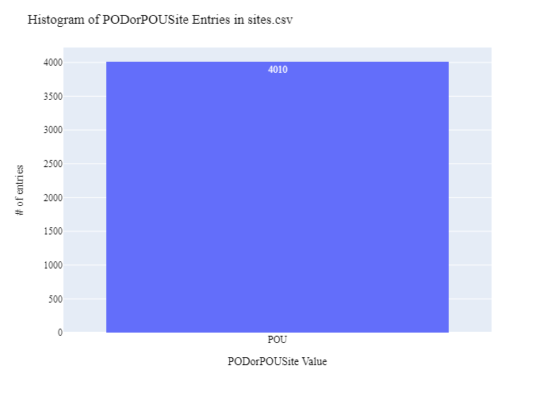
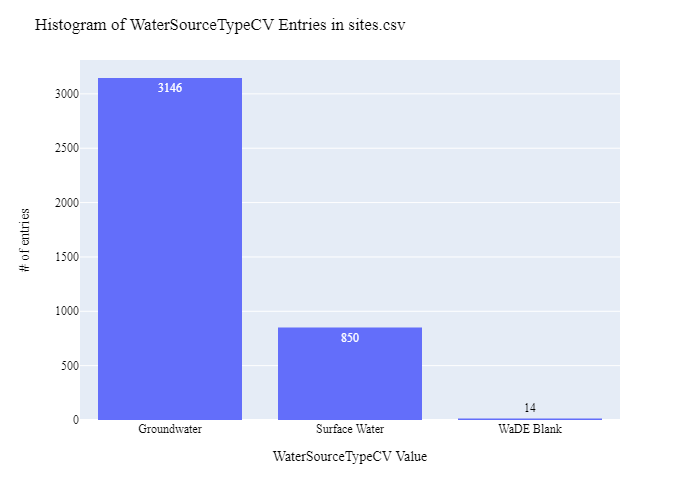
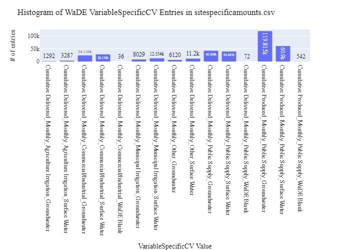
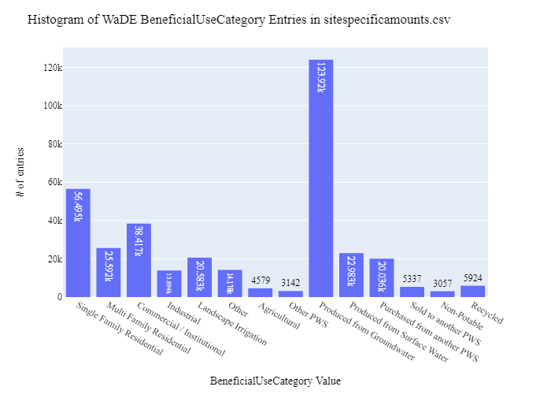
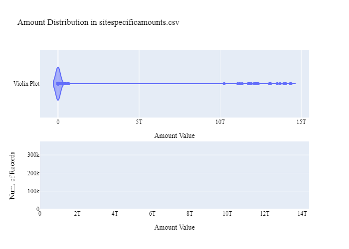
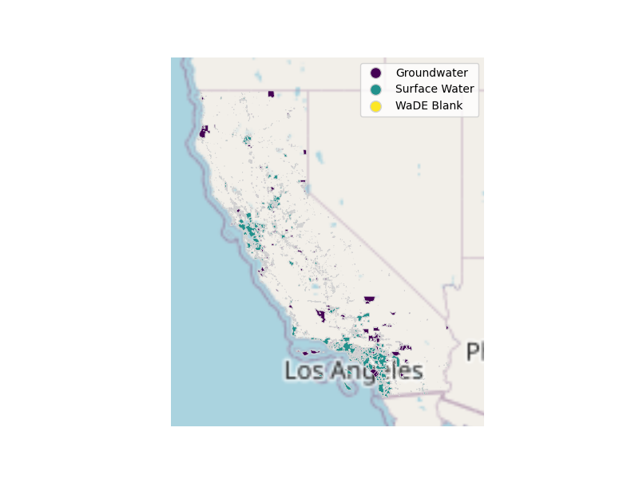

# CSWRCB Site Specific Public Supply Data Preparation for WaDE
This readme details the process that was applied by the staff of the [Western States Water Council (WSWC)](http://wade.westernstateswater.org/) to extracting site specific time series water data made available by the [California State Water Resources Control Board (CSWRCB)](https://www.waterboards.ca.gov/waterrights/water_issues/programs/ewrims/), for inclusion into the Water Data Exchange (WaDE) project.  WaDE enables states to share data with each other and the public in a more streamlined and consistent way. WaDE is not intended to replace the states data or become the source for that data but rather to enable regional analysis to inform policy decisions and for planning purposes. 

## Overview of Source Data Utilized
The following data was used for water allocations...

Name | Description | Download Link | Metadata Glossary Link
---------- | ---------- | ------------ | ------------
**Delivered & Produced Water - Public System** | Time series data 2013-2016. | [link](https://data.ca.gov/dataset/drinking-water-public-water-system-annually-reported-water-production-and-delivery-information) | see download link
**Public Water system Facilities** | Information for all public water systems (PWS) in California, including the name, location and some general informaiton for each PWS.| [link](https://data.ca.gov/dataset/drinking-water-public-water-system-information) | see download link
**California Drinking Water System Area Boundaries** | Service area boundaries of drinking water service providers, as verified by the Division of Drinking Water, State Water Resources Control Board.| [link](https://gispublic.waterboards.ca.gov/portal/home/item.html?id=fbba842bf134497c9d611ad506ec48cc) | [link](https://gispublic.waterboards.ca.gov/portal/sharing/rest/content/items/fbba842bf134497c9d611ad506ec48cc/info/metadata/metadata.xml?format=default&output=html)

Input files used are as follows...
- delivered-water-public-system-water-reported-in-the-electronic-annual-report-ear-2013-2016.zip, csv of delivered timeseries info
- produced-water-public-water-system-reported-in-the-electronic-annual-report-ear-2013-2016.zip, csv of produced timeseries info
- drinking Water Watch - Public Water System facilities.zip, csv of drinking water info
- California_Drinking_Water_System_Area_Boundaries.zip, shp file boundary info of drinking water
 

## Storage for WaDE 2.0 Source and Processed Water Data
The 1) raw input data shared by the state / state agency / data provider (excel, csv, shapefiles, PDF, etc), & the 2) csv processed input data ready to load into the WaDE database, can both be found within the WaDE sponsored Google Drive.  Please contact WaDE staff if unavailable or if you have any questions about the data.
- CSWRCB Site-Specific Public Supply Time Series Data: [link](https://drive.google.com/drive/folders/1Q5qCreoYhKy7AVgSoG3d0OKVoPMFXVa-?usp=drive_link)

## Summary of Data Prep
The following text summarizes the process used by the WSWC staff to prepare and share CSWRCB's site-specific public supply time series data for inclusion into the Water Data Exchange (WaDE 2.0) project.  For a complete mapping outline, see *CAssps_Public Supply Water Use Schema Mapping to WaDE.xlsx*.  Several WaDE csv input files will be created in order to extract the CSWRCB's site-specific public supply time series data from the above mentioned input.  Each of these WaDE csv input files was created using the [Python](https://www.python.org/) native language, built and ran within [Jupyter Notebooks](https://jupyter.org/) environment.  Those python files include the following...

- **1_CAssps_PreProcessAllocationData.ipynb**: used to pre-processes the native date into a WaDE format friendly format.  All datatype conversions occur here.
- **2_CAssps_CreateWaDEInputFiles.ipynb**: used to create the WaDE input csv files: methods.csv, variables.csv, organizations.csv, watersources.csv, sites.csv, sitespecificamounts.csv, podsitetopousiterelationships.csv.
- **3_XXssps_WaDEDataAssessmentScript.ipynb**: used to evaluate the WaDE input csv files.

***
### 0) Code File: 1_CAssps_PreProcessAllocationData.ipynb
Purpose: Pre-process the state agency's input data files and merge them into one master file for simple dataframe creation and extraction.

#### Inputs: 
- delivered-water-public-system-water-reported-in-the-electronic-annual-report-ear-2013-2016.zip
- produced-water-public-water-system-reported-in-the-electronic-annual-report-ear-2013-2016.zip
- drinking Water Watch - Public Water System facilities.zip
- California_Drinking_Water_System_Area_Boundaries.zip

#### Outputs:
 - Pssps_Main.zip
 - P_Geometry.zip

#### Inputs: 
- Read in input csv data, shp files.  Store into temporary dataframes.
- Left join dataframes together.  Join *delivered* -to- *PWS Facility Information.csv* via **PWSID** and **Water System No** respectively, and *CADWS_AreaBoundaries.csv* with **SABL_PWSID**.
- As a whole, there are 11 different timeseries that will be incorporated into the WaDE 2.0 architecture.  These timeseries differ by variable type, beneficial use, and water source type…
    - for variable: Delivered or Produced
    - for beneficial use: Single Family Residential, Multi-Family Residential, Commercial Institutional, Industrial, Landscape Irrigation, Other, Agriculture, Other PWS, or Total Use
    - for water source type: Groundwater, Surface Water, or Unspecified
- For Delivered data, there are eight different timeseries of interest.  For each of eight data sets...
    - WaDE *VariableCV* field = "Delivered".
    - WaDE *WaterSourceTypeCV* field = "Unspecified".
    - WaDE *CoordinateMethodCV* field = "Centroid of Area.
    - WaDE *County* field = **COUNTY** input.
    - WaDE *Latitude* field = **Lat** created from centroid of area using shapefile.
    - WaDE *Longitude* field = **Long** created from centroid of area using shapefile.
    - WaDE *PODorPOUSite* field = "POU".
    - WaDE *SiteName* field = **Water System Name** input.
    - WaDE *SiteNativeID* field = **SABL_PWSID** input.
    - WaDE *SiteTypeCV* field = **BOUNDARY_T** input.
    - *WaterUnits* = blank, nothing used here.  Needed to align with Produced data.
    - WaDE *Amount* field = **WATER DELIVERIES TO Single.family.Residential**, **WATER DELIVERIES TO Multi.family.Residential**, **WATER DELIVERIES TO Commercial.Institutional**, **WATER DELIVERIES TO Industrial**, **WATER DELIVERIES TO Landscape.Irrigation**, **WATER DELIVERIES TO Other**, **WATER DELIVERIES TO Agricultural**, & **WATER DELIVERIES TO Other.PWS** inputs respectively.
    - WaDE *BenUse* field = "Single Family Residential", "Multi Family Residential", "Commercial Institutional", "Industrial", "Landscape Irrigation", "Other", "Agricultural" &  "Other PWS" respectively.
    - WaDE *CommunityWaterSupplySystem* field = **Water.System.Name** input.
    - WaDE *CustomerTypeCV* field = **State Water System Type** input.
    - WaDE *PopulationServed* field = **Population Of Service Area** input.
    - *Year* = **Year** input.
    - *Month* = **Month** input.
    - *Days.In.Month* = **Days.In.Month** input.
    - Concatenate the eight different timeseries into a single long Delivered Data DataFrames.
    - Format WaDE *Amount* field, check for errors.
- For Produced data, there are three different timeseries of interest.  For each of three data sets...
    - WaDE *VariableCV* = "Produced".
    - WaDE *WaterSourceTypeCV* field = "Groundwater", "Surface Water", & "Purchased" respectively.
    - WaDE *CoordinateMethodCV* field = "Centroid of Area".
    - WaDE *County* field = **COUNTY** input.
    - WaDE *Latitude* field = **Lat** created from centroid of area using shapefile.
    - WaDE *Longitude* field = **Long** created from centroid of area using shapefile.
    - WaDE *PODorPOUSite* field = "POU".
    - WaDE *SiteName* field = **Water System Name** input.
    - WaDE *SiteNativeID* field = **SABL_PWSID** input.
    - WaDE *SiteTypeCV* field = **BOUNDARY_T** input.
    - *WaterUnits* = **WATER PRODUCED Water.Units REVIEWED BY OFFICE OF INFORMATION MANAGEMENT AND ANALYSIS** input.
    - WaDE *Amount* field = **WATER PRODUCED FROM GROUNDWATER**, **WATER PRODUCED FROM SURFACE WATER**, & **FINSIHIED WATER PURCHASED OR RECEIVED FROM ANOTHER PUBLIC WATER SYSTEM** inputs respectively.
    - WaDE *BenUse* = "Unspecified".
    - WaDE *CommunityWaterSupplySystem* field = **Water.System.Name** input.
    - WaDE *CustomerTypeCV* field = **State Water System Type** input.
    - WaDE *PopulationServed* field = **Population Of Service Area** input.
    - *Year* = **Year** input.
    - *Month* = **Month** input.
    - *Days.In.Month* = **Days.In.Month** input.
    - Concatenate the three different timeseries into a single long Produced Data DataFrames.
    - Convert WaDE *Amount* field using *WaterUnits* to convert to Gallons, check for errors.
- Concatenate Delivered Data DataFrames with Produced Data DataFrames.
- Create WaDE *TimeframeStart* field using *Year* and *Month* values.  Assume starting day is always "01".  Format to YYYY-MM_DD format.
- Create WaDE *TimeframeEnd* field using *Year*, *Month* & *Days.In.Month* values.  Format to YYYY-MM_DD format.
- Generate WaDE specific *TimeframeStart* & *TimeframeEnd* fields. Assume start date is 01/ + **Month** & **Year**,  and end date is 31/ + + **Month** & **Year**.
- Review for errors.
- Create WaDE Specific *WaterSourceNativeID* field using created *WaterSourceTypeCV* field, helps cut down on searching.
- Export output DataFrames as new csv file, *Pssps_Main.zip*.

***
## Code File: 2_CAssps_CreateWaDEInputFiles.ipynb
Purpose: generate WaDE csv input files (methods.csv, variables.csv, organizations.csv, watersources.csv, sites.csv, sitespecificamounts.csv, podsitetopousiterelationships.csv).

#### Inputs:
- Pssps_xxMain.zip

#### Outputs:
- methods.csv  `Create by hand.`
- variables.csv  `Create by hand.`
- organizations.csv  `Create by hand.`
- watersources.csv
- sites.csv
- sitespecificamounts.csv
- podsitetopousiterelationships.csv

## 1) Method Information
Purpose: generate legend of granular methods used on data collection.

#### Operation and Steps:
- Generate single output dataframe *outdf*.
- Populate output dataframe with *WaDE Method* specific columns.
- Assign state info to the *WaDE Method* specific columns (this was hardcoded by hand for simplicity).
- Assign method UUID identifier to each (unique) row.
- Perform error check on output dataframe.
- Export output dataframe *methods.csv*.

#### Sample Output (WARNING: not all fields shown):
|    | MethodUUID   | ApplicableResourceTypeCV   | DataConfidenceValue   | DataCoverageValue   | DataQualityValueCV   | MethodName    | MethodNEMILink                                                                                                             | MethodTypeCV   | WaDEDataMappingUrl                                                                                                 |
|---:|:-------------|:---------------------------|:----------------------|:--------------------|:---------------------|:--------------|:---------------------------------------------------------------------------------------------------------------------------|:---------------|:-------------------------------------------------------------------------------------------------------------------|
|  0 | CAssps_M1    | Surface Ground Water       |                       |                     |                      | Self Reported | https://data.ca.gov/dataset/drinking-water-public-water-system-annually-reported-water-production-and-delivery-information | Self Reported  | https://github.com/WSWCWaterDataExchange/MappingStatesDataToWaDE2.0/tree/master/California/SS_PublicSupplyWaterUse |

## 2) Variables Information
Purpose: generate legend of granular variables specific to each state.

#### Operation and Steps:
- Generate single output dataframe *outdf*.
- Populate output dataframe with *WaDE Variable* specific columns.
- Assign state info to the *WaDE Variable* specific columns (this was hardcoded by hand for simplicity).
- Assign variable UUID identifier to each (unique) row.
- Perform error check on output dataframe.
- Export output dataframe *variables.csv*.

#### Sample Output (WARNING: not all fields shown):
|    | VariableSpecificUUID   |   AggregationInterval | AggregationIntervalUnitCV   | AggregationStatisticCV   | AmountUnitCV   | MaximumAmountUnitCV   |   ReportYearStartMonth | ReportYearTypeCV   | VariableCV           | VariableSpecificCV                                     |
|---:|:-----------------------|----------------------:|:----------------------------|:-------------------------|:---------------|:----------------------|-----------------------:|:-------------------|:---------------------|:-------------------------------------------------------|
|  0 | CAssps_V1              |                     1 | Month                       | Unspecified              | G              | G                     |                      1 | CalendarYear       | Cumulative Delivered | Cumulative Delivered_Monthly_Public Supply_Groundwater |

## 3) Organization  Information
Purpose: generate organization directory, including names, email addresses, and website hyperlinks for organization supplying data source.

#### Operation and Steps:
- Generate single output dataframe *outdf*.
- Populate output dataframe with *WaDE Organizations* specific columns.
- Assign state info to the *WaDE Organizations* specific columns (this was hardcoded by hand for simplicity).
- Assign organization UUID identifier to each (unique) row.
- Perform error check on output dataframe.
- Export output dataframe *organizations.csv*.

#### Sample Output (WARNING: not all fields shown):
|    | OrganizationUUID   | OrganizationContactEmail          | OrganizationContactName   | OrganizationName                               | OrganizationPhoneNumber   | OrganizationPurview                                                                                                                                                                                | OrganizationWebsite                                                      | State   |
|---:|:-------------------|:----------------------------------|:--------------------------|:-----------------------------------------------|:--------------------------|:---------------------------------------------------------------------------------------------------------------------------------------------------------------------------------------------------|:-------------------------------------------------------------------------|:--------|
|  0 | CAssps_O1          | Greg.Gearheart@waterboards.ca.gov | Greg Gearheart            | California State Water Resources Control Board | 916-341-5892              | The Electronic Water Rights Information Management System (eWRIMS) is a computer database developed by the State Water Resources Control Board to track information on water rights in California. | https://www.waterboards.ca.gov/waterrights/water_issues/programs/ewrims/ | CA      |

## 4) Water Source Information
Purpose: generate a list of water sources specific to a water right.

#### Operation and Steps:
- Read the input file and generate single output dataframe *outdf*.
- Populate output dataframe with *WaDE WaterSources* specific columns.
- Assign agency info to the *WaDE WaterSources* specific columns.  See *CAssps_Public Supply Water Use Schema Mapping to WaDE.xlsx* for specific details.  Items of note are as follows...
    - *WaterSourceUUID* = "CAssps_WS" + counter
    - *WaterQualityIndicatorCV* = ""
    - *WaterSourceName* = ""
    - *WaterSourceNativeID* = ""
    - *WaterSourceTypeCV* = **Primary Water Source Type**
- Consolidate output dataframe into water source specific information only by dropping duplicate entries, drop by WaDE specific *WaterSourceName* & *WaterSourceTypeCV* fields.
- Assign water source UUID identifier to each (unique) row.
- Perform error check on output dataframe.
- Export output dataframe *WaterSources.csv*.

#### Sample Output (WARNING: not all fields shown):
|    | WaterSourceUUID   | Geometry   | GNISFeatureNameCV   | WaterQualityIndicatorCV   | WaterSourceName   | WaterSourceNativeID   | WaterSourceTypeCV   |
|---:|:------------------|:-----------|:--------------------|:--------------------------|:------------------|:----------------------|:--------------------|
|  0 | CAssps_WSwadeId1  |            |                     | Fresh                     | Wade Blank        | wadeId1               | Groundwater         |

Any data fields that are missing required values and dropped from the WaDE-ready dataset are instead saved in a separate csv file (e.g. *watersources_missing.csv*) for review.  This allows for future inspection and ease of inspection on missing items.  Mandatory fields for the water sources include the following...
- WaterSourceUUID
- WaterQualityIndicatorCV
- WaterSourceTypeCV

## 5) Site Information
Purpose: generate a list of sites information.

#### Operation and Steps:
- Read the input file and generate single output dataframe *outdf*.
- Populate output dataframe with *WaDE Site* specific columns.
- Assign agency info to the *WaDE Site* specific columns.  See *CAssps_Public Supply Water Use Schema Mapping to WaDE.xlsx* for specific details.  Items of note are as follows...
    - *SiteUUID* = "CAssps_S" + counter
    - *WaterSourceUUIDs* = Extract *WaterSourceUUID* from waterSources.csv input csv file. See code for specific implementation of extraction.
    - *CoordinateAccuracy* = ""
    - *CoordinateMethodCV* = ""
    - *Country* = **COUNTY**
    - *EPSGCodeCV* = "4326"
    - *Geometry* = ""
    - *GNISCodeCV* = ""
    - *HUC12* = ""
    - *HUC8* = ""
    - *Latitude* = **Lat**
    - *Longitude* = **Long**
    - *NHDNetworkStatusCV* = ""
    - *NHDProductCV* = ""
    - *PODorPOUSite* = ""
    - *SiteName* = **Water System Name**
    - *SiteNativeID* = **SABL_PWSID**
    - *SiteTypeCV* = **BOUNDARY_T**
    - *StateCV* = "CA"
    - *USGSSiteID* = ""
- Consolidate output dataframe into site specific information only by dropping duplicate entries, drop by WaDE specific *SiteNativeID*, *SiteName*, *SiteTypeCV*, *Longitude* & *Latitude* fields.
- Assign site UUID identifier to each (unique) row.
- Perform error check on output dataframe.
- Export output dataframe *sites.csv*.

#### Sample Output (WARNING: not all fields shown):
|    | SiteUUID          | RegulatoryOverlayUUIDs   | WaterSourceUUIDs   | CoordinateAccuracy   | CoordinateMethodCV   | County   |   EPSGCodeCV | GNISCodeCV   | HUC12   | HUC8   |   Latitude |   Longitude | NHDNetworkStatusCV   | NHDProductCV   | PODorPOUSite   | SiteName                           | SiteNativeID   | SitePoint   | SiteTypeCV         | StateCV   | USGSSiteID   |
|---:|:------------------|:-------------------------|:-------------------|:---------------------|:---------------------|:---------|-------------:|:-------------|:--------|:-------|-----------:|------------:|:---------------------|:---------------|:---------------|:-----------------------------------|:---------------|:------------|:-------------------|:----------|:-------------|
|  0 | CAssps_SCA0103040 |                          | CAssps_WSwadeId1   | WaDE Blank           | Centroid of Area     | Alameda  |         4326 |              |         |        |    37.7344 |    -122.027 |                      |                | POU            | Norris Canyon Property Owners Assn | CA0103040      |             | Water Service Area | CA        |              |

Any data fields that are missing required values and dropped from the WaDE-ready dataset are instead saved in a separate csv file (e.g. *sites_missing.csv*) for review.  This allows for future inspection and ease of inspection on missing items.  Mandatory fields for the sites include the following...
- SiteUUID 
- CoordinateMethodCV
- EPSGCodeCV
- SiteName

## 6) SiteSpecificAmounts Information
Purpose: generate master sheet of site-specific amount information to import into WaDE 2.0.

#### Operation and Steps:
- Read the input files and generate single output dataframe *outdf*.
- Populate output dataframe with *WaDE site-specific amount* specific columns.
- Assign agency info to the *WaDE site-specific amount* specific columns.  See *CAssps_Public Supply Water Use Schema Mapping to WaDE.xlsx* for specific details.  Items of note are as follows...
    - Extract *MethodUUID*, *VariableSpecificUUID*, *OrganizationUUID*, *WaterSourceUUID*, & *SiteUUID* from respective input csv files. See code for specific implementation of extraction.
    - *Amount* = **WATER DELIVERIES TO Single.family.Residential**,
    **WATER DELIVERIES TO  Multi.family.Residential**,
    **WATER DELIVERIES TO  Commercial.Institutional**,
    **WATER DELIVERIES TO  Industrial**,
    **WATER DELIVERIES TO  Landscape.Irrigation**,
    **WATER DELIVERIES TO  Other**,
    **WATER DELIVERIES TO  Agricultural**,
    **WATER DELIVERIES TO  Other.PWS**,
    **WATER PRODUCED FROM GROUNDWATER**,
    **WATER PRODUCED FROM SURFACE WATER**,
    **FINSIHIED WATER PURCHASED OR RECEIVED FROM ANOTHER PUBLIC WATER SYSTEM**,
    **WATER SOLD TO ANOTHER PUBLIC WATER SYSTEM**,
    **Non-Potable Produced Water (EXCLUDING RECYCLING)**,
    **RECYCLED WATER PRODUCED**
    - *AssociatedNativeAllocationIDs* = ""
    - *BeneficialUseCategory* = depends on amount value.
      - Single Family Residential, Multi Familiy, Residential, Inustrial, Landscape Irrigation, Other, Agricultural, PWS
      - Produced from Groundwater, Produced from Surface Water, Purchased from another PWS, Sold to another PWS, Non-Potable, Recycled
      - Unspecified
    - *CommunityWaterSupplySystem* = **Water.System.Name**
    - *CropTypeCV* = **State Water System Type**
    - *CustomerTypeCV* = ""
    - *DataPublicationDate* = ""
    - *DataPublicationDOI* = ""
    - *Geometry* = ""
    - *IrrigatedAcreage* = ""
    - *IrrigationMethodCV* = ""
    - *PopulationServed* = **Population Of Service Area**
    - *PowerGeneratedGWh* = ""
    - *PowerType* = ""
    - *PrimaryUseCategory* = ""
    - *ReportYearCV* = **Year**
    - *SDWISIdentifier* = ""
    - *TimeframeEnd* = **Year**, **Month**, & **Days.In.Month**
    - *TimeframeStart* = **Date**
																						
- Perform error check on output dataframe.
- Export output dataframe *sitespecificamounts.csv*.

#### Sample Output (WARNING: not all fields shown):
|    | MethodUUID   | OrganizationUUID   | SiteUUID          | VariableSpecificUUID   | WaterSourceUUID   |   Amount | AllocationCropDutyAmount   | AssociatedNativeAllocationIDs   | BeneficialUseCategory     | CommunityWaterSupplySystem         | CropTypeCV   | CustomerTypeCV   | DataPublicationDate   | DataPublicationDOI   | Geometry   | IrrigatedAcreage   | IrrigationMethodCV   |   PopulationServed | PowerGeneratedGWh   | PowerType   | PrimaryUseCategory   |   ReportYearCV | SDWISIdentifier   | TimeframeEnd   | TimeframeStart   |
|---:|:-------------|:-------------------|:------------------|:-----------------------|:------------------|---------:|:---------------------------|:--------------------------------|:--------------------------|:-----------------------------------|:-------------|:-----------------|:----------------------|:---------------------|:-----------|:-------------------|:---------------------|-------------------:|:--------------------|:------------|:---------------------|---------------:|:------------------|:---------------|:-----------------|
|  0 | CAssps_M1    | CAssps_O1          | CAssps_SCA0103040 | CAssps_V1              | CAssps_WSwadeId1  |   105995 |                            |                                 | Single Family Residential | Norris Canyon Property Owners Assn |              | Community        | 03/13/2024            |                      |            |                    |                      |                 50 |                     |             | Public Supply        |           2015 |                   | 2015-01-31     | 2015-01-01       |

Any data fields that are missing required values and dropped from the WaDE-ready dataset are instead saved in a separate csv file (e.g. *sitespecificamounts_missing.csv*) for review.  This allows for future inspection and ease of inspection on missing items.  Mandatory fields for the site-specific amount include the following...
- MethodUUID
- VariableSpecificUUID
- OrganizationUUID
- SiteUUID
- BeneficialUseCategory
- Amount
- DataPublicationDate

### 7) POD Site -To- POU Polygon Relationships
Purpose: generate linking element between POD and POU sites that share the same water right.
Note: podsitetopousiterelationships.csv output only needed if both POD and POU data is present,  `otherwise produces empty file.`

#### Operation and Steps:
- Read the sites.csv & waterallocations.csv input files.
- Create three temporary dataframes: one for waterallocations, & two for site info that will store POD and POU data separately.
- For the temporary POD dataframe...
  - Read in site.csv data from sites.csv with a _PODSiteUUID_ field = POD only.
  - Create _PODSiteUUID_ field = _SiteUUID_.
- For the temporary POU dataframe
  - Read in site.csv data from sites.csv with a _PODSiteUUID_ field = POU only.
  - Create _POUSiteUUID_ field = _SiteUUID_.
- For the temporary waterallocations dataframe, explode _SiteUUID_ field to create unique rows.
- Left-merge POD & POU dataframes to the waterallocations dataframe via _SiteUUID_ field.
- Consolidate waterallocations dataframe by grouping entries by _AllocationNativeID_ filed.
- Explode the consolidated waterallocations dataframe again using the _PODSiteUUID_ field, and again for the _POUSiteUUID_ field to create unique rows.
- Perform error check on waterallocations dataframe (check for NaN values)
- If waterallocations is not empty, export output dataframe _podsitetopousiterelationships.csv_.

***
## Source Data & WaDE Complied Data Assessment
The following info is from a data assessment evaluation of the completed data...

Dataset | Num of Source Entries (rows)
---------- | ---------- 
**Delivered Water**  | 78,537
**Produced Water**  | 212,824

Dataset  | Num of Identified PODs | Num of Identified POUs | Num of Identified Water Use Records
---------- | ------------ | ------------ | ------------
**Compiled WaDE Data** | 0 | 4,010 | 358,137

Assessment of Removed Source Records | Count | Action
---------- | ---------- | ----------
Incomplete or bad entry for Latitude      |21 | removed from sites.csv input
Incomplete or bad entry for SiteTypeCV     |1 | removed from sites.csv input
Negative, blank, or 0 Amount values     |1,074,537 | removed from sitespecificamounts.csv...
Incomplete or bad entry for SiteUUID    |472,284 | removed from sitespecificamounts.csv ...

**Figure 1:** Distribution of POD vs POU Sites within the sites.csv

**Figure 2:** Distribution Sites by WaterSourceTypeCV within the sites.csv

**Figure 3:** Distribution of VariableSpecificCV WaDE Values within the sitespecificamounts.csv

**Figure 4:** Distribution of Identified Beneficial Uses within the sitespecificamounts.csv

**Figure 5:** Distribution & Range of Amount (CFS) within the sitespecificamounts.csv

**Figure 6:** Map of Identified Points within the sites.csv
<!--  -->
- no point info with this data

**Figure 7:** Map of Identified Polygons within the sites.csv

***
## Staff Contributions
Data created here was a contribution between the [Western States Water Council (WSWC)](http://wade.westernstateswater.org/) and the [California State Water Resources Control Board (CSWRCB)](https://www.waterboards.ca.gov/waterrights/water_issues/programs/ewrims/).

WSWC Staff
- Ryan James <rjames@wswc.utah.gov>

CSWRCB Staff
- Greg Gearheart <Greg.Gearheart@waterboards.ca.gov>
