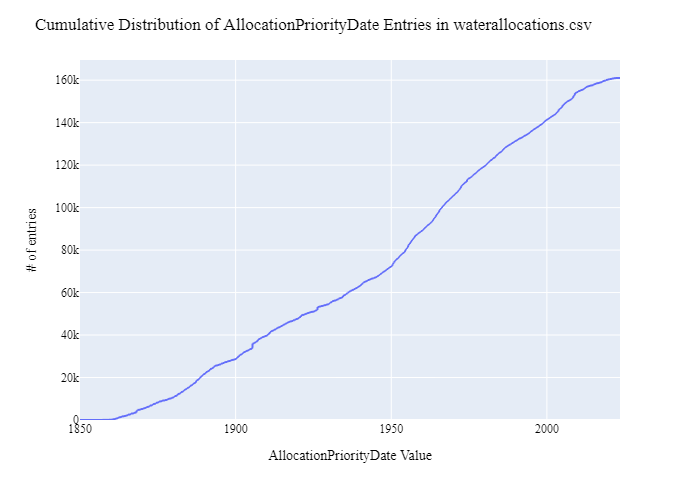
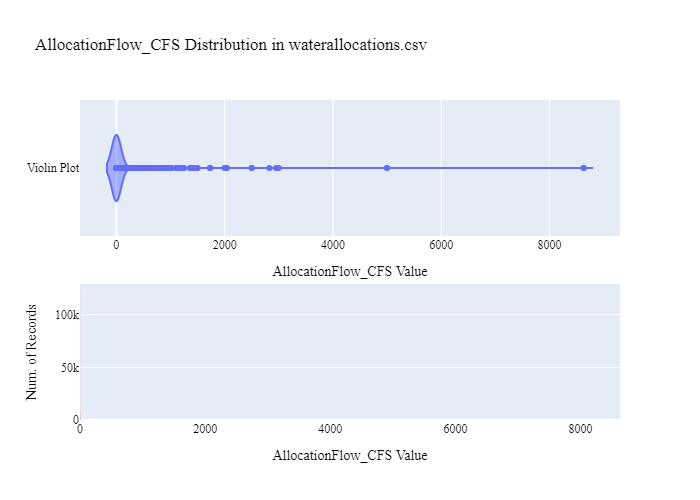
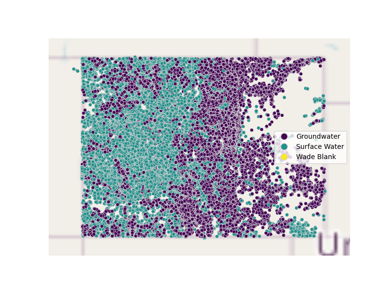

# CDWR Water Rights Data Preparation for WaDE
This readme details the process that was applied by the staff of the [Western States Water Council (WSWC)](http://wade.westernstateswater.org/) to extracting water rights data made available by the [Colorado Division of Water Resources (CDWR)](https://dwr.colorado.gov/about-us/contact-us/denver-office), for inclusion into the Water Data Exchange (WaDE) project.  WaDE enables states to share data with each other and the public in a more streamlined and consistent way.  WaDE is not intended to replace the states data or become the source for that data but rather to enable regional analysis to inform policy decisions and for planning purposes. 

## Overview of Source Data Utilized
The following data was used for water allocations...

Name | Description | Download Link | Metadata Glossary Link
---------- | ---------- | ------------ | ------------
**DWR Water Right - Net Amounts** | Data files for surface and groundwater. | [link](https://data.colorado.gov/Water/DWR-Water-Right-Net-Amounts/acsg-f33s/data) | [link](https://data.colorado.gov/Water/DWR-Water-Right-Net-Amounts/acsg-f33s?category=Water&view_name=DWR-Water-Right-Net-Amounts)

Input files used are as follows...
- DWR_Water_Right_-_Net_Amounts.zip, zipped csv file of water right and site info.
- TimeSeriesInfo.zip, zipped csv file of monthly discharge values related to water right sites where the site only has 1 associated water right.
 

## Storage for WaDE 2.0 Source and Processed Water Data
The 1) raw input data shared by the state / state agency / data provider (excel, csv, shapefiles, PDF, etc), & the 2) csv processed input data ready to load into the WaDE database, can both be found within the WaDE sponsored Google Drive.  Please contact WaDE staff if unavailable or if you have any questions about the data.
- CDWR Allocation & Water Use Data: [link](https://drive.google.com/drive/folders/1aSgdrjn7m-OY4vyXE6QPpD_vHfLEyEjf?usp=drive_link)

## Summary of Data Prep
The following text summarizes the process used by the WSWC staff to prepare and share CDWR's water rights data for inclusion into the Water Data Exchange (WaDE 2.0) project.  For a complete mapping outline, see *COwr_Allocation Schema Mapping to WaDE.xlsx*.  Several WaDE csv input files will be created in order to extract the CDWR's water rights data from the above mentioned input.  Each of these WaDE csv input files was created using the [Python](https://www.python.org/) native language, built and ran within [Jupyter Notebooks](https://jupyter.org/) environment.  Those python files include the following...

- **1_COwr_wu_PreProcessAllocationData.ipynb**: used to pre-processes the native date into a WaDE format friendly format.  All datatype conversions occur here.
- **2_COwr_wu_CreateWaDEInputFiles.ipynb**: used to create the WaDE input csv files: methods.csv, variables.csv, organizations.csv, watersources.csv, sites.csv, waterallocations.csv, podsitetopousiterelationships.csv.
- **3_COwr_wu_WaDEDataAssessmentScript.ipynb**: used to evaluate the WaDE input csv files.

***
### 0) Code File: 1_COwr_wu_PreProcessAllocationData.ipynb
Purpose: Pre-process the state agency's input data files and merge them into one master file for simple dataframe creation and extraction.

#### Inputs: 
- DWR_Water_Right_-_Net_Amounts.zip

#### Outputs:
 - Pwr_wu_Main.zip

#### Operation and Steps:
- Read the input file and generate temporary input dataframe.
- Format date datatype values to WaDE 2.0 appropriate formats.
- Using provided index, translate provided beneficial uses abbreviations into full terms.
- Format water source type to match WaDE 2.0 appropriate formats, extract from **Structure Type** input field using provided dictionary.
- Format GNIS ID to match WaDE 2.0 appropriate formats, "Unspecified" if not provided.
- Two separate fields were provided for allocation flow.  Use the following rules to determine appropriate value...
    - If **Decreed Units** is equal to "C" and **Net Absolute** does not equal to 0, then return **Net Absolute** as allocation flow.
    - If **Decreed Units** is equal to "C" and **Net Conditional** does not equal to 0, then return **Net Conditional** as allocation flow.
    - If neither is true, return a value of "0" for allocation flow.
- Two separate fields were provided for allocation volume.  Use the following rules to determine appropriate value...
    - If **Decreed Units** is equal to "A" and **Net Absolute** does not equal to 0, then return **Net Absolute** as allocation volume.
    - If **Decreed Units** is equal to "A" and **Net Conditional** does not equal to 0, then return **Net Conditional** as allocation volume.
    - If neither is true, return a value of "0" for allocation volume.
- Determine legal status depending on if either **Net Absolute** or **Net Conditional** were used.
- Combine **Admin No**, **Order No**, **Decreed Units**, & **WDID** into single string entry for a unique water right identifier.
- Inspect output dataframe for additional errors / datatypes.
- Export output dataframe as new csv file, *Pwr_coMain.zip*.

***
## Code File: 2_COwr_wu_CreateWaDEInputFiles.ipynb
Purpose: generate WaDE csv input files (methods.csv, variables.csv, organizations.csv, watersources.csv, sites.csv, waterallocations.csv, podsitetopousiterelationships.csv).

#### Inputs:
- Pwr_wu_Main.zip

#### Outputs:
- methods.csv  `Create by hand.`
- variables.csv  `Create by hand.`
- organizations.csv  `Create by hand.`
- watersources.csv
- sites.csv
- waterallocations.csv
- podsitetopousiterelationships.csv

## 1) Method Information
Purpose: generate legend of granular methods used on data collection.

#### Operation and Steps:
- Generate single output dataframe *outdf*.
- Populate output dataframe with *WaDE Method* specific columns.
- Assign state info to the *WaDE Method* specific columns (this was hardcoded by hand for simplicity).
- Assign method UUID identifier to each (unique) row.
- Perform error check on output dataframe.
- Export output dataframe *methods.csv*.

#### Sample Output (WARNING: not all fields shown):
|    | MethodUUID   | ApplicableResourceTypeCV   | DataConfidenceValue   | DataCoverageValue   | DataQualityValueCV   | MethodName                   | MethodNEMILink                                                         | MethodTypeCV    | WaDEDataMappingUrl                                                                                                |
|---:|:-------------|:---------------------------|:----------------------|:--------------------|:---------------------|:-----------------------------|:-----------------------------------------------------------------------|:----------------|:------------------------------------------------------------------------------------------------------------------|
|  0 | COwr_M1      | Surface Ground Water       |                       |                     |                      | Colorado Water Rights Method | https://drive.google.com/file/d/14r6HBwqebBwSE60yuiUu1smmtDONJbu2/view | Legal Processes | https://github.com/WSWCWaterDataExchange/MappingStatesDataToWaDE2.0/tree/master/Colorado/WaterAllocation_WaterUse |

## 2) Variables Information
Purpose: generate legend of granular variables specific to each state.

#### Operation and Steps:
- Generate single output dataframe *outdf*.
- Populate output dataframe with *WaDE Variable* specific columns.
- Assign state info to the *WaDE Variable* specific columns (this was hardcoded by hand for simplicity).
- Assign variable UUID identifier to each (unique) row.
- Perform error check on output dataframe.
- Export output dataframe *variables.csv*.

#### Sample Output (WARNING: not all fields shown):
|    | VariableSpecificUUID   |   AggregationInterval | AggregationIntervalUnitCV   | AggregationStatisticCV   | AmountUnitCV   | MaximumAmountUnitCV   |   ReportYearStartMonth | ReportYearTypeCV   | VariableCV   | VariableSpecificCV   |
|---:|:-----------------------|----------------------:|:----------------------------|:-------------------------|:---------------|:----------------------|-----------------------:|:-------------------|:-------------|:---------------------|
|  0 | COwr_V1                |                     1 | Annual                      | Average                  | CFS            | AF                    |                     11 | WaterYear          | Allocation   | Allocation           |

## 3) Organization  Information
Purpose: generate organization directory, including names, email addresses, and website hyperlinks for organization supplying data source.

#### Operation and Steps:
- Generate single output dataframe *outdf*.
- Populate output dataframe with *WaDE Organizations* specific columns.
- Assign state info to the *WaDE Organizations* specific columns (this was hardcoded by hand for simplicity).
- Assign organization UUID identifier to each (unique) row.
- Perform error check on output dataframe.
- Export output dataframe *organizations.csv*.

#### Sample Output (WARNING: not all fields shown):
|    | OrganizationUUID   | OrganizationContactEmail   | OrganizationContactName   | OrganizationName                     | OrganizationPhoneNumber   | OrganizationPurview                            | OrganizationWebsite                                        | State   |
|---:|:-------------------|:---------------------------|:--------------------------|:-------------------------------------|:--------------------------|:-----------------------------------------------|:-----------------------------------------------------------|:--------|
|  0 | COwr_O1            | doug.stenzel@state.co.us   | Doug Stenzel              | Colorado Division of Water Resources | 303-866-3581              | Water Administration for the State of Colorado | https://dwr.colorado.gov/about-us/contact-us/denver-office | CO      |

## 4) Water Source Information
Purpose: generate a list of water sources specific to a water right.

#### Operation and Steps:
- Read the input file and generate single output dataframe *outdf*.
- Populate output dataframe with *WaDE WaterSources* specific columns.
- Assign agency info to the *WaDE WaterSources* specific columns.  See *COwr_Allocation Schema Mapping to WaDE.xlsx* for specific details.  Items of note are as follows...
    - *WaterSourceUUID* = ""
    - *WaterQualityIndicatorCV* = ""
    - *WaterSourceName* = ""
    - *WaterSourceNativeID* = ""
    - *WaterSourceTypeCV* = ""
- Consolidate output dataframe into water source specific information only by dropping duplicate entries, drop by WaDE specific *WaterSourceName* & *WaterSourceTypeCV* fields.
- Assign water source UUID identifier to each (unique) row.
- Perform error check on output dataframe.
- Export output dataframe *WaterSources.csv*.

#### Sample Output (WARNING: not all fields shown):
|    | WaterSourceUUID   | Geometry   | GNISFeatureNameCV   | WaterQualityIndicatorCV   | WaterSourceName   | WaterSourceNativeID   | WaterSourceTypeCV   |
|---:|:------------------|:-----------|:--------------------|:--------------------------|:------------------|:----------------------|:--------------------|
|  1 | COwr_WwadeId10    |            |                     | Fresh                     | Gold Creek        | wadeId10              | Surface Water       |

Any data fields that are missing required values and dropped from the WaDE-ready dataset are instead saved in a separate csv file (e.g. *watersources_missing.csv*) for review.  This allows for future inspection and ease of inspection on missing items.  Mandatory fields for the water sources include the following...
- WaterSourceUUID
- WaterQualityIndicatorCV
- WaterSourceTypeCV

## 5) Site Information
Purpose: generate a list of sites information.

#### Operation and Steps:
- Read the input file and generate single output dataframe *outdf*.
- Populate output dataframe with *WaDE Site* specific columns.
- Assign agency info to the *WaDE Site* specific columns.  See *COwr_Allocation Schema Mapping to WaDE.xlsx* for specific details.  Items of note are as follows...
    - *SiteUUID* = ""
    - *WaterSourceUUIDs* = Extract *WaterSourceUUID* from waterSources.csv input csv file. See code for specific implementation of extraction.
    - *CoordinateAccuracy* = ""
    - *CoordinateMethodCV* = ""
    - *Country* = ""
    - *EPSGCodeCV* = ""
    - *Geometry* = ""
    - *GNISCodeCV* = ""
    - *HUC12* = ""
    - *HUC8* = ""
    - *Latitude* = ""
    - *Longitude* = ""
    - *NHDNetworkStatusCV* = ""
    - *NHDProductCV* = ""
    - *PODorPOUSite* = ""
    - *SiteName* = ""
    - *SiteNativeID* = ""
    - *SiteTypeCV* = ""
    - *StateCV* = ""																			
    - *USGSSiteID* = ""
- Consolidate output dataframe into site specific information only by dropping duplicate entries, drop by WaDE specific *SiteNativeID*, *SiteName*, *SiteTypeCV*, *Longitude* & *Latitude* fields.
- Assign site UUID identifier to each (unique) row.
- Perform error check on output dataframe.
- Export output dataframe *sites.csv*.

#### Sample Output (WARNING: not all fields shown):
|    | SiteUUID     | RegulatoryOverlayUUIDs   | WaterSourceUUIDs   | CoordinateAccuracy   | CoordinateMethodCV   | County   |   EPSGCodeCV | GNISCodeCV   |        HUC12 |     HUC8 |   Latitude |   Longitude | NHDNetworkStatusCV   | NHDProductCV   | PODorPOUSite   | SiteName     |   SiteNativeID | SitePoint   | SiteTypeCV   | StateCV   | USGSSiteID   |
|---:|:-------------|:-------------------------|:-------------------|:---------------------|:---------------------|:---------|-------------:|:-------------|-------------:|---------:|-----------:|------------:|:---------------------|:---------------|:---------------|:-------------|---------------:|:------------|:-------------|:----------|:-------------|
|  1 | COwr_S100501 |                          | COwr_WwadeId1      | WaDE Blank           | Digitized            | Weld     |         4326 |              | 101900030806 | 10190003 |    40.3785 |    -104.484 |                      |                | POD            | Empire Ditch |         100501 |             | Ditch        | CO        |              |

Any data fields that are missing required values and dropped from the WaDE-ready dataset are instead saved in a separate csv file (e.g. *sites_missing.csv*) for review.  This allows for future inspection and ease of inspection on missing items.  Mandatory fields for the sites include the following...
- SiteUUID 
- CoordinateMethodCV
- EPSGCodeCV
- SiteName

## 6) AllocationsAmounts Information
Purpose: generate master sheet of water allocations to import into WaDE 2.0.

#### Operation and Steps:
- Read the input files and generate single output dataframe *outdf*.
- Populate output dataframe with *WaDE Water Allocations* specific columns.
- Assign agency info to the *WaDE Water Allocations* specific columns.  See *COwr_Allocation Schema Mapping to WaDE.xlsx* for specific details.  Items of note are as follows...
    - Extract *MethodUUID*, *VariableSpecificUUID*, *OrganizationUUID*, & *SiteUUID* from respective input csv files. See code for specific implementation of extraction.
    - *AllocationApplicationDate* = ""
    - *AllocationAssociatedConsumptiveUseSiteIDs* = ""
    - *AllocationAssociatedWithdrawalSiteIDs* = ""
    - *AllocationBasisCV* = ""
    - *AllocationChangeApplicationIndicator* = ""
    - *AllocationCommunityWaterSupplySystem* = ""
    - *AllocationCropDutyAmount* = ""
    - *AllocationExpirationDate* = ""
    - *AllocationFlow_CFS* = ""
    - *AllocationLegalStatusCV* = ""
    - *AllocationNativeID* = ""
    - *AllocationOwner* =  ""
    - *AllocationPriorityDate* = ""
    - *AllocationSDWISIdentifierCV* = ""
    - *AllocationTimeframeEnd* = ""
    - *AllocationTimeframeStart* = ""
    - *AllocationTypeCV* = ""
    - *AllocationVolume_AF* = ""
    - *BeneficialUseCategory* = ""
    - *CommunityWaterSupplySystem* = ""
    - *CropTypeCV* = ""
    - *CustomerTypeCV* = ""
    - *DataPublicationDate* = "{use today's date}"
    - *DataPublicationDOI* = ""
    - *ExemptOfVolumeFlowPriority* = ""
    - *GeneratedPowerCapacityMW* = ""
    - *IrrigatedAcreage* = ""
    - *IrrigationMethodCV* = ""
    - *LegacyAllocationIDs* = ""
    - *OwnerClassificationCV* = ""
    - *PopulationServed* = ""
    - *PowerType* = ""
    - *PrimaryBeneficialUseCategory* = ""
    - *WaterAllocationNativeURL* = ""																							
- Consolidate output dataframe into water allocations specific information only by grouping entries by *AllocationNativeID* filed.
- Perform error check on output dataframe.
- Export output dataframe *waterallocations.csv*.
- Export output dataframe *waterallocations.csv*.

#### Sample Output (WARNING: not all fields shown):
|    | AllocationUUID        | MethodUUID   | OrganizationUUID   | SiteUUID     | VariableSpecificUUID   | AllocationApplicationDate   | AllocationAssociatedConsumptiveUseSiteIDs   | AllocationAssociatedWithdrawalSiteIDs   | AllocationBasisCV   | AllocationChangeApplicationIndicator   | AllocationCommunityWaterSupplySystem   | AllocationCropDutyAmount   | AllocationExpirationDate   |   AllocationFlow_CFS | AllocationLegalStatusCV   | AllocationNativeID   | AllocationOwner   | AllocationPriorityDate   | AllocationSDWISIdentifierCV   | AllocationTimeframeEnd   | AllocationTimeframeStart   | AllocationTypeCV   |   AllocationVolume_AF | BeneficialUseCategory           | CommunityWaterSupplySystem   | CropTypeCV   | CustomerTypeCV   | DataPublicationDate   | DataPublicationDOI   |   ExemptOfVolumeFlowPriority | GeneratedPowerCapacityMW   |   IrrigatedAcreage | IrrigationMethodCV   | LegacyAllocationIDs   | OwnerClassificationCV   | PopulationServed   | PowerType   | PrimaryBeneficialUseCategory   | WaterAllocationNativeURL                                     |
|---:|:----------------------|:-------------|:-------------------|:-------------|:-----------------------|:----------------------------|:--------------------------------------------|:----------------------------------------|:--------------------|:---------------------------------------|:---------------------------------------|:---------------------------|:---------------------------|---------------------:|:--------------------------|:---------------------|:------------------|:-------------------------|:------------------------------|:-------------------------|:---------------------------|:-------------------|----------------------:|:--------------------------------|:-----------------------------|:-------------|:-----------------|:----------------------|:---------------------|-----------------------------:|:---------------------------|-------------------:|:---------------------|:----------------------|:------------------------|:-------------------|:------------|:-------------------------------|:-------------------------------------------------------------|
|  1 | COwr_WR1000200C400588 | COwr_M1      | COwr_O1            | COwr_S400588 | COwr_V1                |                             |                                             |                                         | WaDE Blank          |                                        |                                        |                            |                            |                39.52 | Absolute                  | 10002.0-0-C-400588   | WaDE Blank        | 1877-05-20               |                               | 12/31                    | 01/01                      | WaDE Blank         |                     0 | Storage,Irrigation,Augmentation |                              |              |                  | 02/01/2024            |                      |                            0 |                            |                  0 |                      |                       | Private                 |                    |             | Agriculture Irrigation         | https://dwr.state.co.us/Tools/WaterRights/NetAmounts/1482328 |

Any data fields that are missing required values and dropped from the WaDE-ready dataset are instead saved in a separate csv file (e.g. *waterallocations_missing.csv*) for review.  This allows for future inspection and ease of inspection on missing items.  Mandatory fields for the water allocations include the following...
- MethodUUID
- VariableSpecificUUID
- OrganizationUUID
- WaterSourceUUID
- SiteUUID
- AllocationPriorityDate
- BeneficialUseCategory
- AllocationAmount or AllocationMaximum
- DataPublicationDate

Any data fields that are missing required values and dropped from the WaDE-ready dataset are instead saved in a separate csv file (e.g. *sitespecificamounts_missing.csv*) for review.  This allows for future inspection and ease of inspection on missing items.  Mandatory fields for the site-specific amount include the following...
- MethodUUID
- VariableSpecificUUID
- OrganizationUUID
- SiteUUID
- BeneficialUseCategory
- Amount
- DataPublicationDate

### 8) POD Site -To- POU Polygon Relationships
Purpose: generate linking element between POD and POU sites that share the same water right.
Note: podsitetopousiterelationships.csv output only needed if both POD and POU data is present,  `otherwise produces empty file.`

#### Operation and Steps:
- Read the sites.csv & waterallocations.csv input files.
- Create three temporary dataframes: one for waterallocations, & two for site info that will store POD and POU data separately.
- For the temporary POD dataframe...
  - Read in site.csv data from sites.csv with a _PODSiteUUID_ field = POD only.
  - Create _PODSiteUUID_ field = _SiteUUID_.
- For the temporary POU dataframe
  - Read in site.csv data from sites.csv with a _PODSiteUUID_ field = POU only.
  - Create _POUSiteUUID_ field = _SiteUUID_.
- For the temporary waterallocations dataframe, explode _SiteUUID_ field to create unique rows.
- Left-merge POD & POU dataframes to the waterallocations dataframe via _SiteUUID_ field.
- Consolidate waterallocations dataframe by grouping entries by _AllocationNativeID_ filed.
- Explode the consolidated waterallocations dataframe again using the _PODSiteUUID_ field, and again for the _POUSiteUUID_ field to create unique rows.
- Perform error check on waterallocations dataframe (check for NaN values)
- If waterallocations is not empty, export output dataframe _podsitetopousiterelationships.csv_.

***
## Source Data & WaDE Complied Data Assessment
The following info is from a data assessment evaluation of the completed data...

Dataset | Num of Source Entries (rows)
---------- | ---------- 
**DWR Water Right - Net Amounts** | 171,214

Dataset  | Num of Identified PODs | Num of Identified POUs | Num of Identified Water Right Records
**Compiled WaDE Data** | 124605 | 0 | 161016

Assessment of Removed Source Records | Count | Action
---------- | ---------- | ----------
Unused WaterSource Record   | 1 | removed from watersources.csv input
Incomplete or bad entry for Latitude    |243 | removed from sites.csv input
Unused Site Record                       | 2 | removed from sites.csv input
Incomplete or bad entry for SiteUUID    |269 | removed from waterallocations.csv input
Incomplete or bad entry for Flow         | 2 | removed from waterallocations.csv input

**Figure 1:** Distribution of POD vs POU Sites within the sites.csv

**Figure 2:** Distribution Sites by WaterSourceTypeCV within the sites.csv

**Figure 3:** Distribution of Identified Water Right Records by WaDE Categorized Primary Beneficial Uses within the waterallocations.csv

**Figure 4a:** Range of Priority Date of Identified Water Right Records within the waterallocations.csv

**Figure 4b:** Cumulative distribution of Priority Date of Identified Water Right Records within the waterallocations.csv

**Figure 5:** Distribution & Range of Flow (CFS) of Identified Water Right Records within the waterallocations.csv

**Figure 6:** Distribution & Range of Volume (AF) of Identified Water Right Records within the waterallocations.csv

**Figure 7:** Map of Identified Points within the sites.csv

**Figure 8:** Map of Identified Polygons within the sites.csv
- No POU data provided

***
## Staff Contributions
Data created here was a contribution between the [Western States Water Council (WSWC)](http://wade.westernstateswater.org/) and the [Colorado Division of Water Resources (CDWR)](https://dwr.colorado.gov/about-us/contact-us/denver-office).

WSWC Staff
- Ryan James <rjames@wswc.utah.gov>

CDWR Staff
- Brian Macpherson <brian.macpherson@state.co.us>
