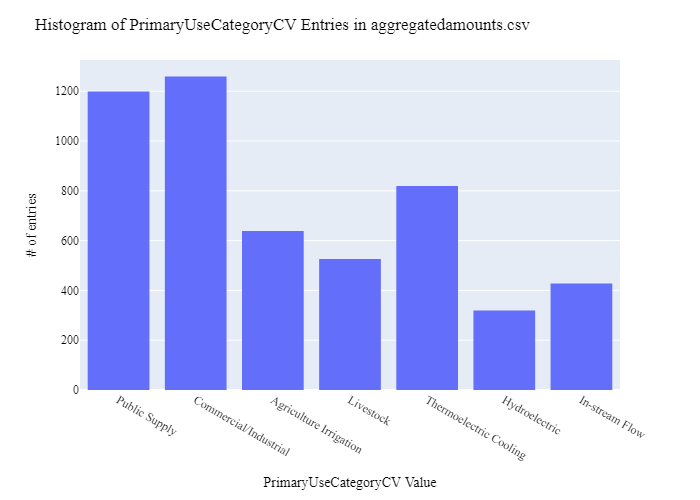
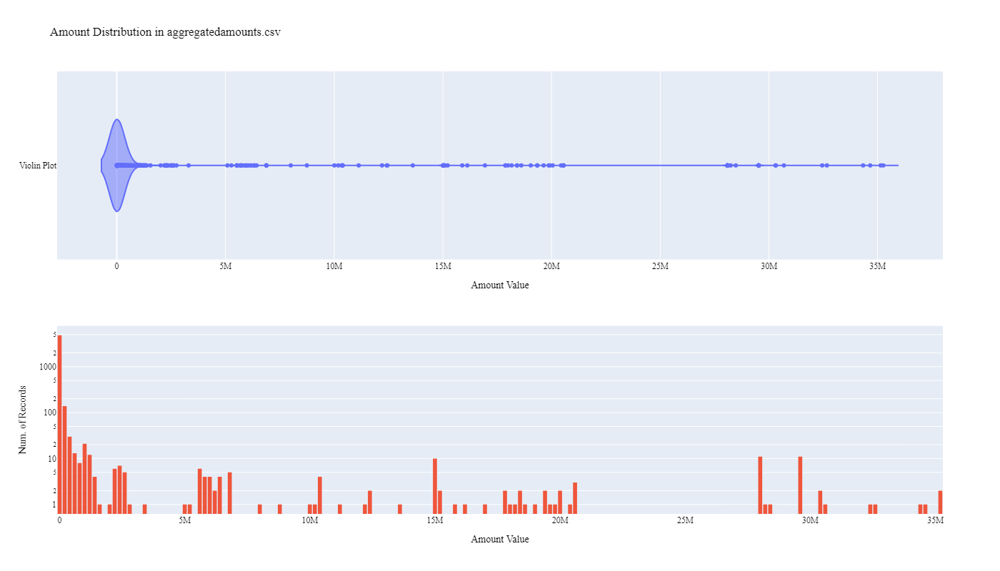
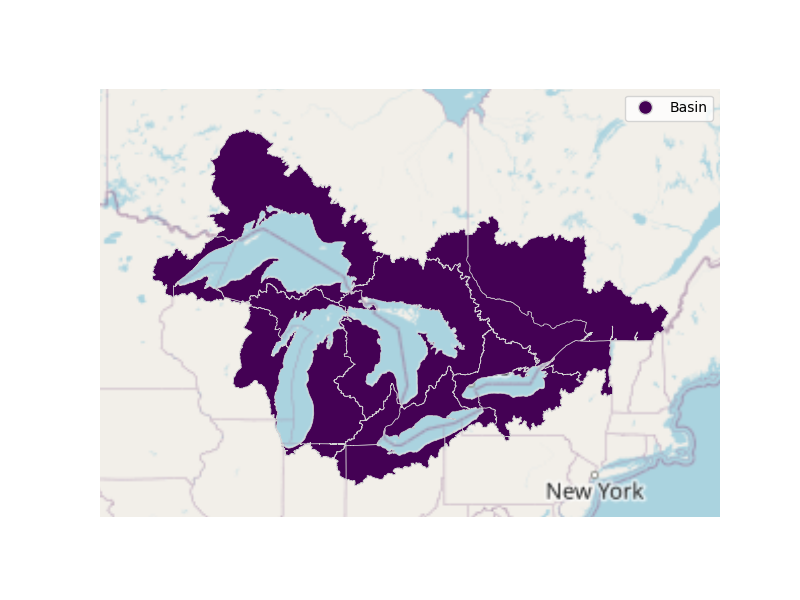

# Great Lakes Commission Aggregated Water Use Data Preparation for WaDE
This readme details the process that was applied by the staff of the [Western States Water Council (WSWC)](http://wade.westernstateswater.org/) to extracting aggregated water use data made available by the [Great Lakes Commission](www.glc.org), for inclusion into the Water Data Exchange (WaDE) project.   WaDE enables states to share data with each other and the public in a more streamlined and consistent way.  WaDE is not intended to replace the states data or become the source for that data but rather to enable regional analysis to inform policy decisions and for planning purposes. 

## Overview of Data Utilized
The following data was used for water allocations...

Name | Description | Download Link | Metadata Glossary Link
---------- | ---------- | ------------ | ------------
**WSWC Great Lakes Data 2012-2022** | Annual water use data for the great lakes from 2021-2022 | Email | Not Provided
**Exploded_GLCompact_Basins_Jurisdictions** | Shape file geometry information of great lakes related to water use records. | Email | Not Provided

## Storage for WaDE 2.0 Source and Processed Water Data
The 1) raw input data shared by the state / state agency / data provider (excel, csv, shapefiles, PDF, etc), & the 2) csv processed input data ready to load into the WaDE database, can both be found within the WaDE sponsored Google Drive.  Please contact WaDE staff if unavailable or if you have any questions about the data.
- Great Lakes Commission Aggregated Water Use Time Series Data: [link](https://drive.google.com/drive/folders/1JClR8Nc7WXc73F1v6lj_yqXIQuYLHd3t?usp=drive_link)

## Summary of Data Prep
The following text summarizes the process used by the WSWC staff to prepare and share aggregated water use data for inclusion into the Water Data Exchange (WaDE 2.0) project.  For a complete mapping outline, see *GLwuag_Aggregated Water Use Schema Mapping to WaDE.xlsx*.  Several WaDE csv input files will be created in order to extract the water rights data from the above mentioned input.  Each of these WaDE csv input files was created using the [Python](https://www.python.org/) native language, built and ran within [Jupyter Notebooks](https://jupyter.org/) environment.  Those python files include the following...

- **1_GLwuag_PreProcessAggregatedWaterUseData**: used to pre-processes the native date into a WaDE format friendly format.  All datatype conversions occur here.
- **2_GLwuag_CreateWaDEInputFiles.ipynb**: used to create the WaDE input csv files: methods.csv, variables.csv, organizations.csv, watersources.csv, reportingunits.csv, aggregatedamounts.csv
- **3_GLwuag_WaDEDataAssessmentScript.ipynb**: used to evaluate the WaDE input csv files.

***
## Code File: 1_GLwuag_PreProcessAggregatedWaterUseData.ipynb
Purpose: Pre-process the input data files and merge them into one master file for simple dataframe creation and extraction.

#### Inputs: 
- WSWC Great Lakes Data 2012-2022.zip, zipped csv of timeseries info.
- Exploded_GLCompact_Basins_Jurisdictions.zip, zipped shp of geometry data.

#### Outputs:
 - Pwuag_Main.zip
 - P_Geometry.zip

#### Operation and Steps:
 - Read in timeseries data and shape file geometry data as temporary DataFrames.
 - Left join geometry data to timeseries via **jurisdiction** & **basin** inputs from timeseries to match similar inputs in geometry data.
 - Determine method type of measurements from **method** input, use provided dictionary.
 - Determine water source type from **source** input, use provided dictionary.
 - Determine beneficial use value from **sector** input, use provided dictionary.
 - Determine amount value from **with_amt** **unit** inputs.  If **unit** = 1, multiple by **with_amt** by 365.  If **unit** = 2, multiple by **with_amt** by * 0.264172 * 365.
 - Extract inputs to WaDe specific inputs.
 - Clean data types.
 - Export data.

***
## Code File: 2_GLwuag_CreateWaDEInputFiles.ipynb
Purpose: generate WaDE csv input files (methods.csv, variables.csv, organizations.csv, watersources.csv, reportingunits.csv, aggregatedamounts.csv).

#### Inputs:
- Pwuag_Main.zip
- P_Geometry.zip

#### Outputs:
- methods.csv  `Create by hand.`
- variables.csv  `Create by hand.`
- organizations.csv  `Create by hand.`
- watersources.csv
- reportingunits.csv
- aggregatedamounts.csv

## 1) Method Information
Purpose: generate legend of granular methods used on data collection.

#### Operation and Steps:
- Generate single output dataframe *outdf*.
- Populate output dataframe with *WaDE Method* specific columns.
- Assign state info to the *WaDE Method* specific columns (this was hardcoded by hand for simplicity).
- Assign method UUID identifier to each (unique) row.
- Perform error check on output dataframe.
- Export output dataframe *methods.csv*.

#### Sample Output (WARNING: not all fields shown):
|    | MethodUUID   | ApplicableResourceTypeCV    | DataConfidenceValue   | DataCoverageValue   | DataQualityValueCV   | MethodName          | MethodNEMILink                                               | MethodTypeCV   | WaDEDataMappingUrl                                                                                                 |
|---:|:-------------|:----------------------------|:----------------------|:--------------------|:---------------------|:--------------------|:-------------------------------------------------------------|:---------------|:-------------------------------------------------------------------------------------------------------------------|
|  0 | GLwuag_M1    | Surface Water & Groundwater |                       |                     |                      | Withdrawal Measured | https://www.glc.org/category/library/water-quantity-and-use/ | Measured       | https://github.com/WSWCWaterDataExchange/MappingStatesDataToWaDE2.0/tree/master/GreatLakes/WaterUse_AggregatedArea |

## 2) Variables Information
Purpose: generate legend of granular variables specific to each state.

#### Operation and Steps:
- Generate single output dataframe *outdf*.
- Populate output dataframe with *WaDE Variable* specific columns.
- Assign state info to the *WaDE Variable* specific columns (this was hardcoded by hand for simplicity).
- Assign variable UUID identifier to each (unique) row.
- Perform error check on output dataframe.
- Export output dataframe *variables.csv*.

#### Sample Output (WARNING: not all fields shown):
|    | VariableSpecificUUID   |   AggregationInterval | AggregationIntervalUnitCV   | AggregationStatisticCV   | AmountUnitCV   | MaximumAmountUnitCV   |   ReportYearStartMonth | ReportYearTypeCV   | VariableCV   | VariableSpecificCV                                                          |
|---:|:-----------------------|----------------------:|:----------------------------|:-------------------------|:---------------|:----------------------|-----------------------:|:-------------------|:-------------|:----------------------------------------------------------------------------|
|  0 | GLwuag_V1              |                     1 | Annual                      | Average                  | MG             | MG                    |                      1 | CalendarYear       | Withdrawal   | Withdrawal_Annual_Public Water Supply_Great Lakes St Lawrence Surface Water |

## 3) Organization  Information
Purpose: generate organization directory, including names, email addresses, and website hyperlinks for organization supplying data source.

#### Operation and Steps:
- Generate single output dataframe *outdf*.
- Populate output dataframe with *WaDE Organizations* specific columns.
- Assign state info to the *WaDE Organizations* specific columns (this was hardcoded by hand for simplicity).
- Assign organization UUID identifier to each (unique) row.
- Perform error check on output dataframe.
- Export output dataframe *organizations.csv*.

#### Sample Output (WARNING: not all fields shown):
|    | OrganizationUUID   | OrganizationContactEmail   | OrganizationContactName   | OrganizationName       | OrganizationPhoneNumber   | OrganizationPurview                                                                                                                                                                                                                    | OrganizationWebsite   | State   |
|---:|:-------------------|:---------------------------|:--------------------------|:-----------------------|:--------------------------|:---------------------------------------------------------------------------------------------------------------------------------------------------------------------------------------------------------------------------------------|:----------------------|:--------|
|  0 | GLwuag_O1          | jpolidori@glc.org          | James Polidori            | Great Lakes Commission | 734-396-6060              | The Great Lakes Commission is an environmental and economic asset for the United States and Canada, who recommends policies and practices to balance the use, development, and conservation of the water resources of the Great Lakes. | www.glc.org           | GL      |

## 4) Water Source Information
Purpose: generate a list of water sources specific to a water right.

#### Operation and Steps:
- Read the input file and generate single output dataframe *outdf*.
- Populate output dataframe with *WaDE WaterSources* specific columns.
- Assign agency info to the *WaDE WaterSources* specific columns.  See *GLwuag_Aggregated Water Use Schema Mapping to WaDE.xlsx* for specific details.  Items of note are as follows...
    - *WaterSourceUUID* = "GLwuag_W" + native id value, auto create one if not provided based on unique name and type.
    - *WaterQualityIndicatorCV* = "Fresh"
    - *WaterSourceName* = ""
    - *WaterSourceNativeID* = ""
    - *WaterSourceTypeCV* = **source** input.
- Consolidate output dataframe into water source specific information only by dropping duplicate entries, drop by WaDE specific *WaterSourceName* & *WaterSourceTypeCV* fields.
- Perform error check on output dataframe.
- Export output dataframe *WaterSources.csv*.

#### Sample Output (WARNING: not all fields shown):
|    | WaterSourceUUID   | Geometry   | GNISFeatureNameCV   | WaterQualityIndicatorCV   | WaterSourceName   | WaterSourceNativeID   | WaterSourceTypeCV                     |
|---:|:------------------|:-----------|:--------------------|:--------------------------|:------------------|:----------------------|:--------------------------------------|
|  0 | GLwuag_WwadeId1   |            |                     | Fresh                     | Wade Blank        | wadeId1               | Great Lakes St Lawrence Surface Water |

Any data fields that are missing required values and dropped from the WaDE-ready dataset are instead saved in a separate csv file (e.g. *watersources_missing.csv*) for review.  This allows for future inspection and ease of inspection on missing items.  Mandatory fields for the water sources include the following...
- WaterSourceUUID
- WaterQualityIndicatorCV
- WaterSourceTypeCV

### 5) Reporting Unit Area Information
Purpose: generate a list of polygon areas associated with the state agency specific area on aggregated water use data.

#### Operation and Steps:
- Read the input file and generate single output dataframe *outdf*.
- Populate output dataframe with *WaDE ReportingUnits* specific columns.
- Assign state agency data info to the *WaDE ReportingUnits* specific columns.  See *GLwuag_Aggregated Water Use Schema Mapping to WaDE.xlsx* for specific details.  Items of note are as follows...
    - *ReportingUnitUUID* =  "GLwuag_RU" +  **jurisdiction** & **basin** inputs.
    - *EPSGCodeCV* = 4326
    - *ReportingUnitName* = **jur_name** & **basin_name** inputs.
    - *ReportingUnitNativeID* =  **jurisdiction** & **basin** inputs.
    - *ReportingUnitProductVersion* = ""
    - *ReportingUnitTypeCV* = "Basin"
    - *ReportingUnitUpdateDate* = ""
    - *StateCV* = "GL"
- Consolidate output dataframe into site specific information only by dropping duplicate entries, drop by WaDE specific *ReportingUnitName*, *ReportingUnitNativeID* & *ReportingUnitTypeCV* fields.
- Perform error check on output dataframe.
- Export output dataframe *reportingunits.csv*.

#### Sample Output (WARNING: not all fields shown):
|    | ReportingUnitUUID   |   EPSGCodeCV | ReportingUnitName      | ReportingUnitNativeID   | ReportingUnitProductVersion   | ReportingUnitTypeCV   | ReportingUnitUpdateDate   | StateCV   |
|---:|:--------------------|-------------:|:-----------------------|:------------------------|:------------------------------|:----------------------|:--------------------------|:----------|
|  0 | GLwuag_RUGL_j10_b1  |         4326 | Wisconsinlake Superior | GL_j10_b1               |                               | Basin                 |                           | GL        |

Any data fields that are missing required values and dropped from the WaDE-ready dataset are instead saved in a separate csv file (e.g. *reportingunits_missing.csv*) for review.  This allows for future inspection and ease of inspection on missing items.  Mandatory fields for the reportingunits include the following...
- ReportingUnitUUID
- ReportingUnitName
- ReportingUnitNativeID
- ReportingUnitTypeCV
- StateCV

### 6) Aggregated to Area Time Series Information
Purpose: generate master sheet of state agency specified area aggregated water budget information to import into WaDE 2.0.

#### Operation and Steps:
- Read the input files and generate single output dataframe *outdf*.
- Populate output dataframe with *WaDE Water Allocations* specific columns.
- Assign state agency data info to the *WaDE Water Allocations* specific columns.  See *GLwuag_Aggregated Water Use Schema Mapping to WaDE.xlsx* for specific details.  Items of note are as follows...
    - Extract *MethodUUID*, *VariableSpecificUUID*, *OrganizationUUID*, *WaterSourceUUID*, & *ReportingUnitUUID* from respective input csv files. See code for specific implementation of extraction.
    - *AllocationCropDutyAmount* = ""
    - *Amount* = **with_amt** & **unit** inputs.
    - *BeneficialUseCategory* = **sector** input.
    - *CommunityWaterSupplySystem* = ""
    - *CropTypeCV* = ""
    - *CustomerTypeCV* = ""
    - *DataPublicationDate* = ""
    - *DataPublicationDOI* = ""
    - *InterbasinTransferFromID* = ""
    - *InterbasinTransferToID* = ""
    - *IrrigatedAcreage* = ""
    - *IrrigationMethodCV* = ""
    - *PopulationServed* = ""
    - *PowerGeneratedGWh* = ""
    - *PowerType* = ""
    - *PrimaryUseCategoryCV* = ""
    - *ReportYearCV* = **year** input.
    - *SDWISIdentifierCV* = ""
    - *TimeframeEnd* = 12/31/ + **year** input.
    - *TimeframeStart* = 01/01/ + **year** input.
- Perform error check on output dataframe.
- Export output dataframe *aggregatedamounts.csv*.

#### Sample Output (WARNING: not all fields shown):
|    | MethodUUID   | OrganizationUUID   | ReportingUnitUUID   | VariableSpecificUUID   | WaterSourceUUID   | AllocationCropDutyAmount   |   Amount | BeneficialUseCategory   | CommunityWaterSupplySystem   | CropTypeCV   | CustomerTypeCV   | DataPublicationDate   | DataPublicationDOI   | InterbasinTransferFromID   | InterbasinTransferToID   | IrrigatedAcreage   | IrrigationMethodCV   | PopulationServed   | PowerGeneratedGWh   | PowerType   | PrimaryUseCategoryCV   |   ReportYearCV | SDWISIdentifierCV   | TimeframeEnd   | TimeframeStart   | PrimaryUseCategory   |
|---:|:-------------|:-------------------|:--------------------|:-----------------------|:------------------|:---------------------------|---------:|:------------------------|:-----------------------------|:-------------|:-----------------|:----------------------|:---------------------|:---------------------------|:-------------------------|:-------------------|:---------------------|:-------------------|:--------------------|:------------|:-----------------------|---------------:|:--------------------|:---------------|:-----------------|:---------------------|
|  0 | GLwuag_M1    | GLwuag_O1          | GLwuag_RUGL_j1_b2   | GLwuag_V1              | GLwuag_WwadeId1   |                            |   286091 | Public Water Supply     |                              |              |                  | 09/29/2024            |                      |                            |                          |                    |                      |                    |                     |             | Public Supply          |           2022 |                     | 2022-12-31     | 2022-01-01       |                      |

Any data fields that are missing required values and dropped from the WaDE-ready dataset are instead saved in a separate csv file (e.g. *aggregatedamounts_missing.csv*) for review.  This allows for future inspection and ease of inspection on missing items.  Mandatory fields for the water allocations include the following...
- MethodUUID
- VariableSpecificUUID
- OrganizationUUID
- WaterSourceUUID
- ReportingUnitUUID
- Amount

***
## Source Data & WaDE Complied Data Assessment
The following info is from a data assessment evaluation of the completed data...

Dataset | Num of Source Entries (rows)
---------- | ---------- 
**WSWC Great Lakes Data 2012-2022** | 5,189
**Exploded_GLCompact_Basins_Jurisdictions** | 22 

Dataset  | Num of Identified Reporting Unit Areas | Num of Identified Time Series Records
**Compiled WaDE Data** | 22 | 5189

Assessment of Removed Source Records | Count | Action
---------- | ---------- | ----------
Nothing Removed | - | -

**Figure 1:** Distribution of Primary Beneficial Uses within the aggregatedamounts.csv

**Figure 2:** Distribution & Range of Amount within the aggregatedamounts.csv

**Figure 3:** Map of Identified Reporting Unit Aea within reportingunits.csv

***
## Staff Contributions
Data created here was a contribution between the [Western States Water Council (WSWC)](http://wade.westernstateswater.org/) and the [Great Lakes Commission](www.glc.org).

WSWC Staff
- Ryan James <rjames@wswc.utah.gov>

Great Lakes Commission Staff
- James Polidori <jpolidori@glc.org>