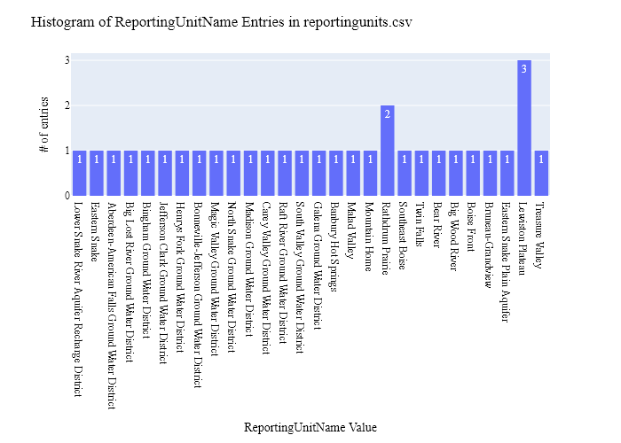
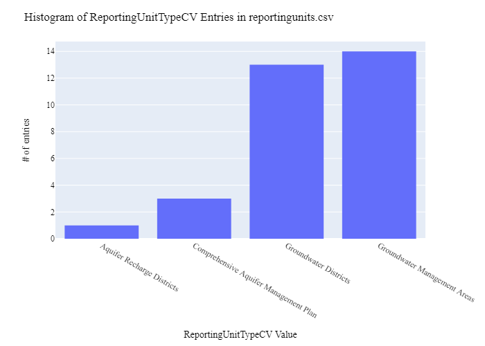
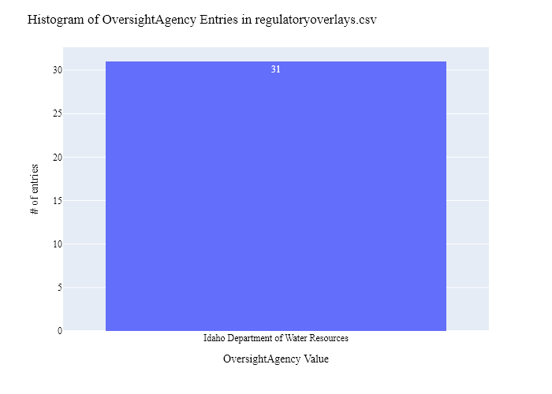
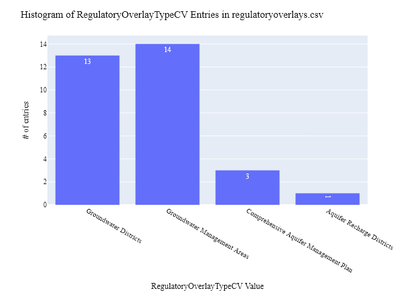
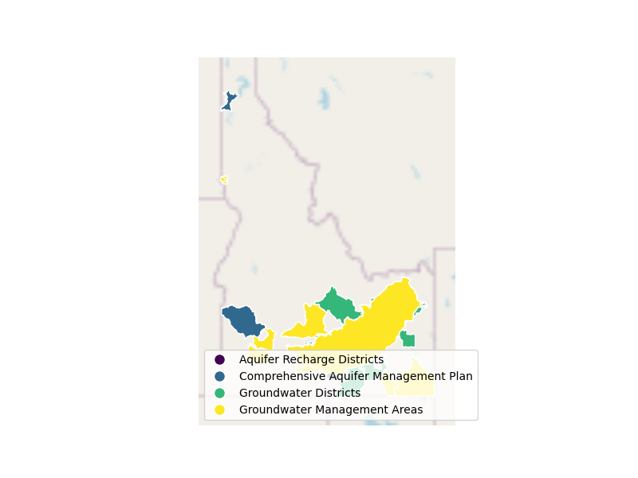
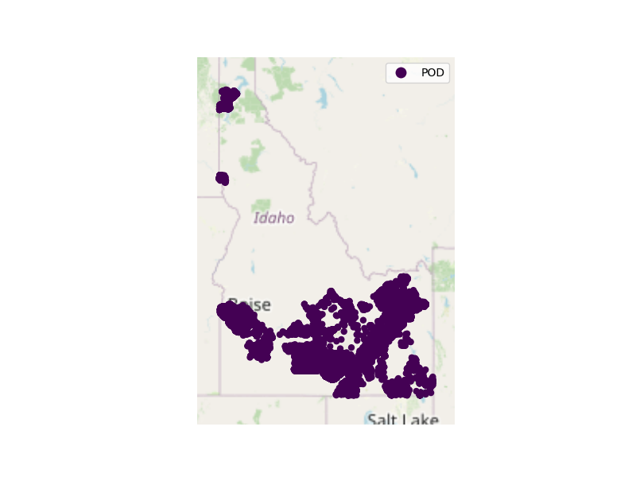

# Idaho Department of Water Resources (IDWR) Overlay Data Preparation for WaDE
This readme details the process that was applied by the staff of the [Western States Water Council (WSWC)](http://wade.westernstateswater.org/) to extracting overlay area data, made available by the [Idaho Department of Water Resources (IDWR)](https://idwr.idaho.gov/), for inclusion into the Water Data Exchange (WaDE) project.  WaDE enables states to share data with each other and the public in a more streamlined and cost-effective way.

## Overview of Source Data Utilized
The following data was used for water allocations...

Name | Description | Download Link | Metadata Glossary Link
---------- | ---------- | ------------ | ------------
**Rathdrum Comprehensive Aquifer Management Plan** | Rathdrum Comprehensive Aquifer Management Area based on the boundary of the Spokane Valley-Rathdrum Prairie Aquifer within Idaho. | [link](https://data-idwr.hub.arcgis.com/datasets/rathdrum-comprehensive-aquifer-management-plan/explore?location=47.653070%2C-116.087083%2C7.73) | [link](https://idwr.idaho.gov/iwrb/water-planning/camps/)
**Treasure Valley Comprehensive Aquifer Management Plan** | To delineate the TVHP study area boundary. | [link](https://data-idwr.hub.arcgis.com/datasets/IDWR::treasure-valley-comprehensive-aquifer-management-plan/explore?location=43.138851%2C-115.877224%2C7.65) | [link](https://idwr.idaho.gov/iwrb/water-planning/camps/)
**Eastern Snake Comprehensive Aquifer Management Plan** | The Eastern Snake Comprehensive Aquifer Management Plan boundary is equivalent to Area of Common Ground Water Supply (ACGWS). The ACGWS is defined in Section 37.03.11 administrative rules. | [link](https://data-idwr.hub.arcgis.com/datasets/eastern-snake-comprehensive-aquifer-management-plan/explore?location=43.322127%2C-114.298158%2C6.00) | [link](https://idwr.idaho.gov/iwrb/water-planning/camps/)
**Groundwater_Districts** | Groundwater Districts | [link](https://data-idwr.hub.arcgis.com/datasets/groundwater-districts/explore?location=44.257184%2C-114.070068%2C6.00) | [link](https://idwr.idaho.gov/water-rights/groundwater-districts/)
**Groundwater_Management_Areas** | Groundwater Management Areas | [link](https://data-idwr.hub.arcgis.com/datasets/groundwater-management-areas/explore?location=44.907017%2C-113.939603%2C6.00) | [link](https://idwr.idaho.gov/water-rights/groundwater-management-areas/)
**Lower_Snake_River_Aquifer_Recharge_Districts** | Aquifer Rechard Districts | [link](https://data-idwr.hub.arcgis.com/datasets/IDWR::lower-snake-river-aquifer-recharge-district/explore?location=42.761496%2C-114.701649%2C10.69) | [link](https://idwr.idaho.gov/water-rights/aquifer-recharge-districts/)

Unique files were created to be used as input.  Input files used are as follows...
- Rathdrum_Comprehensive_Aquifer_Management_Plan.shp
- Treasure_Valley_Comprehensive_Aquifer_Management_Plan.shp
- Eastern_Snake_Comprehensive_Aquifer_Management_Plan.shp
- Groundwater_Districts.shp
- Groundwater_Management_Areas.shp
- Lower_Snake_River_Aquifer_Recharge_Districts.shp

## Storage for WaDE 2.0 Source and Processed Water Data
The 1) raw input data shared by the state / state agency / data provider (excel, csv, shapefiles, PDF, etc), & the 2) csv processed input data ready to load into the WaDE database, can both be found within the WaDE sponsored Google Drive.  Please contact WaDE staff if unavailable or if you have any questions about the data.
- Idaho Department of Water Resources (IDWR) Overlay Data: [link](https://drive.google.com/drive/folders/12-5MRIg-a-ovWx-NV24VirEI1iC8L1K8?usp=drive_link)

## Summary of Data Prep
The following text summarizes the process used by the WSWC staff to prepare and share overlay data for inclusion into the Water Data Exchange (WaDE 2.0) project.  For a complete mapping outline, see *IDov_Overlay Info Schema Mapping to WaDE.xlsx*. Several WaDE csv input files will be created in order to extract the overlay data from the above mentioned input.  Each of these WaDE csv input files was created using the [Python](https://www.python.org/) native language, built and ran within [Jupyter Notebooks](https://jupyter.org/) environment.  Those python files include the following...

- **1_IDov_PreProcessRegulatoryData.ipynb**: used to pre-processes the native date into a WaDE format friendly format.  All datatype conversions occur here.
- **2_IDov_CreateWaDEInputFiles.ipynb**: used to create the WaDE input csv files: date.csv, organization.csv, reportingunits.csv, regulatoryoverlays.csv, regulatoryreportingunits.csv, sites.csv, etc.
- **3_IDov_WRSiteRegulatoryID.ipynb**: used to pair overlay information to water allocation information using an overlay on water allocation site information within the boundaries of the regulation.
- **4_IDov_WaDEDataAssessmentScript.ipynb**: used to evaluate the WaDE input csv files.

***
## Code File: 1_IDov_PreProcessRegulatoryData.ipynb
Purpose: Pre-process the input data files and merge them into one master file for simple dataframe creation and extraction.

#### Inputs: 
- Rathdrum_Comprehensive_Aquifer_Management_Plan.shp
- Treasure_Valley_Comprehensive_Aquifer_Management_Plan.shp
- Eastern_Snake_Comprehensive_Aquifer_Management_Plan.shp

#### Outputs:
 - Pre_idMain.zip
 - P_Geometry.zip

#### Operation and Steps:
- Read in input data per shapefile, store in temp dataframes per input.
- Add information unique to each shapefile to the dataframe.
- Combine individual dataframes into single output dataframe.
- Review data for errors, check data data types.
- Extract geometry value from shp file, store in separate file *P_Geometry.zip*.
- Export output dataframe as new csv file, *Pre_idMain.csv* for tabular data and *P_Geometry.csv* for geometry data.

***
## Code File: 2_IDov_CreateWaDEInputFiles.ipynb
Purpose: generate WaDE csv input files (date.csv, organizations.csv, reportingunits.csv, regulatoryoverlays.csv, regulatoryreportingunits.csv, sites.csv).

#### Inputs:
- Pre_idMain.zip
- P_Geometry.zip

#### Outputs:
- date.csv  `Create by hand.`
- organizations.csv  `Create by hand.`
- reportingunits.csv
- regulatoryoverlays.csv 
- regulatoryreportingunits.csv

## 1) Date Information
Purpose: generate legend of granular date used on data collection.

#### Operation and Steps:
- Generate single output dataframe *outdf*.
- Populate output dataframe with *WaDE Date* specific columns.
- Assign agency info to the *WaDE Date* specific columns (this was hardcoded by hand for simplicity).
- Perform error check on output dataframe.
- Export output dataframe *methods.csv*.

#### Sample Output (WARNING: not all fields shown):
Date | Year 
---------- | ---------- 
10/02/2023 | 2023

## 2) Organization Information
Purpose: generate organization directory, including names, email addresses, and website hyperlinks for organization supplying data source.

#### Operation and Steps:
- Generate single output dataframe *outdf*.
- Populate output dataframe with *WaDE Organizations* specific columns.
- Assign agency info to the *WaDE Organizations* specific columns (this was hardcoded by hand for simplicity).
- Assign organization UUID identifier to each (unique) row.
- Perform error check on output dataframe.
- Export output dataframe *organizations.csv*.

#### Sample Output (WARNING: not all fields shown):
OrganizationUUID | OrganizationName | OrganizationContactName | OrganizationWebsite | State
---------- | ---------- | ------------ | ------------ | ------------
IDov_O1 | Idaho Department of Water Resources | Linda Davis | https://idwr.idaho.gov/ | ID 

### 3) Reporting Unit Information
Purpose: generate a list of polygon areas associated with the state agency overlay area data.

#### Operation and Steps:
- Read the input file and generate single output dataframe *outdf*.
- Populate output dataframe with *WaDE ReportingUnits* specific columns.
- Assign state agency data info to the *WaDE ReportingUnits* specific columns.  See *IDov_Overlay Info Schema Mapping to WaDE.xlsx* for specific details.  Items of note are as follows...
    - *ReportingUnitUUID* = "IDov_RU" + counter
    - *EPSGCodeCV* = 4326.
    - *ReportingUnitName* = "Eastern Snake", "Rathdrum Prairie", & "Treasure Valley" per input.
    - *ReportingUnitNativeID* = ""
    - *ReportingUnitProductVersion* = ""
    - *ReportingUnitTypeCV* = "Comprehensive Aquifer Management Plan"
    - *ReportingUnitUpdateDate* = ""
    - *StateCV* = "ID"
    - *Geometry* = extract geometry from shp file.
- Consolidate output dataframe into site specific information only by dropping duplicate entries, drop by WaDE specific *ReportingUnitName*, *ReportingUnitNativeID* & *ReportingUnitTypeCV* fields.
- Assign reportingunits UUID identifier to each (unique) row.
- Perform error check on output dataframe.
- Export output dataframe *sites.csv*.

#### Sample Output (WARNING: not all fields shown):
ReportingUnitUUID | EPSGCodeCV | ReportingUnitName | ReportingUnitNativeID | ReportingUnitProductVersion | ReportingUnitTypeCV | ReportingUnitUpdateDate | StateCV | Geometry 
---------- | ---------- | ------------ | ------------ | ------------ | ------------ | ------------ | ------------ | ------------  
IDov_RUwadeEasternSnake | 4326 | Eastern Snake | wadeEasternSnake | - | Comprehensive Aquifer Management Plan | - | ID | - | 

Any data fields that are missing required values and dropped from the WaDE-ready dataset are instead saved in a separate csv file (e.g. *reportingunits_missing.csv*) for review.  This allows for future inspection and ease of inspection on missing items.  Mandatory fields for the reportingunits include the following...
- ReportingUnitUUID
- ReportingUnitName
- ReportingUnitNativeID
- ReportingUnitTypeCV
- StateCV

### 4) Overlays Information
Purpose: generate master sheet of overlay area information to import into WaDE 2.0.

#### Operation and Steps:
- Read the input files and generate single output dataframe *outdf*.
- Populate output dataframe with *WaDE Water Overlays* specific columns.
- Assign state agency data info to the *WaDE Water Overlays* specific columns.  See *IDov_Overlay Info Schema Mapping to WaDE.xlsx* for specific details.  Items of note are as follows...
    - *RegulatoryOverlayUUID* = "IDov_RO" + counter
    - *OversightAgency* = "Idaho Department of Water Resources"
    - *RegulatoryDescription* = ""
    - *RegulatoryName* = "Eastern Snake", "Rathdrum Prairie", & "Treasure Valley" per input.
    - *RegulatoryOverlayNativeID* = ""
    - *RegulatoryStatusCV* = "Active"
    - *RegulatoryStatue* = ""
    - *RegulatoryStatuteLink* = "'Rathdrum Prairie CAMP: https://idwr.idaho.gov/IWRB/water-planning/CAMPs/rathdrum-prairie/
Treasure Valley CAMP: https://idwr.idaho.gov/iwrb/water-planning/camps/treasure-valley/
Eastern Snake River Plain Aquifer CAMP:  https://idwr.idaho.gov/iwrb/water-planning/camps/espa/
Groundwater Districts: https://idwr.idaho.gov/water-rights/groundwater-districts/
Groundwater Management Areas: https://idwr.idaho.gov/water-rights/groundwater-management-areas/
Aquifer Recharge Area: https://idwr.idaho.gov/water-rights/aquifer-recharge-districts/"
    - *StatutoryEffectiveDate* = "01/01/2009"
    - *RegulatoryOverlayTypeCV* = "Comprehensive Aquifer Management Plan"
    - *WaterSourceTypeCV* = ""
- Perform error check on output dataframe.
- Export output dataframe *regulatoryoverlays.csv*.

#### Sample Output (WARNING: not all fields shown):
RegulatoryOverlayUUID| OversightAgency | RegulatoryDescription | RegulatoryName | RegulatoryOverlayNativeID | RegulatoryStatusCV | RegulatoryStatute | RegulatoryStatuteLink | StatutoryEffectiveDate | StatutoryEndDate | RegulatoryOverlayTypeCV | WaterSourceTypeCV 
---------- | ---------- | ------------ | ------------ | ------------ | ------------ | ------------ | ------------ | ------------ | ------------ | ------------ | ------------ 
IDov_ROwade1 | Idaho Department of Water Resources | Eastern Snake CAMP | wade1 | - | Active | - | https://idwr.idaho.gov/iwrb/water-planning/camps/espa/ | 1/1/2009 | - | Comprehensive Aquifer Management Plan | Groundwater

Any data fields that are missing required values and dropped from the WaDE-ready dataset are instead saved in a separate csv file (e.g. *regulatoryoverlays_missing.csv*) for review.  This allows for future inspection and ease of inspection on missing items.  Mandatory fields for the water overlays include the following...
- RegulatoryOverlayUUID
- OversightAgency
- RegulatoryDescription
- RegulatoryName
- RegulatoryStatusCV
- StatutoryEffectiveDate

### 5) Reporting Units Information 
Purpose: generate master sheet of overlay area information and how it algins with reporting unit area information.

#### Operation and Steps:
- Read the input file and generate single output dataframe *outdf*.
- Populate output dataframe with *WaDE Reportingunits* specific columns.
- Assign state agency data info to the *WaDE Reportingunits* specific columns.  See *IDov_Overlay Info Schema Mapping to WaDE.xlsx* for specific details.  Items of note are as follows...
    -*DataPublicationDate* = ""
    - *OrganizationUUID* = ""
    - *RegulatoryOverlayUUID* = ""
    - *ReportingUnitUUID* = ""
- Consolidate output dataframe into site specific information only by dropping duplicate entries, drop by WaDE specific *ReportingUnitName*, *ReportingUnitNativeID* & *ReportingUnitTypeCV* fields.
- Assign reportingunits UUID identifier to each (unique) row.
- Perform error check on output dataframe.
- Export output dataframe *regulatoryreportingunits.csv*.

#### Sample Output (WARNING: not all fields shown):
DataPublicationDate | OrganizationUUID | RegulatoryOverlayUUID | ReportingUnitUUID 
---------- | ---------- | ------------ | ------------ 
10/02/2023 | IDov_O1 | IDov_ROwadeEasternSnake| IDov_RUwadeEasternSnake

Any data fields that are missing required values and dropped from the WaDE-ready dataset are instead saved in a separate csv file (e.g. *regulatoryreportingunits_missing.csv*) for review.  This allows for future inspection and ease of inspection on missing items.  Mandatory fields for the reportingunits include the following...
- DataPublicationDate
- OrganizationUUID
- RegulatoryOverlayUUID
- ReportingUnitUUID

***
## Source Data & WaDE Complied Data Assessment
The following info is from a data assessment evaluation of the completed data...

Dataset | Num of Source Entries (rows) 
---------- | ----------
Eastern Snake CAMP Entries (rows) | 1
Rathdrum CAMP  CAMP Entries (rows) | 1
Treasure Valley Entries (rows) | 1
Groundwater Districts Entries (rows) | 13
Groundwater Management Areas Entries (rows) | 14
Aquifer Recharge District Entries (rows) | 1

Dataset | Num of Identified Reporting Units | Num of Identified Overlays
---------- | ---------- | ------------
**Compiled WaDE Data** | 31 | 31

Assessment of Removed Source Records | Count | Action
- nothing removed
<!-- ---------- | ---------- | ----------
Incomplete or bad entry for Latitude | 0 | Removed from WaDE -->

**Figure 1:** Distribution of Reporting Unit Name within reportingunits.csv

**Figure 2:** Distribution of Reporting Unit Type within reportingunits.csv

**Figure 3:** Distribution of Oversight Agency within the regulatoryoverlays.csv

**Figure 4:** Distribution of Overlay Type within the regulatoryoverlays.csv

**Figure 5:** Map of Regulatory Areas (i.e., Reporting Unit)

**Figure 6:** Map of identified water rights within the Areas Polygons within the sites.csv

***
## Staff Contributions
Data created here was a contribution between the [Western States Water Council (WSWC)](http://wade.westernstateswater.org/) and the [Idaho Department of Water Resources (IDWR)](https://idwr.idaho.gov/).

WSWC Staff
- Ryan James (Data Analysis) <rjames@wswc.utah.gov>

IDWR Staff
- Linda Davis <linda.davis@idwr.idaho.gov>
