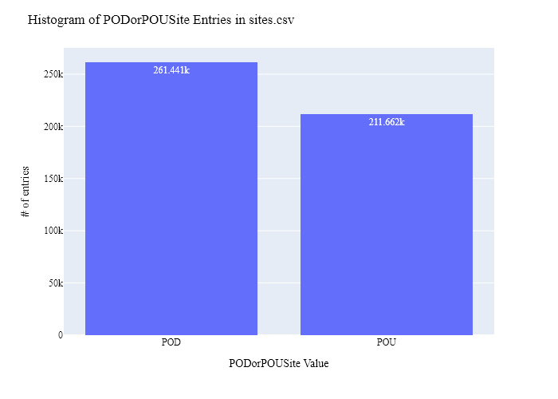
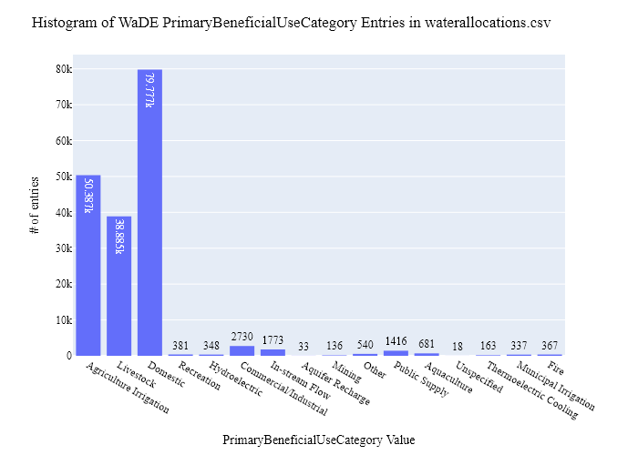
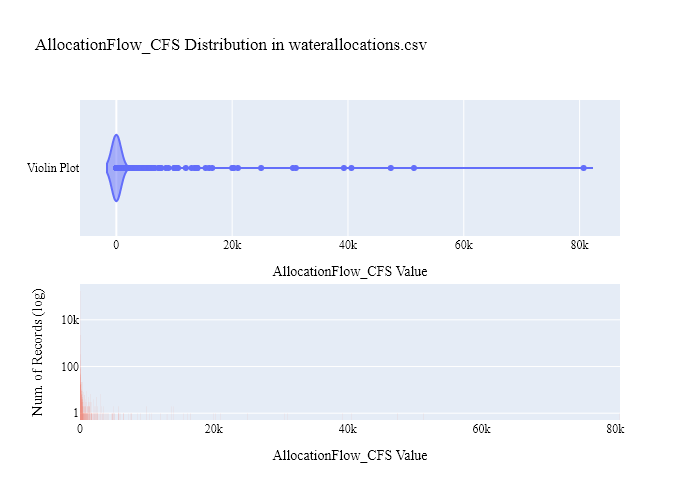
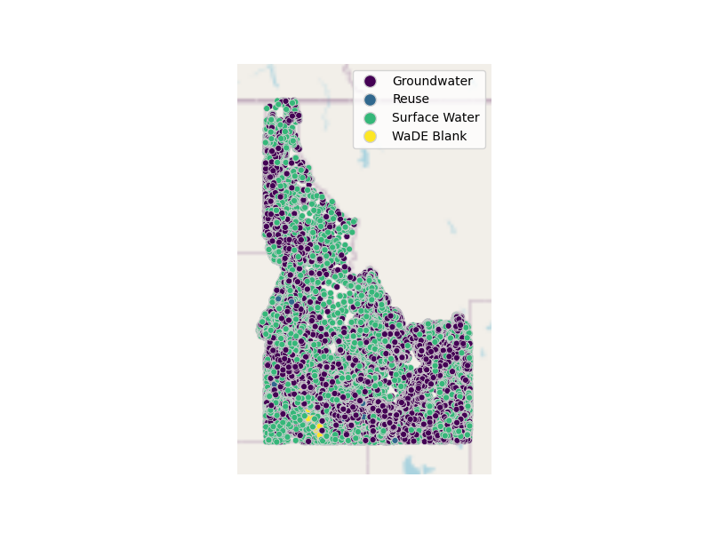

# IDWR Water Rights (Allocation) Data Preparation for WaDE

This readme details the process that was applied by the staff of the [Western States Water Council (WSWC)](http://wade.westernstateswater.org/) to extracting water rights data made available by the [Idaho Department of Water Resources (IDWR)](https://idwr.idaho.gov/), for inclusion into the Water Data Exchange (WaDE) project. WaDE enables states to share data with each other and the public in a more streamlined and consistent way. WaDE is not intended to replace the states data or become the source for that data but rather to enable regional analysis to inform policy decisions and for planning purposes.

## Overview of Source Data Utilized

The following data was used for water allocations...

Name | Description | Download Link | Metadata Glossary Link
---------- | ---------- | ------------ | ------------
**Point of diversion (POD)** | Point of diversion water right sites. | [link](https://data-idwr.hub.arcgis.com/datasets/f0b37d653f8249a4945d61bdb98dc4a7_0/explore) | not given
**Place of use (PoU)** | Place of use water right polygons. | [link](https://data-idwr.hub.arcgis.com/documents/IDWR::place-of-use-water-right/about) | not given

Unique files were created from the above links to be used as input to the Python codes that prepare WaDE2 input files. Input files used are as follows...

- Water_Right_PODs.shp
- WaterRightPOUs.shp

## Storage for WaDE 2.0 Source and Processed Water Data

The 1) raw input data shared by the state / state agency / data provider (excel, csv, shapefiles, PDF, etc), & the 2) csv processed input data ready to load into the WaDE database, can both be found within the WaDE sponsored Google Drive. Please contact WaDE staff if unavailable or if you have any questions about the data.

- Idaho Allocation Data: https://drive.google.com/drive/folders/1HYjr3B-CPqZ9ncEi_BClax2ADO1rhy5k?usp=sharing

## Summary of Data Prep
The following text summarizes the process used by the WSWC staff to prepare and share NMOSE's water rights data for inclusion into the Water Data Exchange (WaDE 2.0) project.  For a complete mapping outline, see *IDwr_Allocation Schema Mapping to WaDE.xlsx*.  Several WaDE csv input files will be created in order to extract the NMOSE's water rights data from the above mentioned input.  Each of these WaDE csv input files was created using the [Python](https://www.python.org/) native language, built and ran within [Jupyter Notebooks](https://jupyter.org/) environment.  Those python files include the following...

- **1_IDwr_PreProcessAllocationData.ipynb**: used to pre-processes the native date into a WaDE format friendly format.  All datatype conversions occur here.
- **2_IDwr_CreateWaDEInputFiles.ipynb**: used to create the WaDE input csv files: methods.csv, variables.csv, organizations.csv, watersources.csv, sites.csv, waterallocations.csv, podsitetopousiterelationships.csv.
- **3_IDwr_WaDEDataAssessmentScript.ipynb**: used to evaluate the WaDE input csv files.

***
## Code File: 1_IDwr_PreProcessAllocationData.ipynb
Purpose: Pre-process the Idaho input data files and merge them into one master file for simple dataframe creation and extraction.

#### Inputs:
- Water_Right_PODs.shp
- WaterRightPOUs.shp

#### Outputs:
- Pwr_idMain.zip
- P_Geometry.zip

#### Operation and Steps:
- Read the input files and generate temporary input dataframes. Goal will be to create separate POD and POU centric dataframes, then join together into single output dataframe.
- For POD data...
  - Read in shp file information.
  - Convert given EPSG 8826 project to WaDE friendly EPSGS 4326.
  - Create WaDE POD centric temporary dataframe. Extract ID POD relevant data (see preprocessing code).
- For POU data...
  - Read in shp file information.
  - Convert given EPSG 8826 project to WaDE friendly EPSGS 4326.
  - Create WaDE POU centric temporary dataframe. Extract ID POD relevant data (see preprocessing code).
- Concatenate temporary POD & POU dataframes together into single long output dataframe.
  - Remove special characters from water right owner info.
  - Generate WaDE Specific Field _WaterSourceType_ from IDWR **Source** field (see pre-process code for specific dictionary used to determine water type).
  - Format **PriorityDate** field to %m/%d/%Y format.
  - Generate WaDE specific field _WaterSourceNativeID_ from WaDE **Source** field. Used to identify unique sources of water.
  - Convert converted *Latitude* & *Longitude* values to numeric values.
- Extract geometry info from POU shapefile, export as *P_idGeometry.csv*.
- Inspect output dataframe for additional errors / datatypes.
- Export output dataframe as new csv file,*Pwr_idMain.zip*.

***
## Code File: 2_NMwr_CreateWaDEInputFiles.ipynb
Purpose: generate WaDE csv input files (methods.csv, variables.csv, organizations.csv, watersources.csv, sites.csv, waterallocations.csv, podsitetopousiterelationships.csv).

#### Inputs:
- Pwr_idMain.zip

#### Outputs:
- methods.csv  `Create by hand.`
- variables.csv  `Create by hand.`
- organizations.csv  `Create by hand.`
- watersources.csv
- sites.csv
- waterallocations.csv
- podsitetopousiterelationships.csv

## 1) Method Information
Purpose: generate legend of granular methods used on data collection.

#### Operation and Steps:
- Generate single output dataframe _outdf_.
- Populate output dataframe with _WaDE Method_ specific columns.
- Assign **IDWR** info to the _WaDE Method_ specific columns (this was hardcoded by hand for simplicity).
- Assign method UUID identifier to each (unique) row.
- Perform error check on output dataframe.
- Export output dataframe _methods.csv_.

#### Sample Output (WARNING: not all fields shown):

| MethodUUID | ApplicableResourceTypeCV | MethodTypeCV |
| ---------- | ------------------------ | ------------ |
| IDwr_M1    | Surface Ground Water     | Water Use    |

## 2) Variables Information
Purpose: generate legend of granular variables specific to each state.

#### Operation and Steps:
- Generate single output dataframe _outdf_.
- Populate output dataframe with _WaDE Variable_ specific columns.
- Assign **IDWR** info to the _WaDE Variable_ specific columns (this was hardcoded by hand for simplicity).
- Assign variable UUID identifier to each (unique) row.
- Perform error check on output dataframe.
- Export output dataframe _variables.csv_.

#### Sample Output (WARNING: not all fields shown):

| VariableSpecificUUID | AggregationIntervalUnitCV | AggregationStatisticCV | AmountUnitCV |
| -------------------- | ------------------------- | ---------------------- | ------------ |
| IDwr_V1              | 1                         | Annual                 | CFS          |

## 3) Organization  Information
Purpose: generate organization directory, including names, email addresses, and website hyperlinks for organization supplying data source.

#### Operation and Steps:
- Generate single output dataframe _outdf_.
- Populate output dataframe with _WaDE Organizations_ specific columns.
- Assign **IDWR** info to the _WaDE Organizations_ specific columns (this was hardcoded by hand for simplicity).
- Assign organization UUID identifier to each (unique) row.
- Perform error check on output dataframe.
- Export output dataframe _organizations.csv_.

#### Sample Output (WARNING: not all fields shown):

| OrganizationUUID | OrganizationName            | OrganizationContactName | OrganizationWebsite     |
| ---------------- | --------------------------- | ----------------------- | ----------------------- |
| IDwr_O1          | Idaho Dept. of Water Rights | Linda Davis             | https://idwr.idaho.gov/ |

## 4) Water Source Information
Purpose: generate a list of water sources specific to a water right.

#### Operation and Steps:
- Read the input file and generate single output dataframe _outdf_.
- Populate output dataframe with _WaDE WaterSources_ specific columns.
- Assign **IDWR** info to the _WaDE WaterSources_ specific columns. See _ID_Allocation Schema Mapping to WaDE_QA_ for specific details. Items of note are as follows...
  - _WaterSourceTypeCV_ = generated list of sources from **Source**, see _0_PreProcessIdahoAllocationData.ipynb_ for specifics.
  - _WaterSourceName_ = **Source**, Unspecified if not given.
  - *WaterSourceNativeID* = use custom values for now, temp fix.
- Consolidate output dataframe into water source specific information only by dropping duplicate entries, drop by WaDE specific _WaterSourceName_ & _WaterSourceTypeCV_ fields.
- Assign water source UUID identifier to each (unique) row.
- Perform error check on output dataframe.
- Export output dataframe _WaterSources.csv_.

#### Sample Output (WARNING: not all fields shown):

| WaterSourceUUID | WaterQualityIndicatorCV | WaterSourceName | WaterSourceNativeID | WaterSourceTypeCV |
| --------------- | ----------------------- | --------------- | ------------------- | ----------------- |
| IDwrS3          | Fresh                | COEUR D ALENE LAKE | WaDEID_WS3       | Surface Water     |

Any data fields that are missing required values and dropped from the WaDE-ready dataset are instead saved in a separate csv file (e.g. _watersources_missing.csv_) for review. This allows for future inspection and ease of inspection on missing items. Mandatory fields for the water sources include the following...

- WaterSourceUUID
- WaterQualityIndicatorCV
- WaterSourceTypeCV

## 5) Site Information
Purpose: generate a list of sites where water is diverted (also known as Points Of Diversion, PODs).

#### Operation and Steps:
- Read the input file and generate single output dataframe _outdf_.
- Populate output dataframe with _WaDE Site_ specific columns.
- Assign **IDWR** info to the _WaDE Site_ specific columns. See _ID_Allocation Schema Mapping to WaDE_QA_ for specific details. Items of note are as follows...
  - Extract _WaterSourceUUID_ from waterSources.csv input csv file. See code for specific implementation of extraction.
  - _CoordinateMethodCV_ = **DataSource** for POD, Unspecified if not given. "Centroid" if POU data.
  - _Latitude_ = converted **X** projection from IDWR EPSG:8826 -to- WaDE EPSG:4326. Centroid of polygon for POU data.
  - _Longitude_ = converted **Y** projection from IDWR EPSG:8826 -to- WaDE EPSG:4326. Centroid of polygon for POU data.
  - _SiteName_ = **DiversionN** for POD, Unspecified if not given or for POU.
  - _SiteNativeID_ = **PointOfDiv** for POD, **PlaceOfUse** for POU, Unspecified if not given.
  - _SiteTypeCV_ = "Unspecified".
- Consolidate output dataframe into site specific information only by dropping duplicate entries, drop by WaDE specific _SiteNativeID_, _SiteName_ & _SiteTypeCV_ fields.
- Assign site UUID identifier to each (unique) row.
- Perform error check on output dataframe.
- Export output dataframe _sites.csv_.

#### Sample Output (WARNING: not all fields shown):

| SiteUUID | WaterSourceUUID | CoordinateMethodCV | Latitude         | Longitude         | SiteName                 |
| -------- | --------------- | ------------------ | ---------------- | ----------------- | ------------------------ |
| IDwr_S9    | IDwr_WS1        | Digitized          | 43.6997001071638 | -116.354766990569 | EAGLE ELEMENTARY WELL #1 |

Any data fields that are missing required values and dropped from the WaDE-ready dataset are instead saved in a separate csv file (e.g. _sites_missing.csv_) for review. This allows for future inspection and ease of inspection on missing items. Mandatory fields for the sites include the following...

- SiteUUID
- CoordinateMethodCV
- EPSGCodeCV
- SiteName

## 6) AllocationsAmounts Information
Purpose: generate master sheet of water allocations to import into WaDE 2.0.

#### Operation and Steps:
- Read the input files and generate single output dataframe _outdf_.
- Populate output dataframe with _WaDE Water Allocations_ specific columns.
- Assign **IDWR** info to the _WaDE Water Allocations_ specific columns. See _ID_Allocation Schema Mapping to WaDE_QA_ for specific details. Items of note are as follows...
  - Extract _MethodUUID_, _VariableSpecificUUID_, _OrganizationUUID_, & _SiteUUID_ from respective input csv files. See code for specific implementation of extraction.
  - _AllocationBasisCV_ = **Basis** from POD data
  - _AllocationFlow_CFS_ = **OverallMax**.
  - _AllocationVolume_AF_ = **OverallM_1**.
  - _AllocationLegalStatusCV_ = **Status**.
  - _AllocationNativeID_ = **WaterRight**.
  - _AllocationOwner_ = **Owner**.
  - _AllocationPriorityDate_ = **PriorityDa**.
  - _BeneficialUseCategory_ = **Uses*** for POD data, **WaterUse** for POU data, Unspecified if not given.
  - _IrrigatedAcreage_ = **AcreLimit** from POU data.
  - _WaterAllocationNativeURL_ = **WRReport**.
- Consolidate output dataframe into water allocations specific information only by grouping entries by _AllocationNativeID_ filed.
- Perform error check on output dataframe.
- Export output dataframe _waterallocations.csv_.

#### Sample Output (WARNING: not all fields shown):

| AllocationUUID | MethodUUID | OrganizationUUID | SiteUUID                  | VariableSpecificUUID | AllocationFlow_CFS | AllocationPriorityDate | BeneficialUseCategory |
| -------------- | ---------- | ---------------- | ------------------------- | -------------------- | ------------------ | ---------------------- | --------------------- |
| IDwr_WR1       | IDwr_M1    | IDwr_O1          | IDwr_S406997,IDwr_S153532 | IDwr_V1              | 180                | 4/1/1939               | IRRIGATION            |

Any data fields that are missing required values and dropped from the WaDE-ready dataset are instead saved in a separate csv file (e.g. _waterallocations_missing.csv_) for review. This allows for future inspection and ease of inspection on missing items. Mandatory fields for the water allocations include the following...

- MethodUUID
- VariableSpecificUUID
- OrganizationUUID
- SiteUUID
- AllocationPriorityDate
- BeneficialUseCategory
- AllocationAmount or AllocationMaximum
- DataPublicationDate

### 7) POD Site -To- POU Polygon Relationships
Purpose: generate linking element between POD and POU sites that share the same water right.
Note: podsitetopousiterelationships.csv output only needed if both POD and POU data is present, **otherwise produces empty file**.

#### Operation and Steps:
- Read the sites.csv & waterallocations.csv input files.
- Create three temporary dataframes: one for waterallocations, & two for site info that will store POD and POU data separately.
- For the temporary POD dataframe...
  - Read in site.csv data from sites.csv with a _PODSiteUUID_ field = POD only.
  - Create _PODSiteUUID_ field = _SiteUUID_.
- For the temporary POU dataframe
  - Read in site.csv data from sites.csv with a _PODSiteUUID_ field = POU only.
  - Create _POUSiteUUID_ field = _SiteUUID_.
- For the temporary waterallocations dataframe, explode _SiteUUID_ field to create unique rows.
- Left-merge POD & POU dataframes to the waterallocations dataframe via _SiteUUID_ field.
- Consolidate waterallocations dataframe by grouping entries by _AllocationNativeID_ filed.
- Explode the consolidated waterallocations dataframe again using the _PODSiteUUID_ field, and again for the _POUSiteUUID_ field to create unique rows.
- Perform error check on waterallocations dataframe (check for NaN values)
- If waterallocations is not empty, export output dataframe _podsitetopousiterelationships.csv_.

***
## Source Data & WaDE Complied Data Assessment
The following info is from a data assessment evaluation of the completed data...

Dataset | Num of Source Entries (rows)
---------- | ---------- 
**Point of diversion (POD)** | 265,829
**Place of use (PoU)**  | 217,143

Dataset  | Num of Identified PODs | Num of Identified POUs | Num of Identified Water Right Records
---------- | ------------ | ------------ | ------------
**Compiled WaDE Data** | 261,441 | 211,662 | 177,972

Assessment of Removed Source Records | Count | Action
---------- | ---------- | ----------
Unused WaterSource Record    67 | removed from watersources.csv input
Unused Site Record                     | 7408 | removed from sites.csv input
Incomplete or bad entry for SiteName   |  395 | removed from sites.csv input
Incomplete or bad entry for IrrigatedAcreage         | 1417 | removed from waterallocations.csv input
Incomplete or bad entry for AllocationPriorityDate   |  554 | removed from waterallocations.csv input
Incomplete or bad entry for SiteUUID                 |    2 | removed from waterallocations.csv input

**Figure 1:** Distribution of POD vs POU Sites within the sites.csv

**Figure 2:** Distribution Sites by WaterSourceTypeCV within the sites.csv

**Figure 3:** Distribution of Identified Water Right Records by WaDE Categorized Primary Beneficial Uses within the waterallocations.csv

**Figure 4a:** Range of Priority Date of Identified Water Right Records within the waterallocations.csv

**Figure 4b:** Cumulative distribution of Priority Date of Identified Water Right Records within the waterallocations.csv

**Figure 5:** Distribution & Range of Flow (CFS) of Identified Water Right Records within the waterallocations.csv

**Figure 6:** Distribution & Range of Volume (AF) of Identified Water Right Records within the waterallocations.csv

**Figure 7:** Map of Identified Points within the sites.csv

**Figure 8:** Map of Identified Polygons within the sites.csv

***
## Staff Contributions
Data created here was a contribution between the [Western States Water Council (WSWC)](http://wade.westernstateswater.org/) and the [Idaho Department of Water Resources (IDWR)](https://idwr.idaho.gov/).

WSWC Staff
- Ryan James <rjames@wswc.utah.gov>

IDWR Staff

- Linda Davis <linda.davis@idwr.idaho.gov>
- Danielle Favreau <Danielle.Favreau@idwr.idaho.gov>
- Dan Narsavage <Dan.Narsavage@idwr.idaho.gov>
- Phil Blankenau <phil.blankenau@idwr.idaho.gov>
