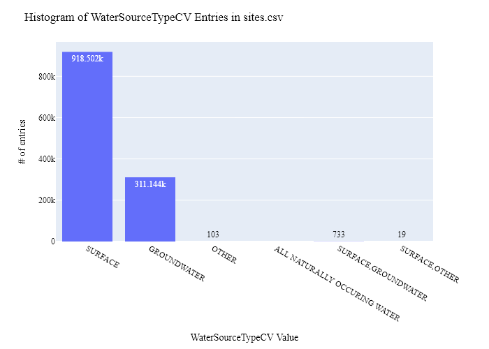
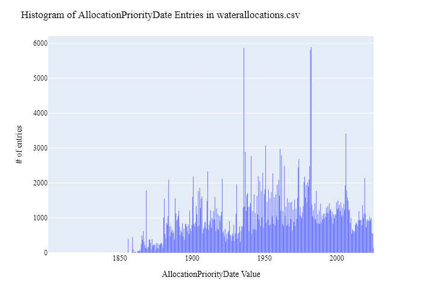
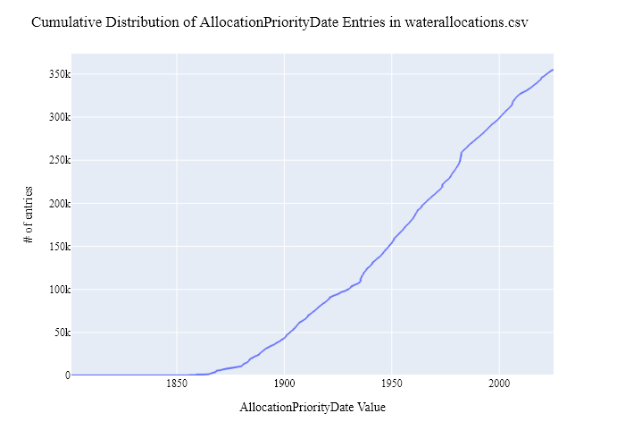
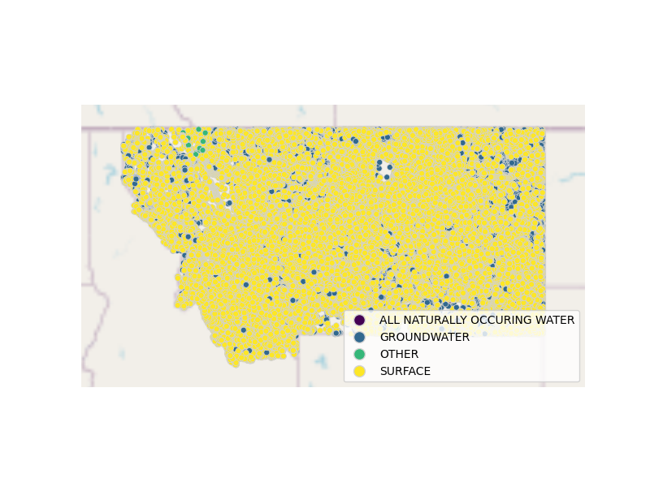
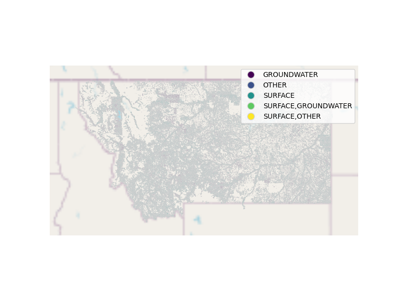

#  Montana Department of Natural Resources and Conservation (DNRC) Water Rights (Allocation) Data Preparation for WaDE
This readme details the process that was applied by the staff of the [Western States Water Council (WSWC)](http://wade.westernstateswater.org/) to extracting water rights data made available by the [Montana Department of Natural Resources and Conservation (DNRC)](http://dnrc.mt.gov/), for inclusion into the Water Data Exchange (WaDE) project.  WaDE enables states to share data with each other and the public in a more streamlined and consistent way. WaDE is not intended to replace the states data or become the source for that data but rather to enable regional analysis to inform policy decisions and for planning purposes. 

## Overview of Source Data Utilized
The following data was used for water allocations...

Name | Description | Download Link | Metadata Glossary Link
---------- | ---------- | ------------ | ------------
**Points of Diversion** | Point of Diversion sites related to water rights. | [link](https://gis.dnrc.mt.gov/arcgis/rest/services/WRD/WRQS/FeatureServer/1) | Not Provided
**Places of Use** | Place of Use polygons related to water rights.| [link](https://gis.dnrc.mt.gov/arcgis/rest/services/WRD/WRQS/FeatureServer/2) | Not Provided

Issue of **PERIOD_OF_DIVERSIONS** input sometimes has multiple values. Temp fix of only using the first value provided.

Issue of unknown "POF" meaning value in **MAX_FLOW** input ([Ex Link](https://wrqsproxy.dnrc.mt.gov/Report?/WRQS/WRD2090AR&P_WRGT_ID_SEQ=473015&P_VERS_ID_SEQ=1&rs:Command=Render&rs:Format=PDF)). Temp fix of removing all POF related records

Unique files were created to be used as input.  Input files used are as follows...
- PointsofDiversion.zip (zipped csv file)
- PlaceofUse.zip (zipped shp & dbf files)

## Storage for WaDE 2.0 Source and Processed Water Data
The 1) raw input data shared by the state / state agency / data provider (excel, csv, shapefiles, PDF, etc), & the 2) csv processed input data ready to load into the WaDE database, can both be found within the WaDE sponsored Google Drive.  Please contact WaDE staff if unavailable or if you have any questions about the data.
-  Montana Department of Natural Resources and Conservation (DNRC) Allocation Data: [link](https://drive.google.com/drive/folders/1HWY-AZZYO7zJfQoRnVPYy6N_pYJOyqGJ)

## Summary of Data Prep
The following text summarizes the process used by the WSWC staff to prepare and share water rights data for inclusion into the Water Data Exchange (WaDE 2.0) project.  For a complete mapping outline, see *MTwr_Allocation Schema Mapping to WaDE.xlsx*.  Several WaDE csv input files will be created in order to extract the water rights data from the above mentioned input.  Each of these WaDE csv input files was created using the [Python](https://www.python.org/) native language, built and ran within [Jupyter Notebooks](https://jupyter.org/) environment.  Those python files include the following...

- **1_MTwr_PreProcessAllocationData.ipynb**: used to pre-processes the native date into a WaDE format friendly format.  All datatype conversions occur here.
- **2_MTwr_CreateWaDEInputFiles.ipynb**: used to create the WaDE input csv files: methods.csv, variables.csv, organizations.csv, watersources.csv, sites.csv, waterallocations.csv, podsitetopousiterelationships.csv.
- **3_MTwr_WaDEDataAssessmentScript.ipynb**: used to evaluate the WaDE input csv files.

***
## Code File: 1_XXwr_PreProcessAllocationData.ipynb
Purpose: Pre-process the input data files and merge them into one master file for simple dataframe creation and extraction.

#### Inputs: 
- PointsofDiversion.zip (zipped csv file)
- PlaceofUse.zip (zipped shp & dbf files)

#### Outputs:
 - Pwr_mtMain.zip
 - P_Geometry.zip

#### Operation and Steps:
- Read in input data, store in POD and POU input dataframes.
- For each input dataframe....
  - Separate out **PERIOD_OF_DIVERSIONS** input from start to end dates. Issue of some records of multiple start and end times, will cheat for now and just use the first one provided.
- Fill in WaDE appropriate values.
- Clean data, check data types, remove special characters, ensure empty cells where needed.
- Remove all 'WITHDRAWN', 'TERMINATED', 'PENDING', 'CANCELLED', 'DISMISSED', 'SUSPENDED', 'DENIED', 'SEVERED', 'EXPIRED', & 'REVOKED' legal status record (we only want to work with "Active" legal status records).
- Extract geometry input from PlaceofUse.zip input, export as P_Geometry.zip.
- Review for errors.
- Export as Pwr_mtMain.zip.

***
## Code File: 2_UTwr_CreateWaDEInputFiles.ipynb
Purpose: generate WaDE csv input files (methods.csv, variables.csv, organizations.csv, watersources.csv, sites.csv, waterallocations.csv, podsitetopousiterelationships.csv).

#### Inputs:
- Pwr_mtMain.zip
- P_Geometry.zip

#### Outputs:
- methods.csv  `Create by hand.`
- variables.csv  `Create by hand.`
- organizations.csv  `Create by hand.`
- watersources.csv
- sites.csv
- waterallocations.csv
- podsitetopousiterelationships.csv

## 1) Method Information
Purpose: generate legend of granular methods used on data collection.

#### Operation and Steps:
- Generate single output dataframe *outdf*.
- Populate output dataframe with *WaDE Method* specific columns.
- Assign agency info to the *WaDE Method* specific columns (this was hardcoded by hand for simplicity).
- Assign method UUID identifier to each (unique) row.
- Perform error check on output dataframe.
- Export output dataframe *methods.csv*.

#### Sample Output (WARNING: not all fields shown):
MethodUUID | ApplicableResourceTypeCV | DataConfidenceValue | DataCoverageValue | DataQualityValueCV | MethodDescription | MethodName | MethodNEMILink | MethodTypeCV | WaDEDataMappingUrl
---------- | ---------- | ------------ | ------------ | ------------ | ------------ | ------------ | ------------ | ------------ | ------------
MTwr_M1	Surface Ground Water | -	|	- |	- | - | The Montana Department of Natural Resources and Conservation (DNRC) provides this product for informational purposes only... | Montana Water Rights Method | https://dnrc.mt.gov/Water-Resources/Water-Rights/Understanding-Water-Rights/ | Legal Processes | https://github.com/WSWCWaterDataExchange/MappingStatesDataToWaDE2.0/tree/master/Montana

## 2) Variables Information
Purpose: generate legend of granular variables specific to each state.

#### Operation and Steps:
- Generate single output dataframe *outdf*.
- Populate output dataframe with *WaDE Variable* specific columns.
- Assign agency info to the *WaDE Variable* specific columns (this was hardcoded by hand for simplicity).
- Assign variable UUID identifier to each (unique) row.
- Perform error check on output dataframe.
- Export output dataframe *variables.csv*.

#### Sample Output (WARNING: not all fields shown):
VariableSpecificUUID | AggregationInterval | AggregationIntervalUnitCV | AggregationStatisticCV | AmountUnitCV | VariableCV | VariableSpecificCV 
---------- | ---------- | ------------ | ------------ | ------------ | ------------ | ------------
MTwr_V1	1 | Year | Average | CFS | AFY | 10 | WaterYear | Allocation | Allocation

## 3) Organization Information
Purpose: generate organization directory, including names, email addresses, and website hyperlinks for organization supplying data source.

#### Operation and Steps:
- Generate single output dataframe *outdf*.
- Populate output dataframe with *WaDE Organizations* specific columns.
- Assign agency info to the *WaDE Organizations* specific columns (this was hardcoded by hand for simplicity).
- Assign organization UUID identifier to each (unique) row.
- Perform error check on output dataframe.
- Export output dataframe *organizations.csv*.

#### Sample Output (WARNING: not all fields shown):
OrganizationUUID | OrganizationContactEmail | OrganizationContactName | OrganizationName | OrganizationPhoneNumber | OrganizationPurview | OrganizationWebsite | State
---------- | ---------- | ------------ | ------------ | ------------ | ------------ | ------------ | ------------
MTwr_O1 | CKuntz@mt.gov | Chris Kuntz | The Montana Department of Natural Resources and Conservation | 406-444-2074 | The Montana Department of Natural Resources and Conservation is a government agency... | http://dnrc.mt.gov/ | MT

## 4) Water Source Information
Purpose: generate a list of water sources specific to a water right.

#### Operation and Steps:
- Read the input file and generate single output dataframe *outdf*.
- Populate output dataframe with *WaDE WaterSources* specific columns.
- Assign agency info to the *WaDE WaterSources* specific columns.  See *XXwr_Allocation Schema Mapping_WaDE.xlsx* for specific details.  Items of note are as follows...
    - *WaterSourceUUID* = create unique it based on *WaterSourceNativeID*.
    - *WaterQualityIndicatorCV* = "Fresh"
    - *WaterSourceName* = **SOURCE_NAME** input.
    - *WaterSourceNativeID* = (not provided) Will need to create unique value based on name and type.
    - *WaterSourceTypeCV* = **SOURCE_TYPE** input.
- Consolidate output dataframe into water source specific information only by dropping duplicate entries, drop by WaDE specific *WaterSourceName* & *WaterSourceTypeCV* fields.
- Assign water source UUID identifier to each (unique) row.
- Perform error check on output dataframe.
- Export output dataframe *WaterSources.csv*.

#### Sample Output (WARNING: not all fields shown):
WaterSourceUUID | WaterQualityIndicatorCV | WaterSourceName | WaterSourceNativeID | WaterSourceTypeCV
---------- | ---------- | ------------ | ------------ | ------------
MTwr_WSwId1 | Fresh | lathead River Flathead Lake | wId1 | SURFACE

Any data fields that are missing required values and dropped from the WaDE-ready dataset are instead saved in a separate csv file (e.g. *watersources_missing.csv*) for review.  This allows for future inspection and ease of inspection on missing items.  Mandatory fields for the water sources include the following...
- WaterSourceUUID
- WaterQualityIndicatorCV
- WaterSourceTypeCV

## 5) Site Information
Purpose: generate a list of sites information.

#### Operation and Steps:
- Read the input file and generate single output dataframe *outdf*.
- Populate output dataframe with *WaDE Site* specific columns.
- Assign agency info to the *WaDE Site* specific columns.  See *XXwr_Allocation Schema Mapping_WaDE.xlsx* for specific details.  Items of note are as follows...
    - *SiteUUID* = create unique it based on **PODV_ID_SEQ** input.
    - *WaterSourceUUIDs* = Extract *WaterSourceUUID* from waterSources.csv input csv file. See code for specific implementation of extraction.
    - *CoordinateAccuracy* = "WaDE Blank"
    - *CoordinateMethodCV* = "WaDE Blank"
    - *Country* = **COUNTY** input.
    - *EPSGCodeCV* = "4326"
    - *Geometry* = **geometry** input, converted to WGS 1984 coordinate.
    - *GNISCodeCV* = ""
    - *HUC12* = ""
    - *HUC8* = ""
    - *Latitude* = created with shp file, using WGS 1984 coordinate.
    - *Longitude* = created with shp file, using WGS 1984 coordinate.
    - *NHDNetworkStatusCV* = ""
    - *NHDProductCV* = ""
    - *PODorPOUSite* = "POD" or "POU" respectively
    - *SiteName* = ""
    - *SiteNativeID* = **PODV_ID_SEQ** input.
    - *SiteTypeCV* = **MEANS_OF_DIV** input.
    - *StateCV* = "MT"
    - *USGSSiteID* = ""
- Consolidate output dataframe into site specific information only by dropping duplicate entries, drop by WaDE specific *SiteNativeID*, *SiteName*, *SiteTypeCV*, *Longitude* & *Latitude* fields.
- Assign site UUID identifier to each (unique) row.
- Perform error check on output dataframe.
- Export output dataframe *sites.csv*.

#### Sample Output (WARNING: not all fields shown):
SiteUUID | WaterSourceUUID | CoordinateMethodCV | County | Latitude | Longitude | PODorPOUSite| SiteName | SiteNativeID | SiteTypeCV
---------- | ---------- | ---------- | ------------ | ------------ | ------------ | ------------ | ------------ | ------------ | ------------
MTwr_S124706 | MTwr_WSwId2 | WaDE Blank | Powder River | 45.02667 | -105.87871 | POD | WaDE Blank | 124706 | WELL

Any data fields that are missing required values and dropped from the WaDE-ready dataset are instead saved in a separate csv file (e.g. *sites_missing.csv*) for review.  This allows for future inspection and ease of inspection on missing items.  Mandatory fields for the sites include the following...
- SiteUUID 
- CoordinateMethodCV
- EPSGCodeCV
- SiteName

## 6) AllocationsAmounts Information
Purpose: generate master sheet of water allocations to import into WaDE 2.0.

#### Operation and Steps:
- Read the input files and generate single output dataframe *outdf*.
- Populate output dataframe with *WaDE Water Allocations* specific columns.
- Assign agency info to the *WaDE Water Allocations* specific columns.  See *XXwr_Allocation Schema Mapping_WaDE.xlsx* for specific details.  Items of note are as follows...
    - Extract *MethodUUID*, *VariableSpecificUUID*, *OrganizationUUID*, & *SiteUUID* from respective input csv files. See code for specific implementation of extraction.
    - *AllocationApplicationDate* = ""
    - *AllocationAssociatedConsumptiveUseSiteIDs* = ""
    - *AllocationAssociatedWithdrawalSiteIDs* = ""
    - *AllocationBasisCV* = ""
    - *AllocationChangeApplicationIndicator* = ""
    - *AllocationCommunityWaterSupplySystem* = ""
    - *AllocationCropDutyAmount* = ""
    - *AllocationExpirationDate* = ""
    - *AllocationFlow_CFS* = **MAX_FLOW** input.
    - *AllocationLegalStatusCV* = **WR_STATUS** input.
    - *AllocationNativeID* = **WR_NUMBER** input.
    - *AllocationOwner* =  **OWNERS** input.
    - *AllocationPriorityDate* = **ENF_PRTY_DT_DATE**input.
    - *AllocationSDWISIdentifierCV* = ""
    - *AllocationTimeframeEnd* = end date extracted from **PERIOD_OF_DIVERSIONS** input.
    - *AllocationTimeframeStart* = start date extracted from **PERIOD_OF_DIVERSIONS** input.
    - *AllocationTypeCV* = **WR_TYPE** input.
    - *AllocationVolume_AF* = **MAX_VOL** input.
    - *BeneficialUseCategory* = **PURPOSES** input.
    - *CommunityWaterSupplySystem* = ""
    - *CropTypeCV* = ""
    - *CustomerTypeCV* = ""
    - *DataPublicationDate* = "{use today's date}"
    - *DataPublicationDOI* = ""
    - *ExemptOfVolumeFlowPriority* = "0", for non-exempt.
    - *GeneratedPowerCapacityMW* = ""
    - *IrrigatedAcreage* = **MAX_ACRES** input.
    - *IrrigationMethodCV* = ""
    - *LegacyAllocationIDs* = ""
    - *OwnerClassificationCV* = ""
    - *PopulationServed* = ""
    - *PowerType* = ""
    - *PrimaryBeneficialUseCategory* = ""
    - *WaterAllocationNativeURL* = **URL_ABSTRACT** input.																							
- Consolidate output dataframe into water allocations specific information only by grouping entries by *AllocationNativeID* filed.
- Perform error check on output dataframe.
- Export output dataframe *waterallocations.csv*.

#### Sample Output (WARNING: not all fields shown):
AllocationUUID | MethodUUID | OrganizationUUID | SiteUUID | VariableSpecificUUID | AllocationBasisCV | AllocationFlow_CFS | AllocationLegalStatusCV | AllocationNativeID | AllocationOwner | AllocationPriorityDate | AllocationTypeCV | BeneficialUseCategory | OwnerClassificationCV | WaterAllocationNativeURL
---------- | ---------- | ---------- | ---------- | ---------- | ---------- | ---------- | ---------- | ---------- | ---------- | ---------- | ---------- | ---------- | ---------- | ----------
MTwr_WR38H10224400 | MTwr_M1 | MTwr_O1 | MTwr_Su254979,MTwr_S249593	 | MTwr_V1 | WaDE Blank | 0.00000 | ACTIVE | 38H 102244 00 | Usa Dept Of Interior Bureau Of Land Mgm | 1997-11-25	 | STOCKWATER PERMIT | STOCK | Bureau of Land Management (USBLM) | https://wrqsproxy.dnrc.mt.gov/Report?/WRQS/WRD...

Any data fields that are missing required values and dropped from the WaDE-ready dataset are instead saved in a separate csv file (e.g. *waterallocations_missing.csv*) for review.  This allows for future inspection and ease of inspection on missing items.  Mandatory fields for the water allocations include the following...
- MethodUUID
- VariableSpecificUUID
- OrganizationUUID
- SiteUUID
- AllocationPriorityDate
- BeneficialUseCategory
- AllocationAmount or AllocationMaximum
- DataPublicationDate

### 7) POD Site -To- POU Polygon Relationships
Purpose: generate linking element between POD and POU sites that share the same water right.
Note: podsitetopousiterelationships.csv output only needed if both POD and POU data is present,  `otherwise produces empty file.`

#### Operation and Steps:
- Read the sites.csv & waterallocations.csv input files.
- Create three temporary dataframes: one for waterallocations, & two for site info that will store POD and POU data separately.
- For the temporary POD dataframe...
  - Read in site.csv data from sites.csv with a _PODSiteUUID_ field = POD only.
  - Create _PODSiteUUID_ field = _SiteUUID_.
- For the temporary POU dataframe
  - Read in site.csv data from sites.csv with a _PODSiteUUID_ field = POU only.
  - Create _POUSiteUUID_ field = _SiteUUID_.
- For the temporary waterallocations dataframe, explode _SiteUUID_ field to create unique rows.
- Left-merge POD & POU dataframes to the waterallocations dataframe via _SiteUUID_ field.
- Consolidate waterallocations dataframe by grouping entries by _AllocationNativeID_ filed.
- Explode the consolidated waterallocations dataframe again using the _PODSiteUUID_ field, and again for the _POUSiteUUID_ field to create unique rows.
- Perform error check on waterallocations dataframe (check for NaN values)
- If waterallocations is not empty, export output dataframe *podsitetopousiterelationships.csv*.

***
## Source Data & WaDE Complied Data Assessment
The following info is from a data assessment evaluation of the completed data...

Dataset | Num of Source Entries (rows)
---------- | ---------- 
**Points of Diversion** | 593,225
**Places of Use** | 468,780

Dataset  | Num of Identified PODs | Num of Identified POUs | Num of Identified Water Right Records
---------- | ------------ | ------------ | ------------
**Compiled WaDE Data** | 484,001 | 331,871 | 342,498

Assessment of Removed Source Records | Count | Action
---------- | ---------- | ----------
Unused WaterSource Record | 322 | removed from watersources.csv input
Unused Site Record | 198,315 | removed from sites.csv input
Incomplete or bad entry for County | 103 | removed from sites.csv input
Incomplete or bad entry for WaterSourceUUIDs | 36 | removed from sites.csv input
Incomplete or bad entry for AllocationTimeframeEnd | 46,836 | removed from waterallocations.csv input
Incomplete or bad entry for AllocationPriorityDate  | 2,628 | removed from waterallocations.csv input
Incomplete or bad entry for Flow | 1151 | removed from waterallocations.csv input
Incomplete or bad entry for AllocationTimeframeStart | 611 | removed from waterallocations.csv input
Incomplete or bad entry for Volume | 248 | removed from waterallocations.csv input
Incomplete or bad entry for IrrigatedAcreage | 224 | removed from waterallocations.csv input
Incomplete or bad entry for AllocationOwner | 157 | removed from waterallocations.csv input
Incomplete or bad entry for SiteUUID | 77 | removed from waterallocations.csv input

**Figure 1:** Distribution of POD vs POU Sites within the sites.csv

**Figure 2:** Distribution Sites by WaterSourceTypeCV within the sites.csv

**Figure 3:** Distribution of Identified Water Right Records by WaDE Categorized Primary Beneficial Uses within the waterallocations.csv

**Figure 4a:** Range of Priority Date of Identified Water Right Records within the waterallocations.csv

**Figure 4b:** Cumulative distribution of Priority Date of Identified Water Right Records within the waterallocations.csv

**Figure 5:** Distribution & Range of Flow (CFS) of Identified Water Right Records within the waterallocations.csv

**Figure 6:** Distribution & Range of Volume (AF) of Identified Water Right Records within the waterallocations.csv

**Figure 7:** Map of Identified Points within the sites.csv

**Figure 8:** Map of Identified Polygons within the sites.csv

***
## Staff Contributions
Data created here was a contribution between the [Western States Water Council (WSWC)](http://wade.westernstateswater.org/) and the [Montana Department of Natural Resources and Conservation (DNRC)](http://dnrc.mt.gov/).

WSWC Staff
- Adel Abdallah (Project Manager) <adelabdallah@wswc.utah.gov>
- Ryan James (Data Analysis) <rjames@wswc.utah.gov>

 Montana Department of Natural Resources and Conservation (DNRC) Staff
- "{name of staff member that is our point of contact for this data}" <"{point of contacts email"}>
