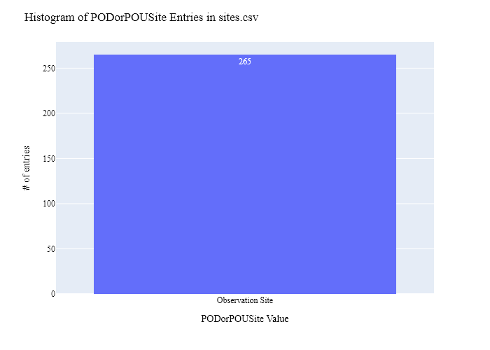
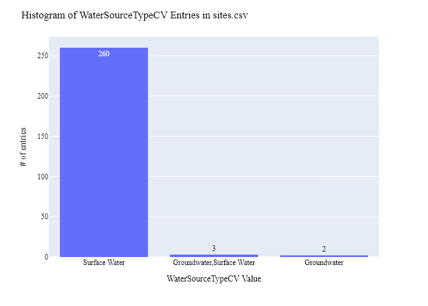
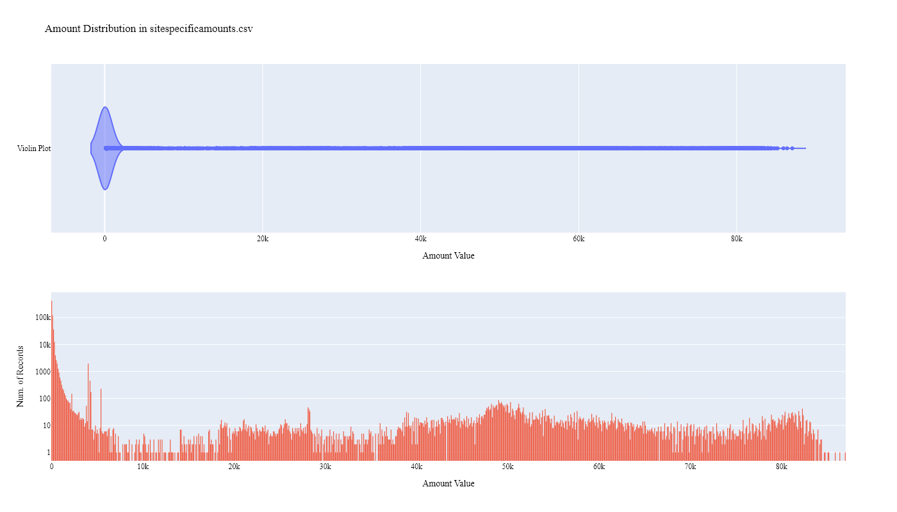
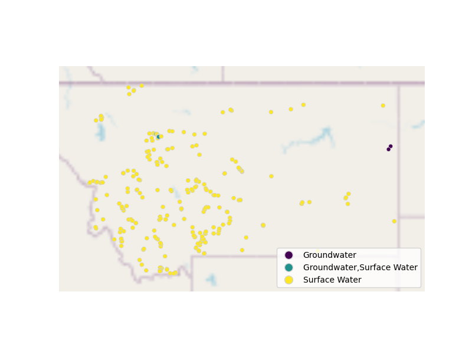

# MT Water Supply Site Data Preparation for WaDE
This readme details the process that was applied by the staff of the [Western States Water Council (WSWC)](http://wade.westernstateswater.org/) to extracting Water Supply site time series water data made available by the [The Montana Department of Natural Resources and Conservation (MDNRC)](http://dnrc.mt.gov/), for inclusion into the Water Data Exchange (WaDE) project.  WaDE enables states to share data with each other and the public in a more streamlined and consistent way. WaDE is not intended to replace the states data or become the source for that data but rather to enable regional analysis to inform policy decisions and for planning purposes. 

## Overview of Source Data Utilized
The following data was used for water allocations...

Name | Description | Download Link | Metadata Glossary Link
---------- | ---------- | ------------ | ------------
"datasets_table" | DNRC Water Management Bureau StAGE Web MapService information on available datasets / metadata to existing timeseries. | [link](https://gis.dnrc.mt.gov/arcgis/rest/services/WRD/WMB_StAGE/MapServer/3) | not provided
"locations_with_geometry" | DNRC Water Management Bureau StAGE Web MapService information on sites information with geometry.| [link](https://gis.dnrc.mt.gov/arcgis/rest/services/WRD/WMB_StAGE/MapServer/1) | not provided
"timeseries_table" | DNRC Water Management Bureau StAGE Web MapService information on available timeseries data tied to sites. | [link](https://gis.dnrc.mt.gov/arcgis/rest/services/WRD/WMB_StAGE/MapServer/2) | not provided

Input files used are as follows...
- datasets_table.zip, zipped file of available datasets. 
- locations_with_geometry.zip, zipped file of sites information.
- timeseries_table.zip, zipped file of timeseries information tied to sites.
 

## Storage for WaDE 2.0 Source and Processed Water Data
The 1) raw input data shared by the state / state agency / data provider (excel, csv, shapefiles, PDF, etc), & the 2) csv processed input data ready to load into the WaDE database, can both be found within the WaDE sponsored Google Drive.  Please contact WaDE staff if unavailable or if you have any questions about the data.
- MT Site Specific Reservoir and Gage Data: [link](https://drive.google.com/drive/folders/1Z7OzJU79arz3OFrRErtTnbv4KoBxZVXh?usp=drive_link)

## Summary of Data Prep
The following text summarizes the process used by the WSWC staff to prepare and share MT's water supply data for inclusion into the Water Data Exchange (WaDE 2.0) project. For a complete mapping outline, see *MTwsss_Water Supply Sites Schema Mapping to WaDE.xlsx*. Several WaDE csv input files will be created in order to extract the MT's water supply data from the above mentioned input. Each of these WaDE csv input files was created using the [Python](https://www.python.org/) native language, built and ran within [Jupyter Notebooks](https://jupyter.org/) environment. Those python files include the following...

- **1_MTwsss_PreProcessWaterSupplySites.ipynb**: used to pre-processes the native date into a WaDE format friendly format.  All datatype conversions occur here.
- **2_MTwsss_CreateWaDEInputFiles.ipynb**: used to create the WaDE input csv files: methods.csv, variables.csv, organizations.csv, watersources.csv, sites.csv, sitespecificamounts.csv.
- **3_MTwsss_WaDEDataAssessmentScript.ipynb**: used to evaluate the WaDE input csv files.

***
### 0) Code File: 1_MTwsss_PreProcessWaterSupplySites.ipynb
Purpose: Pre-process the state agency's input data files and merge them into one master file for simple dataframe creation and extraction.

#### Inputs: 
- datasets_table.zip
- locations_with_geometry.zip
- timeseries_table.zip

#### Outputs:
 - Pwsss_Main.zip

#### Operation and Steps:
- Using DNRC Water Management Bureau StAGE Web available MapService, the following actions were performed...
    - retrieve datasets_table via MapServer/3, all records, all fields, no geometry, return json.
    - retrieve locations_with_geometry via MapServer/1, all records, all fields, with geometry, return json.
    - Only records whose datasets_table **ParameterLabel** = ("Discharge", "Lake Res Elevation" ,"Stage", "Total Storage", & "Water Level"). Filter for sites in locations_with_geometry that fit this query. Retrieve timeseries_table via MapServer/2 by quering single site at a time, save to json.
    - all MapServer saved to local zip file for future use.
- Read in hard copies of datasets_table, locations_with_geometry, and timeseries_table. Save to DataFrames. Trim to only necessary columns.
- Inner-join datasets_table to locations_with_geometry via **LocationID**, and timeseries_table via **SensorID**.
- Convert timestamp to "%m/%d/%Y" format, units in milliseconds. Extract out date and year value.
- String split LocationName (issue of some site names have a ", Mt" in them, like "West Fork Trail Creek Nr Livingston, Mt").
- Correct **UnitOfMeasure** units to WaDE equivalents (e.g., "ft^3/s" : "CFS").
- Extract water source type from **SensorLabel** value that contains any string equivalent to "Groundwater", else set to surface water.
- Extract and map out key data columns to WadE equivalent.
- Error check units and data types.
- Export to Pwsss_Main.zip.

***
## Code File: 2_MTwsss_CreateWaDEInputFiles.ipynb
Purpose: generate WaDE csv input files (methods.csv, variables.csv, organizations.csv, watersources.csv, sites.csv, sitespecificamounts.csv).

#### Inputs:
- Pwsss_Main.zip

#### Outputs:
- methods.csv  `Create by hand.`
- variables.csv  `Create by hand.`
- organizations.csv  `Create by hand.`
- watersources.csv
- sites.csv
- sitespecificamounts.csv

## 1) Method Information
Purpose: generate legend of granular methods used on data collection.

#### Operation and Steps:
- Generate single output dataframe *outdf*.
- Populate output dataframe with *WaDE Method* specific columns.
- Assign state info to the *WaDE Method* specific columns (this was hardcoded by hand for simplicity).
- Assign method UUID identifier to each (unique) row.
- Perform error check on output dataframe.
- Export output dataframe *methods.csv*.

#### Sample Output (WARNING: not all fields shown):
|    | MethodUUID   | ApplicableResourceTypeCV   | DataConfidenceValue   | DataCoverageValue   | DataQualityValueCV   | MethodName   | MethodNEMILink   | MethodTypeCV   | WaDEDataMappingUrl                                                                      |
|---:|:-------------|:---------------------------|:----------------------|:--------------------|:---------------------|:-------------|:-----------------|:---------------|:----------------------------------------------------------------------------------------|
|  0 | MTwsss_M1    | Surface Water              |                       |                     |                      | Unspecified  |                  | Measured       | https://github.com/WSWCWaterDataExchange/MappingStatesDataToWaDE2.0/tree/master/Montana |

## 2) Variables Information
Purpose: generate legend of granular variables specific to each state.

#### Operation and Steps:
- Generate single output dataframe *outdf*.
- Populate output dataframe with *WaDE Variable* specific columns.
- Assign state info to the *WaDE Variable* specific columns (this was hardcoded by hand for simplicity).
- Assign variable UUID identifier to each (unique) row.
- Perform error check on output dataframe.
- Export output dataframe *variables.csv*.

#### Sample Output (WARNING: not all fields shown):
|    | VariableSpecificUUID   |   AggregationInterval | AggregationIntervalUnitCV   | AggregationStatisticCV   | AmountUnitCV   | MaximumAmountUnitCV   |   ReportYearStartMonth | ReportYearTypeCV   | VariableCV    | VariableSpecificCV                          |
|---:|:-----------------------|----------------------:|:----------------------------|:-------------------------|:---------------|:----------------------|-----------------------:|:-------------------|:--------------|:--------------------------------------------|
|  0 | MTwsss_V1              |                     1 | Daily                       | Mean                     | CFS            | CFS                   |                      1 | CalendarYear       | Daily Average | Daily Average_Daily_Discharge_Surface Water |

## 3) Organization  Information
Purpose: generate organization directory, including names, email addresses, and website hyperlinks for organization supplying data source.

#### Operation and Steps:
- Generate single output dataframe *outdf*.
- Populate output dataframe with *WaDE Organizations* specific columns.
- Assign state info to the *WaDE Organizations* specific columns (this was hardcoded by hand for simplicity).
- Assign organization UUID identifier to each (unique) row.
- Perform error check on output dataframe.
- Export output dataframe *organizations.csv*.

#### Sample Output (WARNING: not all fields shown):
|    | OrganizationUUID   | OrganizationContactEmail   | OrganizationContactName   | OrganizationName                                             | OrganizationPhoneNumber   | OrganizationPurview                                                                                                                                                                                  | OrganizationWebsite   | State   |
|---:|:-------------------|:---------------------------|:--------------------------|:-------------------------------------------------------------|:--------------------------|:-----------------------------------------------------------------------------------------------------------------------------------------------------------------------------------------------------|:----------------------|:--------|
|  0 | MTwsss_O1          | CKuntz@mt.gov              | Chris Kuntz               | The Montana Department of Natural Resources and Conservation | 406-444-2074              | The Montana Department of Natural Resources and Conservation responsibility for ensuring sustainable development of the state's land, mineral, natural gas, oil, timber, water, and other resources. | http://dnrc.mt.gov/   | MT      |

## 4) Water Source Information
Purpose: generate a list of water sources specific to a water right.

#### Operation and Steps:
- Read the input file and generate single output dataframe *outdf*.
- Populate output dataframe with *WaDE WaterSources* specific columns.
- Assign agency info to the *WaDE WaterSources* specific columns.  See *MTwsss_Water Supply Sites Schema Mapping to WaDE.xlsx* for specific details.  Items of note are as follows...
    - *WaterSourceUUID* = ""
    - *WaterQualityIndicatorCV* = ""
    - *WaterSourceName* = ""
    - *WaterSourceNativeID* = ""
    - *WaterSourceTypeCV* = **SensorLabel** see above for details.
- Consolidate output dataframe into water source specific information only by dropping duplicate entries, drop by WaDE specific *WaterSourceName* & *WaterSourceTypeCV* fields.
- Assign water source UUID identifier to each (unique) row.
- Perform error check on output dataframe.
- Export output dataframe *WaterSources.csv*.

#### Sample Output (WARNING: not all fields shown):
|    | WaterSourceUUID   | Geometry   | GNISFeatureNameCV   | WaterQualityIndicatorCV   | WaterSourceName   | WaterSourceNativeID   | WaterSourceTypeCV   |
|---:|:------------------|:-----------|:--------------------|:--------------------------|:------------------|:----------------------|:--------------------|
|  0 | MTwsss_WwadeId1   |            |                     | Fresh                     | WaDE Blank        | wadeId1               | Surface Water       |

Any data fields that are missing required values and dropped from the WaDE-ready dataset are instead saved in a separate csv file (e.g. *watersources_missing.csv*) for review.  This allows for future inspection and ease of inspection on missing items.  Mandatory fields for the water sources include the following...
- WaterSourceUUID
- WaterQualityIndicatorCV
- WaterSourceTypeCV

## 5) Site Information
Purpose: generate a list of sites information.

#### Operation and Steps:
- Read the input file and generate single output dataframe *outdf*.
- Populate output dataframe with *WaDE Site* specific columns.
- Assign agency info to the *WaDE Site* specific columns.  See *MTwsss_Water Supply Sites Schema Mapping to WaDE.xlsx* for specific details.  Items of note are as follows...
    - *SiteUUID* = ""
    - *WaterSourceUUIDs* = Extract *WaterSourceUUID* from waterSources.csv input csv file. See code for specific implementation of extraction.
    - *CoordinateAccuracy* = ""
    - *CoordinateMethodCV* = ""
    - *Country* = ""
    - *EPSGCodeCV* = ""
    - *Geometry* = ""
    - *GNISCodeCV* = ""
    - *HUC12* = ""
    - *HUC8* = ""
    - *Latitude* = **Latitude** input.
    - *Longitude* = **Longitude** input.
    - *NHDNetworkStatusCV* = ""
    - *NHDProductCV* = "Observation Sit"
    - *PODorPOUSite* = ""
    - *SiteName* = **LocationName** input.
    - *SiteNativeID* = **LocationCode** input.
    - *SiteTypeCV* = ""
    - *StateCV* = "MT"																			
    - *USGSSiteID* = ""
- Consolidate output dataframe into site specific information only by dropping duplicate entries, drop by WaDE specific *SiteNativeID*, *SiteName*, *SiteTypeCV*, *Longitude* & *Latitude* fields.
- Assign site UUID identifier to each (unique) row.
- Perform error check on output dataframe.
- Export output dataframe *sites.csv*.

#### Sample Output (WARNING: not all fields shown):
|    | SiteUUID         | OverlayUUIDs   | WaterSourceUUIDs   | CoordinateAccuracy   | CoordinateMethodCV   | County   |   EPSGCodeCV | GNISCodeCV   | HUC12   | HUC8   |   Latitude |   Longitude | NHDNetworkStatusCV   | NHDProductCV   | PODorPOUSite     | SiteName                   | SiteNativeID   | SitePoint   | SiteTypeCV   | StateCV   | USGSSiteID   |
|---:|:-----------------|:---------------|:-------------------|:---------------------|:---------------------|:---------|-------------:|:-------------|:--------|:-------|-----------:|------------:|:---------------------|:---------------|:-----------------|:---------------------------|:---------------|:------------|:-------------|:----------|:-------------|
|  0 | MTwsss_S39E09000 |                | MTwsss_WwadeId1    | WaDE Blank           | WaDE Blank           |          |         4326 |              |         |        |    45.8394 |    -104.169 |                      |                | Observation Site | Box Elder Creek Nr Ekalaka | 39E 09000      |             | WaDE Blank   | MT        |              |

Any data fields that are missing required values and dropped from the WaDE-ready dataset are instead saved in a separate csv file (e.g. *sites_missing.csv*) for review.  This allows for future inspection and ease of inspection on missing items.  Mandatory fields for the sites include the following...
- SiteUUID 
- CoordinateMethodCV
- EPSGCodeCV
- SiteName

## 6) SiteSpecificAmounts Information
Purpose: generate master sheet of site-specific amount information to import into WaDE 2.0.

#### Operation and Steps:
- Read the input files and generate single output dataframe *outdf*.
- Populate output dataframe with *WaDE site-specific amount* specific columns.
- Assign agency info to the *WaDE site-specific amount* specific columns.  See *MTwsss_Water Supply Sites Schema Mapping to WaDE.xlsx* for specific details.  Items of note are as follows...
    - Extract *MethodUUID*, *VariableSpecificUUID*, *OrganizationUUID*, *WaterSourceUUID*, & *SiteUUID* from respective input csv files. See code for specific implementation of extraction.
    - *Amount* = **RecordedValue** input.
    - *AssociatedNativeAllocationIDs* = ""
    - *BeneficialUseCategory* = **ParameterLabel** input.
    - *CommunityWaterSupplySystem* = ""
    - *CropTypeCV* = ""
    - *CustomerTypeCV* = ""
    - *DataPublicationDate* = ""
    - *DataPublicationDOI* = ""
    - *Geometry* = ""
    - *IrrigatedAcreage* = ""
    - *IrrigationMethodCV* = ""
    - *PopulationServed* = ""
    - *PowerGeneratedGWh* = ""
    - *PowerType* = ""
    - *PrimaryUseCategory* = ""
    - *ReportYearCV* = **Timestamp_Year** input, see above for details.
    - *SDWISIdentifier* = ""
    - *TimeframeEnd* = **Timestamp_Date** input, see above for details.
    - *TimeframeStart* = **Timestamp_Date** input, see above for details.
																						
- Perform error check on output dataframe.
- Export output dataframe *sitespecificamounts.csv*.

#### Sample Output (WARNING: not all fields shown):
|    | MethodUUID   | OrganizationUUID   | SiteUUID        | VariableSpecificUUID   | WaterSourceUUID   |   Amount | AllocationCropDutyAmount   | AssociatedNativeAllocationIDs   | BeneficialUseCategory   | CommunityWaterSupplySystem   | CropTypeCV   | CustomerTypeCV   | DataPublicationDate   | DataPublicationDOI   | Geometry   | IrrigatedAcreage   | IrrigationMethodCV   | PopulationServed   | PowerGeneratedGWh   | PowerType   | PrimaryUseCategory   |   ReportYearCV | SDWISIdentifier   | TimeframeEnd   | TimeframeStart   |
|---:|:-------------|:-------------------|:----------------|:-----------------------|:------------------|---------:|:---------------------------|:--------------------------------|:------------------------|:-----------------------------|:-------------|:-----------------|:----------------------|:---------------------|:-----------|:-------------------|:---------------------|:-------------------|:--------------------|:------------|:---------------------|---------------:|:------------------|:---------------|:-----------------|
|  0 | MTwsss_M1    | MTwsss_O1          | MTwsss_S40A1500 | MTwsss_V1              | MTwsss_WwadeId1   |       14 |                            |                                 | Discharge               |                              |              |                  | 10/22/2025            |                      |            |                    |                      |                    |                     |             | Other                |           1980 |                   | 1980-05-01     | 1980-05-01       |

Any data fields that are missing required values and dropped from the WaDE-ready dataset are instead saved in a separate csv file (e.g. *sitespecificamounts_missing.csv*) for review.  This allows for future inspection and ease of inspection on missing items.  Mandatory fields for the site-specific amount include the following...
- MethodUUID
- VariableSpecificUUID
- OrganizationUUID
- SiteUUID
- BeneficialUseCategory
- Amount
- DataPublicationDate

***
## Source Data & WaDE Complied Data Assessment
The following info is from a data assessment evaluation of the completed data...

Dataset | Num of Source Entries (rows)
---------- | ---------- 
**datasets_table** | 99
**locations_with_geometry** | 294
**timeseries_table** | 26,795,662

Dataset  | Num of Identified Usable Sites | Num of Identified Unique Time Series Records
**Compiled WaDE Data** | 265 | 619,263

Assessment of Removed Source Records | Count | Action
---------- | ---------- | ----------
Unused Site Record   | 16 | removed from sites.csv input
Not Unique combination of SiteSpecificAmounts record (unable to separate out)   | 6,532,803 | removed from sitespecificamounts.csv...
Negative, blank, or 0 Amount values                    | 35,350 | removed from sitespecificamounts.csv i..

**Figure 1:** Distribution of POD vs POU Sites within the sites.csv

**Figure 2:** Distribution Sites by WaterSourceTypeCV within the sites.csv

**Figure 3:** Distribution of Primary Beneficial Uses within the sitespecificamounts.csv

**Figure 4:** Distribution & Range of Amount (CFS) within the sitespecificamounts.csv

**Figure 5:** Map of Identified Points within the sites.csv

***
## Staff Contributions
Data created here was a contribution between the [Western States Water Council (WSWC)](http://wade.westernstateswater.org/) and the [The Montana Department of Natural Resources and Conservation (MDNRC)](http://dnrc.mt.gov/).

WSWC Staff
- Ryan James <rjames@wswc.utah.gov>

MDNRC Staff
- Chris Kuntz <CKuntz@mt.gov>
