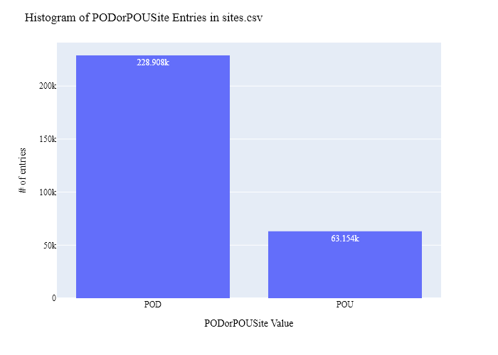
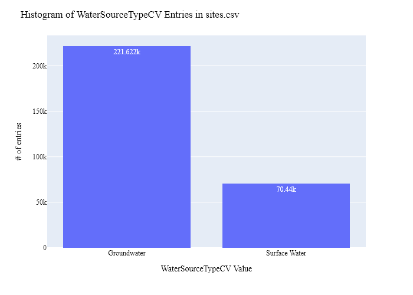
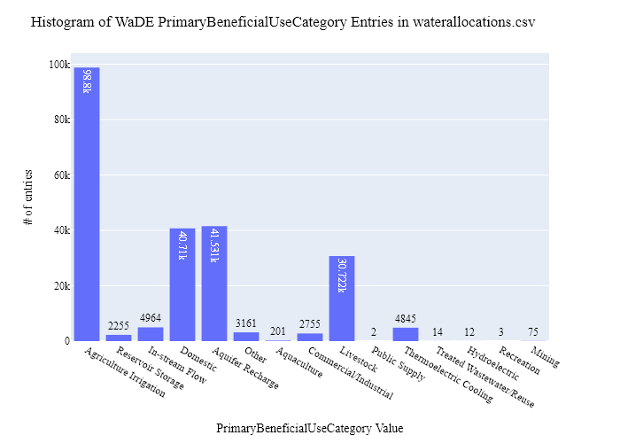
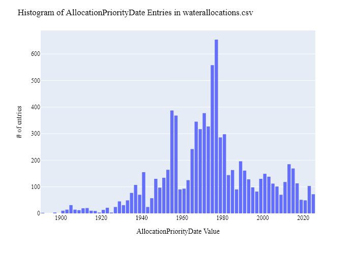
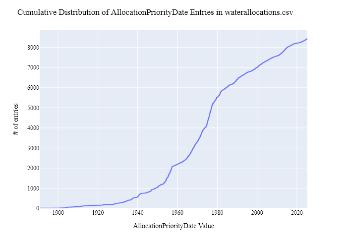
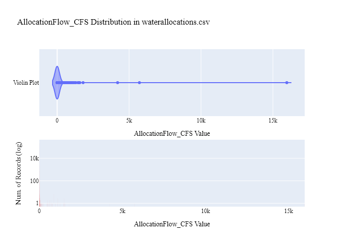
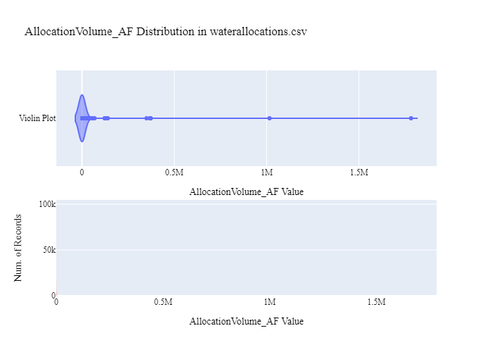
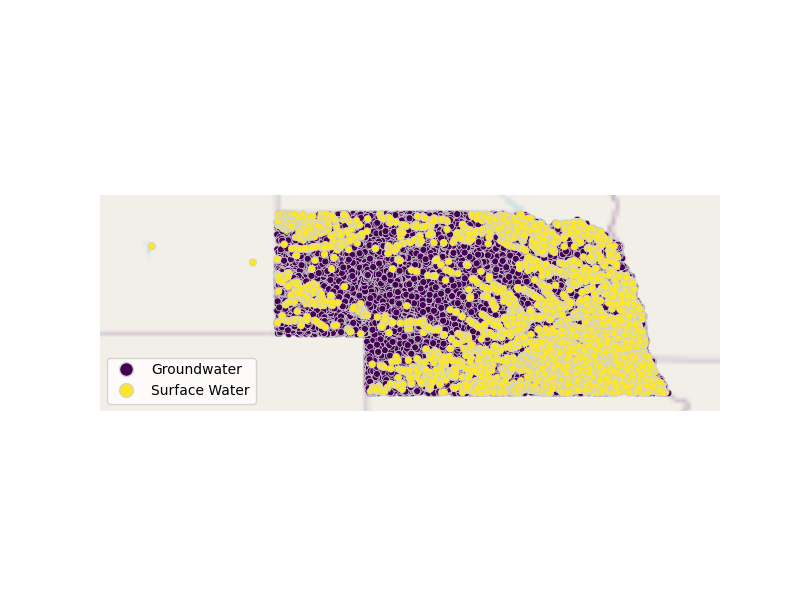
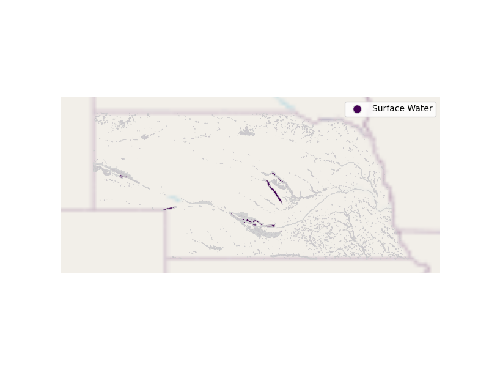

# NEDNR Water Rights (Allocation) Data Preparation for WaDE
This readme details the process that was applied by the staff of the [Western States Water Council (WSWC)](http://wade.westernstateswater.org/) to extracting water rights data made available by the [Nebraska Department of Natural Resources (NEDNR)](https://dnr.nebraska.gov/), for inclusion into the Water Data Exchange (WaDE) project.  WaDE enables states to share data with each other and the public in a more streamlined and consistent way. WaDE is not intended to replace the states data or become the source for that data but rather to enable regional analysis to inform policy decisions and for planning purposes. 

## Overview of Source Data Utilized
The following data was used for water allocations...

Name | Description | Download Link | Metadata Glossary Link
---------- | ---------- | ------------ | ------------
**AllSurfaceWaterPoints** | All surface water rights points of diversion, retrieved via API. | [link](https://NEDNR.nebraska.gov/IwipApi/swagger/ui/index#/) | [link](https://NEDNR.nebraska.gov/media/WaterRights/SurfaceWaterWebSimpleSearch.pdf)
**Surface Water Rights Boundaries 40 Acres External DNR** | Surface Water Right Boundaries Internal layer created by the Nebraska Department of Natural Resources (NeDNR) for external use.  Used as place of use for water right data. | [link](https://www.nebraskamap.gov/datasets/nebraska::surfacewaterrightsboundaries40acresexternal-dnr/about) | [link](https://www.nebraskamap.gov/datasets/nebraska::surfacewaterrightsboundaries40acresexternal-dnr/about)
**Groundwater Wells DNR** | Groundwater well points of diversion, retrieved via API. | [link](https://www.nebraskamap.gov/datasets/nebraska::groundwater-wells-dnr/about) | [link](https://www.nebraskamap.gov/datasets/nebraska::groundwater-wells-dnr/about)

## Storage for WaDE 2.0 Source and Processed Water Data
The 1) raw input data shared by the state / state agency / data provider (excel, csv, shapefiles, PDF, etc), & the 2) csv processed input data ready to load into the WaDE database, can both be found within the WaDE sponsored Google Drive.  Please contact WaDE staff if unavailable or if you have any questions about the data.
- Nebraska Allocation Data: https://drive.google.com/drive/folders/15DalpLwye7ANvmYsw2W3ThGg0v9igUhI?usp=sharing

## Summary of Data Prep
The following text summarizes the process used by the WSWC staff to prepare and share water rights data for inclusion into the Water Data Exchange (WaDE 2.0) project.  For a complete mapping outline, see *NEwr_Allocation Schema Mapping to WaDE.xlsx*.  Several WaDE csv input files will be created in order to extract the water rights data from the above mentioned input.  Each of these WaDE csv input files was created using the [Python](https://www.python.org/) native language, built and ran within [Jupyter Notebooks](https://jupyter.org/) environment.  Those python files include the following...

- **1_NEwr_PreProcessAllocationData.ipynb**: used to pre-processes the native date into a WaDE format friendly format.  All datatype conversions occur here.
- **2_NEwr_CreateWaDEInputFiles.ipynb**: used to create the WaDE input csv files: methods.csv, variables.csv, organizations.csv, watersources.csv, sites.csv, waterallocations.csv, podsitetopousiterelationships.csv.
- **3_NEwr_WaDEDataAssessmentScript.ipynb**: used to evaluate the WaDE input csv files.

***
## Code File: 1_NEwr_PreProcessAllocationData.ipynb
Purpose: Pre-process the input data files and merge them into one master file for simple dataframe creation and extraction.

#### Inputs: 
 - AllSurfaceWaterPoints.csv (from API)
 - BND_SurfaceWaterRights_DNR.shp

#### Outputs:
 - Pwr_neMain.zip.csv

#### Operation and Steps:
- Read in the input files.  Goal will be to create separate sw POD and POU centric dataframes, and gw POD dataframe, then join together for single long output dataframe.
- For sw POD data...
    - We are only interested in data that has a **RightStatus** = "Active" and a **PODStatus** = "Active", drop all other records at this time.
    - Create WaDE *VariableSpecificUUID* based whether input values is CFS or AF from **Units** input.
    - Create WaDE *AllocationFlow_CFS* using CFS values from **Units** and **ProGrant** value.
    - Create WaDE *AllocationVolume_AF* using AF values from **Units** and **ProGrant** value.
    - Create WaDE *WaterAllocationNativeURL* using string *https://nednr.nebraska.gov/dynamic/WaterRights/WaterRights/SWRDetailPage?RightId=* + **RightID** input.
- For sw POU data...
    - Create WaDE *VariableSpecificUUID* based whether input values is CFS or AF from **Units** input.
    - Create WaDE *AllocationFlow_CFS* using CFS values from **Units** and **ProGrant** value.
    - Create WaDE *AllocationVolume_AF* using AF values from **Units** and **ProGrant** value.
    - Create WaDE *WaterAllocationNativeURL* using string *https://nednr.nebraska.gov/dynamic/WaterRights/WaterRights/SWRDetailPage?RightId=* + **RightID** input.
- For gw POD data...
    - Retrieve via AllWells API.  Save to local csv file for future use.
    -  Create WaDE *WaterAllocationNativeURL* using string *https://nednr.nebraska.gov/Dynamic/Wells/Wells/WellDetails?WellId=* + **WellID** input.
- Concatenate temporary sw POD, sw POU, & gw POD dataframes together into single long output dataframe.
- WaDE issue of only allowing nvchar(100) for native beneficial use inputs, however there are two values from the NE water data that are not valid and we will apply a temporarily fix to shorten these values to fit within the WaDE system
    - shorten "Supplemental Cooling (an app. for water for cooling through a system that has a prior app. for cooling)" to "Supplemental Cooling (app for water for cooling through a system that has a prior app for cooling)".
    - shorten "Supplemental Irrigation (irrig. from reservoir on lands also covered by a natural flow appropriation)" to "Supplemental Irrigation (irrig. from reservoir on lands covered by a natural flow appropriation)".
- Remove special characters from water source name and owner names.
- Check data types
- Generate WaDE specific field *WaterSourceNativeID*.
- Generate second output with POU geometry using shapefile.
- Inspect output dataframe for additional errors / datatypes.
- Export output dataframe as new csv file, *Pwr_neMain.zip.csv* with water right data & *P_Geometry.zip* with POU geometry.

***
## Code File: 2_NEwr_CreateWaDEInputFiles.ipynb
Purpose: generate WaDE csv input files (methods.csv, variables.csv, organizations.csv, watersources.csv, sites.csv, waterallocations.csv, podsitetopousiterelationships.csv).

#### Inputs:
- Pwr_neMain.zip

#### Outputs:
- methods.csv  `Create by hand.`
- variables.csv  `Create by hand.`
- organizations.csv  `Create by hand.`
- watersources.csv
- sites.csv
- waterallocations.csv
- podsitetopousiterelationships.csv

## 1) Method Information
Purpose: generate legend of granular methods used on data collection.

#### Operation and Steps:
- Generate single output dataframe *outdf*.
- Populate output dataframe with *WaDE Method* specific columns.
- Assign state info to the *WaDE Method* specific columns (this was hardcoded by hand for simplicity).
- Assign method UUID identifier to each (unique) row.
- Perform error check on output dataframe.
- Export output dataframe *methods.csv*.

#### Sample Output (WARNING: not all fields shown):
MethodUUID  | DataConfidenceValue | DataCoverageValue | DataQualityValueCV | MethodDescription | MethodName | MethodNEMILink | MethodTypeCV | WaDEDataMappingUrl
---------- | ------------ | ------------ | ------------ | ------------ | ------------ | ------------ | ------------ | ------------
NEwr_M1 | Surface Water | Nebraska Water Rights Method | https://dnr.nebraska.gov/surface-water/ownership-preview-groundwater-wells-and-surface-water-rights | Legal Processes | https://github.com/WSWCWaterDataExchange/MappingStatesDataToWaDE2.0/tree/master/Nebraska

## 2) Variables Information
Purpose: generate legend of granular variables specific to each state.

#### Operation and Steps:
- Generate single output dataframe *outdf*.
- Populate output dataframe with *WaDE Variable* specific columns.
- Assign state info to the *WaDE Variable* specific columns (this was hardcoded by hand for simplicity).
- Assign variable UUID identifier to each (unique) row.
- Perform error check on output dataframe.
- Export output dataframe *variables.csv*.

#### Sample Output (WARNING: not all fields shown):
VariableSpecificUUID | AggregationInterval | AggregationIntervalUnitCV | AggregationStatisticCV | AmountUnitCV | VariableCV | VariableSpecificCV 
---------- | ---------- | ------------ | ------------ | ------------ | ------------ | ------------
NEwr_V1	1 | Year | Average | CFS | CFS | 1 | WaterYear | Allocation | Allocation

## 3) Organization Information
Purpose: generate organization directory, including names, email addresses, and website hyperlinks for organization supplying data source.

#### Operation and Steps:
- Generate single output dataframe *outdf*.
- Populate output dataframe with *WaDE Organizations* specific columns.
- Assign state info to the *WaDE Organizations* specific columns (this was hardcoded by hand for simplicity).
- Assign organization UUID identifier to each (unique) row.
- Perform error check on output dataframe.
- Export output dataframe *organizations.csv*.

#### Sample Output (WARNING: not all fields shown):
OrganizationUUID | OrganizationContactEmail | OrganizationContactName | OrganizationName | OrganizationPhoneNumber | OrganizationPurview | OrganizationWebsite | State
---------- | ---------- | ------------ | ------------ | ------------ | ------------ | ------------ | ------------
NEwr_O1 | jennifer.schellpeper@nebraska.gov | Jennifer Schellpepe | Nebraska Department of Natural Resources | 402-471-2899 | Provide Nebraskas citizens and leaders with the data and analyses they need to make wise resource decisions for the benefit of all Nebraskans both now and in the future. | https://dnr.nebraska.gov/contact | NE

## 4) Water Source Information
Purpose: generate a list of water sources specific to a water right.

#### Operation and Steps:
- Read the input file and generate single output dataframe *outdf*.
- Populate output dataframe with *WaDE WaterSources* specific columns.
- Assign agency data info to the *WaDE WaterSources* specific columns.  See *NEwr_Allocation Schema Mapping_WaDE.xlsx* for specific details.  Items of note are as follows...
    - *WaterSourceTypeCV* = **SourceName** input.
    - *WaterSourceNativeID** = not provdied, auto-generate a wade specific value as a temp fix.
    - *WaterSourceTypeCV* = "Surface Water".
- Consolidate output dataframe into water source specific information only by dropping duplicate entries, drop by WaDE specific *WaterSourceTypeCV* fields.
- Assign water source UUID identifier to each (unique) row.
- Perform error check on output dataframe.
- Export output dataframe *WaterSources.csv*.

#### Sample Output (WARNING: not all fields shown):
WaterSourceUUID | WaterQualityIndicatorCV | WaterSourceName | WaterSourceNativeID | WaterSourceTypeCV
---------- | ---------- | ------------ | ------------ | ------------
NEwr_WS1 | Fresh | North Platte River | wadeID1 | Surface Water

Any data fields that are missing required values and dropped from the WaDE-ready dataset are instead saved in a separate csv file (e.g. *watersources_missing.csv*) for review.  This allows for future inspection and ease of inspection on missing items.  Mandatory fields for the water sources include the following...
- WaterSourceUUID
- WaterQualityIndicatorCV
- WaterSourceTypeCV

## 5) Site Information
Purpose: generate a list of sites where water is diverted (also known as Points Of Diversion, PODs).

#### Operation and Steps:
- Read the input file and generate single output dataframe *outdf*.
- Populate output dataframe with *WaDE Site* specific columns.
- Assign state agency info to the *WaDE Site* specific columns.  See *NEwr_Allocation Schema Mapping_WaDE.xlsx* for specific details.  Items of note are as follows...
    - Extract *WaterSourceUUID* from waterSources.csv input csv file. See code for specific implementation of extraction.
    - *HUC12* = **HUC12**, convert to int value to prevent trailing 0s.
    - *Latitude* = **LatitudeDecimalDegrees** for POD, and auto-generated Latitude of POU polygon centroid using EPSG:4326 projection.
    - *Longitude* = **LongitudeDecimalDegrees** for POD, and auto-generated Longitude of POU polygon centroid using EPSG:4326 projection.
    - *SiteNativeID* = "POD" + **PointOfDiversionID** for POD data, not provided for POU so use "POU" + a WaDE auto-generated site native ID using OBJECTID input from shapefile.
- Consolidate output dataframe into site specific information only by dropping duplicate entries, drop by WaDE specific *SiteNativeID*, *SiteTypeCV*, *Longitude*, and *Latitude* fields.
- Assign site UUID identifier to each (unique) row.
- Perform error check on output dataframe.
- Export output dataframe *sites.csv*.

#### Sample Output (WARNING: not all fields shown):
SiteUUID | WaterSourceUUID | CoordinateMethodCV | County | Latitude | Longitude | PODorPOUSite| SiteName | SiteNativeID | SiteTypeCV
---------- | ---------- | ---------- | ------------ | ------------ | ------------ | ------------ | ------------ | ------------ | ------------
NEwr_SPOD10 | NEwr_WSwadeID175 | WaDE Blank | WaDE Blank | WaDE Blank | 4326 | 1.025E+11 | 40.00909598 | -99.40437451 | POD | WaDE Blank | POD10 | WaDE Blank | NE	

Any data fields that are missing required values and dropped from the WaDE-ready dataset are instead saved in a separate csv file (e.g. *sites_missing.csv*) for review.  This allows for future inspection and ease of inspection on missing items.  Mandatory fields for the sites include the following...
- SiteUUID 
- CoordinateMethodCV
- EPSGCodeCV
- SiteName

## 6) AllocationsAmounts Information
Purpose: generate master sheet of water allocations to import into WaDE 2.0.

#### Operation and Steps:
- Read the input files and generate single output dataframe *outdf*.
- Populate output dataframe with *WaDE Water Allocations* specific columns.
- Assign state agency info to the *WaDE Water Allocations* specific columns.  See *NEwr_Allocation Schema Mapping_WaDE.xlsx* for specific details.  Items of note are as follows...
    - Extract *MethodUUID*, *VariableSpecificUUID*, *OrganizationUUID*, & *SiteUUID* from respective input csv files. See code for specific implementation of extraction.
    - *AllocationFlow_CFS* = **ProGrant** input but beware of units given in **Units** input.
    - *AllocationVolume_AF* = **ProGrant** input but beware of units given in **Units** input.
    - *AllocationLegalStatusCV* = **RightStatus** input for POD data.
    - *AllocationNativeID* = **RightID** input.
    - *AllocationOwner* = **FirstName** + **LastName** inputs from POD data, remove any special characters.
    - *AllocationPriorityDate* = **PriorityDate**.
    - *BeneficialUseCategory* = **UseDescription** for POD, & **RightUse** for POU.
- Consolidate output dataframe into water allocations specific information only by grouping entries by *AllocationNativeID* filed.
- Perform error check on output dataframe.
- Export output dataframe *waterallocations.csv*.

#### Sample Output (WARNING: not all fields shown):
AllocationUUID | MethodUUID | OrganizationUUID | SiteUUID | VariableSpecificUUID | AllocationBasisCV | AllocationFlow_CFS | AllocationLegalStatusCV | AllocationNativeID | AllocationOwner | AllocationPriorityDate | AllocationTypeCV | BeneficialUseCategory | OwnerClassificationCV | WaterAllocationNativeURL
---------- | ---------- | ---------- | ---------- | ---------- | ---------- | ---------- | ---------- | ---------- | ---------- | ---------- | ---------- | ---------- | ---------- | ----------
NEwr_WR10 | NEwr_M1 | NEwr_O1 | NEwr_SPOD11055,NEwr_SPOUwade8942 | NEwr_V1 | WaDE Blank | 0.23 | Active | 10 | Byron D Donna L Juma,Rusure | 9/28/1960 | WaDE Blank | Irrigation from Natural Stream | WaDE Blank | https://nednr.nebraska.gov/dynamic/WaterRights/WaterRights/SWRDetailPage?RightId=10

Any data fields that are missing required values and dropped from the WaDE-ready dataset are instead saved in a separate csv file (e.g. *waterallocations_missing.csv*) for review.  This allows for future inspection and ease of inspection on missing items.  Mandatory fields for the water allocations include the following...
- MethodUUID
- VariableSpecificUUID
- OrganizationUUID
- SiteUUID
- AllocationPriorityDate
- BeneficialUseCategory
- AllocationAmount or AllocationMaximum
- DataPublicationDate

### 7) POD Site -To- POU Polygon Relationships
Purpose: generate linking element between POD and POU sites that share the same water right.
Note: podsitetopousiterelationships.csv output only needed if both POD and POU data is present,  `otherwise produces empty file.`

#### Operation and Steps:
- Read the sites.csv & waterallocations.csv input files.
- Create three temporary dataframes: one for waterallocations, & two for site info that will store POD and POU data separately.
- For the temporary POD dataframe...
  - Read in site.csv data from sites.csv with a _PODSiteUUID_ field = POD only.
  - Create _PODSiteUUID_ field = _SiteUUID_.
- For the temporary POU dataframe
  - Read in site.csv data from sites.csv with a _PODSiteUUID_ field = POU only.
  - Create _POUSiteUUID_ field = _SiteUUID_.
- For the temporary waterallocations dataframe, explode _SiteUUID_ field to create unique rows.
- Left-merge POD & POU dataframes to the waterallocations dataframe via _SiteUUID_ field.
- Consolidate waterallocations dataframe by grouping entries by _AllocationNativeID_ filed.
- Explode the consolidated waterallocations dataframe again using the _PODSiteUUID_ field, and again for the _POUSiteUUID_ field to create unique rows.
- Perform error check on waterallocations dataframe (check for NaN values)
- If waterallocations is not empty, export output dataframe _podsitetopousiterelationships.csv_.

***
## Source Data & WaDE Complied Data Assessment
The following info is from a data assessment evaluation of the completed data...

Dataset | Num of Source Entries (rows)
---------- | ---------- 
**AllSurfaceWaterPoints** | 1,401,420
**SurfaceWaterRightsBoundaries40AcresExternal_DNR** | 88,552
**Groundwater Wells DNR** | 261,710

Dataset  | Num of Identified PODs | Num of Identified POUs | Num of Identified Water Right Records
---------- | ------------ | ------------ | ------------
*Compiled WaDE Data** | 228,908 | 63,154 | 230,050

Assessment of Removed Source Records | Count | Action
---------- | ---------- | ----------
Unused WaterSource Record    |18 | removed from watersources.csv input
Unused Site Record                    |46653 | removed from sites.csv input
Incomplete or bad entry for County       |47 | removed from sites.csv input
Incomplete or bad entry for AllocationApplicationDate    |13265 | removed from waterallocations.csv input
Incomplete or bad entry for AllocationPriorityDate         |413 | removed from waterallocations.csv input
Incomplete or bad entry for SiteUUID                       | 64 | removed from waterallocations.csv input
Incomplete or bad entry for AllocationLegalStatusCV         |27 | removed from waterallocations.csv input
Incomplete or bad entry for Volume                          | 4 | removed from waterallocations.csv input

**Figure 1:** Distribution of POD vs POU Sites within the sites.csv

**Figure 2:** Distribution Sites by WaterSourceTypeCV within the sites.csv

**Figure 3:** Distribution of Identified Water Right Records by WaDE Categorized Primary Beneficial Uses within the waterallocations.csv

**Figure 4a:** Range of Priority Date of Identified Water Right Records within the waterallocations.csv

**Figure 4b:** Cumulative distribution of Priority Date of Identified Water Right Records within the waterallocations.csv

**Figure 5:** Distribution & Range of Flow (CFS) of Identified Water Right Records within the waterallocations.csv

**Figure 6:** Distribution & Range of Volume (AF) of Identified Water Right Records within the waterallocations.csv

**Figure 7:** Map of Identified Points within the sites.csv

**Figure 8:** Map of Identified Polygons within the sites.csv

***
## Staff Contributions
Data created here was a contribution between the [Western States Water Council (WSWC)](http://wade.westernstateswater.org/) and the [Nebraska Department of Natural Resources (NEDNR)](https://dnr.nebraska.gov/).

WSWC Staff
- Ryan James <rjames@wswc.utah.gov>

NEDNR Staff
- Jennifer Schellpepe <jennifer.schellpeper@nebraska.gov>
- Kim Menke <kim.menke@nebraska.gov>
- Jesse Bradley <Jesse.Bradley@nebraska.gov>
- Shea Winkler shea.winkler@nebraska.gov
- Dan Kloch <dan.kloch@nebraska.gov>
- Mike Thompson  <mike.thompson@nebraska.gov>
- Ryan Werne <ryan.werner@nebraska.gov>
- B J Green <bj.green@nebraska.gov>