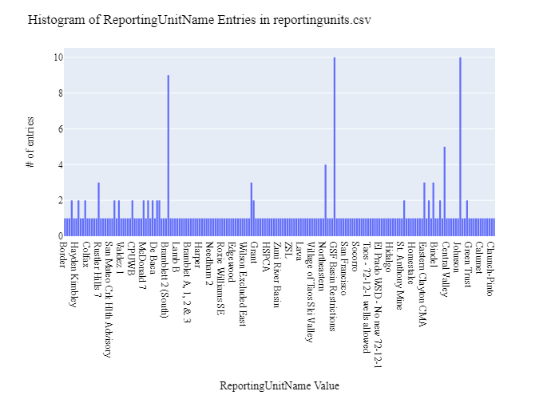
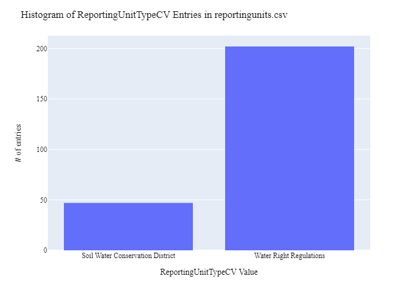
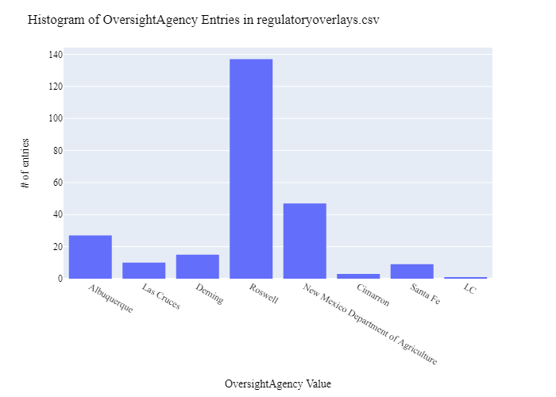
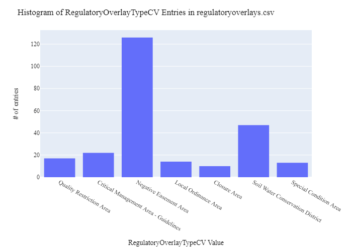
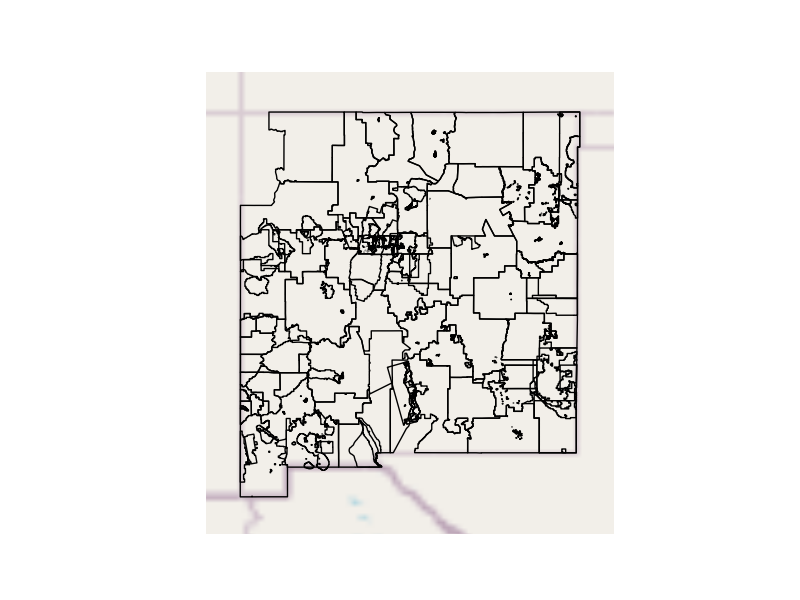
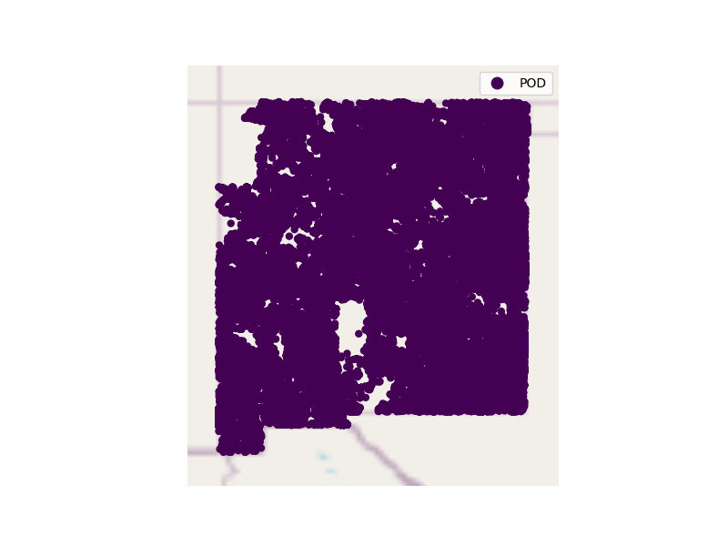

# New Mexico Office of the State Engineer Regulatory Overview Data Preparation for WaDE
This readme details the process that was applied by the staff of the [Western States Water Council (WSWC)](http://wade.westernstateswater.org/) to extracting regulatory overlay area data, made available by the [New Mexico Office of the State Engineer](https://www.ose.state.nm.us/), for inclusion into the Water Data Exchange (WaDE) project.  WaDE enables states to share data with each other and the public in a more streamlined and cost-effective way.

## Overview of Source Data Utilized
The following data was used for water allocations...

Name | Description | Download Link | Metadata Glossary Link
---------- | ---------- | ------------ | ------------
**Water Right Regulations** | Represents areas where restrictions have been applied to water rights. | [link](https://ose.maps.arcgis.com/home/item.html?id=5617df05c3de4ac8b59594bd51cbab94) | [link](https://www.ose.state.nm.us/WR/WRindex.php#:~:text=Anyone%20wanting%20to%20use%20water,you%20to%20make%20an%20appointment)
**Soil Water Conservation Districts** | To represent existing legal descriptions, in digital form, of the Soil and Water Conservation Districts, for the New Mexico Department of Agriculture. | [link](https://hub.arcgis.com/datasets/OSE::nm-soil-water-conservation-districts/explore?location=33.648931%2C-104.473196%2C6.97) | [link](https://nmdeptag.nmsu.edu/statutes-and-rules.html)

Unique files were created to be used as input.  Input files used are as follows...
- WaterRightRegulations.zip
- NMSoilWaterConservationDistricts.zip

## Storage for WaDE 2.0 Source and Processed Water Data
The 1) raw input data shared by the state / state agency / data provider (excel, csv, shapefiles, PDF, etc), & the 2) csv processed input data ready to load into the WaDE database, can both be found within the WaDE sponsored Google Drive.  Please contact WaDE staff if unavailable or if you have any questions about the data.
- New Mexico Office of the State Engineer Regulatory Data: "{https web link address to the WaDE google doc where we are storing the data}"

## Summary of Data Prep
The following text summarizes the process used by the WSWC staff to prepare and share the state's water rights data for inclusion into the Water Data Exchange (WaDE 2.0) project.  For a complete mapping outline, see *NMre_RegulatoryInfo Schema Mapping to WaDE.xlsx*. Several WaDE csv input files will be created in order to extract the water rights data from the above mentioned input.  Each of these WaDE csv input files was created using the [Python](https://www.python.org/) native language, built and ran within [Jupyter Notebooks](https://jupyter.org/) environment.  Those python files include the following...

- **1_NMre_PreProcessRegulatoryData.ipynb**: used to pre-processes the native date into a WaDE format friendly format.  All datatype conversions occur here.
- **2_NMre_CreateWaDEInputFiles.ipynb**: used to create the WaDE input csv files: date.csv, organization.csv, reportingunits.csv, regulatoryoverlays.csv, regulatoryreportingunits.csv, sites.csv, etc.
- **3_NMre_WRSiteRegulatoryID.ipynb**: used to pair regulatory overlay information to water allocation information using an overlay on water allocation site information within the boundaries of the regulation.
- **4_NMre_WaDEDataAssessmentScript.ipynb**: used to evaluate the WaDE input csv files.

***
## Code File: 1_NMre_PreProcessRegulatoryData.ipynb
Purpose: Pre-process the input data files and merge them into one master file for simple dataframe creation and extraction.

#### Inputs: 
- WaterRightRegulations.zip
- NMSoilWaterConservationDistricts.zip

#### Outputs:
- Read in input data, place into temporary separate dataframes.
- For WaterRightRegulations information...
    - Create unique WaDE reporting unit & regulatory overlay ID using **alt_name** input & counter.
    - Extract WaDE key information.
- For NMSoilWaterConservationDistricts information...
    - Create unique WaDE reporting unit & regulatory overlay ID using **NAME** input & counter.
    - Extract WaDE key information.
- Combine extracted WaDE information to single output dataframe.
- Clean output values.
- Export ouput as "Pre_nmMain.zip"
- Extract geometry values from shp files, export as "P_Geometry.zip" file.

#### Operation and Steps:
- "{describe how the data was pre-processed}"
- Export output dataframe as new csv file, *Pre_xxMain.csv* for tabular data and *P_Geometry.csv* for geometry data.

***
## Code File: 2_UTwr_CreateWaDEInputFiles.ipynb
Purpose: generate WaDE csv input files (date.csv, organizations.csv, reportingunits.csv, regulatoryoverlays.csv, regulatoryreportingunits.csv, sites.csv).

#### Inputs:
- Pre_nmMain.zip
- P_Geometry.zip

#### Outputs:
- date.csv  `Create by hand.`
- organizations.csv  `Create by hand.`
- reportingunits.csv
- regulatoryoverlays.csv 
- regulatoryreportingunits.csv

## 1) Date Information
Purpose: generate legend of granular date used on data collection.

#### Operation and Steps:
- Generate single output dataframe *outdf*.
- Populate output dataframe with *WaDE Date* specific columns.
- Assign agency info to the *WaDE Date* specific columns (this was hardcoded by hand for simplicity).
- Perform error check on output dataframe.
- Export output dataframe *methods.csv*.

#### Sample Output (WARNING: not all fields shown):
Date | Year 
---------- | ---------- 
10/16/2023 | 2023

## 2) Organization Information
Purpose: generate organization directory, including names, email addresses, and website hyperlinks for organization supplying data source.

#### Operation and Steps:
- Generate single output dataframe *outdf*.
- Populate output dataframe with *WaDE Organizations* specific columns.
- Assign agency info to the *WaDE Organizations* specific columns (this was hardcoded by hand for simplicity).
- Assign organization UUID identifier to each (unique) row.
- Perform error check on output dataframe.
- Export output dataframe *organizations.csv*.

#### Sample Output (WARNING: not all fields shown):
OrganizationUUID | OrganizationContactEmail | OrganizationContactName | OrganizationName | OrganizationPhoneNumber | OrganizationPurview | OrganizationWebsite | State
---------- | ---------- | ------------ | ------------ | ------------ | ------------ | ------------ | ------------
NMre_O1 | ose.webmaster@state.nm.us | David Hatchner | New Mexico Office of the State Engineer | 505-827-3846 | The New Mexico Office of the State Engineer (OSE) provides this geographic data and any associated metadata as is without warranty of any kind. | https://www.ose.state.nm.us/ | NM

### 3) Reporting Unit Information
Purpose: generate a list of polygon areas associated with the state agency regulatory overlay area data.

#### Operation and Steps:
- Read the input file and generate single output dataframe *outdf*.
- Populate output dataframe with *WaDE ReportingUnits* specific columns.
- Assign state agency data info to the *WaDE ReportingUnits* specific columns.  See *NMre_RegulatoryInfo Schema Mapping to WaDE.xlsx* for specific details.  Items of note are as follows...
    - *ReportingUnitUUID* = NMre_RU + counter
    - *EPSGCodeCV* = 4326.
    - *ReportingUnitName* = **alt_name** input for WRR, **NAME** inputs for SWCD.
    - *ReportingUnitNativeID* = create custom id, see "1_NMre_PreProcessRegulatoryData.ipynb" for details.
    - *ReportingUnitProductVersion* = ""
    - *ReportingUnitTypeCV* = "'Water Right Regulations", "Soil Water Conservation District"
    - *ReportingUnitUpdateDate* = **created_date** input for WRR
    - *StateCV* = "NM"
    - *Geometry* = extract from shp file(s)
- Consolidate output dataframe into site specific information only by dropping duplicate entries, drop by WaDE specific *ReportingUnitName*, *ReportingUnitNativeID* & *ReportingUnitTypeCV* fields.
- Assign reportingunits UUID identifier to each (unique) row.
- Perform error check on output dataframe.
- Export output dataframe *sites.csv*.

#### Sample Output (WARNING: not all fields shown):
ReportingUnitUUID | EPSGCodeCV | ReportingUnitName | ReportingUnitNativeID | ReportingUnitProductVersion | ReportingUnitTypeCV | ReportingUnitUpdateDate | StateCV  
---------- | ---------- | ------------ | ------------ | ------------ | ------------ | ------------ | ------------  
NMre_RU0SWCDb | 4326 | Border | 0SWCDb | - | Soil Water Conservation District | - | NM 

Any data fields that are missing required values and dropped from the WaDE-ready dataset are instead saved in a separate csv file (e.g. *reportingunits_missing.csv*) for review.  This allows for future inspection and ease of inspection on missing items.  Mandatory fields for the reportingunits include the following...
- ReportingUnitUUID
- ReportingUnitName
- ReportingUnitNativeID
- ReportingUnitTypeCV
- StateCV

### 4) Regulatory Overlays Information
Purpose: generate master sheet of regulatory overlay area information to import into WaDE 2.0.

#### Operation and Steps:
- Read the input files and generate single output dataframe *outdf*.
- Populate output dataframe with *WaDE Water Regulatory Overlays* specific columns.
- Assign state agency data info to the *WaDE Water Regulatory Overlays* specific columns.  See *NMre_RegulatoryInfo Schema Mapping to WaDE.xlsx* for specific details.  Items of note are as follows...
    - *RegulatoryOverlayUUID* = NMre_RO + counter
    - *OversightAgency* = **district_office** input for WRR, "New Mexico Department of Agriculture" for SWCD.
    - *RegulatoryDescription* = **estd_purpose** input for WRR, "Conserve and develop the natural resources of the state" for SWCD.
    - *RegulatoryName* = **alt_name** input for WRR, **NAME** input for SWCD.
    - *RegulatoryOverlayNativeID* = create custom id, see "1_NMre_PreProcessRegulatoryData.ipynb" for details.
    - *RegulatoryStatusCV* = "Active"
    - *RegulatoryStatue* = ""
    - *RegulatoryStatuteLink* = "https://www.ose.state.nm.us/WR/WRindex.php#:~:text=Anyone%20wanting%20to%20use%20water,you%20to%20make%20an%20appointment" for WRR, "https://nmdeptag.nmsu.edu/statutes-and-rules.html" for SWCD.
    - *StatutoryEffectiveDate* = **effect_date** input for WRR, "1/1/1978" for SWCD.
    - *RegulatoryOverlayTypeCV* =  **reg_type** input for WRR, "Soil Water Conservation District" for SWCD.
    - *WaterSourceTypeCV* = "Surface and Groundwater" for both.
- Perform error check on output dataframe.
- Export output dataframe *regulatoryoverlays.csv*.

#### Sample Output (WARNING: not all fields shown):
RegulatoryOverlayUUID| OversightAgency | RegulatoryDescription | RegulatoryName | RegulatoryOverlayNativeID | RegulatoryStatusCV | RegulatoryStatute | RegulatoryStatuteLink | StatutoryEffectiveDate | StatutoryEndDate | RegulatoryOverlayTypeCV | WaterSourceTypeCV
---------- | ---------- | ------------ | ------------ | ------------ | ------------ | ------------ | ------------ | ------------ | ------------ | ------------ | ------------
NMre_RO15WRRaass | Albuquerque | To protect human heatlh. | AT&SF ABQ Superfund Site | 15WRRaass | Active | - | https://www.ose.state.nm.us/WR/WRindex.php#:~:text=Anyone%20wanting%20to%20use%20water,you%20to%20make%20an%20appointment	1/29/2009 | - | Quality Restriction Area | Surface and Groundwater

Any data fields that are missing required values and dropped from the WaDE-ready dataset are instead saved in a separate csv file (e.g. *regulatoryoverlays_missing.csv*) for review.  This allows for future inspection and ease of inspection on missing items.  Mandatory fields for the water regulatory overlays include the following...
- RegulatoryOverlayUUID
- OversightAgency
- RegulatoryDescription
- RegulatoryName
- RegulatoryStatusCV
- StatutoryEffectiveDate

### 5) Regulatory Reporting Units Information 
Purpose: generate master sheet of regulatory overlay area information and how it algins with reporting unit area information.

#### Operation and Steps:
- Read the input file and generate single output dataframe *outdf*.
- Populate output dataframe with *WaDE Regulatory Reportingunits* specific columns.
- Assign state agency data info to the *WaDE Regulatory Reportingunits* specific columns.  See *NMre_RegulatoryInfo Schema Mapping to WaDE.xlsx* for specific details.  Items of note are as follows...
    - *DataPublicationDate* = use date of file creation
    - *OrganizationUUID* = pull from organization.csv
    - *RegulatoryOverlayUUID* = pull form regulatoryoverlay.csv
    - *ReportingUnitUUID* = pull from reportingunit.csv
- Consolidate output dataframe into site specific information only by dropping duplicate entries, drop by WaDE specific *ReportingUnitName*, *ReportingUnitNativeID* & *ReportingUnitTypeCV* fields.
- Assign reportingunits UUID identifier to each (unique) row.
- Perform error check on output dataframe.
- Export output dataframe *regulatoryreportingunits.csv*.

#### Sample Output (WARNING: not all fields shown):
DataPublicationDate | OrganizationUUID | RegulatoryOverlayUUID | ReportingUnitUUID 
---------- | ---------- | ------------ | ------------ 
11/30/2023 | NMre_O1 | NMre_RO0WRRmss | NMre_RU0WRRmss

Any data fields that are missing required values and dropped from the WaDE-ready dataset are instead saved in a separate csv file (e.g. *regulatoryreportingunits_missing.csv*) for review.  This allows for future inspection and ease of inspection on missing items.  Mandatory fields for the regulatory reportingunits include the following...
- DataPublicationDate
- OrganizationUUID
- RegulatoryOverlayUUID
- ReportingUnitUUID

***
## Source Data & WaDE Complied Data Assessment
The following info is from a data assessment evaluation of the completed data...

Dataset | Num of Source Entries (rows) 
---------- | ----------
**WaterRightRegulations** | 203
**NMSoilWaterConservationDistricts** | 47

Dataset | Num of Identified Reporting Units | Num of Identified Regulatory Overlays
---------- | ---------- | ------------
**Compiled WaDE Data** | 249 | 249

Assessment of Removed Source Records | Count | Action
---------- | ---------- | ----------
Incomplete or bad entry for StatutoryEffectiveDate | 1 | Removed from WaDE

**Figure 1:** Distribution of Reporting Unit Name within reportingunits.csv

**Figure 2:** Distribution of Reporting Unit Type within reportingunits.csv

**Figure 3:** Distribution of Oversight Agency within the regulatoryoverlays.csv

**Figure 4:** Distribution of Regulatory Overlay Type within the regulatoryoverlays.csv

**Figure 5:** Map of Regulatory Areas (i.e., Reporting Unit)

**Figure 6:** Map of identified water rights within the Regulatory Areas Polygons within the sites.csv

***
## Staff Contributions
Data created here was a contribution between the [Western States Water Council (WSWC)](http://wade.westernstateswater.org/) and the [New Mexico Office of the State Engineer](https://www.ose.state.nm.us/).

WSWC Staff
- Adel Abdallah (Project Manager) <adelabdallah@wswc.utah.gov>
- Ryan James (Data Analysis) <rjames@wswc.utah.gov>

New Mexico Office of the State Engineer Staff
- Julie Valdez <julie.valdez@state.nm.us >
