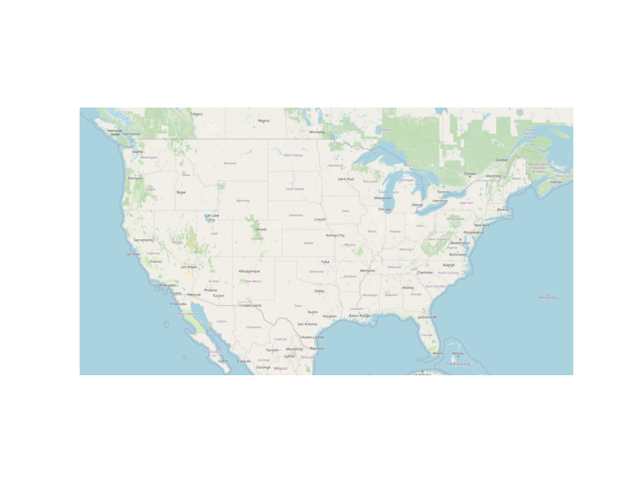

# NMOSE Water Rights (Allocation) Data Preparation for WaDE
This readme details the process that was applied by the staff of the [Western States Water Council (WSWC)](http://wade.westernstateswater.org/) to extracting water rights data made available by the [New Mexico Office of the State Engineer (NMOSE)](https://www.ose.state.nm.us/), for inclusion into the Water Data Exchange (WaDE) project.  WaDE enables states to share data with each other and the public in a more streamlined and consistent way. WaDE is not intended to replace the states data or become the source for that data but rather to enable regional analysis to inform policy decisions and for planning purposes. 

## Overview of Source Data Utilized
The following data was used for water allocations...

Name | Description | Download Link | Metadata Glossary Link
---------- | ---------- | ------------ | ------------
**OSE PODs** | Point of diversion water right sites. | [link](https://geospatialdata-ose.opendata.arcgis.com/datasets/OSE::ose-pods/about) | [link](https://geospatialdata-ose.opendata.arcgis.com/documents/5cc5f222d5454797822964c14526a70d/explore)

The following unique source files were used as inputs...
 - OSE_PODst.zip

## Storage for WaDE 2.0 Source and Processed Water Data
The 1) raw input data shared by the state / state agency / data provider (excel, csv, shapefiles, PDF, etc), 2) WaDE input csv processed data files ready to load into the WaDE database, & 3) data assessment figures and reports overviewing the native state data and which records could not be used, can all be found within the WaDE sponsored Google Drive.  Please contact WaDE staff if unavailable or if you have any questions about the data.
- [WaDE New Mexico Allocation Data (link)](https://drive.google.com/drive/folders/171lNosVUaf6yXxUL3d7lrRAYZSYaw22s?usp=sharing)

## Summary of Data Prep
The following text summarizes the process used by the WSWC staff to prepare and share water rights data for inclusion into the Water Data Exchange (WaDE 2.0) project.  For a complete mapping outline, see *NMwr_Allocation Schema Mapping to WaDE.xlsx*.  Several WaDE csv input files will be created in order to extract the water rights data from the above mentioned input.  Each of these WaDE csv input files was created using the [Python](https://www.python.org/) native language, built and ran within [Jupyter Notebooks](https://jupyter.org/) environment.  Those python files include the following...

- **1_NMwr_PreProcessAllocationData.ipynb**: used to pre-processes the native date into a WaDE format friendly format.  All datatype conversions occur here.
- **2_NMwr_CreateWaDEInputFiles.ipynb**: used to create the WaDE input csv files: methods.csv, variables.csv, organizations.csv, watersources.csv, sites.csv, waterallocations.csv, podsitetopousiterelationships.csv.
- **3_NMwr_WaDEDataAssessmentScript.ipynb**: used to evaluate the WaDE input csv files.

***
## Code File: 1_NMwr_PreProcessAllocationData.ipynb
Purpose: pre-process the native input data files and merge them into one main input file for simple dataframe creation and extraction.

#### Inputs: 
 -  OSE_PODst.zip

#### Outputs:
 - Pwr_NMMain.zip

#### Operation and Steps:
- Read in the input files & create temporary dataframes.
- Create longitude & latitude values from the existing **easting** & **northing** inputs using projection of init="epsg:26913", proj="utm", zone=13.
- If **ditch_name**  input is blank, replace with "Unspecified".
- Assign "Groundwater" text to **grnd_wtr_s** if not blank, & "Surface Water" text to **surface_co** input if value is not blank & > 0.  For water source type...
  - if both values are are not blank, assign "Surface and Groundwater" text.
  - if groundwater is not blank, assign "Groundwater" text.
  - if groundwater is blank but surface water is not, assign "Surface Water" text.
  - if both values are blank, assign "Unspecified" text.
- Translate **surface_co** input from number code to name using provided dictionary.
- Concatenate **own_fname** & **own_lname** fields together to create an owner name.
- Translate **use_** input from abbreviation to descriptive text of the beneficial using provided dictionary.
- Translate **status** input from abbreviation to descriptive text of the legal status using provided dictionary.
- Generate WaDE specific field *WaterSourceNativeID* from WaDE *WaterSourceName* & *WaterSourceTypeCV* fields.  Used to identify unique sources of water.
- Generate WaDE specific field *SiteNativeID* from WaDE *Latitude*, *Longitude*, & *SiteName* fields.  Used to identify unique sites.
- Inspect output dataframe for additional errors / datatypes.
- Export output dataframe as new csv file, *Pwr_NMMain.zip*.

***
## Code File: 2_NMwr_CreateWaDEInputFiles.ipynb
Purpose: generate WaDE csv input files (methods.csv, variables.csv, organizations.csv, watersources.csv, sites.csv, waterallocations.csv, podsitetopousiterelationships.csv).

#### Inputs:
- Pwr_NMMain.zip

#### Outputs:
- methods.csv  `Create by hand.`
- variables.csv  `Create by hand.`
- organizations.csv  `Create by hand.`
- watersources.csv
- sites.csv
- waterallocations.csv
- podsitetopousiterelationships.csv

## 1) Method Information
Purpose: generate legend of granular methods used on data collection.

#### Operation and Steps:
- Generate single output dataframe *outdf*.
- Populate output dataframe with *WaDE Method* specific columns.
- Assign **NMOSE** info to the *WaDE Method* specific columns (this was hardcoded by hand for simplicity).
- Assign method UUID identifier to each (unique) row.
- Perform error check on output dataframe.
- Export output dataframe *methods.csv*.

#### Sample Output (WARNING: not all fields shown):
MethodUUID | ApplicableResourceTypeCV | MethodTypeCV
---------- | ---------- | ------------
NMwr_M1 | Surface Water and Groundwater | Allocation

## 2) Variables Information
Purpose: generate legend of granular variables specific to each state.

#### Operation and Steps:
- Generate single output dataframe *outdf*.
- Populate output dataframe with *WaDE Variable* specific columns.
- Assign **NMOSE** info to the *WaDE Variable* specific columns (this was hardcoded by hand for simplicity).
- Assign variable UUID identifier to each (unique) row.
- Perform error check on output dataframe.
- Export output dataframe *variables.csv*.

#### Sample Output (WARNING: not all fields shown):
VariableSpecificUUID | AggregationIntervalUnitCV | AggregationStatisticCV | AmountUnitCV
---------- | ---------- | ------------ | ------------
NMwr_V1 | 1 | Year | AF

## 3) Organization Information
Purpose: generate organization directory, including names, email addresses, and website hyperlinks for organization supplying data source.

#### Operation and Steps:
- Generate single output dataframe *outdf*.
- Populate output dataframe with *WaDE Organizations* specific columns.
- Assign **NMOSE** info to the *WaDE Organizations* specific columns (this was hardcoded by hand for simplicity).
- Assign organization UUID identifier to each (unique) row.
- Perform error check on output dataframe.
- Export output dataframe *organizations.csv*.

#### Sample Output (WARNING: not all fields shown):
OrganizationUUID | OrganizationName | OrganizationContactName | OrganizationWebsite
---------- | ---------- | ------------ | ------------
NMwr_O1 | New Mexico Office of the State Engineer | David Hatchner (GIS Manager) | https://www.ose.state.nm.us/

## 4) Water Source Information
Purpose: generate a list of water sources information.

#### Operation and Steps:
- Read the input file and generate single output dataframe *outdf*.
- Populate output dataframe with *WaDE WaterSources* specific columns.
- Assign **NMOSE** info to the *WaDE WaterSources* specific columns.  See *NMwr_Allocation Schema Mapping to WaDE.xlsx* for specific details.  Items of note are as follows...
    - *WaterSourceName* = translated from **surface_co**, see *1_NMwr_PreProcessAllocationData.ipynb* for specifics. 
    - *WaterSourceTypeCV* = generated list of sources from **SOURCE_TYPE**, see *1_NMwr_PreProcessAllocationData.ipynb* for specifics.
    - *WaterSourceNativeID* = see *1_NMwr_PreProcessAllocationData.ipynb* for specifics.
- Consolidate output dataframe into water source specific information only by dropping duplicate entries, drop by WaDE specific *WaterSourceName* & *WaterSourceTypeCV* fields.
- Assign water source UUID identifier to each (unique) row.
- Perform error check on output dataframe.
- Export output dataframe *WaterSources.csv*.

#### Sample Output (WARNING: not all fields shown):
WaterSourceUUID | WaterQualityIndicatorCV | WaterSourceName | WaterSourceNativeID | WaterSourceTypeCV
---------- | ---------- | ------------ | ------------ | ------------
NMwr_WS1 | WaDE Unspecified | WaDE Unspecified | WaDENM_WS1 | Groundwater

Any data fields that are missing required values and dropped from the WaDE-ready dataset are instead saved in a separate csv file (e.g. *watersources_missing.csv*) for review.  This allows for future inspection and ease of inspection on missing items.  Mandatory fields for the water sources include the following...
- WaterSourceUUID
- WaterQualityIndicatorCV
- WaterSourceTypeCV

## 5) Site Information
Purpose: generate a list of sites information.

#### Operation and Steps:
- Read the input file and generate single output dataframe *outdf*.
- Populate output dataframe with *WaDE Site* specific columns.
- Assign **NMOSE** info to the *WaDE Site* specific columns.  See *NMwr_Allocation Schema Mapping to WaDE.xlsx* for specific details.  Items of note are as follows...
    - Extract *WaterSourceUUID* from waterSources.csv input csv file. See code for specific implementation of extraction.
    - *County* = **county** input.
    - *Latitude* = created from **easting** & **northing** inputs, see *1_NMwr_PreProcessAllocationData.ipynb* for specifics.
    - *Longitude* = created from **easting** & **northing** inputs, see *1_NMwr_PreProcessAllocationData.ipynb* for specifics.
    - *SiteName* = **ditch_name** inputs, see *1_NMwr_PreProcessAllocationData.ipynb* for specifics.
    - *SiteNativeID* = **pod_file** input.
    - *SiteTypeCV* = "Unspecified".
- Consolidate output dataframe into site specific information only by dropping duplicate entries, drop by WaDE specific *SiteNativeID*, *SiteName*, *SiteTypeCV*, *Longitude* & *Latitude* fields.
- Assign site UUID identifier to each (unique) row.
- Perform error check on output dataframe.
- Export output dataframe *sites.csv*.

#### Sample Output (WARNING: not all fields shown):
SiteUUID | WaterSourceUUID | CoordinateMethodCV | Latitude | Longitude | SiteName
---------- | ---------- | ---------- | ------------ | ------------ | ------------
NMwr_S1 | NMwr_WS1 | WaDE Unspecified | 35.3044225068985 | -108.145455321569 | WaDE Unspecified

Any data fields that are missing required values and dropped from the WaDE-ready dataset are instead saved in a separate csv file (e.g. *sites_missing.csv*) for review.  This allows for future inspection and ease of inspection on missing items.  Mandatory fields for the sites include the following...
- SiteUUID 
- CoordinateMethodCV
- EPSGCodeCV
- SiteName

## 6) AllocationsAmounts Information
Purpose: generate sheet of water allocations records to import into WaDE 2.0.

#### Operation and Steps:
- Read the input files and generate single output dataframe *outdf*.
- Populate output dataframe with *WaDE Water Allocations* specific columns.
- Assign **NMOSE** info to the *WaDE Water Allocations* specific columns.  See *NMwr_Allocation Schema Mapping to WaDE.xlsx* for specific details.  Items of note are as follows...
    - Extract *MethodUUID*, *VariableSpecificUUID*, *OrganizationUUID*, & *SiteUUID* from respective input csv files. See code for specific implementation of extraction.
    - *AllocationFlow_CFS* = empty.
    - *AllocationLegalStatusCV* = **status** input, see *1_NMwr_PreProcessAllocationData.ipynb* for specifics.
    - *AllocationNativeID* = **db_file** input.
    - *AllocationOwner* = **own_fname** & **own_lname** inputs, see *1_NMwr_PreProcessAllocationData.ipynb* for specifics.
    - *AllocationPriorityDate* = leave blank, not provided.
    - *AllocationVolume_AF* == **total_div** input, as float.
    - *BeneficialUseCategory* = **use_** input, , see *1_NMwr_PreProcessAllocationData.ipynb* for specifics.
    - *WaterAllocationNativeURL* = **nmwrrs_wrs**
- Consolidate output dataframe into water allocations specific information only by grouping entries by *AllocationNativeID* filed.
- Perform error check on output dataframe.
- Export output dataframe *waterallocations.csv*.

#### Sample Output (WARNING: not all fields shown):
AllocationNativeID | AllocationVolume_AF | AllocationLegalStatusCV | BeneficialUseCategory
---------- | ---------- | ------------ | ------------
NMwr_WR1 | 1 | Permit | WaDE Unspecified

Any data fields that are missing required values and dropped from the WaDE-ready dataset are instead saved in a separate csv file (e.g. *waterallocations_missing.csv*) for review.  This allows for future inspection and ease of inspection on missing items.  Mandatory fields for the water allocations include the following...
- MethodUUID
- VariableSpecificUUID
- OrganizationUUID
- SiteUUID
- AllocationPriorityDate
- BeneficialUseCategory
- AllocationAmount or AllocationMaximum
- DataPublicationDate

### 7) POD Site -To- POU Polygon Relationships
Purpose: generate linking element between POD and POU sites that share the same water right.
Note: podsitetopousiterelationships.csv output only needed if both POD and POU data is present,  `otherwise produces empty file.`

#### Operation and Steps:
- Read the sites.csv & waterallocations.csv input files.
- Create three temporary dataframes: one for waterallocations, & two for site info that will store POD and POU data separately.
- For the temporary POD dataframe...
  - Read in site.csv data from sites.csv with a _PODSiteUUID_ field = POD only.
  - Create _PODSiteUUID_ field = _SiteUUID_.
- For the temporary POU dataframe
  - Read in site.csv data from sites.csv with a _PODSiteUUID_ field = POU only.
  - Create _POUSiteUUID_ field = _SiteUUID_.
- For the temporary waterallocations dataframe, explode _SiteUUID_ field to create unique rows.
- Left-merge POD & POU dataframes to the waterallocations dataframe via _SiteUUID_ field.
- Consolidate waterallocations dataframe by grouping entries by _AllocationNativeID_ filed.
- Explode the consolidated waterallocations dataframe again using the _PODSiteUUID_ field, and again for the _POUSiteUUID_ field to create unique rows.
- Perform error check on waterallocations dataframe (check for NaN values)
- If waterallocations is not empty, export output dataframe _podsitetopousiterelationships.csv_.

***
## Source Data & WaDE Complied Data Assessment
The following info is from a data assessment evaluation of the completed data...

Dataset | Num of Source Entries (rows) | Num of Identified PODs | Num of Identified POUs | Num of Identified Water Right Records
---------- | ---------- | ------------ | ------------ | ------------
OSE PODs | 265,651 | N/A | N/A | N/A
WestDAAT | N/A | 265,649 | 0 | 217,110

Assessment of Removed Source Records | Count | Action
---------- | ---------- | ----------
Incomplete or bad entry for Latitude | 1 | Removed from WaDE

**Figure 1:** Distribution of POD vs POU Sites within the sites.csv

**Figure 2:** Distribution Sites by WaterSourceTypeCV within the sites.csv

**Figure 3:** Distribution of Identified Water Right Records by WaDE Categorized Primary Beneficial Uses within the waterallocations.csv

**Figure 4:** Range of Priority Date of Identified Water Right Records within the waterallocations.csv

**Figure 5:** Distribution & Range of Flow (CFS) of Identified Water Right Records within the waterallocations.csv

**Figure 6:** Distribution & Range of Volume (AF) of Identified Water Right Records within the waterallocations.csv

**Figure 7:** Map of Identified Points within the sites.csv

**Figure 8:** Map of Identified Polygons within the sites.csv

***
## Staff Contributions
Data created here was a contribution between the [Western States Water Council (WSWC)](http://wade.westernstateswater.org/) and the [Nevada Division of Water Resources [New Mexico Office of the State Engineer (NMOSE)](https://www.ose.state.nm.us/).

WSWC Staff
- Adel Abdallah <adelabdallah@wswc.utah.gov>
- Ryan James <rjames@wswc.utah.gov>

NMOSE Staff
- David Hatchner (GIS Manager)<ose.webmaster@state.nm.us>
