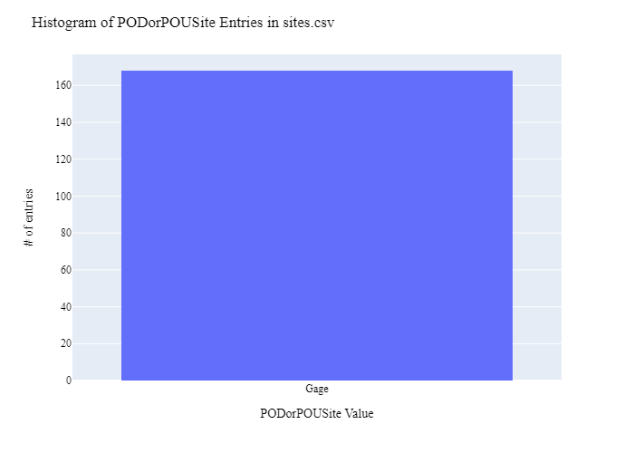
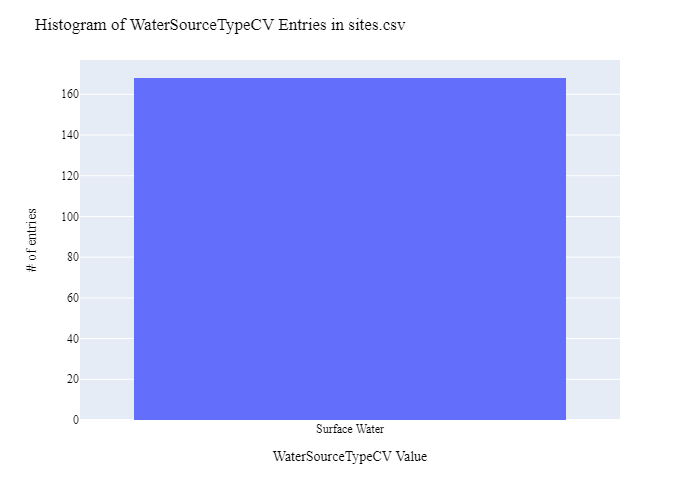
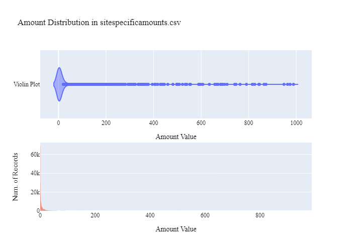
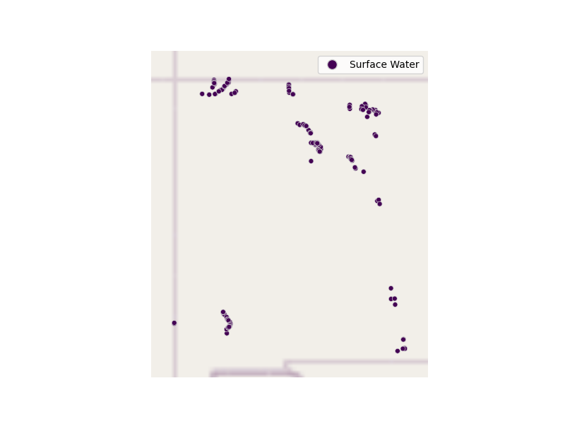

# New Mexico Office of the State Engineer (OSE) Stream and Reservoir Observation Site Data Preparation for WaDE
This readme details the process that was applied by the staff of the [Western States Water Council (WSWC)](http://wade.westernstateswater.org/) to extracting stream and reservoir observation site time series water data made available by the [New Mexico Office of the State Engineer (OSE)](https://www.ose.state.nm.us/), for inclusion into the Water Data Exchange (WaDE) project.  WaDE enables states to share data with each other and the public in a more streamlined and consistent way. WaDE is not intended to replace the states data or become the source for that data but rather to enable regional analysis to inform policy decisions and for planning purposes. 

## Overview of Source Data Utilized
The following data was used for water allocations...

Name | Description | Download Link | Metadata Glossary Link
---------- | ---------- | ------------ | ------------
**OSERealTimeMeters** | Site info for real-time measurement meters for the State of New Mexico under the responsibility of the Office of the State Engineer. | [link](https://services2.arcgis.com/qXZbWTdPDbTjl7Dy/arcgis/rest/services/OSE_RTMs/FeatureServer) | Not provided
**Reak-Time Water Measurement Info** | TimeseriesSite info for real-time measurement meters for the State of New Mexico under the responsibility of the Office of the State Engineer. | [link](http://meas.ose.state.nm.us/) | Not provided

Input files used are as follows...
- OSERealTimeMeters.zip, a modified version of the OSERealTimeMeters (see 1_NMssro_PreProcessReservoirObservationSites.ipunb below for specifics)
- timeSeriesInfo.zip, (see 1_NMssro_PreProcessReservoirObservationSites.ipunb below for specifics on how to gather)
 

## Storage for WaDE 2.0 Source and Processed Water Data
The 1) raw input data shared by the state / state agency / data provider (excel, csv, shapefiles, PDF, etc), & the 2) csv processed input data ready to load into the WaDE database, can both be found within the WaDE sponsored Google Drive.  Please contact WaDE staff if unavailable or if you have any questions about the data.
- New Mexico Office of the State Engineer (OSE) Site Specific Reservoir and Gage Data: [link](https://drive.google.com/open?id=1Xsa58Zt1NyE8jWkSiDCRI7chcSqAruz8&usp=drive_copy)

## Summary of Data Prep
The following text summarizes the process used by the WSWC staff to prepare and share New Mexico Office of the State Engineer (OSE)'s water rights & water use data for inclusion into the Water Data Exchange (WaDE 2.0) project.  For a complete mapping outline, see *NMssro_ReservoirsObservationSitesSchema Mapping to WaDE.xlsx*.  Several WaDE csv input files will be created in order to extract the New Mexico Office of the State Engineer (OSE)'s water rights & water use data from the above mentioned input.  Each of these WaDE csv input files was created using the [Python](https://www.python.org/) native language, built and ran within [Jupyter Notebooks](https://jupyter.org/) environment.  Those python files include the following...

- **1_NMssro_PreProcessReservoirObservationSites.ipynb**: used to pre-processes the native date into a WaDE format friendly format.  All datatype conversions occur here.
- **2_NMssro_CreateWaDEInputFiles.ipynb**: used to create the WaDE input csv files: methods.csv, variables.csv, organizations.csv, watersources.csv, sites.csv, sitespecificamounts.csv.
- **3_NMssro_WaDEDataAssessmentScript.ipynb**: used to evaluate the WaDE input csv files.

***
### 0) Code File: 1_NMssro_PreProcessReservoirObservationSites.ipynb
Purpose: Pre-process the state agency's input data files and merge them into one master file for simple dataframe creation and extraction.

#### Inputs: 
- OSERealTimeMeters.zip
- timeSeriesInfo.zip

#### Outputs:
 - Pssro_nmMain.zip

#### Operation and Steps:
- Download data for the OSERealTimeMeters site information. Data is in need of repair and the following changes were made...
    - We only want to work with records whose **Jurisdiction** input = "OSE".
    - Issue of duplicate **Station_ID** inputs with conflicting names and location information.  For solution, removed duplicate records that did not have a **data_url** input.
- Load site info into temporary dataframe.
- For retreiving time series information.
    - Retrieve data from an API using the following info: start date = 01/01/2011, end date = 01/24/2024, dischargeData = davg for daily average cfs, format = csv, and **Station_ID** inputs from site info
    - Load strait into DataFrame. Ex API string: "http://meas.ose.state.nm.us/ReportProxy?id=" + **Station_ID** + "&type=S&sDate=01/01/2011&eDate=01/24/2024&dischargeData=davg&rptFormat=CSV&sort=asc"
    - Merge time series info to site info via **Station_ID** input.
- Extract WaDE key inputs from  data.
- Inspect for errors / clean up data types and outputs.
- Export data as "Pssro_nmMain.zip".

***
## Code File: 2_NMssro_CreateWaDEInputFiles.ipynb
Purpose: generate WaDE csv input files (methods.csv, variables.csv, organizations.csv, watersources.csv, sites.csv, sitespecificamounts.csv).

#### Inputs:
- Pssro_nmMain.zip

#### Outputs:
- methods.csv  `Create by hand.`
- variables.csv  `Create by hand.`
- organizations.csv  `Create by hand.`
- watersources.csv
- sites.csv
- sitespecificamounts.csv

## 1) Method Information
Purpose: generate legend of granular methods used on data collection.

#### Operation and Steps:
- Generate single output dataframe *outdf*.
- Populate output dataframe with *WaDE Method* specific columns.
- Assign state info to the *WaDE Method* specific columns (this was hardcoded by hand for simplicity).
- Assign method UUID identifier to each (unique) row.
- Perform error check on output dataframe.
- Export output dataframe *methods.csv*.

#### Sample Output (WARNING: not all fields shown):
|    | MethodUUID   | ApplicableResourceTypeCV      | DataConfidenceValue   | DataCoverageValue   | DataQualityValueCV   | MethodName                                     | MethodNEMILink                       | MethodTypeCV   | WaDEDataMappingUrl                                                                                                      | Unnamed: 10   |
|---:|:-------------|:------------------------------|:----------------------|:--------------------|:---------------------|:-----------------------------------------------|:-------------------------------------|:---------------|:------------------------------------------------------------------------------------------------------------------------|:--------------|
|  0 | NMssro_M1    | Surface Water and Groundwater |                       |                     |                      | Real-Time Water Measurement Information System | http://meas.ose.state.nm.us/home.jsp | Measured       | https://github.com/WSWCWaterDataExchange/MappingStatesDataToWaDE2.0/tree/master/NewMexico/SS_ReservoirsObservationSites |               |

## 2) Variables Information
Purpose: generate legend of granular variables specific to each state.

#### Operation and Steps:
- Generate single output dataframe *outdf*.
- Populate output dataframe with *WaDE Variable* specific columns.
- Assign state info to the *WaDE Variable* specific columns (this was hardcoded by hand for simplicity).
- Assign variable UUID identifier to each (unique) row.
- Perform error check on output dataframe.
- Export output dataframe *variables.csv*.

#### Sample Output (WARNING: not all fields shown):
|    | VariableSpecificUUID   |   AggregationInterval | AggregationIntervalUnitCV   | AggregationStatisticCV   | AmountUnitCV   | MaximumAmountUnitCV   |   ReportYearStartMonth | ReportYearTypeCV   | VariableCV   | VariableSpecificCV                        |
|---:|:-----------------------|----------------------:|:----------------------------|:-------------------------|:---------------|:----------------------|-----------------------:|:-------------------|:-------------|:------------------------------------------|
|  0 | NMssro_V1              |                     1 | Daily                       | Average                  | CFS            | CFS                   |                      1 | CalendarYear       | Discharge    | Discharge_Daily_Stream Gage_Surface Water |

## 3) Organization  Information
Purpose: generate organization directory, including names, email addresses, and website hyperlinks for organization supplying data source.

#### Operation and Steps:
- Generate single output dataframe *outdf*.
- Populate output dataframe with *WaDE Organizations* specific columns.
- Assign state info to the *WaDE Organizations* specific columns (this was hardcoded by hand for simplicity).
- Assign organization UUID identifier to each (unique) row.
- Perform error check on output dataframe.
- Export output dataframe *organizations.csv*.

#### Sample Output (WARNING: not all fields shown):
|    | OrganizationUUID   | OrganizationContactEmail   | OrganizationContactName      | OrganizationName                        | OrganizationPhoneNumber   | OrganizationPurview                                                                                                                             | OrganizationWebsite          | State   |
|---:|:-------------------|:---------------------------|:-----------------------------|:----------------------------------------|:--------------------------|:------------------------------------------------------------------------------------------------------------------------------------------------|:-----------------------------|:--------|
|  0 | NMssro_O1          | ose.webmaster@state.nm.us  | David Hatchner (GIS Manager) | New Mexico Office of the State Engineer | 505-827-3846              | The New Mexico Office of the State Engineer (OSE) provides this geographic data and any associated metadata as is without warranty of any kind. | https://www.ose.state.nm.us/ | NM      |

## 4) Water Source Information
Purpose: generate a list of water sources specific to a water right.

#### Operation and Steps:
- Read the input file and generate single output dataframe *outdf*.
- Populate output dataframe with *WaDE WaterSources* specific columns.
- Assign agency info to the *WaDE WaterSources* specific columns.  See *NMssro_ReservoirsObservationSitesSchema Mapping to WaDE.xlsx* for specific details.  Items of note are as follows...
    - *WaterSourceUUID* = "NMssro_WS" + counter value for each unique water source record.
    - *WaterQualityIndicatorCV* = "Fresh"
    - *WaterSourceName* = ""
    - *WaterSourceNativeID* = ""
    - *WaterSourceTypeCV* = **SW_or_GW** input. Convert abbreviation to "Surface Water" or "Groundwater".
- Consolidate output dataframe into water source specific information only by dropping duplicate entries, drop by WaDE specific *WaterSourceName* & *WaterSourceTypeCV* fields.
- Assign water source UUID identifier to each (unique) row.
- Perform error check on output dataframe.
- Export output dataframe *WaterSources.csv*.

#### Sample Output (WARNING: not all fields shown):
|    | WaterSourceUUID   | Geometry   | GNISFeatureNameCV   | WaterQualityIndicatorCV   | WaterSourceName   | WaterSourceNativeID   | WaterSourceTypeCV   |
|---:|:------------------|:-----------|:--------------------|:--------------------------|:------------------|:----------------------|:--------------------|
|  0 | NMssro_WSwadeId1  |            |                     | Fresh                     | WaDE Blank        | wadeId1               | Surface Water       |

Any data fields that are missing required values and dropped from the WaDE-ready dataset are instead saved in a separate csv file (e.g. *watersources_missing.csv*) for review.  This allows for future inspection and ease of inspection on missing items.  Mandatory fields for the water sources include the following...
- WaterSourceUUID
- WaterQualityIndicatorCV
- WaterSourceTypeCV

## 5) Site Information
Purpose: generate a list of sites information.

#### Operation and Steps:
- Read the input file and generate single output dataframe *outdf*.
- Populate output dataframe with *WaDE Site* specific columns.
- Assign agency info to the *WaDE Site* specific columns.  See *NMssro_ReservoirsObservationSitesSchema Mapping to WaDE.xlsx* for specific details.  Items of note are as follows...
    - *SiteUUID* = "NMssro_S" + counter value for each unique site record.
    - *WaterSourceUUIDs* = Extract *WaterSourceUUID* from waterSources.csv input csv file. See code for specific implementation of extraction.
    - *CoordinateAccuracy* = ""
    - *CoordinateMethodCV* = ""
    - *Country* = ""
    - *EPSGCodeCV* = "4326".
    - *Geometry* = ""
    - *GNISCodeCV* = ""
    - *HUC12* = ""
    - *HUC8* = ""
    - *Latitude* = **wade_lat** input.  A WaDE specific latitude value for WGS 1984 projections. 
    - *Longitude* = **wade_long** input.  A WaDE specific longitude value for WGS 1984 projections. 
    - *NHDNetworkStatusCV* = ""
    - *NHDProductCV* = ""
    - *PODorPOUSite* = "Gage"
    - *SiteName* = **Gauge_name** input.
    - *SiteNativeID* = **Station_ID** input.
    - *SiteTypeCV* = "Stream Gage".
    - *StateCV* = "NM".
    - *USGSSiteID* = ""
- Consolidate output dataframe into site specific information only by dropping duplicate entries, drop by WaDE specific *SiteNativeID*, *SiteName*, *SiteTypeCV*, *Longitude* & *Latitude* fields.
- Assign site UUID identifier to each (unique) row.
- Perform error check on output dataframe.
- Export output dataframe *sites.csv*.

#### Sample Output (WARNING: not all fields shown):
|    | SiteUUID   | RegulatoryOverlayUUIDs   | WaterSourceUUIDs   | CoordinateAccuracy   | CoordinateMethodCV   | County     |   EPSGCodeCV | GNISCodeCV   | HUC12   | HUC8   |   Latitude |   Longitude | NHDNetworkStatusCV   | NHDProductCV   | PODorPOUSite   | SiteName   |   SiteNativeID | SitePoint   | SiteTypeCV   | StateCV   | USGSSiteID   |
|---:|:-----------|:-------------------------|:-------------------|:---------------------|:---------------------|:-----------|-------------:|:-------------|:--------|:-------|-----------:|------------:|:---------------------|:---------------|:---------------|:-----------|---------------:|:------------|:-------------|:----------|:-------------|
|  1 | NMssro_S2  |                          | NMssro_WSwadeId1   | WaDE Blank           | WaDE Blank           | WaDE Blank |         4326 |              |         |        |    35.8881 |     -106.05 |                      |                | Gage           | Barranco   |              2 |             | Stream Gage  | NM        |              |

Any data fields that are missing required values and dropped from the WaDE-ready dataset are instead saved in a separate csv file (e.g. *sites_missing.csv*) for review.  This allows for future inspection and ease of inspection on missing items.  Mandatory fields for the sites include the following...
- SiteUUID 
- CoordinateMethodCV
- EPSGCodeCV
- SiteName

## 6) SiteSpecificAmounts Information
Purpose: generate master sheet of site-specific amount information to import into WaDE 2.0.

#### Operation and Steps:
- Read the input files and generate single output dataframe *outdf*.
- Populate output dataframe with *WaDE site-specific amount* specific columns.
- Assign agency info to the *WaDE site-specific amount* specific columns.  See *NMssro_ReservoirsObservationSitesSchema Mapping to WaDE.xlsx* for specific details.  Items of note are as follows...
    - Extract *MethodUUID*, *VariableSpecificUUID*, *OrganizationUUID*, *WaterSourceUUID*, & *SiteUUID* from respective input csv files. See code for specific implementation of extraction.
    - *Amount* = **DischargeAvg (cfs)** input.
    - *AssociatedNativeAllocationIDs* = ""
    - *BeneficialUseCategory* = "Stream Gage".
    - *CommunityWaterSupplySystem* = ""
    - *CropTypeCV* = ""
    - *CustomerTypeCV* = ""
    - *DataPublicationDate* = ""
    - *DataPublicationDOI* = ""
    - *Geometry* = ""
    - *IrrigatedAcreage* = ""
    - *IrrigationMethodCV* = ""
    - *PopulationServed* = ""
    - *PowerGeneratedGWh* = ""
    - *PowerType* = ""
    - *PrimaryUseCategory* = ""
    - *ReportYearCV* = **Day** input. Extract out year value.
    - *SDWISIdentifier* = ""
    - *TimeframeEnd* = **Day** input.
    - *TimeframeStart* = **Day** input.
																						
- Perform error check on output dataframe.
- Export output dataframe *sitespecificamounts.csv*.

#### Sample Output (WARNING: not all fields shown):
|    | MethodUUID   | OrganizationUUID   | SiteUUID   | VariableSpecificUUID   | WaterSourceUUID   |   Amount | AllocationCropDutyAmount   | AssociatedNativeAllocationIDs   | BeneficialUseCategory   | CommunityWaterSupplySystem   | CropTypeCV   | CustomerTypeCV   | DataPublicationDate   | DataPublicationDOI   | Geometry   | IrrigatedAcreage   | IrrigationMethodCV   | PopulationServed   | PowerGeneratedGWh   | PowerType   | PrimaryUseCategory   |   ReportYearCV | SDWISIdentifier   | TimeframeEnd   | TimeframeStart   |
|---:|:-------------|:-------------------|:-----------|:-----------------------|:------------------|---------:|:---------------------------|:--------------------------------|:------------------------|:-----------------------------|:-------------|:-----------------|:----------------------|:---------------------|:-----------|:-------------------|:---------------------|:-------------------|:--------------------|:------------|:---------------------|---------------:|:------------------|:---------------|:-----------------|
|  1 | NMssro_M1    | NMssro_O1          | NMssro_S1  | NMssro_V1              | NMssro_WSwadeId1  |     0.39 |                            |                                 | Stream Gage             |                              |              |                  | 01/25/2024            |                      |            |                    |                      |                    |                     |             | Stream Gage          |           2012 |                   | 2012-04-10     | 2012-04-10       |

Any data fields that are missing required values and dropped from the WaDE-ready dataset are instead saved in a separate csv file (e.g. *sitespecificamounts_missing.csv*) for review.  This allows for future inspection and ease of inspection on missing items.  Mandatory fields for the site-specific amount include the following...
- MethodUUID
- VariableSpecificUUID
- OrganizationUUID
- SiteUUID
- BeneficialUseCategory
- Amount
- DataPublicationDate

***
## Source Data & WaDE Complied Data Assessment
The following info is from a data assessment evaluation of the completed data...

Dataset | Num of Source Entries (rows)
---------- | ---------- 
**OSERealTimeMeters**   | 184
**Reak-Time Water Measurement Info**  | 491,499

Dataset  | Num of Identified PODs | Num of Identified POUs | Num of Identified Time Series Records
**Compiled WaDE Data** | 168 | 0 | 280,108

Assessment of Removed Source Records | Count | Action
---------- | ---------- | ----------
Unused WaterSource Record    | 1 | removed from watersources.csv input
Unused Site Record    | 16 | removed from sites.csv input
Negative, blank, or 0 Amount values    | 211,405 | removed from sitespecificamounts.csv ...

**Figure 1:** Distribution of POD vs POU Sites within the sites.csv

**Figure 2:** Distribution Sites by WaterSourceTypeCV within the sites.csv

**Figure 3:** Distribution of Primary Beneficial Uses within the sitespecificamounts.csv

**Figure 4:** Distribution & Range of Amount (CFS) within the sitespecificamounts.csv

**Figure 5:** Map of Identified Points within the sites.csv

***
## Staff Contributions
Data created here was a contribution between the [Western States Water Council (WSWC)](http://wade.westernstateswater.org/) and the [New Mexico Office of the State Engineer (OSE)](https://www.ose.state.nm.us/).

WSWC Staff
- Ryan James <rjames@wswc.utah.gov>

New Mexico Office of the State Engineer (OSE) Staff
- Julie Valdez <julie.valdez@state.nm.us >
