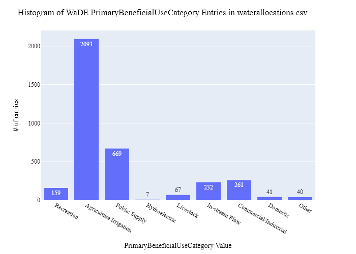
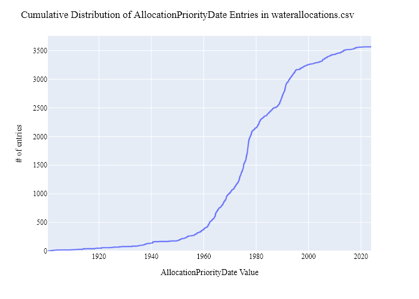
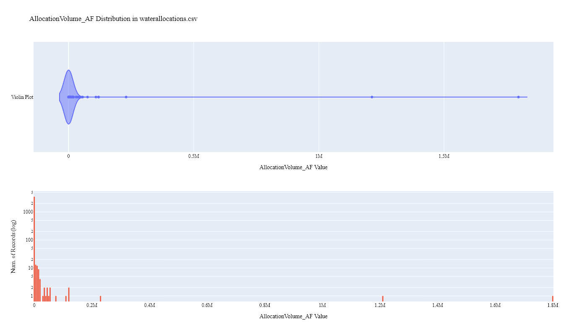

# NDSWC Water Rights (Allocation) & Water Use Data Preparation for WaDE
This readme details the process that was applied by the staff of the [Western States Water Council (WSWC)](http://wade.westernstateswater.org/) to extracting water rights & water use data made available by the [North Dakota Department of Water Resources](https://www.dwr.nd.gov/reg_approp/waterpermits/), for inclusion into the Water Data Exchange (WaDE) project.  WaDE enables states to share data with each other and the public in a more streamlined and consistent way.  WaDE is not intended to replace the states data or become the source for that data but rather to enable regional analysis to inform policy decisions and for planning purposes. 

## Overview of Source Data Utilized
The following data was used for water allocations...

Name | Description | Download Link | Metadata Glossary Link
---------- | ---------- | ------------ | ------------
**Permit** | Point of diversion (POD) data was obtained from NDSWC Maps. Downloaded “Water permits” layer displayed by “Use type”. Open the shapefile in QGIS and export layer to csv file: Permits.csv, which was used as the primary input for data. | [link](https://mapservice.swc.nd.gov/) | not given
**Water Use** | Contains both the POD_Index and the Permit_Index for purposes of aggregating it back to either the POD or the Permit. | Obtained via personal email corespodnace with NDSWC | Not Provided

Input files used are as follows...
- Permit.shp, a geo shapefile of point-of-diversion water rights.
- Water_Use.zip, a csv file of timeseries water use related to permits.
 

## Storage for WaDE 2.0 Source and Processed Water Data
The 1) raw input data shared by the state / state agency / data provider (excel, csv, shapefiles, PDF, etc), & the 2) csv processed input data ready to load into the WaDE database, can both be found within the WaDE sponsored Google Drive.  Please contact WaDE staff if unavailable or if you have any questions about the data.
- NDSWC Allocation & Water Use Data: [link](https://drive.google.com/drive/folders/1c9IihyR00IJeUkylNDq7u2LGxrO3lkla?usp=drive_link)

## Summary of Data Prep
The following text summarizes the process used by the WSWC staff to prepare and share NDSWC's water rights & water use data for inclusion into the Water Data Exchange (WaDE 2.0) project.  For a complete mapping outline, see *ND_Allocation and Water Use Schema Mapping to WaDE.xlsx*.  Several WaDE csv input files will be created in order to extract the NDSWC's water rights & water use data from the above mentioned input.  Each of these WaDE csv input files was created using the [Python](https://www.python.org/) native language, built and ran within [Jupyter Notebooks](https://jupyter.org/) environment.  Those python files include the following...

- **1_NDwr_wu_PreProcessAllocationData.ipynb**: used to pre-processes the native date into a WaDE format friendly format.  All datatype conversions occur here.
- **2_NDwr_wu_CreateWaDEInputFiles.ipynb**: used to create the WaDE input csv files: methods.csv, variables.csv, organizations.csv, watersources.csv, sites.csv, waterallocations.csv, sitespecificamounts.csv, podsitetopousiterelationships.csv.
- **3_NDwr_wu_WaDEDataAssessmentScript.ipynb**: used to evaluate the WaDE input csv files.

***
### 0) Code File: 1_NDwr_wu_PreProcessAllocationData.ipynb
Purpose: Pre-process the state agency's input data files and merge them into one master file for simple dataframe creation and extraction.

#### Inputs: 
- Permit.shp
- Water_Use.zip

#### Outputs:
 - Pwr_wu_xxMain.zip

#### Operation and Steps:
- Read in Permit.shp and Water_Use.zip files and store in temporary dataframes.
- For permit data...
  - ensure **permit_ind** input is an int with no null entries.
  - ensure **pod_index** input is an int with no null entries.
  - Create *linkKey* key by joining **permit_ind** and **pod_index** inputs together, to be used for joining with time series data.
  - Issue of overlapping duplicate sites sharing **pod** input values but differ slightly in latitude and longitude inputs.  Will disslove duplicate sites together per **pod** input -> recalculate latitude and longitude inputs to dissolved point.
  - Strip **permit_hol** input list into string value.
- For water use data...
  - ensure **Permit_Index** input is an int with no null entries.
  - ensure **POD_Index** input is an int with no null entries.
  - Create *linkKey* key by joining **Permit_Index** and **POD_Index** inputs together, to be used for joining with time series data.
  - ensure **Use_Year** input is an int with no null entries
- Left join water use values to permit sites values via the created *linkKey* input.
- Assign state values to specific WaDE inputs.
- For ND, we don't want water rights that are considered: "Application In Processing", "Cancelled", "Deferred", "Denied", "Held In Abeyance", "InActive", "Pending Review", "Under Review", "Void"
- Inspect output dataframe for additional errors / datatypes.
- Export output dataframe as new csv file, *Pwr_ndMain.zip*.

***
## Code File: 2_NDwr_wu_CreateWaDEInputFiles.ipynb
Purpose: generate WaDE csv input files (methods.csv, variables.csv, organizations.csv, watersources.csv, sites.csv, waterallocations.csv, sitespecificamounts.csv, podsitetopousiterelationships.csv).

#### Inputs:
- Pwr_wu_xxMain.zip

#### Outputs:
- methods.csv  `Create by hand.`
- variables.csv  `Create by hand.`
- organizations.csv  `Create by hand.`
- watersources.csv
- sites.csv
- waterallocations.csv
- sitespecificamounts.csv
- podsitetopousiterelationships.csv

## 1) Method Information
Purpose: generate legend of granular methods used on data collection.

#### Operation and Steps:
- Generate single output dataframe *outdf*.
- Populate output dataframe with *WaDE Method* specific columns.
- Assign state info to the *WaDE Method* specific columns (this was hardcoded by hand for simplicity).
- Assign method UUID identifier to each (unique) row.
- Perform error check on output dataframe.
- Export output dataframe *methods.csv*.

#### Sample Output (WARNING: not all fields shown):
|    | MethodUUID   | ApplicableResourceTypeCV      | DataConfidenceValue   | DataCoverageValue   | DataQualityValueCV   | MethodName                       | MethodNEMILink                                  | MethodTypeCV    | WaDEDataMappingUrl                                                                                                   |
|---:|:-------------|:------------------------------|:----------------------|:--------------------|:---------------------|:---------------------------------|:------------------------------------------------|:----------------|:---------------------------------------------------------------------------------------------------------------------|
|  0 | NDwr_M1      | Surface Water and Groundwater |                       |                     |                      | North Dakota Water Rights Method | https://www.swc.nd.gov/reg_approp/waterpermits/ | Legal Processes | https://github.com/WSWCWaterDataExchange/MappingStatesDataToWaDE2.0/tree/master/NorthDakota/WaterAllocation_WaterUse |

## 2) Variables Information
Purpose: generate legend of granular variables specific to each state.

#### Operation and Steps:
- Generate single output dataframe *outdf*.
- Populate output dataframe with *WaDE Variable* specific columns.
- Assign state info to the *WaDE Variable* specific columns (this was hardcoded by hand for simplicity).
- Assign variable UUID identifier to each (unique) row.
- Perform error check on output dataframe.
- Export output dataframe *variables.csv*.

#### Sample Output (WARNING: not all fields shown):
|    | VariableSpecificUUID   |   AggregationInterval | AggregationIntervalUnitCV   | AggregationStatisticCV   | AmountUnitCV   | MaximumAmountUnitCV   |   ReportYearStartMonth | ReportYearTypeCV   | VariableCV   | VariableSpecificCV   |
|---:|:-----------------------|----------------------:|:----------------------------|:-------------------------|:---------------|:----------------------|-----------------------:|:-------------------|:-------------|:---------------------|
|  0 | NDwr_V1                |                     1 | Year                        | Average                  | CFS            | AF                    |                     10 | WaterYear          | Allocation   | Allocation           |

## 3) Organization  Information
Purpose: generate organization directory, including names, email addresses, and website hyperlinks for organization supplying data source.

#### Operation and Steps:
- Generate single output dataframe *outdf*.
- Populate output dataframe with *WaDE Organizations* specific columns.
- Assign state info to the *WaDE Organizations* specific columns (this was hardcoded by hand for simplicity).
- Assign organization UUID identifier to each (unique) row.
- Perform error check on output dataframe.
- Export output dataframe *organizations.csv*.

#### Sample Output (WARNING: not all fields shown):
|    | OrganizationUUID   | OrganizationContactEmail   | OrganizationContactName   | OrganizationName                          | OrganizationPhoneNumber   | OrganizationPurview                                                                                                                                                                                                                                                    | OrganizationWebsite     | State   |
|---:|:-------------------|:---------------------------|:--------------------------|:------------------------------------------|:--------------------------|:-----------------------------------------------------------------------------------------------------------------------------------------------------------------------------------------------------------------------------------------------------------------------|:------------------------|:--------|
|  0 | NDwr_O1            | cbader@nd.gov              | Chris Bader               | North Dakota Department of Water Resource | (701) 328-2750            | The Department of Water Resources (DWR) was created in 2021 by Legislative action.  DWR has the authority to investigate, plan, construct, and develop water-related projects, and serves as a mechanism to financially support those efforts throughout North Dakota. | https://www.swc.nd.gov/ | ND      |

## 4) Water Source Information
Purpose: generate a list of water sources specific to a water right.

#### Operation and Steps:
- Read the input file and generate single output dataframe *outdf*.
- Populate output dataframe with *WaDE WaterSources* specific columns.
- Assign agency info to the *WaDE WaterSources* specific columns.  See *ND_Allocation and Water Use Schema Mapping to WaDE.xlsx* for specific details.  Items of note are as follows...
    - *WaterSourceUUID* = ""
    - *WaterQualityIndicatorCV* = ""
    - *WaterSourceName* = **source_nam** input.
    - *WaterSourceNativeID* = ""
    - *WaterSourceTypeCV* = **source** input.
- Consolidate output dataframe into water source specific information only by dropping duplicate entries, drop by WaDE specific *WaterSourceName* & *WaterSourceTypeCV* fields.
- Assign water source UUID identifier to each (unique) row.
- Perform error check on output dataframe.
- Export output dataframe *WaterSources.csv*.

#### Sample Output (WARNING: not all fields shown):
|    | WaterSourceUUID   | Geometry   | GNISFeatureNameCV   | WaterQualityIndicatorCV   | WaterSourceName   | WaterSourceNativeID   | WaterSourceTypeCV   |
|---:|:------------------|:-----------|:--------------------|:--------------------------|:------------------|:----------------------|:--------------------|
|  0 | NDwr_WSwadeId1    |            |                     | Fresh                     | WaDE Blank        | wadeId1               | Groundwater         |

Any data fields that are missing required values and dropped from the WaDE-ready dataset are instead saved in a separate csv file (e.g. *watersources_missing.csv*) for review.  This allows for future inspection and ease of inspection on missing items.  Mandatory fields for the water sources include the following...
- WaterSourceUUID
- WaterQualityIndicatorCV
- WaterSourceTypeCV

## 5) Site Information
Purpose: generate a list of sites information.

#### Operation and Steps:
- Read the input file and generate single output dataframe *outdf*.
- Populate output dataframe with *WaDE Site* specific columns.
- Assign agency info to the *WaDE Site* specific columns.  See *ND_Allocation and Water Use Schema Mapping to WaDE.xlsx* for specific details.  Items of note are as follows...
    - *SiteUUID* = ""
    - *WaterSourceUUIDs* = Extract *WaterSourceUUID* from waterSources.csv input csv file. See code for specific implementation of extraction.
    - *CoordinateAccuracy* = ""
    - *CoordinateMethodCV* = "Centroid of Area"
    - *Country* = ""
    - *EPSGCodeCV* = 4326
    - *Geometry* = ""
    - *GNISCodeCV* = ""
    - *HUC12* = ""
    - *HUC8* = ""
    - *Latitude* = "wade_lat", see "1_NDwr_wu_PreProcessAllocationData.ipynb" for specifics.
    - *Longitude* = "wade_long", see "1_NDwr_wu_PreProcessAllocationData.ipynb" for specifics.
    - *NHDNetworkStatusCV* = ""
    - *NHDProductCV* = ""
    - *PODorPOUSite* = "POD".
    - *SiteName* = ""
    - *SiteNativeID* = "nd" + **pod** input.
    - *SiteTypeCV* = ""
    - *StateCV* = "ND".																			
    - *USGSSiteID* = ""
- Consolidate output dataframe into site specific information only by dropping duplicate entries, drop by WaDE specific *SiteNativeID*, *SiteName*, *SiteTypeCV*, *Longitude* & *Latitude* fields.
- Assign site UUID identifier to each (unique) row.
- Perform error check on output dataframe.
- Export output dataframe *sites.csv*.

#### Sample Output (WARNING: not all fields shown):
|    | SiteUUID          | RegulatoryOverlayUUIDs   | WaterSourceUUIDs   | CoordinateAccuracy   | CoordinateMethodCV   | County     |   EPSGCodeCV | GNISCodeCV   | HUC12   | HUC8   |   Latitude |   Longitude | NHDNetworkStatusCV   | NHDProductCV   | PODorPOUSite   | SiteName   | SiteNativeID   | SitePoint   | SiteTypeCV   | StateCV   | USGSSiteID   | WaterSourceUUID   | WaterSourceTypeCV   |
|---:|:------------------|:-------------------------|:-------------------|:---------------------|:---------------------|:-----------|-------------:|:-------------|:--------|:-------|-----------:|------------:|:---------------------|:---------------|:---------------|:-----------|:---------------|:------------|:-------------|:----------|:-------------|:------------------|:--------------------|
|  0 | NDwr_Snd12904705A | NDre_RO43                | NDwr_WSwadeId1     | WaDE Blank           | Centroid of Area     | WaDE Blank |         4326 |              |         |        |    46.0184 |    -96.6019 |                      |                | POD            | WaDE Blank | nd12904705A    |             | WaDE Blank   | ND        |              | NDwr_WSwadeId1    | Groundwater         |

Any data fields that are missing required values and dropped from the WaDE-ready dataset are instead saved in a separate csv file (e.g. *sites_missing.csv*) for review.  This allows for future inspection and ease of inspection on missing items.  Mandatory fields for the sites include the following...
- SiteUUID 
- CoordinateMethodCV
- EPSGCodeCV
- SiteName

## 6) AllocationsAmounts Information
Purpose: generate master sheet of water allocations to import into WaDE 2.0.

#### Operation and Steps:
- Read the input files and generate single output dataframe *outdf*.
- Populate output dataframe with *WaDE Water Allocations* specific columns.
- Assign agency info to the *WaDE Water Allocations* specific columns.  See *ND_Allocation and Water Use Schema Mapping to WaDE.xlsx* for specific details.  Items of note are as follows...
    - Extract *MethodUUID*, *VariableSpecificUUID*, *OrganizationUUID*, & *SiteUUID* from respective input csv files. See code for specific implementation of extraction.
    - *AllocationApplicationDate* = **date_issue** input.
    - *AllocationAssociatedConsumptiveUseSiteIDs* = ""
    - *AllocationAssociatedWithdrawalSiteIDs* = ""
    - *AllocationBasisCV* = ""
    - *AllocationChangeApplicationIndicator* = ""
    - *AllocationCommunityWaterSupplySystem* = ""
    - *AllocationCropDutyAmount* = ""
    - *AllocationExpirationDate* = **date_cance** input.
    - *AllocationFlow_CFS* = **app_rate** input.
    - *AllocationLegalStatusCV* = **status** input.
    - *AllocationNativeID* = **permit_num** = **pod_index** inputs.
    - *AllocationOwner* =  **permit_hol** input.
    - *AllocationPriorityDate* = **priority_d** input.
    - *AllocationSDWISIdentifierCV* = ""
    - *AllocationTimeframeEnd* = **period_end** input.
    - *AllocationTimeframeStart* = **period_sta** input.
    - *AllocationTypeCV* = ""
    - *AllocationVolume_AF* = **app_acft** input.
    - *BeneficialUseCategory* = **use_type** input.
    - *CommunityWaterSupplySystem* = ""
    - *CropTypeCV* = ""
    - *CustomerTypeCV* = ""
    - *DataPublicationDate* = "{use today's date}"
    - *DataPublicationDOI* = ""
    - *ExemptOfVolumeFlowPriority* = 0, no exceptions made for this data.
    - *GeneratedPowerCapacityMW* = ""
    - *IrrigatedAcreage* = ""
    - *IrrigationMethodCV* = ""
    - *LegacyAllocationIDs* = ""
    - *OwnerClassificationCV* = ""
    - *PopulationServed* = ""
    - *PowerType* = ""
    - *PrimaryBeneficialUseCategory* = ""
    - *WaterAllocationNativeURL* = *https://www.swc.nd.gov/info_edu/map_data_resources/waterpermits/single.php?id=* + **permid_ind**.
- Consolidate output dataframe into water allocations specific information only by grouping entries by *AllocationNativeID* filed.
- Perform error check on output dataframe.
- Export output dataframe *waterallocations.csv*.
- Export output dataframe *waterallocations.csv*.

#### Sample Output (WARNING: not all fields shown):
|    | AllocationUUID   | MethodUUID   | OrganizationUUID   | SiteUUID           | VariableSpecificUUID   | AllocationApplicationDate   | AllocationAssociatedConsumptiveUseSiteIDs   | AllocationAssociatedWithdrawalSiteIDs   | AllocationBasisCV   | AllocationChangeApplicationIndicator   | AllocationCommunityWaterSupplySystem   | AllocationCropDutyAmount   | AllocationExpirationDate   |   AllocationFlow_CFS | AllocationLegalStatusCV   |   AllocationNativeID | AllocationOwner       | AllocationPriorityDate   | AllocationSDWISIdentifierCV   | AllocationTimeframeEnd   | AllocationTimeframeStart   | AllocationTypeCV   |   AllocationVolume_AF | BeneficialUseCategory   | CommunityWaterSupplySystem   | CropTypeCV   | CustomerTypeCV   | DataPublicationDate   | DataPublicationDOI   |   ExemptOfVolumeFlowPriority | GeneratedPowerCapacityMW   |   IrrigatedAcreage | IrrigationMethodCV   | LegacyAllocationIDs   | OwnerClassificationCV   | PopulationServed   | PowerType   | PrimaryBeneficialUseCategory   | WaterAllocationNativeURL                                                          |
|---:|:-----------------|:-------------|:-------------------|:-------------------|:-----------------------|:----------------------------|:--------------------------------------------|:----------------------------------------|:--------------------|:---------------------------------------|:---------------------------------------|:---------------------------|:---------------------------|---------------------:|:--------------------------|---------------------:|:----------------------|:-------------------------|:------------------------------|:-------------------------|:---------------------------|:-------------------|----------------------:|:------------------------|:-----------------------------|:-------------|:-----------------|:----------------------|:---------------------|-----------------------------:|:---------------------------|-------------------:|:---------------------|:----------------------|:------------------------|:-------------------|:------------|:-------------------------------|:----------------------------------------------------------------------------------|
|  0 | NDwr_WR1002_1199 | NDwr_M1      | NDwr_O1            | NDwr_Snd13908411CC | NDwr_V1                | 1962-08-02                  |                                             |                                         | WaDE Blank          |                                        |                                        |                            |                            |                    0 | Active                    |            1002_1199 | Nd Game And Fish Dept | 1961-12-28               |                               |                          |                            | WaDE Blank         |                   950 | Recreation              |                              |              |                  | 01/31/2024            |                      |                            0 |                            |                  0 |                      |                       | Private                 |                    |             | Recreation                     | https://www.swc.nd.gov/info_edu/map_data_resources/waterpermits/single.php?id=771 |

Any data fields that are missing required values and dropped from the WaDE-ready dataset are instead saved in a separate csv file (e.g. *waterallocations_missing.csv*) for review.  This allows for future inspection and ease of inspection on missing items.  Mandatory fields for the water allocations include the following...
- MethodUUID
- VariableSpecificUUID
- OrganizationUUID
- WaterSourceUUID
- SiteUUID
- AllocationPriorityDate
- BeneficialUseCategory
- AllocationAmount or AllocationMaximum
- DataPublicationDate

## 7) SiteSpecificAmounts Information
Purpose: generate master sheet of site-specific amount information to import into WaDE 2.0.

#### Operation and Steps:
- Read the input files and generate single output dataframe *outdf*.
- Populate output dataframe with *WaDE site-specific amount* specific columns.
- Assign agency info to the *WaDE site-specific amount* specific columns.  See *ND_Allocation and Water Use Schema Mapping to WaDE.xlsx* for specific details.  Items of note are as follows...
    - Extract *MethodUUID*, *VariableSpecificUUID*, *OrganizationUUID*, *WaterSourceUUID*, & *SiteUUID* from respective input csv files. See code for specific implementation of extraction.
    - *Amount* = **Reported_AcFt** input.
    - *AssociatedNativeAllocationIDs* = **permit_num** = **pod_index** inputs.
    - *BeneficialUseCategory* = ""
    - *CommunityWaterSupplySystem* = ""
    - *CropTypeCV* = ""
    - *CustomerTypeCV* = ""
    - *DataPublicationDate* = ""
    - *DataPublicationDOI* = ""
    - *Geometry* = ""
    - *IrrigatedAcreage* = ""
    - *IrrigationMethodCV* = ""
    - *PopulationServed* = ""
    - *PowerGeneratedGWh* = ""
    - *PowerType* = ""
    - *PrimaryUseCategory* = ""
    - *ReportYearCV* = **Use_Year** input, extract out year value.
    - *SDWISIdentifier* = ""
    - *TimeframeEnd* = **Use_Year** input + "/12/31".
    - *TimeframeStart* = **Use_Year** input + "/01/01".
																						
- Perform error check on output dataframe.
- Export output dataframe *sitespecificamounts.csv*.

#### Sample Output (WARNING: not all fields shown):
|    | MethodUUID   | OrganizationUUID   | SiteUUID           | VariableSpecificUUID   | WaterSourceUUID   |   Amount | AllocationCropDutyAmount   | AssociatedNativeAllocationIDs   | BeneficialUseCategory   | CommunityWaterSupplySystem   | CropTypeCV   | CustomerTypeCV   | DataPublicationDate   | DataPublicationDOI   | Geometry   |   IrrigatedAcreage | IrrigationMethodCV   | PopulationServed   | PowerGeneratedGWh   | PowerType   | PrimaryUseCategory     |   ReportYearCV | SDWISIdentifier   | TimeframeEnd   | TimeframeStart   | WaDEUUID   |
|---:|:-------------|:-------------------|:-------------------|:-----------------------|:------------------|---------:|:---------------------------|:--------------------------------|:------------------------|:-----------------------------|:-------------|:-----------------|:----------------------|:---------------------|:-----------|-------------------:|:---------------------|:-------------------|:--------------------|:------------|:-----------------------|---------------:|:------------------|:---------------|:-----------------|:-----------|
|  0 | NDwr_M1      | NDwr_O1            | NDwr_Snd14910026AB | NDwr_V3                | NDwr_WSwadeId2    |      291 |                            | 2D_4                            | Irrigation              |                              |              |                  | 02/01/2024            |                      |            |                291 |                      |                    |                     |             | Agriculture Irrigation |           1977 |                   | 1977-12-31     | 1977-01-01       |            |

Any data fields that are missing required values and dropped from the WaDE-ready dataset are instead saved in a separate csv file (e.g. *sitespecificamounts_missing.csv*) for review.  This allows for future inspection and ease of inspection on missing items.  Mandatory fields for the site-specific amount include the following...
- MethodUUID
- VariableSpecificUUID
- OrganizationUUID
- SiteUUID
- BeneficialUseCategory
- Amount
- DataPublicationDate

### 8) POD Site -To- POU Polygon Relationships
Purpose: generate linking element between POD and POU sites that share the same water right.
Note: podsitetopousiterelationships.csv output only needed if both POD and POU data is present,  `otherwise produces empty file.`

#### Operation and Steps:
- Read the sites.csv & waterallocations.csv input files.
- Create three temporary dataframes: one for waterallocations, & two for site info that will store POD and POU data separately.
- For the temporary POD dataframe...
  - Read in site.csv data from sites.csv with a _PODSiteUUID_ field = POD only.
  - Create _PODSiteUUID_ field = _SiteUUID_.
- For the temporary POU dataframe
  - Read in site.csv data from sites.csv with a _PODSiteUUID_ field = POU only.
  - Create _POUSiteUUID_ field = _SiteUUID_.
- For the temporary waterallocations dataframe, explode _SiteUUID_ field to create unique rows.
- Left-merge POD & POU dataframes to the waterallocations dataframe via _SiteUUID_ field.
- Consolidate waterallocations dataframe by grouping entries by _AllocationNativeID_ filed.
- Explode the consolidated waterallocations dataframe again using the _PODSiteUUID_ field, and again for the _POUSiteUUID_ field to create unique rows.
- Perform error check on waterallocations dataframe (check for NaN values)
- If waterallocations is not empty, export output dataframe _podsitetopousiterelationships.csv_.

***
## Source Data & WaDE Complied Data Assessment
The following info is from a data assessment evaluation of the completed data...

Dataset | Num of Source Entries (rows)
---------- | ---------- 
**Permits** | 12,889
**Water Use** | 206,166

Dataset  | Num of Identified PODs | Num of Identified POUs | Num of Identified Water Right Records | Num of Identified Water Use Records
---------- | ------------ | ------------ | ------------ | ------------
**Compiled WaDE Data** | 3,201 | 0 | 3,569 | 76,571

Assessment of Removed Source Records | Count | Action
---------- | ---------- | ----------
Unused WaterSource Record   | 186 | removed from watersources.csv input
Unused Site Record    | 1592 | removed from sites.csv input
Incomplete or bad entry for AllocationTimeframeEnd      | 1,901 | removed from waterallocations.csv input
Incomplete or bad entry for AllocationTimeframeStart     | 25 | removed from waterallocations.csv input
Incomplete or bad entry for AllocationPriorityDate        | 1 | removed from waterallocations.csv input
Negative, blank, or 0 Amount values                    | 50,813 | removed from sitespecificamounts.csv input
Not Unique combination of SiteSpecificAmounts record   | 7,856 | removed from sitespecificamounts.csv input
Incomplete or bad entry for ReportYearCV                 |  1 | removed from sitespecificamounts.csv input

**Figure 1:** Distribution of POD vs POU Sites within the sites.csv

**Figure 2:** Distribution Sites by WaterSourceTypeCV within the sites.csv

**Figure 3:** Distribution of Identified Water Right Records by WaDE Categorized Primary Beneficial Uses within the waterallocations.csv

**Figure 4a:** Range of Priority Date of Identified Water Right Records within the waterallocations.csv

**Figure 4b:** Cumulative distribution of Priority Date of Identified Water Right Records within the waterallocations.csv

**Figure 5:** Distribution & Range of Flow (CFS) of Identified Water Right Records within the waterallocations.csv

**Figure 6:** Distribution & Range of Volume (AF) of Identified Water Right Records within the waterallocations.csv

**Figure 7:** Distribution & Range of Amount (CFS) within the sitespecificamounts.csv

**Figure 8:** Map of Identified Points within the sites.csv

**Figure 9:** Map of Identified Polygons within the sites.csv

***
## Staff Contributions
Data created here was a contribution between the [Western States Water Council (WSWC)](http://wade.westernstateswater.org/) and the [North Dakota Department of Water Resources](https://www.dwr.nd.gov/reg_approp/waterpermits/).

WSWC Staff
- Adel Abdallah <adelabdallah@wswc.utah.gov>
- Ryan James <rjames@wswc.utah.gov>

NDSWC Staff
- Chris Bader <cbader@nd.gov>

