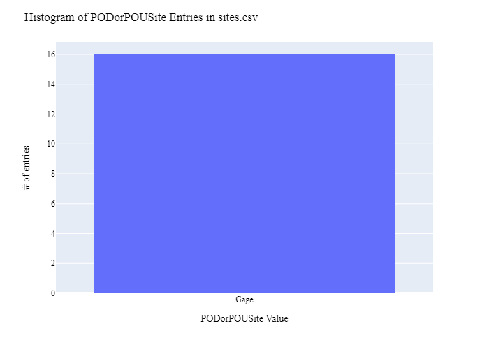
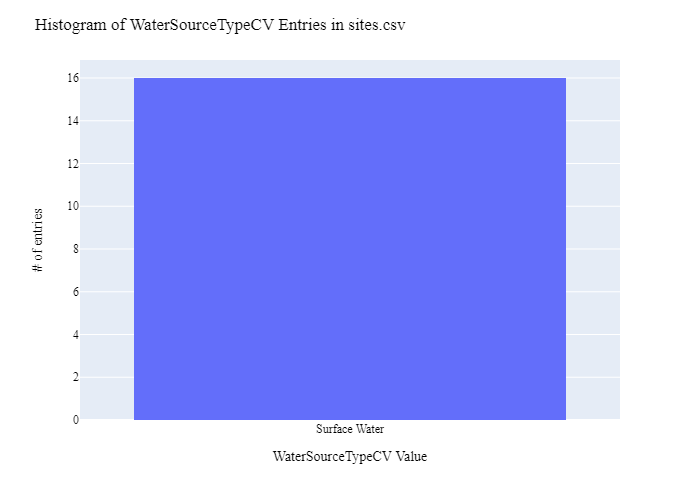
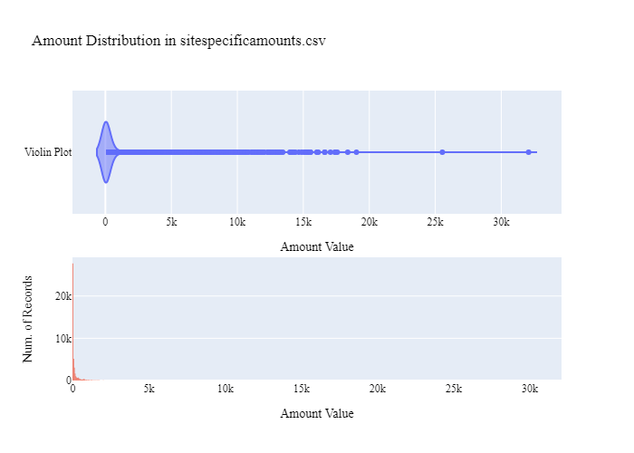
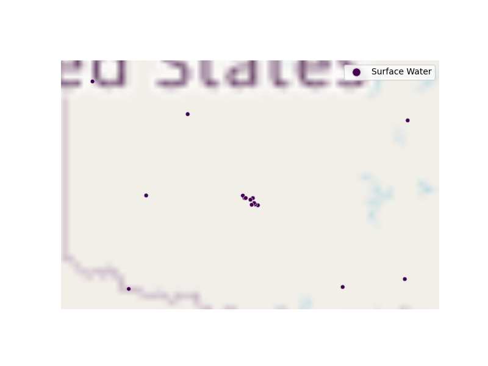

# Oklahoma Water Resources Board Stream and Reservoir Observation Site Data Preparation for WaDE
This readme details the process that was applied by the staff of the [Western States Water Council (WSWC)](http://wade.westernstateswater.org/) to extracting stream and reservoir observation site time series water data made available by the [Oklahoma Water Resources Board](https://www.owrb.ok.gov/), for inclusion into the Water Data Exchange (WaDE) project.  WaDE enables states to share data with each other and the public in a more streamlined and consistent way. WaDE is not intended to replace the states data or become the source for that data but rather to enable regional analysis to inform policy decisions and for planning purposes. 

## Overview of Source Data Utilized
The following data was used for water allocations...

Name | Description | Download Link | Metadata Glossary Link
---------- | ---------- | ------------ | ------------
**Continous River / Streams Data**| The OWRB collects continuous and discrete water quality and quantity data from lakes, streams, and aquifers across the state. Continuous data, including water well level and stream stage or discharge, are collected using data loggers that report readings in real-time intervals.  | [link](https://data-owrb.aquaticinformatics.net/Data) | [link](https://data-owrb.aquaticinformatics.net/Content/Manuals/en/UserGuide.pdf)

Input files used are as follows...
- joined_Site_Info.csv, a hand made csv file of the location information involving Mean Daily Flow discharge data.
- timeSeriesInfo.zip, time series into related to the site info, retrieved via api.
 

## Storage for WaDE 2.0 Source and Processed Water Data
The 1) raw input data shared by the state / state agency / data provider (excel, csv, shapefiles, PDF, etc), & the 2) csv processed input data ready to load into the WaDE database, can both be found within the WaDE sponsored Google Drive.  Please contact WaDE staff if unavailable or if you have any questions about the data.
-  Oklahoma Water Resources Board Site Specific Reservoir and Gage Data:[link](https://drive.google.com/drive/folders/1--ZEadrOCM5svZlUw-kGOG0R_8bwv1gl?usp=sharing)

## Summary of Data Prep
The following text summarizes the process used by the WSWC staff to prepare and share Oklahoma Water Resources Board's water rights & water use data for inclusion into the Water Data Exchange (WaDE 2.0) project.  For a complete mapping outline, see *OKssro_ReservoirsObservationSitesSchema Mapping to WaDE.xlsx*.  Several WaDE csv input files will be created in order to extract the Oklahoma Water Resources Board's water rights & water use data from the above mentioned input.  Each of these WaDE csv input files was created using the [Python](https://www.python.org/) native language, built and ran within [Jupyter Notebooks](https://jupyter.org/) environment.  Those python files include the following...

- **1_OKssro_PreProcessReservoirObservationSites.ipynb**: used to pre-processes the native date into a WaDE format friendly format.  All datatype conversions occur here.
- **2_OKssro_CreateWaDEInputFiles.ipynb**: used to create the WaDE input csv files: methods.csv, variables.csv, organizations.csv, watersources.csv, sites.csv, sitespecificamounts.csv.
- **3_OKssro_WaDEDataAssessmentScript.ipynb**: used to evaluate the WaDE input csv files.

***
### 0) Code File: 1_OKssro_PreProcessReservoirObservationSites.ipynb
Purpose: Pre-process the state agency's input data files and merge them into one master file for simple dataframe creation and extraction.

#### Inputs: 
- joined_Site_Info.csv
- timeSeriesInfo.zip

#### Outputs:
 - Pssro_okMain.zip

#### Operation and Steps:
- Load in joined_Site_Info, store in temporary dataframe.
- Using API information [ex link](https://data-owrb.aquaticinformatics.net/Data/Export), retrieve time series info using site data type.
- Join site into with timeseries info via **LocationIdentifier** input.
- Concatenate stream gage and reservoir level DataFrames together into single output dataframe.
- Review for errors.
- Export output DataFrames as new csv file, Pssro_okMain.csv.

***
## Code File: 2_XXssro_CreateWaDEInputFiles.ipynb
Purpose: generate WaDE csv input files (methods.csv, variables.csv, organizations.csv, watersources.csv, sites.csv, sitespecificamounts.csv).

#### Inputs:
- Pssro_okMain.zip

#### Outputs:
- methods.csv  `Create by hand.`
- variables.csv  `Create by hand.`
- organizations.csv  `Create by hand.`
- watersources.csv
- sites.csv
- sitespecificamounts.csv

## 1) Method Information
Purpose: generate legend of granular methods used on data collection.

#### Operation and Steps:
- Generate single output dataframe *outdf*.
- Populate output dataframe with *WaDE Method* specific columns.
- Assign state info to the *WaDE Method* specific columns (this was hardcoded by hand for simplicity).
- Assign method UUID identifier to each (unique) row.
- Perform error check on output dataframe.
- Export output dataframe *methods.csv*.

#### Sample Output (WARNING: not all fields shown):
|    | MethodUUID          | ApplicableResourceTypeCV   | DataConfidenceValue   | DataCoverageValue   | DataQualityValueCV   | MethodName                     | MethodNEMILink                                | MethodTypeCV                 | WaDEDataMappingUrl                                                                                                     |
|---:|:--------------------|:---------------------------|:----------------------|:--------------------|:---------------------|:-------------------------------|:----------------------------------------------|:-----------------------------|:-----------------------------------------------------------------------------------------------------------------------|
|  0 | OKssro_M1 + counter | Surface Water              |                       |                     |                      | Continous River / Streams Data | https://data-owrb.aquaticinformatics.net/Data | Continous River Streams Data | https://github.com/WSWCWaterDataExchange/MappingStatesDataToWaDE2.0/tree/master/Oklahoma/SS_ReservoirsObservationSites |

## 2) Variables Information
Purpose: generate legend of granular variables specific to each state.

#### Operation and Steps:
- Generate single output dataframe *outdf*.
- Populate output dataframe with *WaDE Variable* specific columns.
- Assign state info to the *WaDE Variable* specific columns (this was hardcoded by hand for simplicity).
- Assign variable UUID identifier to each (unique) row.
- Perform error check on output dataframe.
- Export output dataframe *variables.csv*.

#### Sample Output (WARNING: not all fields shown):
|    | VariableSpecificUUID   |   AggregationInterval | AggregationIntervalUnitCV   | AggregationStatisticCV   | AmountUnitCV   | MaximumAmountUnitCV   |   ReportYearStartMonth | ReportYearTypeCV   | VariableCV               | VariableSpecificCV                                       |
|---:|:-----------------------|----------------------:|:----------------------------|:-------------------------|:---------------|:----------------------|-----------------------:|:-------------------|:-------------------------|:---------------------------------------------------------|
|  1 | Okssro_V2              |                     1 | Daily                       | Average                  | CFS            | CFS                   |                      1 | CalendarYear       | Discharge MDF JTW 062922 | Discharge MDF JTW 062922_Daily_Stream Gage_Surface Water |

## 3) Organization  Information
Purpose: generate organization directory, including names, email addresses, and website hyperlinks for organization supplying data source.

#### Operation and Steps:
- Generate single output dataframe *outdf*.
- Populate output dataframe with *WaDE Organizations* specific columns.
- Assign state info to the *WaDE Organizations* specific columns (this was hardcoded by hand for simplicity).
- Assign organization UUID identifier to each (unique) row.
- Perform error check on output dataframe.
- Export output dataframe *organizations.csv*.

#### Sample Output (WARNING: not all fields shown):
|    | OrganizationUUID   | OrganizationContactEmail   | OrganizationContactName   | OrganizationName               | OrganizationPhoneNumber   | OrganizationPurview                                               | OrganizationWebsite      | State   |
|---:|:-------------------|:---------------------------|:--------------------------|:-------------------------------|:--------------------------|:------------------------------------------------------------------|:-------------------------|:--------|
|  0 | OKssro_O1          | david.hamilton@owrb.ok.gov | David Hamilton            | Oklahoma Water Resources Board | 303-866-3581              | OWRB produces and maintains datasets related to water in Oklahoma | https://www.owrb.ok.gov/ | OK      |

## 4) Water Source Information
Purpose: generate a list of water sources specific to a water right.

#### Operation and Steps:
- Read the input file and generate single output dataframe *outdf*.
- Populate output dataframe with *WaDE WaterSources* specific columns.
- Assign agency info to the *WaDE WaterSources* specific columns.  See *OKssro_ReservoirsObservationSitesSchema Mapping to WaDE.xlsx* for specific details.  Items of note are as follows...
    - *WaterSourceUUID* = OKssro_WS + counter
    - *WaterQualityIndicatorCV* = "Fresh"
    - *WaterSourceName* = ""
    - *WaterSourceNativeID* = ""
    - *WaterSourceTypeCV* = "Surface Water"
- Consolidate output dataframe into water source specific information only by dropping duplicate entries, drop by WaDE specific *WaterSourceName* & *WaterSourceTypeCV* fields.
- Assign water source UUID identifier to each (unique) row.
- Perform error check on output dataframe.
- Export output dataframe *WaterSources.csv*.

#### Sample Output (WARNING: not all fields shown):
|    | WaterSourceUUID   | Geometry   | GNISFeatureNameCV   | WaterQualityIndicatorCV   | WaterSourceName   | WaterSourceNativeID   | WaterSourceTypeCV   |
|---:|:------------------|:-----------|:--------------------|:--------------------------|:------------------|:----------------------|:--------------------|
|  0 | OKssro_WSwadeId1  |            |                     | Fresh                     | WaDE Blank        | wadeId1               | Surface Water       |

Any data fields that are missing required values and dropped from the WaDE-ready dataset are instead saved in a separate csv file (e.g. *watersources_missing.csv*) for review.  This allows for future inspection and ease of inspection on missing items.  Mandatory fields for the water sources include the following...
- WaterSourceUUID
- WaterQualityIndicatorCV
- WaterSourceTypeCV

## 5) Site Information
Purpose: generate a list of sites information.

#### Operation and Steps:
- Read the input file and generate single output dataframe *outdf*.
- Populate output dataframe with *WaDE Site* specific columns.
- Assign agency info to the *WaDE Site* specific columns.  See *OKssro_ReservoirsObservationSitesSchema Mapping to WaDE.xlsx* for specific details.  Items of note are as follows...
    - *SiteUUID* =  OKssro_W + counter
    - *WaterSourceUUIDs* = Extract *WaterSourceUUID* from waterSources.csv input csv file. See code for specific implementation of extraction.
    - *CoordinateAccuracy* = ""
    - *CoordinateMethodCV* = ""
    - *Country* = ""
    - *EPSGCodeCV* = "4326"
    - *Geometry* = ""
    - *GNISCodeCV* = ""
    - *HUC12* = ""
    - *HUC8* = ""
    - *Latitude* = **Latitude** input.
    - *Longitude* = *Longitude** input.
    - *NHDNetworkStatusCV* = ""
    - *NHDProductCV* = ""
    - *PODorPOUSite* = "Gage"
    - *SiteName* = **LocationName** input.
    - *SiteNativeID* = **LocationIdentifier** input.
    - *SiteTypeCV* = **LocationType** input.
    - *StateCV* = "OK"
    - *USGSSiteID* = ""
- Consolidate output dataframe into site specific information only by dropping duplicate entries, drop by WaDE specific *SiteNativeID*, *SiteName*, *SiteTypeCV*, *Longitude* & *Latitude* fields.
- Assign site UUID identifier to each (unique) row.
- Perform error check on output dataframe.
- Export output dataframe *sites.csv*.

#### Sample Output (WARNING: not all fields shown):
|    | SiteUUID      | RegulatoryOverlayUUIDs   | WaterSourceUUIDs   | CoordinateAccuracy   | CoordinateMethodCV   | County     |   EPSGCodeCV | GNISCodeCV   | HUC12   | HUC8   |   Latitude |   Longitude | NHDNetworkStatusCV   | NHDProductCV   | PODorPOUSite   | SiteName                | SiteNativeID   | SitePoint   | SiteTypeCV                      | StateCV   | USGSSiteID   |
|---:|:--------------|:-------------------------|:-------------------|:---------------------|:---------------------|:-----------|-------------:|:-------------|:--------|:-------|-----------:|------------:|:---------------------|:---------------|:---------------|:------------------------|:---------------|:------------|:--------------------------------|:----------|:-------------|
|  1 | OKssro_SATMO2 |                          | OKssro_WSwadeId1   | WaDE Blank           | WaDE Blank           | WaDE Blank |         4326 |              |         |        |    34.2339 |     -96.073 |                      |                | Gage           | Muddy Boggy Creek Atoka | ATMO2          |             | Flowing Water Hydrology Station | OK        |              |

Any data fields that are missing required values and dropped from the WaDE-ready dataset are instead saved in a separate csv file (e.g. *sites_missing.csv*) for review.  This allows for future inspection and ease of inspection on missing items.  Mandatory fields for the sites include the following...
- SiteUUID 
- CoordinateMethodCV
- EPSGCodeCV
- SiteName

## 6) SiteSpecificAmounts Information
Purpose: generate master sheet of site-specific amount information to import into WaDE 2.0.

#### Operation and Steps:
- Read the input files and generate single output dataframe *outdf*.
- Populate output dataframe with *WaDE site-specific amount* specific columns.
- Assign agency info to the *WaDE site-specific amount* specific columns.  See *OKssro_ReservoirsObservationSitesSchema Mapping to WaDE.xlsx* for specific details.  Items of note are as follows...
    - Extract *MethodUUID*, *VariableSpecificUUID*, *OrganizationUUID*, *WaterSourceUUID*, & *SiteUUID* from respective input csv files. See code for specific implementation of extraction.
    - *Amount* = **Value (ft^3/s)** input.
    - *AssociatedNativeAllocationIDs* = ""
    - *BeneficialUseCategory* = "Stream Gage".
    - *CommunityWaterSupplySystem* = ""
    - *CropTypeCV* = ""
    - *CustomerTypeCV* = ""
    - *DataPublicationDate* = ""
    - *DataPublicationDOI* = ""
    - *Geometry* = ""
    - *IrrigatedAcreage* = ""
    - *IrrigationMethodCV* = ""
    - *PopulationServed* = ""
    - *PowerGeneratedGWh* = ""
    - *PowerType* = ""
    - *PrimaryUseCategory* = ""
    - *ReportYearCV* = **Timestamp (UTC-06:00)** input, extract year value.
    - *SDWISIdentifier* = ""
    - *TimeframeEnd* = **Timestamp (UTC-06:00)** input.
    - *TimeframeStart* = **Timestamp (UTC-06:00)** input.
																						
- Perform error check on output dataframe.
- Export output dataframe *sitespecificamounts.csv*.

#### Sample Output (WARNING: not all fields shown):
|    | MethodUUID   | OrganizationUUID   | SiteUUID   | VariableSpecificUUID   | WaterSourceUUID   |   Amount | AllocationCropDutyAmount   | AssociatedNativeAllocationIDs   | BeneficialUseCategory   | CommunityWaterSupplySystem   | CropTypeCV   | CustomerTypeCV   | DataPublicationDate   | DataPublicationDOI   | Geometry   | IrrigatedAcreage   | IrrigationMethodCV   | PopulationServed   | PowerGeneratedGWh   | PowerType   | PrimaryUseCategory   |   ReportYearCV | SDWISIdentifier   | TimeframeEnd   | TimeframeStart   |
|---:|:-------------|:-------------------|:-----------|:-----------------------|:------------------|---------:|:---------------------------|:--------------------------------|:------------------------|:-----------------------------|:-------------|:-----------------|:----------------------|:---------------------|:-----------|:-------------------|:---------------------|:-------------------|:--------------------|:------------|:---------------------|---------------:|:------------------|:---------------|:-----------------|
|  1 | OKssro_M1    | OKssro_O1          | OKssro_SCC | Okssro_V1              | OKssro_WSwadeId1  |     0.35 |                            |                                 | Stream Gage             |                              |              |                  | 01/22/2024            |                      |            |                    |                      |                    |                     |             | Stream Gage          |           2016 |                   | 2016-07-02     | 2016-07-02       |

Any data fields that are missing required values and dropped from the WaDE-ready dataset are instead saved in a separate csv file (e.g. *sitespecificamounts_missing.csv*) for review.  This allows for future inspection and ease of inspection on missing items.  Mandatory fields for the site-specific amount include the following...
- MethodUUID
- VariableSpecificUUID
- OrganizationUUID
- SiteUUID
- BeneficialUseCategory
- Amount
- DataPublicationDate

***
## Source Data & WaDE Complied Data Assessment
The following info is from a data assessment evaluation of the completed data...

Dataset | Num of Source Entries (rows)
---------- | ---------- 
**Continous River / Streams Data** | 16
**Continous River / Streams Data - API time series info**  | 51,856

Dataset  | Num of Identified PODs | Num of Identified POUs | Num of Identified Time Series Records
**Compiled WaDE Data** | 0 | 0 | 46077

Assessment of Removed Source Records | Count | Action
---------- | ---------- | ----------
Negative, blank, or 0 Amount values    | 5,619 | removed from sitespecificamounts.csv input

**Figure 1:** Distribution of Sites within the sites.csv

**Figure 2:** Distribution Sites by WaterSourceTypeCV within the sites.csv

**Figure 3:** Distribution of Primary Beneficial Uses within the sitespecificamounts.csv

**Figure 4:** Distribution & Range of Amount (CFS) within the sitespecificamounts.csv

**Figure 5:** Map of Identified Points within the sites.csv

***
## Staff Contributions
Data created here was a contribution between the [Western States Water Council (WSWC)](http://wade.westernstateswater.org/) and the [(Oklahoma Water Resources Board)]("https://www.owrb.ok.gov/").

WSWC Staff
- Adel Abdallah <adelabdallah@wswc.utah.gov>
- Ryan James <rjames@wswc.utah.gov>

Oklahoma Water Resources Board Staff
- David Hamilton
