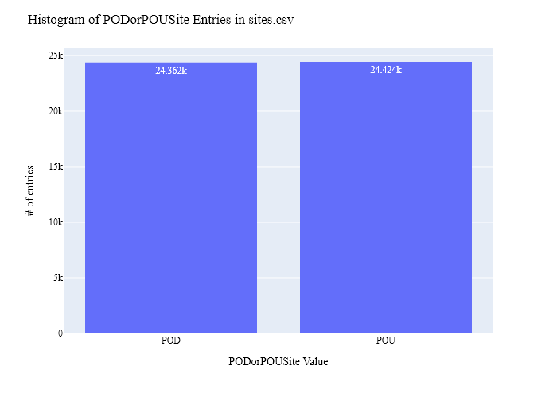
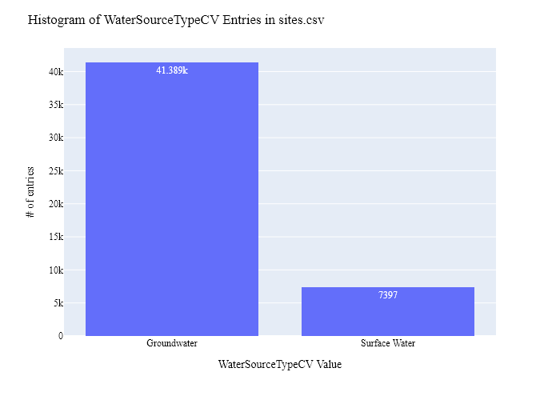
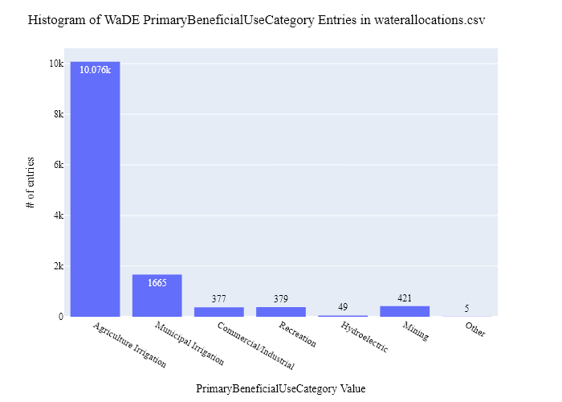
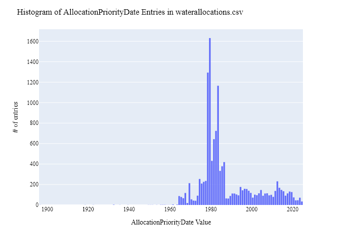
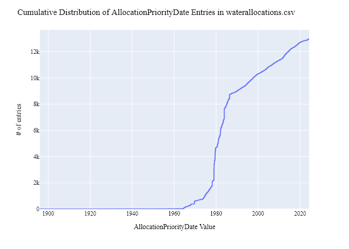
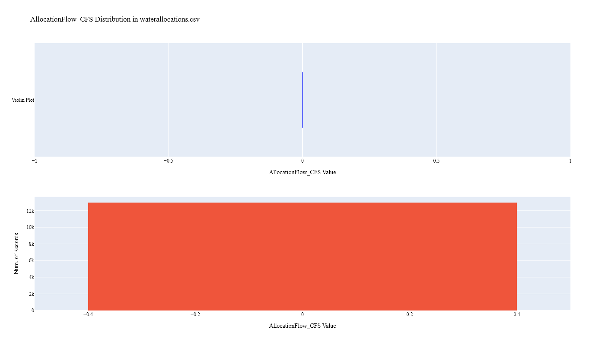
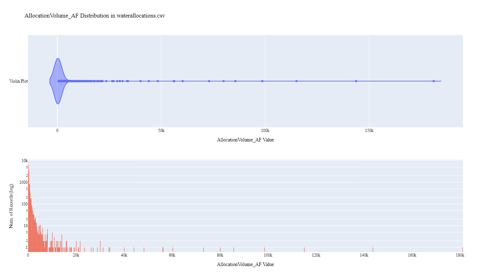
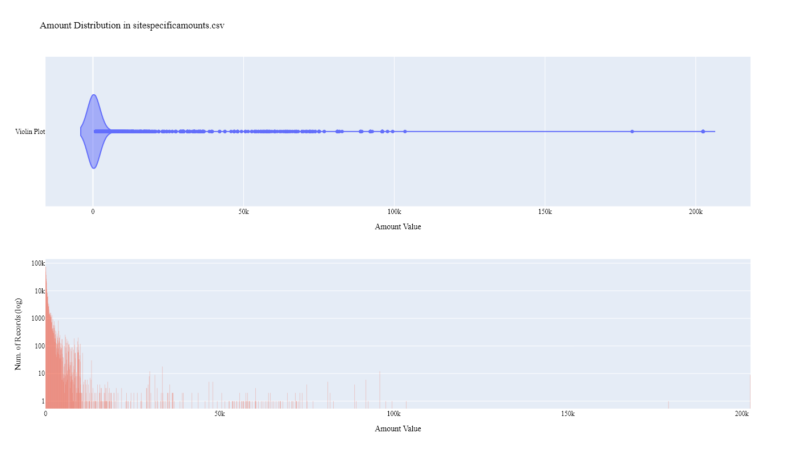
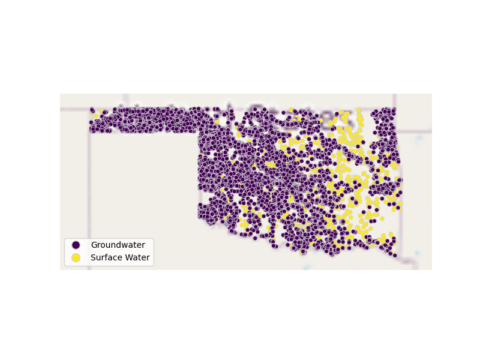
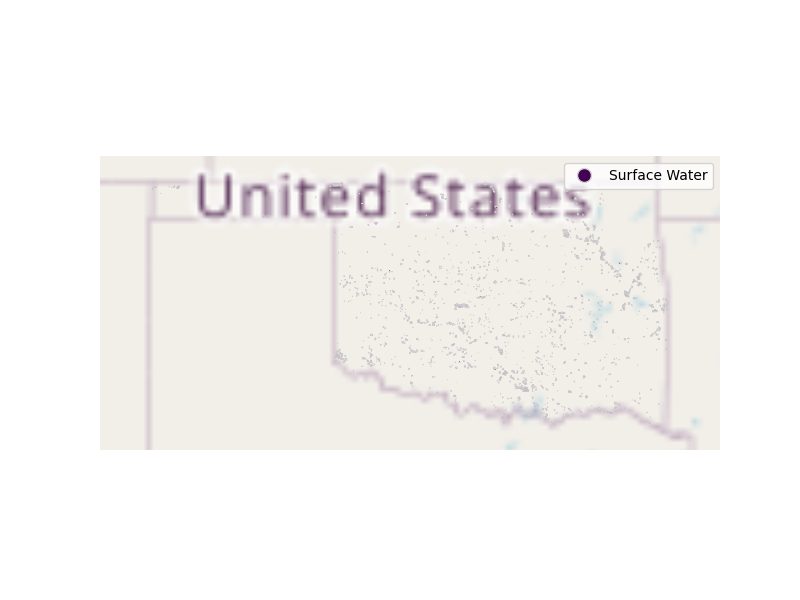

# Oklahoma Water Resources Board Water Rights (Allocation) & Water Use Data Preparation for WaDE
This readme details the process that was applied by the staff of the [Western States Water Council (WSWC)](http://wade.westernstateswater.org/) to extracting water rights & water use data made available by the [(Oklahoma Water Resources Board)]("https://www.owrb.ok.gov/"), for inclusion into the Water Data Exchange (WaDE) project.  WaDE enables states to share data with each other and the public in a more streamlined and consistent way.  WaDE is not intended to replace the states data or become the source for that data but rather to enable regional analysis to inform policy decisions and for planning purposes. 

## Overview of Source Data Utilized
The following data was used for water allocations...

Name | Description | Download Link | Metadata Glossary Link
---------- | ---------- | ------------ | ------------
**Water Rights - POD and POU Surface Water** | Maps and data published by the OWRB. Permitted Surface Water Diversions and Areas of Use. | [link](https://www.owrb.ok.gov/maps/pmg/owrbdata_WR.html) | [link](https://www.owrb.ok.gov/maps/data/layers/Water_Rights/Permitted_SW_Diversions.htm)
**Water Rights - POD and POU Groundwater** | Maps and data published by the OWRB. Contains Permitted Groundwater Wells and Dedicated Lands. | [link](https://www.owrb.ok.gov/maps/pmg/owrbdata_WR.html) | [link](https://www.owrb.ok.gov/maps/data/layers/Water_Rights/Permitted_GW_Wells.htm)
**Water Use Data&& | - | - |
**OWRBStateWaterUse_20220505JSC_wswc** | Microsoft Access Database file of Groundwater and Surface Water annual water use related to water rights for 2000-2020. |  Received via Email | Not Provided

Input files used are as follows...
- Permitted_GW_Wells.zip, zipped csv file of groundwater point-of-diversions of to water rights.
- Permitted_SW_Diversions.zip, zipped csv file of surface water point-of-diversions of to water rights.
- Permitted_Areas_of_Use.zip, zipped shp file of places-of-use polygons to water rights.
- Permitted_Dedicated_Lands.zip, secondary zipped shp file of places-of-use polygons to water rights.
- Groundwater Use 2000-2020.zip, zipped csv file of groundwater use records for 2000-2020.
- Surface Water Use 2000-2020.zip, zipped csv file of surface water use records for 2000-2020.

## Storage for WaDE 2.0 Source and Processed Water Data
The 1) raw input data shared by the state / state agency / data provider (excel, csv, shapefiles, PDF, etc), & the 2) csv processed input data ready to load into the WaDE database, can both be found within the WaDE sponsored Google Drive.  Please contact WaDE staff if unavailable or if you have any questions about the data.
- Oklahoma Water Resources Board Allocation & Water Use Data: [link]("https://drive.google.com/drive/folders/1SRkL8hzcQWPgdBR1pxdDROCbGptCCEze")

## Summary of Data Prep
The following text summarizes the process used by the WSWC staff to prepare and share Oklahoma Water Resources Board's water rights & water use data for inclusion into the Water Data Exchange (WaDE 2.0) project.  For a complete mapping outline, see *OKwrwu_Allocation and Water Use Schema Mapping to WaDE.xlsx*.  Several WaDE csv input files will be created in order to extract the Oklahoma Water Resources Board's water rights & water use data from the above mentioned input.  Each of these WaDE csv input files was created using the [Python](https://www.python.org/) native language, built and ran within [Jupyter Notebooks](https://jupyter.org/) environment.  Those python files include the following...

- **1_OKwrwu_PreProcessAllocationData.ipynb**: used to pre-processes the native date into a WaDE format friendly format.  All datatype conversions occur here.
- **2_OKwrwu_CreateWaDEInputFiles.ipynb**: used to create the WaDE input csv files: methods.csv, variables.csv, organizations.csv, watersources.csv, sites.csv, waterallocations.csv, sitespecificamounts.csv, podsitetopousiterelationships.csv.
- **3_OKwrwu_WaDEDataAssessmentScript.ipynb**: used to evaluate the WaDE input csv files.

***
### 0) Code File: 1_OKwrwu_PreProcessAllocationData.ipynb
Purpose: Pre-process the state agency's input data files and merge them into one master file for simple dataframe creation and extraction.

#### Inputs: 
- Permitted_GW_Wells.zip
- Permitted_SW_Diversions.zip
- Permitted_Areas_of_Use.zip
- Permitted_Dedicated_Lands.zip
- Groundwater Use 2000-2020.zip
- Surface Water Use 2000-2020.zip

#### Outputs:
 - Pwr_wu_xxMain.zip

#### Operation and Steps:
- Read in GW and SW POD files, store in temp DataFrames. Ensure **RECORD_ID** input is string with "pod" value.  Concatenate into single POD DataFrame.
- Read in Area of Use & Dedicated lands shp files, store in temp DataFrames.  Set WADE Lat and Long values to centroid of polygons (WGS84).  Ensure **RECORD_ID** input is string with "pou" valueConcatenate into single POU DataFrame.
- Concatenate POD and POU Dataframes together into single water right input DataFrame.
- Remove commas from "Recreation, Fish, Wildlife" entry in **PRIMARY_PU** input and set as "Recreation Fish Wildlife" (WaDE uses comma separated values to denote lists).
- Read in GW and SW 2000-2020 water use files, store in temp DataFrames.  Concatenate into single Water Use DataFrame.  Transpose recorded water use values / columns related to water right beneficial use into single WaDE Amount value.  Left-join water use records to water right records via **PERMIT_NUM** input.
- Record appropriate inputs into WaDE values (see below).
- Review and clean datatype of inputs
- Create WaDE specific VariableSpecificCV by combining "Water Use" + "Annual" + ben use of water use records + water source type of ben use records
- Create WaDE specific WaterSourceNativeID ID value, if state native value not provided. Unique by Name and Type inputs of water sources.
- Create WaDE specific SiteNativeID ID value, if state native value not provided. Unique by Name, Type, Latitude and Longitude inputs of sites.
- Create separate zipped csv of POU polygon geometry data.  Save **geometry** and related native id input values.
- Export WaDE Inputs as "Pwrwu_Main.zip" and "P_Geometry.zip"

***
## Code File: 2_XXwr_wu_CreateWaDEInputFiles.ipynb
Purpose: generate WaDE csv input files (methods.csv, variables.csv, organizations.csv, watersources.csv, sites.csv, waterallocations.csv, sitespecificamounts.csv, podsitetopousiterelationships.csv).

#### Inputs:
- Pwr_wu_xxMain.zip

#### Outputs:
- methods.csv  `Create by hand.`
- variables.csv  `Create by hand.`
- organizations.csv  `Create by hand.`
- watersources.csv
- sites.csv
- waterallocations.csv
- sitespecificamounts.csv
- podsitetopousiterelationships.csv

## 1) Method Information
Purpose: generate legend of granular methods used on data collection.

#### Operation and Steps:
- Generate single output dataframe *outdf*.
- Populate output dataframe with *WaDE Method* specific columns.
- Assign state info to the *WaDE Method* specific columns (this was hardcoded by hand for simplicity).
- Assign method UUID identifier to each (unique) row.
- Perform error check on output dataframe.
- Export output dataframe *methods.csv*.

#### Sample Output (WARNING: not all fields shown):
|    | MethodUUID   | ApplicableResourceTypeCV      | DataConfidenceValue   | DataCoverageValue   | DataQualityValueCV   | MethodName                   | MethodNEMILink                             | MethodTypeCV    | WaDEDataMappingUrl   | Unnamed: 10                                                                              |
|---:|:-------------|:------------------------------|:----------------------|:--------------------|:---------------------|:-----------------------------|:-------------------------------------------|:----------------|:---------------------|:-----------------------------------------------------------------------------------------|
|  0 | OKwrwu_M1    | Surface Water and Groundwater |                       |                     |                      | Oklahoma Water Rights Method | https://www.owrb.ok.gov/wateruse/index.php | Legal Processes |                      | https://github.com/WSWCWaterDataExchange/MappingStatesDataToWaDE2.0/tree/master/Oklahoma |

## 2) Variables Information
Purpose: generate legend of granular variables specific to each state.

#### Operation and Steps:
- Generate single output dataframe *outdf*.
- Populate output dataframe with *WaDE Variable* specific columns.
- Assign state info to the *WaDE Variable* specific columns (this was hardcoded by hand for simplicity).
- Assign variable UUID identifier to each (unique) row.
- Perform error check on output dataframe.
- Export output dataframe *variables.csv*.

#### Sample Output (WARNING: not all fields shown):
|    | VariableSpecificUUID   |   AggregationInterval | AggregationIntervalUnitCV   | AggregationStatisticCV   | AmountUnitCV   | MaximumAmountUnitCV   |   ReportYearStartMonth | ReportYearTypeCV   | VariableCV   | VariableSpecificCV   |
|---:|:-----------------------|----------------------:|:----------------------------|:-------------------------|:---------------|:----------------------|-----------------------:|:-------------------|:-------------|:---------------------|
|  0 | OKwrwu_V1              |                     1 | Year                        | Average                  | AFY            | AFY                   |                     10 | WaterYear          | Allocation   | Allocation           |

## 3) Organization  Information
Purpose: generate organization directory, including names, email addresses, and website hyperlinks for organization supplying data source.

#### Operation and Steps:
- Generate single output dataframe *outdf*.
- Populate output dataframe with *WaDE Organizations* specific columns.
- Assign state info to the *WaDE Organizations* specific columns (this was hardcoded by hand for simplicity).
- Assign organization UUID identifier to each (unique) row.
- Perform error check on output dataframe.
- Export output dataframe *organizations.csv*.

#### Sample Output (WARNING: not all fields shown):
|    | OrganizationUUID   | OrganizationContactEmail   | OrganizationContactName   | OrganizationName               | OrganizationPhoneNumber   | OrganizationPurview                                               | OrganizationWebsite      | State   |
|---:|:-------------------|:---------------------------|:--------------------------|:-------------------------------|:--------------------------|:------------------------------------------------------------------|:-------------------------|:--------|
|  0 | OKwrwu_O1          | david.hamilton@owrb.ok.gov | David Hamilton            | Oklahoma Water Resources Board | 303-866-3581              | OWRB produces and maintains datasets related to water in Oklahoma | https://www.owrb.ok.gov/ | OK      |

## 4) Water Source Information
Purpose: generate a list of water sources specific to a water right.

#### Operation and Steps:
- Read the input file and generate single output dataframe *outdf*.
- Populate output dataframe with *WaDE WaterSources* specific columns.
- Assign agency info to the *WaDE WaterSources* specific columns.  See *OKwrwu_Allocation and Water Use Schema Mapping to WaDE.xlsx* for specific details.  Items of note are as follows...
    - *WaterSourceUUID* = "OKwrwu_W" + WaterSourceNativeID input.
    - *WaterQualityIndicatorCV* = "Fresh"
    - *WaterSourceName* = Not Provided.
    - *WaterSourceNativeID* = Not provided, will create temp wade specific id.
    - *WaterSourceTypeCV* = **WATER** input.
- Consolidate output dataframe into water source specific information only by dropping duplicate entries, drop by WaDE specific *WaterSourceName* & *WaterSourceTypeCV* fields.
- Assign water source UUID identifier to each (unique) row.
- Perform error check on output dataframe.
- Export output dataframe *WaterSources.csv*.

#### Sample Output (WARNING: not all fields shown):
|    | WaterSourceUUID   | Geometry   | GNISFeatureNameCV   | WaterQualityIndicatorCV   | WaterSourceName   | WaterSourceNativeID   | WaterSourceTypeCV   |
|---:|:------------------|:-----------|:--------------------|:--------------------------|:------------------|:----------------------|:--------------------|
|  0 | OKwrwu_WwadeId1   |            |                     | Fresh                     | WaDE Blank        | wadeId1               | Groundwater         |

Any data fields that are missing required values and dropped from the WaDE-ready dataset are instead saved in a separate csv file (e.g. *watersources_missing.csv*) for review.  This allows for future inspection and ease of inspection on missing items.  Mandatory fields for the water sources include the following...
- WaterSourceUUID
- WaterQualityIndicatorCV
- WaterSourceTypeCV

## 5) Site Information
Purpose: generate a list of sites information.

#### Operation and Steps:
- Read the input file and generate single output dataframe *outdf*.
- Populate output dataframe with *WaDE Site* specific columns.
- Assign agency info to the *WaDE Site* specific columns.  See *OKwrwu_Allocation and Water Use Schema Mapping to WaDE.xlsx* for specific details.  Items of note are as follows...
    - *SiteUUID* = "OKwrwu_S" + SiteNativeID input.
    - *WaterSourceUUIDs* = Extract *WaterSourceUUID* from waterSources.csv input csv file. See code for specific implementation of extraction.
    - *CoordinateAccuracy* = ""
    - *CoordinateMethodCV* = ""
    - *Country* = **COUNTY** input.
    - *EPSGCodeCV* = "4326"
    - *Geometry* = ""
    - *GNISCodeCV* = ""
    - *HUC12* = ""
    - *HUC8* = **HYDRO_UNIT** input.
    - *Latitude* = **LATITUDE** input for POD records, centroid of polygon for POU records.
    - *Longitude* = **LONGITUDE** input for POD records, centroid of polygon for POU records.
    - *NHDNetworkStatusCV* = ""
    - *NHDProductCV* = ""
    - *PODorPOUSite* = "POD" and "POU" respectively.
    - *SiteName* = ""
    - *SiteNativeID* = **RECORD_ID** input.
    - *SiteTypeCV* = ""
    - *StateCV* = "OK"
    - *USGSSiteID* = ""
- Consolidate output dataframe into site specific information only by dropping duplicate entries, drop by WaDE specific *SiteNativeID*, *SiteName*, *SiteTypeCV*, *Longitude* & *Latitude* fields.
- Assign site UUID identifier to each (unique) row.
- Perform error check on output dataframe.
- Export output dataframe *sites.csv*.

#### Sample Output (WARNING: not all fields shown):
|    | SiteUUID      | RegulatoryOverlayUUIDs   | WaterSourceUUIDs   | CoordinateAccuracy   | CoordinateMethodCV   | County   |   EPSGCodeCV | GNISCodeCV   |        HUC12 |        HUC8 |   Latitude |   Longitude | NHDNetworkStatusCV   | NHDProductCV   | PODorPOUSite   | SiteName   | SiteNativeID   | SitePoint   | SiteTypeCV   | StateCV   | USGSSiteID   |
|---:|:--------------|:-------------------------|:-------------------|:---------------------|:---------------------|:---------|-------------:|:-------------|-------------:|------------:|-----------:|------------:|:---------------------|:---------------|:---------------|:-----------|:---------------|:------------|:-------------|:----------|:-------------|
|  0 | OKwrwu_Spod10 |                          | OKwrwu_WwadeId1    | WaDE Blank           | WaDE Blank           | Woodward |         4326 |              | 111003010103 | 1.11003e+07 |    36.2799 |    -99.3864 |                      |                | POD            | WaDE Blank | pod10          |             | WaDE Blank   | OK        |              |

Any data fields that are missing required values and dropped from the WaDE-ready dataset are instead saved in a separate csv file (e.g. *sites_missing.csv*) for review.  This allows for future inspection and ease of inspection on missing items.  Mandatory fields for the sites include the following...
- SiteUUID 
- CoordinateMethodCV
- EPSGCodeCV
- SiteName

## 6) AllocationsAmounts Information
Purpose: generate master sheet of water allocations to import into WaDE 2.0.

#### Operation and Steps:
- Read the input files and generate single output dataframe *outdf*.
- Populate output dataframe with *WaDE Water Allocations* specific columns.
- Assign agency info to the *WaDE Water Allocations* specific columns.  See *OKwrwu_Allocation and Water Use Schema Mapping to WaDE.xlsx* for specific details.  Items of note are as follows...
    - Extract *MethodUUID*, *VariableSpecificUUID*, *OrganizationUUID*, & *SiteUUID* from respective input csv files. See code for specific implementation of extraction.
    - *AllocationApplicationDate* = **DATE_FILED** input.
    - *AllocationAssociatedConsumptiveUseSiteIDs* = ""
    - *AllocationAssociatedWithdrawalSiteIDs* = ""
    - *AllocationBasisCV* = ""
    - *AllocationChangeApplicationIndicator* = ""
    - *AllocationCommunityWaterSupplySystem* = ""
    - *AllocationCropDutyAmount* = ""
    - *AllocationExpirationDate* = ""
    - *AllocationFlow_CFS* = ""
    - *AllocationLegalStatusCV* = **STATUS** input.
    - *AllocationNativeID* = **PERMIT_NUM** input.
    - *AllocationOwner* =  **ENTITY_NAM** input.
    - *AllocationPriorityDate* = **DATE_ISSUE** input.
    - *AllocationSDWISIdentifierCV* = ""
    - *AllocationTimeframeEnd* = ""
    - *AllocationTimeframeStart* = ""
    - *AllocationTypeCV* = **RECORD_TYP** input.
    - *AllocationVolume_AF* = **TOTAL_PERM** input.
    - *BeneficialUseCategory* = **PRIMARY_PU** input.
    - *CommunityWaterSupplySystem* = ""
    - *CropTypeCV* = ""
    - *CustomerTypeCV* = ""
    - *DataPublicationDate* = "08/06/2024"
    - *DataPublicationDOI* = ""
    - *ExemptOfVolumeFlowPriority* = "0", meaning we will not include any exceptions with this dataset.
    - *GeneratedPowerCapacityMW* = ""
    - *IrrigatedAcreage* = ""
    - *IrrigationMethodCV* = ""
    - *LegacyAllocationIDs* = ""
    - *OwnerClassificationCV* = ""
    - *PopulationServed* = ""
    - *PowerType* = ""
    - *PrimaryBeneficialUseCategory* = ""
    - *WaterAllocationNativeURL* = ""																							
- Consolidate output dataframe into water allocations specific information only by grouping entries by *AllocationNativeID* filed.
- Perform error check on output dataframe.
- Export output dataframe *waterallocations.csv*.
- Export output dataframe *waterallocations.csv*.

#### Sample Output (WARNING: not all fields shown):
|    | AllocationUUID    | MethodUUID   | OrganizationUUID   | SiteUUID                          | VariableSpecificUUID   | AllocationApplicationDate   | AllocationAssociatedConsumptiveUseSiteIDs   | AllocationAssociatedWithdrawalSiteIDs   | AllocationBasisCV   | AllocationChangeApplicationIndicator   | AllocationCommunityWaterSupplySystem   | AllocationCropDutyAmount   | AllocationExpirationDate   |   AllocationFlow_CFS | AllocationLegalStatusCV   |   AllocationNativeID | AllocationOwner   | AllocationPriorityDate   | AllocationSDWISIdentifierCV   | AllocationTimeframeEnd   | AllocationTimeframeStart   | AllocationTypeCV   |   AllocationVolume_AF | BeneficialUseCategory   | CommunityWaterSupplySystem   | CropTypeCV   | CustomerTypeCV   | DataPublicationDate   | DataPublicationDOI   |   ExemptOfVolumeFlowPriority | GeneratedPowerCapacityMW   |   IrrigatedAcreage | IrrigationMethodCV   | LegacyAllocationIDs   | OwnerClassificationCV   | PopulationServed   | PowerType   | PrimaryBeneficialUseCategory   | WaterAllocationNativeURL   |
|---:|:------------------|:-------------|:-------------------|:----------------------------------|:-----------------------|:----------------------------|:--------------------------------------------|:----------------------------------------|:--------------------|:---------------------------------------|:---------------------------------------|:---------------------------|:---------------------------|---------------------:|:--------------------------|---------------------:|:------------------|:-------------------------|:------------------------------|:-------------------------|:---------------------------|:-------------------|----------------------:|:------------------------|:-----------------------------|:-------------|:-----------------|:----------------------|:---------------------|-----------------------------:|:---------------------------|-------------------:|:---------------------|:----------------------|:------------------------|:-------------------|:------------|:-------------------------------|:---------------------------|
|  0 | OKwrwu_WR18960001 | OKwrwu_M1    | OKwrwu_OR1         | OKwrwu_Spou20416,OKwrwu_Spod20417 | OKwrwu_V1              |                             |                                             |                                         | WaDE Blank          |                                        |                                        |                            |                            |                    0 | Active                    |             18960001 | Labrue, Percy     | 1896-01-01               |                               |                          |                            | Permit             |                    52 | Irrigation              |                              |              |                  | 08/05/2024            |                      |                            0 |                            |                  0 |                      |                       | Private                 |                    |             | Agriculture Irrigation         |                            |

Any data fields that are missing required values and dropped from the WaDE-ready dataset are instead saved in a separate csv file (e.g. *waterallocations_missing.csv*) for review.  This allows for future inspection and ease of inspection on missing items.  Mandatory fields for the water allocations include the following...
- MethodUUID
- VariableSpecificUUID
- OrganizationUUID
- WaterSourceUUID
- SiteUUID
- AllocationPriorityDate
- BeneficialUseCategory
- AllocationAmount or AllocationMaximum
- DataPublicationDate

## 7) SiteSpecificAmounts Information
Purpose: generate master sheet of site-specific amount information to import into WaDE 2.0.

#### Operation and Steps:
- Read the input files and generate single output dataframe *outdf*.
- Populate output dataframe with *WaDE site-specific amount* specific columns.
- Assign agency info to the *WaDE site-specific amount* specific columns.  See *OKwrwu_Allocation and Water Use Schema Mapping to WaDE.xlsx* for specific details.  Items of note are as follows...
    - Extract *MethodUUID*, *VariableSpecificUUID*, *OrganizationUUID*, *WaterSourceUUID*, & *SiteUUID* from respective input csv files. See code for specific implementation of extraction.
    - *Amount* = See in_Amount above, derive from transposing recorded amount value by beneficial use in the water use data.
    - *AssociatedNativeAllocationIDs* = **PERMIT_NUM** input.
    - *BeneficialUseCategory* = from recorded column of beneficial use.
    - *CommunityWaterSupplySystem* = ""
    - *CropTypeCV* = ""
    - *CustomerTypeCV* = ""
    - *DataPublicationDate* = ""
    - *DataPublicationDOI* = ""
    - *Geometry* = ""
    - *IrrigatedAcreage* = ""
    - *IrrigationMethodCV* = ""
    - *PopulationServed* = ""
    - *PowerGeneratedGWh* = ""
    - *PowerType* = ""
    - *PrimaryUseCategory* = ""
    - *ReportYearCV* = **Year** input.
    - *SDWISIdentifier* = ""
    - *TimeframeEnd* = "12/31/" + **Year** input.
    - *TimeframeStart* = "01/01/" + **Year** input.
																						
- Perform error check on output dataframe.
- Export output dataframe *sitespecificamounts.csv*.

#### Sample Output (WARNING: not all fields shown):
|    | MethodUUID   | OrganizationUUID   | SiteUUID         | VariableSpecificUUID   | WaterSourceUUID   |   Amount | AllocationCropDutyAmount   |   AssociatedNativeAllocationIDs | BeneficialUseCategory   | CommunityWaterSupplySystem   | CropTypeCV   | CustomerTypeCV   | DataPublicationDate   | DataPublicationDOI   | Geometry   | IrrigatedAcreage   | IrrigationMethodCV   | PopulationServed   | PowerGeneratedGWh   | PowerType   | PrimaryUseCategory   |   ReportYearCV | SDWISIdentifier   | TimeframeEnd   | TimeframeStart   |
|---:|:-------------|:-------------------|:-----------------|:-----------------------|:------------------|---------:|:---------------------------|--------------------------------:|:------------------------|:-----------------------------|:-------------|:-----------------|:----------------------|:---------------------|:-----------|:-------------------|:---------------------|:-------------------|:--------------------|:------------|:---------------------|---------------:|:------------------|:---------------|:-----------------|
|  0 | OKwrwu_M1    | OKwrwu_OR1         | OKwrwu_Spod59530 | OKwrwu_V2              | OKwrwu_WwadeId1   |      285 |                            |                        20090520 | Irrigation              |                              |              |                  | 08/06/2024            |                      |            |                    |                      |                    |                     |             | Irrigation           |           2010 |                   | 2010-12-31     | 2010-01-01       |

Any data fields that are missing required values and dropped from the WaDE-ready dataset are instead saved in a separate csv file (e.g. *sitespecificamounts_missing.csv*) for review.  This allows for future inspection and ease of inspection on missing items.  Mandatory fields for the site-specific amount include the following...
- MethodUUID
- VariableSpecificUUID
- OrganizationUUID
- SiteUUID
- BeneficialUseCategory
- Amount
- DataPublicationDate

### 8) POD Site -To- POU Polygon Relationships
Purpose: generate linking element between POD and POU sites that share the same water right.
Note: podsitetopousiterelationships.csv output only needed if both POD and POU data is present,  `otherwise produces empty file.`

#### Operation and Steps:
- Read the sites.csv & waterallocations.csv input files.
- Create three temporary dataframes: one for waterallocations, & two for site info that will store POD and POU data separately.
- For the temporary POD dataframe...
  - Read in site.csv data from sites.csv with a _PODSiteUUID_ field = POD only.
  - Create _PODSiteUUID_ field = _SiteUUID_.
- For the temporary POU dataframe
  - Read in site.csv data from sites.csv with a _PODSiteUUID_ field = POU only.
  - Create _POUSiteUUID_ field = _SiteUUID_.
- For the temporary waterallocations dataframe, explode _SiteUUID_ field to create unique rows.
- Left-merge POD & POU dataframes to the waterallocations dataframe via _SiteUUID_ field.
- Consolidate waterallocations dataframe by grouping entries by _AllocationNativeID_ filed.
- Explode the consolidated waterallocations dataframe again using the _PODSiteUUID_ field, and again for the _POUSiteUUID_ field to create unique rows.
- Perform error check on waterallocations dataframe (check for NaN values)
- If waterallocations is not empty, export output dataframe _podsitetopousiterelationships.csv_.

***
## Source Data & WaDE Complied Data Assessment
The following info is from a data assessment evaluation of the completed data...

Dataset | Num of Source Entries (rows)
---------- | ---------- 
**Permitted_GW_Wells** | 21,484
**Permitted_SW_Diversions** | 3,200
**Permitted_Areas_of_Use** | 4,211
**Permitted_Dedicated_Lands** | 20,777
**Groundwater Use 2000-2020** | 84,972
**Surface Water Use 2000-2020** | 23,599

Dataset  | Num of Identified PODs | Num of Identified POUs | Num of Identified Water Right Records | Num of Identified Water Use Records
---------- | ------------ | ------------ | ------------ | ------------
**Compiled WaDE Data** | 24,227 | 24,260 | 12,930 | 418,865

Assessment of Removed Source Records | Count | Action
---------- | ---------- | ----------
Unused Site Record                     | 468 | removed from sites.csv input
Incomplete or bad entry for Latitude   | 117 | removed from sites.csv input
Incomplete or bad entry for AllocationPriorityDate    | 341 | removed from waterallocations.csv input
Incomplete or bad entry for SiteUUID                  |  1 | removed from waterallocations.csv input
Negative, blank, or 0 Amount values                   | 3,261,703 | removed from sitespecificamounts.csv...
Incomplete or bad entry for SiteUUID                  |  3,112 | removed from sitespecificamounts.csv input
Unused WR & Site Record                               |  1,139 | removed from sitespecificamounts.csv input
Not Unique combination of SiteSpecificAmounts record    |  44 | removed from sitespecificamounts.csv input

**Figure 1:** Distribution of POD vs POU Sites within the sites.csv

**Figure 2:** Distribution Sites by WaterSourceTypeCV within the sites.csv

**Figure 3:** Distribution of Identified Water Right Records by WaDE Categorized Primary Beneficial Uses within the waterallocations.csv

**Figure 4a:** Range of Priority Date of Identified Water Right Records within the waterallocations.csv

**Figure 4b:** Cumulative distribution of Priority Date of Identified Water Right Records within the waterallocations.csv

**Figure 5:** Distribution & Range of Flow (CFS) of Identified Water Right Records within the waterallocations.csv
<!--  -->
 - No flow records provided

**Figure 6:** Distribution & Range of Volume (AF) of Identified Water Right Records within the waterallocations.csv

**Figure 7:** Distribution & Range of Amount (CFS) within the sitespecificamounts.csv

**Figure 8:** Map of Identified Points within the sites.csv

**Figure 9:** Map of Identified Polygons within the sites.csv

***
## Staff Contributions
Data created here was a contribution between the [Western States Water Council (WSWC)](http://wade.westernstateswater.org/) and the [(Oklahoma Water Resources Board)]("https://www.owrb.ok.gov/").

WSWC Staff
- Ryan James <rjames@wswc.utah.gov>

OWRB Staff
- David Hamilton <david.hamilton@owrb.ok.gov>
