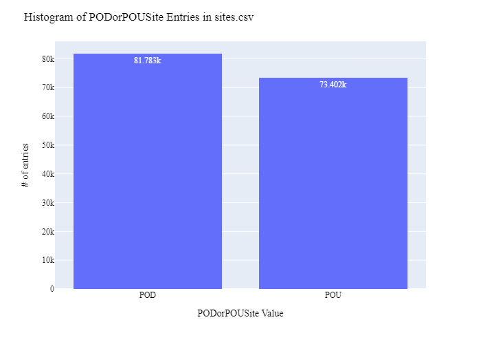
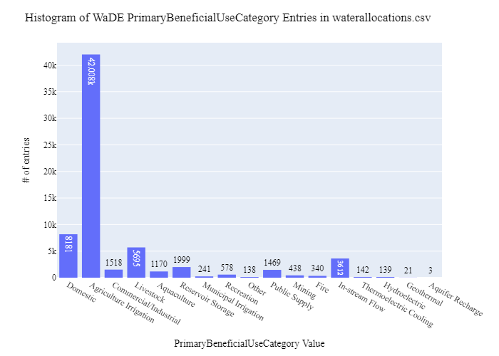

# OWRD Water Rights (Allocation amounts) Data Preparation for WaDE
This read me details the process that was applied by the staff of the [Western States Water Council (WSWC)](http://wade.westernstateswater.org/) to extracting water rights data made available by the [Oregon Water Resources Department (OWRD)](https://www.oregon.gov/OWRD/access_Data/Pages/Data.aspx), for inclusion into the Water Data Exchange (WaDE) project.  WaDE enables states to share data with each other and the public in a more streamlined way that allows regional analysis to inform planning purposes.  WaDE is not intended to replace the states data or become the source for that data but rather to enable regional analysis to inform policy decisions and for planning purposes. 

## Overview of Source Data Utilized
The following data was used for water rights...

Name | Description | Download Link | Metadata Glossary Link
---------- | ---------- | ------------ | ------------
**Oregon Water Right Points of Diversion** | Point of diversion data for water rights. Saved to zipped csv file. | [link](https://www.oregon.gov/OWRD/access_Data/Pages/Data.aspx) | [link](https://arcgis.wrd.state.or.us/data/wr_pod_metadata.pdf)
**Oregon Water Right Places of Use** | Place of use data for water rights. Saved to zipped shp file. | [link](https://www.oregon.gov/OWRD/access_Data/Pages/Data.aspx) | [link](https://arcgis.wrd.state.or.us/data/wr_pou_metadata.pdf)

## Storage for WaDE 2.0 Source and Processed Water Data
The 1) raw input data shared by the state / state agency / data provider (excel, csv, shapefiles, PDF, etc), & the 2) csv processed input data ready to load into the WaDE database, can both be found within the WaDE sponsored Google Drive.  Please contact WaDE staff if unavailable or if you have any questions about the data.
- Oregon Allocation Data: https://drive.google.com/drive/folders/16L4vA4qCP52wM8LbxAioJFhVUCl8WHME?usp=sharing

## Summary of Data Prep
The following text summarizes the process used by the WSWC staff to prepare and share water rights data for inclusion into the Water Data Exchange (WaDE 2.0) project.  For a complete mapping outline, see *ORwr_Allocation Schema Mapping to WaDE.xlsx*.  Several WaDE csv input files will be created in order to extract the water rights data from the above mentioned input.  Each of these WaDE csv input files was created using the [Python](https://www.python.org/) native language, built and ran within [Jupyter Notebooks](https://jupyter.org/) environment.  Those python files include the following...

- **1_ORwr_PreProcessAllocationData.ipynb**: used to pre-processes the native date into a WaDE format friendly format.  All datatype conversions occur here.
- **2_ORwr_CreateWaDEInputFiles.ipynb**: used to create the WaDE input csv files: methods.csv, variables.csv, organizations.csv, watersources.csv, sites.csv, waterallocations.csv, podsitetopousiterelationships.csv.
- **3_ORwr_WaDEDataAssessmentScript.ipynb**: used to evaluate the WaDE input csv files.

***
## Code File: 1_ORwr_PreProcessAllocationData.ipynb
Purpose: Pre-process the input data files and merge them into one master file for simple dataframe creation and extraction.

#### Inputs: 
 - *wr_v_pod_public.zip*, Point of diversion data for water rights. Saved to zipped csv file.
 - *wr_v_pou_public.zip*, Place of use data for water rights. Saved to zipped shp file.

#### Outputs:
 - Pwr_orMain.zip
 - P_Geometry.zip

#### Operation and Steps:
- Read in the input files.  Goal will be to create separate POD and POU centric dataframes, then join together for single long output dataframe.
- For POD data...
    - Generate WaDE *WaterSourceType* field using **wr_type** input and translate from abbreviate format.
    - Generate WaDE *SiteTypeCV* field using **source_type** input and translate from abbreviate format.
    - Generate WaDE *Owner* by determining company vs individual using **name_company**, **name_last**, and **name_first** input fields. Concatenating name of individual.
    - Formate string for WaDE *TimeframeStart* and *TimeframeEnd* fields. Use **begin_month** and **begin_day** input fields.
    - Create WaDE POD centric temporary dataframe.
- For POU data...
    - Attach related *WaterSourceType*, *Owner*, & *LegalStatus* from POD data using the **snp_id** input field.
    - Create WaDE POU centric temporary dataframe.  Extract POU relevant data (see preprocessing code).
- Concatenate temporary POD & POU dataframes together into single long output dataframe.
- Format string for WaDE *BeneficialUse**.  Use **use_code_description** input field.  Need to remove special characters.
- Format **priority_date** field to %m/%d/%Y format.
- Generate WaDE specific field *WaterSourceNativeID* from WaDE *WaterSourceName* & *WaterSourceTypeCV* fields.  Used to identify unique sources of water.
- Inspect output dataframe for additional errors / datatypes.
- Export output dataframe as new csv file, *Pwr_orMain.zip*.
- Using POU shp file, extract geometry input info and create key-value pair to geometry to site native ID using **pou_use_id** input, save and export as *P_Geometry.zip*.

***
## Code File: 2_ORwr_CreateWaDEInputFiles.ipynb
Purpose: generate WaDE csv input files (methods.csv, variables.csv, organizations.csv, watersources.csv, sites.csv, waterallocations.csv, podsitetopousiterelationships.csv).

#### Inputs:
- Pwr_orMain.zip

#### Outputs:
- methods.csv  `Create by hand.`
- variables.csv  `Create by hand.`
- organizations.csv  `Create by hand.`
- watersources.csv
- sites.csv
- waterallocations.csv
- podsitetopousiterelationships.csv

## 1) Method Information
Purpose: generate legend of granular methods used on data collection.

#### Operation and Steps:
- Generate single output dataframe *outdf*.
- Populate output dataframe with *WaDE Method* specific columns.
- Assign state info to the *WaDE Method* specific columns (this was hardcoded by hand for simplicity).
- Assign method UUID identifier to each (unique) row.
- Perform error check on output dataframe.
- Export output dataframe *methods.csv*.

#### Sample Output (WARNING: not all fields shown):
|    | MethodUUID   | ApplicableResourceTypeCV   | DataConfidenceValue   | DataCoverageValue   | DataQualityValueCV   | MethodName                 | MethodNEMILink                                                 | MethodTypeCV    | WaDEDataMappingUrl                                                                                     |
|---:|:-------------|:---------------------------|:----------------------|:--------------------|:---------------------|:---------------------------|:---------------------------------------------------------------|:----------------|:-------------------------------------------------------------------------------------------------------|
|  0 | ORwr_M1      | Surface Ground Storage     |                       |                     |                      | Oregon Water Rights Method | https://arcgis.wrd.state.or.us/data/OWRD_WR_GIS_procedures.pdf | Legal Processes | https://github.com/WSWCWaterDataExchange/MappingStatesDataToWaDE2.0/tree/master/Oregon/WaterAllocation |

## 2) Variables Information
Purpose: generate legend of granular variables specific to each state.

#### Operation and Steps:
- Generate single output dataframe *outdf*.
- Populate output dataframe with *WaDE Variable* specific columns.
- Assign state info to the *WaDE Variable* specific columns (this was hardcoded by hand for simplicity).
- Assign variable UUID identifier to each (unique) row.
- Perform error check on output dataframe.
- Export output dataframe *variables.csv*.

#### Sample Output (WARNING: not all fields shown):
|    | VariableSpecificUUID   |   AggregationInterval | AggregationIntervalUnitCV   | AggregationStatisticCV   | AmountUnitCV   | MaximumAmountUnitCV   |   ReportYearStartMonth | ReportYearTypeCV   | VariableCV   | VariableSpecificCV   |
|---:|:-----------------------|----------------------:|:----------------------------|:-------------------------|:---------------|:----------------------|-----------------------:|:-------------------|:-------------|:---------------------|
|  0 | ORwr_V1                |                     1 | Year                        | Average                  | CFS            | AFY                   |                     10 | WaterYear          | Allocation   | Allocation           |

## 3) Organization  Information
Purpose: generate organization directory, including names, email addresses, and website hyperlinks for organization supplying data source.

#### Operation and Steps:
- Generate single output dataframe *outdf*.
- Populate output dataframe with *WaDE Organizations* specific columns.
- Assign state info to the *WaDE Organizations* specific columns (this was hardcoded by hand for simplicity).
- Assign organization UUID identifier to each (unique) row.
- Perform error check on output dataframe.
- Export output dataframe *organizations.csv*.

#### Sample Output (WARNING: not all fields shown):
|    | OrganizationUUID   | OrganizationContactEmail   | OrganizationContactName   | OrganizationName                  | OrganizationPhoneNumber   | OrganizationPurview                                                                                                                                                | OrganizationWebsite                                     | State   |
|---:|:-------------------|:---------------------------|:--------------------------|:----------------------------------|:--------------------------|:-------------------------------------------------------------------------------------------------------------------------------------------------------------------|:--------------------------------------------------------|:--------|
|  0 | ORwr_O1            | wrd_dl_Director@oregon.gov | Tom Byler                 | Oregon Water Resources Department | 503-986-0900              | Water right surface Points of Diversion (POD) and groundwater Points of Appropriation (POA) locations in the state of Oregon are collectively referred to as PODs. | https://www.oregon.gov/OWRD/access_Data/Pages/Data.aspx | OR      |

## 4) Water Source Information
Purpose: generate a list of water sources specific to a water right.

#### Operation and Steps:
- Read the input file and generate single output dataframe *outdf*.
- Populate output dataframe with *WaDE WaterSources* specific columns.
- Assign state info to the *WaDE WaterSources* specific columns.  See *ORwr_Allocation Schema Mapping to WaDE.xlsx* for specific details.  Items of note are as follows...
    - *WaterSourceName* = **source** POD input.
    - *WaterSourceTypeCV* = **wr_type** POD input, translate from abbreviated format using provided dictionary.
    - *WaterSourceNativeID* = create custom wade ID based on unique entries of WaterSourceName & WaterSourceTypeCV.
- Consolidate output dataframe into water source specific information only by dropping duplicate entries, drop by WaDE specific *WaterSourceName* & *WaterSourceTypeCV* fields.
- Assign water source UUID identifier to each (unique) row.
- Perform error check on output dataframe.
- Export output dataframe *WaterSources.csv*.

#### Sample Output (WARNING: not all fields shown):
|    | WaterSourceUUID   | Geometry   | GNISFeatureNameCV   | WaterQualityIndicatorCV   | WaterSourceName   | WaterSourceNativeID   | WaterSourceTypeCV   |
|---:|:------------------|:-----------|:--------------------|:--------------------------|:------------------|:----------------------|:--------------------|
|  0 | ORwr_WSwadeID10   |            |                     | Fresh                     | Unnamed Stream 1  | wadeID10              | Surface Water       |

Any data fields that are missing required values and dropped from the WaDE-ready dataset are instead saved in a separate csv file (e.g. *watersources_missing.csv*) for review.  This allows for future inspection and ease of inspection on missing items.  Mandatory fields for the water sources include the following...
- WaterSourceUUID
- WaterQualityIndicatorCV
- WaterSourceTypeCV

## 5) Site Information
Purpose: generate a list of sites information.

#### Operation and Steps:
- Read the input file and generate single output dataframe *outdf*.
- Populate output dataframe with *WaDE Site* specific columns.
- Assign state info to the *WaDE Site* specific columns.  See *NV_POD_Allocation Schema Mapping to WaDE_QA.xlsx* & *NV_POU_Allocation Schema Mapping to WaDE_QA.xlsx* for specific details.  Items of note are as follows...
    - Extract *WaterSourceUUID* from waterSources.csv input csv file. See code for specific implementation of extraction.
    - *Latitude* = use ArcGIS to generate latitude information for both POD and POU inputs. For POD use y-coordinate of point, for POU use y-coordinate of centroid of polygon.  Covert to EPSG: 4326 projection.
    - *Longitude* = use ArcGIS to generate longitude information for both POD and POU inputs. For POD use x-coordinate of point, for POU use x-coordinate of centroid of polygon.  Covert to EPSG: 4326 projection.
    - *SiteNativeID* = **pod_location_id** for POD, **pou_use_id** for POU.
    - *SiteTypeCV* = **source_type** for POD, translate from abbreviated format with provided dictionary.
- Consolidate output dataframe into site specific information only by dropping duplicate entries, drop by WaDE specific *SiteNativeID*, *SiteName*, *SiteTypeCV*, *Longitude* & *Latitude* fields.
- Assign site UUID identifier to each (unique) row.
- Perform error check on output dataframe.
- Export output dataframe *sites.csv*.

#### Sample Output (WARNING: not all fields shown):
|    | SiteUUID       | RegulatoryOverlayUUIDs   | WaterSourceUUIDs   | CoordinateAccuracy   | CoordinateMethodCV   | County   |   EPSGCodeCV | GNISCodeCV   |        HUC12 |     HUC8 |   Latitude |   Longitude | NHDNetworkStatusCV   | NHDProductCV   | PODorPOUSite   | SiteName   | SiteNativeID   | SitePoint   | SiteTypeCV   | StateCV   | USGSSiteID   |
|---:|:---------------|:-------------------------|:-------------------|:---------------------|:---------------------|:---------|-------------:|:-------------|-------------:|---------:|-----------:|------------:|:---------------------|:---------------|:---------------|:-----------|:---------------|:------------|:-------------|:----------|:-------------|
|  0 | ORwr_SPOD10000 | ORre_ROor2               | ORwr_WSwadeID3     | WaDE Blank           | WaDE Blank           | Yamhill  |         4326 |              | 170900070304 | 17090007 |    45.2072 |    -123.058 |                      |                | POD            | WaDE Blank | POD10000       |             | well         | OR        |              |

Any data fields that are missing required values and dropped from the WaDE-ready dataset are instead saved in a separate csv file (e.g. *sites_missing.csv*) for review.  This allows for future inspection and ease of inspection on missing items.  Mandatory fields for the sites include the following...
- SiteUUID 
- CoordinateMethodCV
- EPSGCodeCV
- SiteName

## 6) AllocationsAmounts Information
Purpose: generate master sheet of water allocations to import into WaDE 2.0.

#### Operation and Steps:
- Read the input files and generate single output dataframe *outdf*.
- Populate output dataframe with *WaDE Water Allocations* specific columns.
- Assign state info to the *WaDE Water Allocations* specific columns.  See *ORwr_Allocation Schema Mapping to WaDE.xlsx* for specific details.  Items of note are as follows...
    - Extract *MethodUUID*, *VariableSpecificUUID*, *OrganizationUUID*, & *SiteUUID* from respective input csv files. See code for specific implementation of extraction.
    - *AllocationCropDutyAmount* = **duty** POD input.
    - *AllocationFlow_CFS* = **rate_cfs** POD input.
    - *AllocationNativeID* = **snp_id** for both POD and POU inputs.
    - *AllocationOwner* = **name last**, **name first**, **name_company** POD inputs.
    - *AllocationPriorityDate* = **priority_date**.
    - *AllocationTimeframeEnd* = **end_month**, **end_day** POD inputs.
    - *AllocationTimeframeStart* = **begin_month**, **begin_day** POD inputs.
    - *BeneficialUseCategory* = **use_code_description**.
    - *IrrigatedAcreage* = *wris_acres* POU input.
    - *WaterAllocationNativeURL* = **pod_link** POD input.
- Consolidate output dataframe into water allocations specific information only by grouping entries by *AllocationNativeID* filed.
- Perform error check on output dataframe .
- Export output dataframe *waterallocations.csv*.

#### Sample Output (WARNING: not all fields shown):
|    | AllocationUUID   | MethodUUID   | OrganizationUUID   | SiteUUID                       | VariableSpecificUUID   | AllocationApplicationDate   | AllocationAssociatedConsumptiveUseSiteIDs   | AllocationAssociatedWithdrawalSiteIDs   | AllocationBasisCV   | AllocationChangeApplicationIndicator   | AllocationCommunityWaterSupplySystem   | AllocationCropDutyAmount   | AllocationExpirationDate   |   AllocationFlow_CFS | AllocationLegalStatusCV   |   AllocationNativeID | AllocationOwner   | AllocationPriorityDate   | AllocationSDWISIdentifierCV   | AllocationTimeframeEnd   | AllocationTimeframeStart   | AllocationTypeCV    |   AllocationVolume_AF | BeneficialUseCategory              | CommunityWaterSupplySystem   | CropTypeCV   | CustomerTypeCV   | DataPublicationDate   | DataPublicationDOI   |   ExemptOfVolumeFlowPriority | GeneratedPowerCapacityMW   |   IrrigatedAcreage | IrrigationMethodCV   | LegacyAllocationIDs   | OwnerClassificationCV   | PopulationServed   | PowerType   | PrimaryBeneficialUseCategory   | WaterAllocationNativeURL                                                  |
|---:|:-----------------|:-------------|:-------------------|:-------------------------------|:-----------------------|:----------------------------|:--------------------------------------------|:----------------------------------------|:--------------------|:---------------------------------------|:---------------------------------------|:---------------------------|:---------------------------|---------------------:|:--------------------------|---------------------:|:------------------|:-------------------------|:------------------------------|:-------------------------|:---------------------------|:--------------------|----------------------:|:-----------------------------------|:-----------------------------|:-------------|:-----------------|:----------------------|:---------------------|-----------------------------:|:---------------------------|-------------------:|:---------------------|:----------------------|:------------------------|:-------------------|:------------|:-------------------------------|:--------------------------------------------------------------------------|
|  0 | ORwr_WR100001    | ORwr_M1      | ORwr_O1            | ORwr_SPOU86682,ORwr_SPOD106791 | ORwr_V1                |                             |                                             |                                         | WaDE Blank          |                                        |                                        |                            |                            |                 0.01 | WaDE Blank                |               100001 | Ted Nixon         | 1976-06-03               |                               | 12/31                    | 1/1                        | Prior Appropriation |                     0 | DOMESTIC INCLUDING LAWN AND GARDEN |                              |              |                  | 07/11/2024            |                      |                            0 |                            |                  0 |                      |                       | Private                 |                    |             | Domestic                       | https://apps.wrd.state.or.us/apps/wr/wrinfo/wr_details.aspx?snp_id=100001 |

Any data fields that are missing required values and dropped from the WaDE-ready dataset are instead saved in a separate csv file (e.g. *waterallocations_missing.csv*) for review.  This allows for future inspection and ease of inspection on missing items.  Mandatory fields for the water allocations include the following...
- MethodUUID
- VariableSpecificUUID
- OrganizationUUID
- SiteUUID
- AllocationPriorityDate
- BeneficialUseCategory
- AllocationAmount or AllocationMaximum
- DataPublicationDate

### 7) POD Site -To- POU Polygon Relationships
Purpose: generate linking element between POD and POU sites that share the same water right.
Note: podsitetopousiterelationships.csv output only needed if both POD and POU data is present,  `otherwise produces empty file.`

#### Operation and Steps:
- Read the sites.csv & waterallocations.csv input files.
- Create three temporary dataframes: one for waterallocations, & two for site info that will store POD and POU data separately.
- For the temporary POD dataframe...
  - Read in site.csv data from sites.csv with a _PODSiteUUID_ field = POD only.
  - Create _PODSiteUUID_ field = _SiteUUID_.
- For the temporary POU dataframe
  - Read in site.csv data from sites.csv with a _PODSiteUUID_ field = POU only.
  - Create _POUSiteUUID_ field = _SiteUUID_.
- For the temporary waterallocations dataframe, explode _SiteUUID_ field to create unique rows.
- Left-merge POD & POU dataframes to the waterallocations dataframe via _SiteUUID_ field.
- Consolidate waterallocations dataframe by grouping entries by _AllocationNativeID_ filed.
- Explode the consolidated waterallocations dataframe again using the _PODSiteUUID_ field, and again for the _POUSiteUUID_ field to create unique rows.
- Perform error check on waterallocations dataframe (check for NaN values)
- If waterallocations is not empty, export output dataframe _podsitetopousiterelationships.csv_.

***
## Source Data & WaDE Complied Data Assessment
The following info is from a data assessment evaluation of the completed data...

Dataset | Num of Source Entries (rows)
---------- | ---------- 
**Oregon Water Right Points of Diversion** | 195,986
**Oregon Water Right Places of Use** | 110,623

Dataset  | Num of Identified PODs | Num of Identified POUs | Num of Identified Water Right Records
---------- | ------------ | ------------ | ------------
**Compiled WaDE Data** | 81,783  | 73,402 | 67,692

Assessment of Removed Source Records | Count | Action
---------- | ---------- | ----------
Unused WaterSource Record  | 4,748 | removed from watersources.csv input
Unused Site Record  | 79,597 | removed from sites.csv input
Incomplete or bad entry for Latitude | 512 | removed from sites.csv input
Incomplete or bad entry for WaterSourceUUIDs | 69 | removed from sites.csv input
Incomplete or bad entry for Flow                       | 11865  | removed from waterallocations.csv input
Incomplete or bad entry for Volume                     |  2715  | removed from waterallocations.csv input
Incomplete or bad entry for AllocationTimeframeEnd     |  2557  | removed from waterallocations.csv input
Incomplete or bad entry for AllocationPriorityDate     |  1465  | removed from waterallocations.csv input
Incomplete or bad entry for IrrigatedAcreage           |  1148  | removed from waterallocations.csv input
Incomplete or bad entry for AllocationCropDutyAmount   |  1065  | removed from waterallocations.csv input
Incomplete or bad entry for SiteUUID                   |    6 | removed from waterallocations.csv input
Incomplete or bad entry for AllocationTimeframeStart   |    6 | removed from waterallocations.csv input

**Figure 1:** Distribution of POD vs POU Sites within the sites.csv

**Figure 2:** Distribution Sites by WaterSourceTypeCV within the sites.csv

**Figure 3:** Distribution of Identified Water Right Records by WaDE Categorized Primary Beneficial Uses within the waterallocations.csv

**Figure 4a:** Range of Priority Date of Identified Water Right Records within the waterallocations.csv

**Figure 4b:** Cumulative distribution of Priority Date of Identified Water Right Records within the waterallocations.csv

**Figure 5:** Distribution & Range of Flow (CFS) of Identified Water Right Records within the waterallocations.csv

**Figure 6:** Distribution & Range of Volume (AF) of Identified Water Right Records within the waterallocations.csv

**Figure 7:** Map of Identified Points within the sites.csv

**Figure 8:** Map of Identified Polygons within the sites.csv

***
## Staff Contributions
Data created here was a contribution between the [Western States Water Council (WSWC)](http://wade.westernstateswater.org/) and the [Oregon Water Resources Department (OWRD)](https://www.oregon.gov/OWRD/access_Data/Pages/Data.aspx).

WSWC Staff
- Ryan James <rjames@wswc.utah.gov>
- Adel Abdallah <adelabdallah@wswc.utah.gov>

OWRD Staff
- Jordan Beamer
- Tracy Fox
- Melendy Bradley
- Mellony Joskinson
- Greg Dubenko
- Richard Marvin
