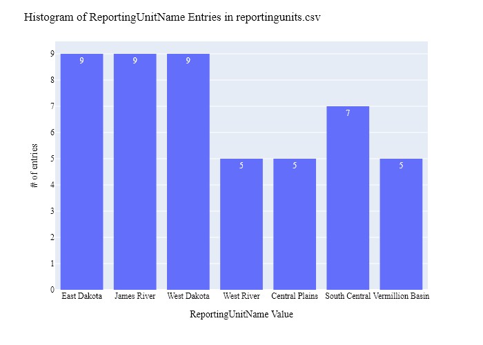
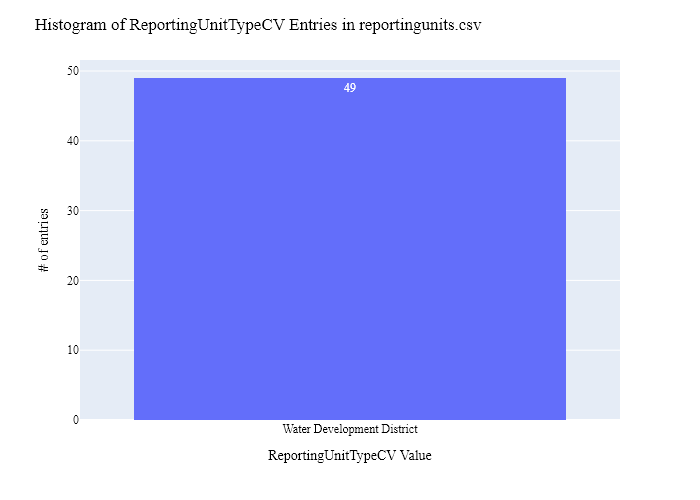
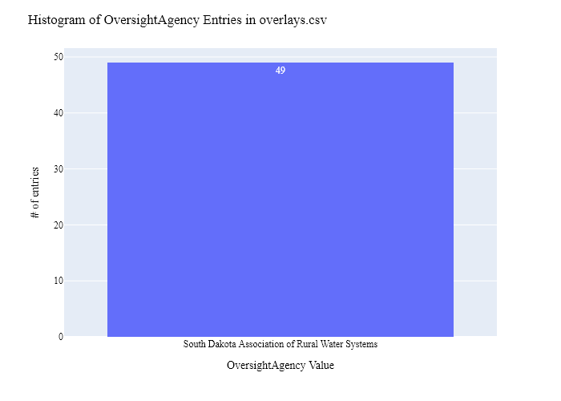
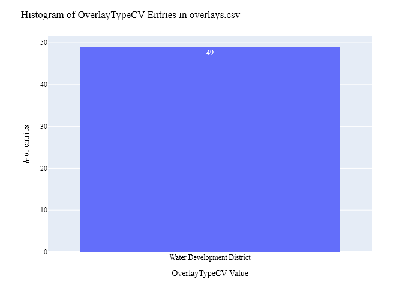
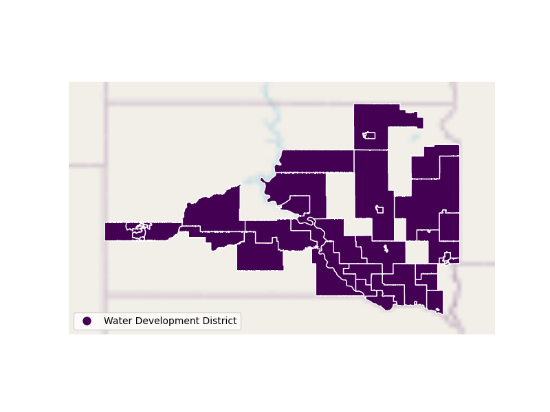

# South Dakota Association of Rural Water Systems Overlay Data Preparation for WaDE
This readme details the process that was applied by the staff of the [Western States Water Council (WSWC)](http://wade.westernstateswater.org/) to extracting overlay area data, made available by the [South Dakota Association of Rural Water Systems](https://www.sdarws.com/), for inclusion into the Water Data Exchange (WaDE) project.  WaDE enables states to share data with each other and the public in a more streamlined and cost-effective way.

## Overview of Source Data Utilized
The following data was used for water allocations...

Name | Description | Download Link | Metadata Glossary Link
---------- | ---------- | ------------ | ------------
**South_Dakota_Water_Development_Districts** | Development district polygon data | [link](https://www.arcgis.com/apps/mapviewer/index.html?layers=4a057946640c487d824eaee7ec5e6107) | Not Provided

Unique files were created to be used as input.  Input files used are as follows...
- South_Dakota_Water_Development_Districts.zip

## Storage for WaDE 2.0 Source and Processed Water Data
The 1) raw input data shared by the state / state agency / data provider (excel, csv, shapefiles, PDF, etc), & the 2) csv processed input data ready to load into the WaDE database, can both be found within the WaDE sponsored Google Drive.  Please contact WaDE staff if unavailable or if you have any questions about the data.
- South Dakota Association of Rural Water Systems Overlay Data:[link](https://drive.google.com/drive/folders/1KqITl7GPeSk5vqqukz5HbZPLvcQkVnac?usp=drive_link)

## Summary of Data Prep
The following text summarizes the process used by the WSWC staff to prepare and share the state's overlay data for inclusion into the Water Data Exchange (WaDE 2.0) project.  For a complete mapping outline, see *SDov_Overlay Info Schema Mapping to WaDE.xlsx*. Several WaDE csv input files will be created in order to extract the overlay data from the above mentioned input.  Each of these WaDE csv input files was created using the [Python](https://www.python.org/) native language, built and ran within [Jupyter Notebooks](https://jupyter.org/) environment.  Those python files include the following...

- **1_SDov_PreProcessOverlayData.ipynb**: used to pre-processes the native date into a WaDE format friendly format.  All datatype conversions occur here.
- **2_SDov_CreateWaDEInputFiles.ipynb**: used to create the WaDE input csv files: date.csv, organization.csv, reportingunits.csv, overlays.csv, overlayreportingunits.csv, etc.
- **3_SDov_WaDEDataAssessmentScript.ipynb**: used to evaluate the WaDE input csv files.

***
## Code File: 1_SDov_PreProcessOverlayData.ipynb
Purpose: Pre-process the input data files and merge them into one master file for simple dataframe creation and extraction.

#### Inputs: 
- South_Dakota_Water_Development_Districts.zip

#### Outputs:
 - Pov_Main.zip
 - P_Geometry.zip

#### Operation and Steps:
- Read in input data, convert to epsg=4326, save to temp Geo-DataFrame.
- Extract polygon name from **name** input abbreviations.
- Extract key WaDE elements.
- Export output dataframe as new csv file, *Pov_Main.csv* for tabular data and *P_Geometry.csv* for geometry data.

***
## Code File: 2_SDov_CreateWaDEInputFiles.ipynb
Purpose: generate WaDE csv input files (date.csv, organizations.csv, reportingunits.csv, overlays.csv, overlayreportingunits.csv.

#### Inputs:
- Pov_Main.zip
- P_Geometry.zip

#### Outputs:
- date.csv  `Create by hand.`
- organizations.csv  `Create by hand.`
- reportingunits.csv
- overlays.csv 
- overlayreportingunits.csv

## 1) Date Information
Purpose: generate legend of granular date used on data collection.

#### Operation and Steps:
- Generate single output dataframe *outdf*.
- Populate output dataframe with *WaDE Date* specific columns.
- Assign agency info to the *WaDE Date* specific columns (this was hardcoded by hand for simplicity).
- Perform error check on output dataframe.
- Export output dataframe *methods.csv*.

#### Sample Output (WARNING: not all fields shown):
|    | Date     |   Year |
|---:|:---------|-------:|
|  0 | 8/7/2023 |   2023 |

## 2) Organization Information
Purpose: generate organization directory, including names, email addresses, and website hyperlinks for organization supplying data source.

#### Operation and Steps:
- Generate single output dataframe *outdf*.
- Populate output dataframe with *WaDE Organizations* specific columns.
- Assign agency info to the *WaDE Organizations* specific columns (this was hardcoded by hand for simplicity).
- Assign organization UUID identifier to each (unique) row.
- Perform error check on output dataframe.
- Export output dataframe *organizations.csv*.

#### Sample Output (WARNING: not all fields shown):
|    | OrganizationUUID   | OrganizationContactEmail   | OrganizationContactName   | OrganizationName                                | OrganizationPhoneNumber   | OrganizationPurview         | OrganizationWebsite     | State   |
|---:|:-------------------|:---------------------------|:--------------------------|:------------------------------------------------|:--------------------------|:----------------------------|:------------------------|:--------|
|  0 | SDov_O1            | jennifermartin@nd.gov      | Jennifer Martin           | South Dakota Association of Rural Water Systems | (605) 556-7219            | Water Development Districts | https://www.sdarws.com/ | SD      |

### 3) Reporting Unit Information
Purpose: generate a list of polygon areas associated with the state agency overlay area data.

#### Operation and Steps:
- Read the input file and generate single output dataframe *outdf*.
- Populate output dataframe with *WaDE ReportingUnits* specific columns.
- Assign state agency data info to the *WaDE ReportingUnits* specific columns.  See *SDov_Overlay Info Schema Mapping to WaDE.xlsx* for specific details.  Items of note are as follows...
    - *ReportingUnitUUID* = ""
    - *EPSGCodeCV* = 4326.
    - *ReportingUnitName* = **name**
    - *ReportingUnitNativeID* = **OBJECTID**, use with counter element.
    - *ReportingUnitProductVersion* = ""
    - *ReportingUnitTypeCV* = "Water Development District"
    - *ReportingUnitUpdateDate* = "3/21/2021"
    - *StateCV* = "SD"
    - *Geometry* = extract from **geometry** field.
- Consolidate output dataframe into site specific information only by dropping duplicate entries, drop by WaDE specific *ReportingUnitName*, *ReportingUnitNativeID* & *ReportingUnitTypeCV* fields.
- Assign reportingunits UUID identifier to each (unique) row.
- Perform error check on output dataframe.
- Export output dataframe *reportingunits.csv*.

#### Sample Output (WARNING: not all fields shown):
|    | ReportingUnitUUID   |   EPSGCodeCV | ReportingUnitName   | ReportingUnitNativeID   | ReportingUnitProductVersion   | ReportingUnitTypeCV        | ReportingUnitUpdateDate   | StateCV   |
|---:|:--------------------|-------------:|:--------------------|:------------------------|:------------------------------|:---------------------------|:--------------------------|:----------|
|  1 | SDov_RUSD10         |         4326 | James River         | SD10                    |                               | Water Development District | 3/21/2021                 | SD        |

Any data fields that are missing required values and dropped from the WaDE-ready dataset are instead saved in a separate csv file (e.g. *reportingunits_missing.csv*) for review.  This allows for future inspection and ease of inspection on missing items.  Mandatory fields for the reportingunits include the following...
- ReportingUnitUUID
- ReportingUnitName
- ReportingUnitNativeID
- ReportingUnitTypeCV
- StateCV

### 4) Overlays Information
Purpose: generate master sheet of overlay area information to import into WaDE 2.0.

#### Operation and Steps:
- Read the input files and generate single output dataframe *outdf*.
- Populate output dataframe with *WaDE Water Overlays* specific columns.
- Assign state agency data info to the *WaDE Water Overlays* specific columns.  See *SDov_Overlay Info Schema Mapping to WaDE.xlsx* for specific details.  Items of note are as follows...
    - *OverlayUUID* = ""
    - *OversightAgency* = "South Dakota Association of Rural Water Systems"
    - *OverlayDescription* = "work to promote the conservation, development and proper management of water resources"
    - *OverlayName* = **name**
    - *OverlayNativeID* = **OBJECTID**, use with counter element.
    - *OverlayStatusCV* = "Active"
    - *Statue* = ""
    - *StatuteLink* = ""
    - *StatutoryEffectiveDate* = "1/1/2011"
    - *OverlayTypeCV* = "Water Development District"
    - *WaterSourceTypeCV* = "Surface Water"
- Perform error check on output dataframe.
- Export output dataframe *overlays.csv*.

#### Sample Output (WARNING: not all fields shown):
|    | OverlayUUID   | OversightAgency                                 | OverlayDescription                                                                     | OverlayName    |   OverlayNativeID | OverlayStatusCV   | Statute   | StatuteLink   | StatutoryEffectiveDate   | StatutoryEndDate   | OverlayTypeCV              | WaterSourceTypeCV   |
|---:|:--------------|:------------------------------------------------|:---------------------------------------------------------------------------------------|:---------------|------------------:|:------------------|:----------|:--------------|:-------------------------|:-------------------|:---------------------------|:--------------------|
|  1 | SDov_RO34     | South Dakota Association of Rural Water Systems | work to promote the conservation, development and proper management of water resources | Central Plains |                34 | Active            |           |               | 2011-01-01               |                    | Water Development District | Surface Water       |

Any data fields that are missing required values and dropped from the WaDE-ready dataset are instead saved in a separate csv file (e.g. *overlays_missing.csv*) for review.  This allows for future inspection and ease of inspection on missing items.  Mandatory fields for the water overlays include the following...
- OverlayUUID 
- OversightAgency
- OverlayDescription
- OverlayName
- OverlayStatusCV
- StatutoryEffectiveDate

### 5) Overlay Reporting Units Information
Purpose: generate master sheet of overlay area information and how it algins with reporting unit area information.

#### Operation and Steps:
- Read the input file and generate single output dataframe *outdf*.
- Populate output dataframe with *WaDE OverlayReportingunits* specific columns.
- Assign state agency data info to the *WaDE OverlayReportingunits* specific columns.  See *SDov_Overlay Info Schema Mapping to WaDE.xlsx* for specific details.  Items of note are as follows...
    - *DataPublicationDate* = use date of file creation
    - *OrganizationUUID* = pull from organization.csv
    - *OverlayUUID* = pull form overlay.csv
    - *ReportingUnitUUID* = pull from reportingunit.csv
- Perform error check on output dataframe.
- Export output dataframe *overlayreportingunits.csv*.

#### Sample Output (WARNING: not all fields shown):
|    | DataPublicationDate   | OrganizationUUID   | OverlayUUID   | ReportingUnitUUID   |
|---:|:----------------------|:-------------------|:--------------|:--------------------|
|  1 | 2025-06-09            | SDov_O1            | SDov_RO2      | SDov_RUSD2          |

Any data fields that are missing required values and dropped from the WaDE-ready dataset are instead saved in a separate csv file (e.g. *overlayreportingunits_missing.csv*) for review.  This allows for future inspection and ease of inspection on missing items.  Mandatory fields for the reportingunits include the following...
- DataPublicationDate
- OrganizationUUID
- OverlayUUID 
- ReportingUnitUUID

***
## Source Data & WaDE Complied Data Assessment
The following info is from a data assessment evaluation of the completed data...

Dataset | Num of Source Entries (rows) 
---------- | ----------
**South_Dakota_Water_Development_Districts** | 49

Dataset | Num of Identified Reporting Units | Num of Identified Overlays
---------- | ---------- | ------------
**Compiled WaDE Data** | 49 | 49

Assessment of Removed Source Records | Count | Action
---------- | ---------- | ----------
...nothing removed |  | 

**Figure 1:** Distribution of Reporting Unit Name within reportingunits.csv

**Figure 2:** Distribution of Reporting Unit Type within reportingunits.csv

**Figure 3:** Distribution of Oversight Agency within the overlays.csv

**Figure 4:** Distribution of Overlay Type within the overlays.csv

**Figure 5:** Map of Overlay Areas (i.e., Reporting Unit)

***
## Staff Contributions
Data created here was a contribution between the [Western States Water Council (WSWC)](http://wade.westernstateswater.org/) and the [South Dakota Association of Rural Water Systems](https://www.sdarws.com/).

WSWC Staff
- Ryan James (Data Analysis) <rjames@wswc.utah.gov>

South Dakota Association of Rural Water Systems Staff
- N/A
