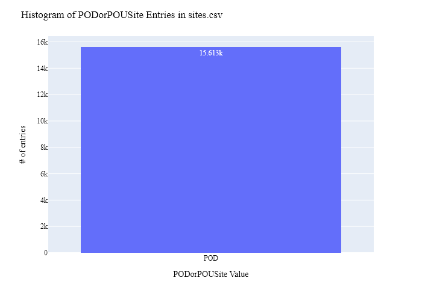
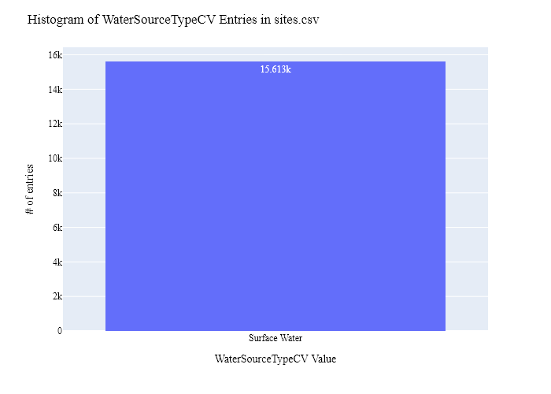
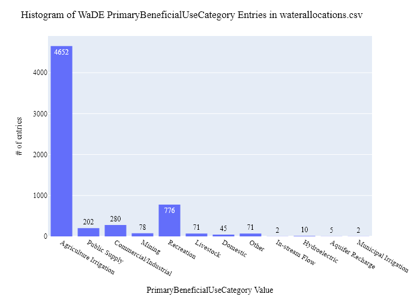
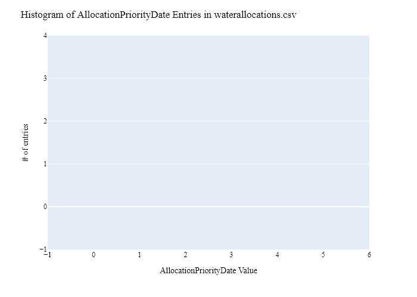
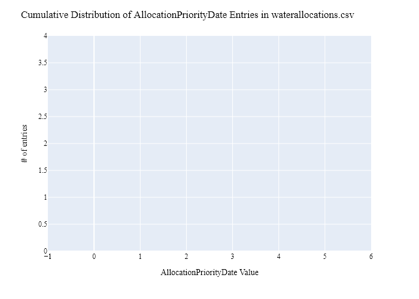
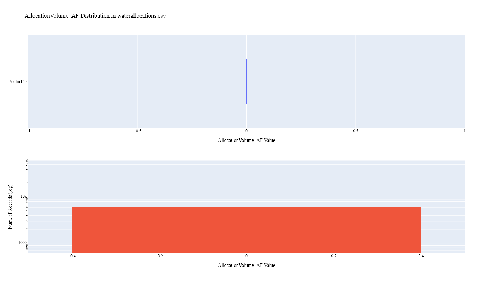
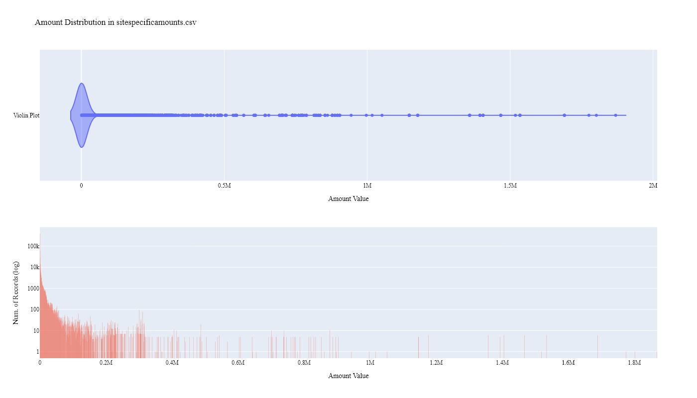
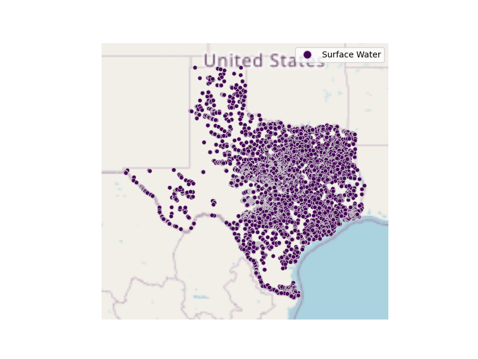

# TCEQ Water Rights (Allocation) & Water Use Data Preparation for WaDE
This readme details the process that was applied by the staff of the [Western States Water Council (WSWC)](http://wade.westernstateswater.org/) to extracting water rights & water use data made available by the [Texas Commission on Environmental Quality (TCEQ)](https://www.tceq.texas.gov/), for inclusion into the Water Data Exchange (WaDE) project.  WaDE enables states to share data with each other and the public in a more streamlined and consistent way. WaDE is not intended to replace the states data or become the source for that data but rather to enable regional analysis to inform policy decisions and for planning purposes. 

## Overview of Source Data Utilized
The following data was used for water allocations...

Name | Description | Download Link | Metadata Glossary Link
---------- | ---------- | ------------ | ------------
**Water Rights As Single Points** | Point of diversion (POD) water rights data. Made available through ArcGis map services. | [link](https://gisweb.tceq.texas.gov/arcgis/rest/services/WaterRights/WaterRightsViewer/MapServer/3) | not provided
**Water Right Owner** | Owner information related to water right data. Made available through ArcGis map services. | [link](https://gisweb.tceq.texas.gov/arcgis/rest/services/WaterRights/WaterRightsViewer/MapServer/14) | not provided
**Water Use** | Water right beneficial use information. Made available through ArcGis map services. | [link](https://gisweb.tceq.texas.gov/arcgis/rest/services/WaterRights/WaterRightsViewer/MapServer/13) | not provided

Input files used are as follows...
- Water_Rights_As_Single_Points.zip
- WaterRightOwner.zip
- WaterUse.zip
 

## Storage for WaDE 2.0 Source and Processed Water Data
The 1) raw input data shared by the state / state agency / data provider (excel, csv, shapefiles, PDF, etc), & the 2) csv processed input data ready to load into the WaDE database, can both be found within the WaDE sponsored Google Drive.  Please contact WaDE staff if unavailable or if you have any questions about the data.
- Texas Allocation & Water Use Data: https://drive.google.com/drive/folders/1LCE-tjTzGGwWbchy2MINAmbodEUCwcef?usp=drive_link

## Summary of Data Prep
The following text summarizes the process used by the WSWC staff to prepare and share TCEQ's water rights & water use data for inclusion into the Water Data Exchange (WaDE 2.0) project.  For a complete mapping outline, see *TCEQ_Allocation and Water Use Schema Mapping to WaDE.xlsx*.  Several WaDE csv input files will be created in order to extract the TCEQ's water rights & water use data from the above mentioned input.  Each of these WaDE csv input files was created using the [Python](https://www.python.org/) native language, built and ran within [Jupyter Notebooks](https://jupyter.org/) environment.  Those python files include the following...

- **1_TCEQwr_wu_PreProcessAllocationData.ipynb**: used to pre-processes the native date into a WaDE format friendly format.  All datatype conversions occur here.
- **2_TCEQwr_wu_CreateWaDEInputFiles.ipynb**: used to create the WaDE input csv files: methods.csv, variables.csv, organizations.csv, watersources.csv, sites.csv, waterallocations.csv, sitespecificamounts.csv, podsitetopousiterelationships.csv.
- **3_TCEQwr_wu_WaDEDataAssessmentScript.ipynb**: used to evaluate the WaDE input csv files.

***
### 0) Code File: 1_TCEQwr_wu_PreProcessAllocationData.ipynb
Purpose: Pre-process the state agency's input data files and merge them into one master file for simple dataframe creation and extraction.

#### Inputs: 
- Water_Rights_As_Single_Points.zip
- WaterRightOwner.zip
- WaterUse.zip

#### Outputs:
 - Pssdw_txMain.zip

#### Operation and Steps:
- Read in owner and water use file information.  Clean up any errors & remove any special characters.  Group by information by **Water Right ID**.
- Read in water right as single points information.  Left-join owner and water use information via **Water Right ID** input.
- Inspect output dataframe for additional errors / datatypes.
- Export output dataframe as new csv file, *Pssdw_txMain.zip*.

***
## Code File: 2_NMwr_CreateWaDEInputFiles.ipynb
Purpose: generate WaDE csv input files (methods.csv, variables.csv, organizations.csv, watersources.csv, sites.csv, waterallocations.csv, sitespecificamounts.csv, podsitetopousiterelationships.csv).

#### Inputs:
- Pssdw_txMain.zip

#### Outputs:
- methods.csv  `Create by hand.`
- variables.csv  `Create by hand.`
- organizations.csv  `Create by hand.`
- watersources.csv
- sites.csv
- waterallocations.csv
- sitespecificamounts.csv
- podsitetopousiterelationships.csv

## 1) Method Information
Purpose: generate legend of granular methods used on data collection.

#### Operation and Steps:
- Generate single output dataframe *outdf*.
- Populate output dataframe with *WaDE Method* specific columns.
- Assign state info to the *WaDE Method* specific columns (this was hardcoded by hand for simplicity).
- Assign method UUID identifier to each (unique) row.
- Perform error check on output dataframe.
- Export output dataframe *methods.csv*.

#### Sample Output (WARNING: not all fields shown):
MethodUUID | ApplicableResourceTypeCV | MethodTypeCV
---------- | ---------- | ------------
TXwr_M1 | Surface Water and Groundwater | Legal Processes

## 2) Variables Information
Purpose: generate legend of granular variables specific to each state.

#### Operation and Steps:
- Generate single output dataframe *outdf*.
- Populate output dataframe with *WaDE Variable* specific columns.
- Assign state info to the *WaDE Variable* specific columns (this was hardcoded by hand for simplicity).
- Assign variable UUID identifier to each (unique) row.
- Perform error check on output dataframe.
- Export output dataframe *variables.csv*.

#### Sample Output (WARNING: not all fields shown):
|    | VariableSpecificUUID   |   AggregationInterval | AggregationIntervalUnitCV   | AggregationStatisticCV   | AmountUnitCV   | MaximumAmountUnitCV   |   ReportYearStartMonth | ReportYearTypeCV   | VariableCV   | VariableSpecificCV                                    |
|---:|:-----------------------|----------------------:|:----------------------------|:-------------------------|:---------------|:----------------------|-----------------------:|:-------------------|:-------------|:------------------------------------------------------|
|  1 | TCEQwr_V2              |                     1 | Monthly                     | Average                  | AF             | AF                    |                      1 | CalendarYear       | Water Use    | Water Use_Monthly_Commercial/Industrial_Surface Water |

## 3) Organization  Information
Purpose: generate organization directory, including names, email addresses, and website hyperlinks for organization supplying data source.

#### Operation and Steps:
- Generate single output dataframe *outdf*.
- Populate output dataframe with *WaDE Organizations* specific columns.
- Assign state info to the *WaDE Organizations* specific columns (this was hardcoded by hand for simplicity).
- Assign organization UUID identifier to each (unique) row.
- Perform error check on output dataframe.
- Export output dataframe *organizations.csv*.

#### Sample Output (WARNING: not all fields shown):
|    | OrganizationUUID   | OrganizationContactEmail       | OrganizationContactName   | Unnamed: 3   | OrganizationName                          | OrganizationPhoneNumber   | OrganizationPurview                                                                      | OrganizationWebsite         | State   |
|---:|:-------------------|:-------------------------------|:--------------------------|:-------------|:------------------------------------------|:--------------------------|:-----------------------------------------------------------------------------------------|:----------------------------|:--------|
|  0 | TCEQwr_O1          | kathy.alexander@tceq.texas.gov | Kathy Alexander           |              | Texas Commission on Environmental Quality | 512-239-1000              | The Texas Commission on Environmental Quality is the environmental agency for the state. | https://www.tceq.texas.gov/ | TX      |

## 4) Water Source Information
Purpose: generate a list of water sources specific to a water right.

#### Operation and Steps:
- Read the input file and generate single output dataframe *outdf*.
- Populate output dataframe with *WaDE WaterSources* specific columns.
- Assign state info to the *WaDE WaterSources* specific columns.  See *TCEQ_Allocation and Water Use Schema Mapping to WaDE.xlsx* for specific details.
- Consolidate output dataframe into water source specific information only by dropping duplicate entries, drop by WaDE specific *WaterSourceName* & *WaterSourceTypeCV* fields.
  - no useable water source information was provided at this time.
- Assign water source UUID identifier to each (unique) row.
- Perform error check on output dataframe.
- Export output dataframe *WaterSources.csv*.

#### Sample Output (WARNING: not all fields shown):
|    | WaterSourceUUID   | Geometry   | GNISFeatureNameCV   | WaterQualityIndicatorCV   | WaterSourceName   | WaterSourceNativeID   | WaterSourceTypeCV   |
|---:|:------------------|:-----------|:--------------------|:--------------------------|:------------------|:----------------------|:--------------------|
|  0 | TCEQwr_WSwadeId1  |            |                     | Fresh                     | Wade Blank        | wadeId1               | Surface Water       |

Any data fields that are missing required values and dropped from the WaDE-ready dataset are instead saved in a separate csv file (e.g. *watersources_missing.csv*) for review.  This allows for future inspection and ease of inspection on missing items.  Mandatory fields for the water sources include the following...
- WaterSourceUUID
- WaterQualityIndicatorCV
- WaterSourceTypeCV

## 5) Site Information
Purpose: generate a list of sites information.

#### Operation and Steps:
- Read the input file and generate single output dataframe *outdf*.
- Populate output dataframe with *WaDE Site* specific columns.
- Assign state info to the *WaDE Site* specific columns.  See *TCEQ_Allocation and Water Use Schema Mapping to WaDE.xlsx* for specific details.  Items of note are as follows...
    - *Latitude* = **Latitude**, will need to convert from EPSG:4269 -to- EPSG:4326. Do this in ArcGis.
    - *Longitude* = **Longitude**, will need to convert from EPSG:4269 -to- EPSG:4326. Do this in ArcGis.
    - *SiteNativeID* = not provided, create custom wade ID as temp fix.
    - *SiteTypeCV* = **TYPE**, clean up any errors.
- Consolidate output dataframe into site specific information only by dropping duplicate entries, drop by WaDE specific *SiteNativeID*, *SiteName*, *SiteTypeCV*, *Longitude* & *Latitude* fields.
- Assign site UUID identifier to each (unique) row.
- Perform error check on output dataframe.
- Export output dataframe *sites.csv*.

#### Sample Output (WARNING: not all fields shown):
|    | SiteUUID             | RegulatoryOverlayUUIDs   | WaterSourceUUIDs   | CoordinateAccuracy   | CoordinateMethodCV   | County     |   EPSGCodeCV | Geometry   | GNISCodeCV   | HUC12   | HUC8   |   Latitude |   Longitude | NHDNetworkStatusCV   | NHDProductCV   | PODorPOUSite   | SiteName   | SiteNativeID   | SitePoint   | SiteTypeCV      | StateCV   | USGSSiteID   |
|---:|:---------------------|:-------------------------|:-------------------|:---------------------|:---------------------|:-----------|-------------:|:-----------|:-------------|:--------|:-------|-----------:|------------:|:---------------------|:---------------|:---------------|:-----------|:---------------|:------------|:----------------|:----------|:-------------|
|  1 | TCEQwr_Swade14591276 |                          | TCEQwr_WSwadeId1   | WaDE Blank           | WaDE Blank           | WaDE Blank |         4326 |            |              |         |        |    32.6087 |    -95.0904 |                      |                | POD            | WaDE Blank | wade14591276   |             | Diversion Point | TX        |              |

Any data fields that are missing required values and dropped from the WaDE-ready dataset are instead saved in a separate csv file (e.g. *sites_missing.csv*) for review.  This allows for future inspection and ease of inspection on missing items.  Mandatory fields for the sites include the following...
- SiteUUID 
- CoordinateMethodCV
- EPSGCodeCV
- SiteName

## 6) AllocationsAmounts Information
Purpose: generate master sheet of water allocations to import into WaDE 2.0.

#### Operation and Steps:
- Read the input files and generate single output dataframe *outdf*.
- Populate output dataframe with *WaDE Water Allocations* specific columns.
- Assign state info to the *WaDE Water Allocations* specific columns.  See *TCEQ_Allocation and Water Use Schema Mapping to WaDE.xlsx* for specific details.  Items of note are as follows...
    - Extract *MethodUUID*, *VariableSpecificUUID*, *OrganizationUUID*, *WaterSourceUUID*, & *SiteUUID* from respective input csv files. See code for specific implementation of extraction.
    - *AllocationNativeID* = **Water Right ID**.
    - *AllocationOwner* = **Owners** from owner input data.
    - *BeneficialUseCategory* = **Use** from water use input data.
    - *WaterAllocationNativeURL* = "https://gisweb.tceq.texas.gov/WRRetrieveRights/?ID=" + **Water Right Type and Number**.
    - *AllocationFlow_CF*, *AllocationVolume_AF*, & *AllocationPriorityDate* not provided.  Will make this data ExemptOfVolumeFlowPriority = **True** as temp fix.
- Consolidate output dataframe into water allocations specific information only by grouping entries by *AllocationNativeID* filed.
- Perform error check on output dataframe.
- Export output dataframe *waterallocations.csv*.

#### Sample Output (WARNING: not all fields shown):
|    | AllocationUUID   | MethodUUID   | OrganizationUUID   | SiteUUID             | VariableSpecificUUID   | AllocationApplicationDate   | AllocationAssociatedConsumptiveUseSiteIDs   | AllocationAssociatedWithdrawalSiteIDs   | AllocationBasisCV   | AllocationChangeApplicationIndicator   | AllocationCommunityWaterSupplySystem   | AllocationCropDutyAmount   | AllocationExpirationDate   |   AllocationFlow_CFS | AllocationLegalStatusCV   | AllocationNativeID   | AllocationOwner                               | AllocationPriorityDate   | AllocationSDWISIdentifierCV   | AllocationTimeframeEnd   | AllocationTimeframeStart   | AllocationTypeCV   |   AllocationVolume_AF | BeneficialUseCategory   | CommunityWaterSupplySystem   | CropTypeCV   | CustomerTypeCV   | DataPublicationDate   | DataPublicationDOI   |   ExemptOfVolumeFlowPriority | GeneratedPowerCapacityMW   |   IrrigatedAcreage | IrrigationMethodCV   | LegacyAllocationIDs   | OwnerClassificationCV   | PopulationServed   | PowerType   | PrimaryBeneficialUseCategory   | WaterAllocationNativeURL                                 |
|---:|:-----------------|:-------------|:-------------------|:---------------------|:-----------------------|:----------------------------|:--------------------------------------------|:----------------------------------------|:--------------------|:---------------------------------------|:---------------------------------------|:---------------------------|:---------------------------|---------------------:|:--------------------------|:---------------------|:----------------------------------------------|:-------------------------|:------------------------------|:-------------------------|:---------------------------|:-------------------|----------------------:|:------------------------|:-----------------------------|:-------------|:-----------------|:----------------------|:---------------------|-----------------------------:|:---------------------------|-------------------:|:---------------------|:----------------------|:------------------------|:-------------------|:------------|:-------------------------------|:---------------------------------------------------------|
|  1 | TCEQwr_WRC1000   | TCEQwr_M1    | TCEQwr_O1          | TCEQwr_Swade14613568 | TCEQwr_V1              |                             |                                             |                                         | WaDE Blank          |                                        |                                        |                            |                            |                    0 | WaDE Blank                | C1000                | Wilson Dorothy,Wilson Woodrow,Wilson Robert W |                          |                               |                          |                            | WaDE Blank         |                     0 | Agriculture             |                              |              |                  | 01/15/2024            |                      |                            1 |                            |                  0 |                      |                       | Private                 |                    |             | Agriculture Irrigation         | https://gisweb.tceq.texas.gov/WRRetrieveRights/?ID=C1000 |

Any data fields that are missing required values and dropped from the WaDE-ready dataset are instead saved in a separate csv file (e.g. *waterallocations_missing.csv*) for review.  This allows for future inspection and ease of inspection on missing items.  Mandatory fields for the water allocations include the following...
- MethodUUID
- VariableSpecificUUID
- OrganizationUUID
- WaterSourceUUID
- SiteUUID
- AllocationPriorityDate
- BeneficialUseCategory
- AllocationAmount or AllocationMaximum
- DataPublicationDate

## 7) SiteSpecificAmounts Information
Purpose: generate master sheet of site-specific amount information to import into WaDE 2.0.

#### Operation and Steps:
- Read the input files and generate single output dataframe *outdf*.
- Populate output dataframe with *WaDE site-specific amount* specific columns.
- Assign agency info to the *WaDE site-specific amount* specific columns.  See *TCEQ_Allocation and Water Use Schema Mapping to WaDE.xlsx* for specific details.  Items of note are as follows...
    - Extract *MethodUUID*, *VariableSpecificUUID*, *OrganizationUUID*, *WaterSourceUUID*, & *SiteUUID* from respective input csv files. See code for specific implementation of extraction.
    - *Amount* = extract from **DIV** values.
    - *AssociatedNativeAllocationIDs* = **Water Right ID** input.
    - *BeneficialUseCategory* = **Use** from water use input data.
    - *CommunityWaterSupplySystem* = ""
    - *CropTypeCV* = ""
    - *CustomerTypeCV* = ""
    - *DataPublicationDate* = ""
    - *DataPublicationDOI* = ""
    - *Geometry* = ""
    - *IrrigatedAcreage* = ""
    - *IrrigationMethodCV* = ""
    - *PopulationServed* = ""
    - *PowerGeneratedGWh* = ""
    - *PowerType* = ""
    - *PrimaryUseCategory* = ""
    - *ReportYearCV* = **Year** input.
    - *SDWISIdentifier* = ""
    - *TimeframeEnd* = extract from **DIV** values and combine with **Year** input.
    - *TimeframeStart* = extract from **DIV** values and combine with **Year** input.
																						
- Perform error check on output dataframe.
- Export output dataframe *sitespecificamounts.csv*.

#### Sample Output (WARNING: not all fields shown):
|    | MethodUUID   | OrganizationUUID   | SiteUUID             | VariableSpecificUUID   | WaterSourceUUID   |   Amount | AllocationCropDutyAmount   | AssociatedNativeAllocationIDs   | BeneficialUseCategory   | CommunityWaterSupplySystem   | CropTypeCV   | CustomerTypeCV   | DataPublicationDate   | DataPublicationDOI   | Geometry   | IrrigatedAcreage   | IrrigationMethodCV   | PopulationServed   | PowerGeneratedGWh   | PowerType   | PrimaryUseCategory    |   ReportYearCV | SDWISIdentifier   | TimeframeEnd   | TimeframeStart   | WaDEUUID   |
|---:|:-------------|:-------------------|:---------------------|:-----------------------|:------------------|---------:|:---------------------------|:--------------------------------|:------------------------|:-----------------------------|:-------------|:-----------------|:----------------------|:---------------------|:-----------|:-------------------|:---------------------|:-------------------|:--------------------|:------------|:----------------------|---------------:|:------------------|:---------------|:-----------------|:-----------|
|  1 | TCEQwr_M1    | TCEQwr_O1          | TCEQwr_Swade14614332 | TCEQwr_V2              | TCEQwr_WSwadeId1  |       14 |                            | C1009                           | Industrial              |                              |              |                  | 01/17/2024            |                      |            |                    |                      |                    |                     |             | Commercial/Industrial |           2019 |                   | 2019-01-31     | 2019-01-01       |            |

Any data fields that are missing required values and dropped from the WaDE-ready dataset are instead saved in a separate csv file (e.g. *sitespecificamounts_missing.csv*) for review.  This allows for future inspection and ease of inspection on missing items.  Mandatory fields for the site-specific amount include the following...
- MethodUUID
- VariableSpecificUUID
- OrganizationUUID
- SiteUUID
- BeneficialUseCategory
- Amount
- DataPublicationDate

### 8) POD Site -To- POU Polygon Relationships
Purpose: generate linking element between POD and POU sites that share the same water right.
Note: podsitetopousiterelationships.csv output only needed if both POD and POU data is present,  `otherwise produces empty file.`

#### Operation and Steps:
- Read the sites.csv & waterallocations.csv input files.
- Create three temporary dataframes: one for waterallocations, & two for site info that will store POD and POU data separately.
- For the temporary POD dataframe...
  - Read in site.csv data from sites.csv with a _PODSiteUUID_ field = POD only.
  - Create _PODSiteUUID_ field = _SiteUUID_.
- For the temporary POU dataframe
  - Read in site.csv data from sites.csv with a _PODSiteUUID_ field = POU only.
  - Create _POUSiteUUID_ field = _SiteUUID_.
- For the temporary waterallocations dataframe, explode _SiteUUID_ field to create unique rows.
- Left-merge POD & POU dataframes to the waterallocations dataframe via _SiteUUID_ field.
- Consolidate waterallocations dataframe by grouping entries by _AllocationNativeID_ filed.
- Explode the consolidated waterallocations dataframe again using the _PODSiteUUID_ field, and again for the _POUSiteUUID_ field to create unique rows.
- Perform error check on waterallocations dataframe (check for NaN values)
- If waterallocations is not empty, export output dataframe _podsitetopousiterelationships.csv_.

***
## Source Data & WaDE Complied Data Assessment
The following info is from a data assessment evaluation of the completed data...

Dataset | Num of Source Entries (rows)
---------- | ----------
**Water Use*** | 80,244
**Water_Rights_As_Single_Points** | 15,542

Dataset  | Num of Identified PODs | Num of Identified POUs | Num of Identified Water Right Records | Num of Identified Water Use Records
**Compiled WaDE Data** | 15,247 | 0 | 5,992 | 528,549

Assessment of Removed Source Records | Count | Action
---------- | ---------- | ----------
Unused Site Record                    |  6 | removed from sites.csv input
Incomplete or bad entry for Latitude  |  2 | removed from sites.csv input
Incomplete or bad entry for SiteUUID  |         138 | removed from waterallocations.csv input
Incomplete or bad entry for AllocationOwner   |   4 | removed from waterallocations.csv input
Negative, blank, or 0 Amount values           |          1,790,703 | removed from sitespecificamounts.csv...
Not Unique combination of SiteSpecificAmounts record.  |  31,467 | removed from sitespecificamounts.csv i...
Incomplete or bad entry for SiteUUID                   | 9,333 | removed from sitespecificamounts.csv input

**Figure 1:** Distribution of POD vs POU Sites within the sites.csv

**Figure 2:** Distribution Sites by WaterSourceTypeCV within the sites.csv

**Figure 3:** Distribution of Identified Water Right Records by WaDE Categorized Primary Beneficial Uses within the waterallocations.csv

**Figure 4a:** Range of Priority Date of Identified Water Right Records within the waterallocations.csv
<!--  -->
- No priority date info given.

**Figure 4b:** Cumulative distribution of Priority Date of Identified Water Right Records within the waterallocations.csv
<!--  -->
- No priority date info given.

**Figure 5:** Distribution & Range of Flow (CFS) of Identified Water Right Records within the waterallocations.csv

**Figure 6:** Distribution & Range of Volume (AF) of Identified Water Right Records within the waterallocations.csv

**Figure 7:** Distribution & Range of Amount (CFS) within the sitespecificamounts.csv

**Figure 8:** Map of Identified Points within the sites.csv

**Figure 9:** Map of Identified Polygons within the sites.csv
<!--  -->
- No POU info given.

***
## Staff Contributions
Data created here was a contribution between the [Western States Water Council (WSWC)](http://wade.westernstateswater.org/) and the [Texas Commission on Environmental Quality (TCEQ)](https://www.tceq.texas.gov/).

WSWC Staff
- Adel Abdallah <adelabdallah@wswc.utah.gov>
- Ryan James <rjames@wswc.utah.gov>

TCEQ Staff
- Kathy Alexander <kathy.alexander@tceq.texas.gov>
- John Cody <john-cody.stalsby@tceq.texas.gov>
