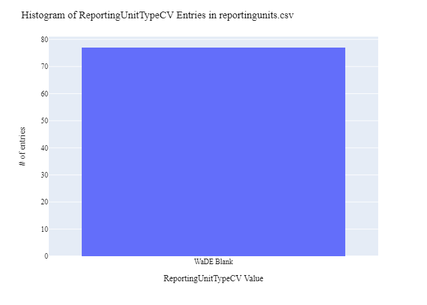
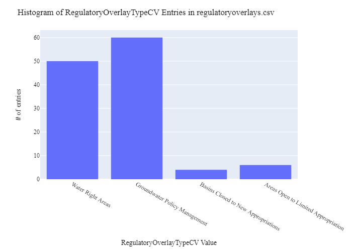

# Utah Department of Natural Resources Regulatory Overview Data Preparation for WaDE
This readme details the process that was applied by the staff of the [Western States Water Council (WSWC)](http://wade.westernstateswater.org/) to extracting regulatory overlay area data, made available by the [Utah Department of Natural Resources](https://naturalresources.utah.gov/), for inclusion into the Water Data Exchange (WaDE) project.  WaDE enables states to share data with each other and the public in a more streamlined and cost-effective way.

## Overview of Source Data Utilized
The following data was used for water allocations...

Name | Description | Download Link | Metadata Glossary Link
---------- | ---------- | ------------ | ------------
**Utah Water Right Areas** | Water Right Areas Service, where administrative boundaries based primarily on surface drainage areas.  | [link](https://opendata.gis.utah.gov/datasets/utahDNR::utah-water-right-areas/about) | Not Provided
**Groundwater Policy Management** | Areas throughout Utah to promote wise use of the ground-water, protect existing water rights, and address water quality issues and over-appropriation of ground water. | Emailed through personal correspondence with state | [link](https://www.waterrights.utah.gov/groundwater/)
**BasinsClosedToNewAppropriations** | Water Right areas / basins closed to new appropriations. | Emailed through personal correspondence with state | Not Provided
**AreasOpenToLimitedAppropriation** | Water Right Areas with limited new appropriations. | Emailed through personal correspondence with state | Not Provided

Unique files were created to be used as input.  Input files used are as follows...
- WaterRightAreasServiceView.zip (zipped shp & dbf files)
- ground_water_policy.zip (zipped shp & dbf files)
- BasinsClosedToNewAppropriations (zipped shp & dbf files)
- AreasOpenToLimitedAppropriation.zip (zipped shp & dbf files)

## Storage for WaDE 2.0 Source and Processed Water Data
The 1) raw input data shared by the state / state agency / data provider (excel, csv, shapefiles, PDF, etc), & the 2) csv processed input data ready to load into the WaDE database, can both be found within the WaDE sponsored Google Drive.  Please contact WaDE staff if unavailable or if you have any questions about the data.
- Utah Department of Natural Resources Regulatory Data: [link](https://drive.google.com/drive/folders/1zXz1qOKe2I20L_Oov5gIBxGeDyuz4Ynk)

## Summary of Data Prep
The following text summarizes the process used by the WSWC staff to prepare and share the state's water rights data for inclusion into the Water Data Exchange (WaDE 2.0) project.  For a complete mapping outline, see *UTre_RegulatoryInfo Schema Mapping to WaDE.xlsx*. Several WaDE csv input files will be created in order to extract the water rights data from the above mentioned input.  Each of these WaDE csv input files was created using the [Python](https://www.python.org/) native language, built and ran within [Jupyter Notebooks](https://jupyter.org/) environment.  Those python files include the following...

- **1_UTre_PreProcessRegulatoryData.ipynb**: used to pre-processes the native date into a WaDE format friendly format.  All datatype conversions occur here.
- **2_UTre_CreateWaDEInputFiles.ipynb**: used to create the WaDE input csv files: date.csv, organization.csv, reportingunits.csv, regulatoryoverlays.csv, regulatoryreportingunits.csv, sites.csv, etc.
- **3_UTre_WRSiteRegulatoryID.ipynb**: used to pair regulatory overlay information to water allocation information using an overlay on water allocation site information within the boundaries of the regulation.
- **4_UTre_WaDEDataAssessmentScript.ipynb**: used to evaluate the WaDE input csv files.

***
## Code File: 1_UTre_PreProcessRegulatoryData.ipynb
Purpose: Pre-process the input data files and merge them into one master file for simple dataframe creation and extraction.

#### Inputs: 
- WaterRightAreasServiceView.zip (zipped shp & dbf files)
- ground_water_policy.zip (zipped shp & dbf files)
- BasinsClosedToNewAppropriations (zipped shp & dbf files)
- AreasOpenToLimitedAppropriation.zip (zipped shp & dbf files)

#### Outputs:
 - Pre_utMain.zip
 - P_Geometry.zip

#### Operation and Steps:
- Read in each data source and store into temporary dataframes.
- Extract key WadE information needed from each source, combine into single output dataframe outdf.
- Clean & inspect the data (remove special characters, round float values, remove white space between strings).
- Extract geometry values from temporary dataframes, save as P_Geometry df.
- Export output dataframe as new csv file, *Pre_utMain.csv* for tabular data and *P_Geometry.csv* for geometry data.

***
## Code File: 2_UTwr_CreateWaDEInputFiles.ipynb
Purpose: generate WaDE csv input files (date.csv, organizations.csv, reportingunits.csv, regulatoryoverlays.csv, regulatoryreportingunits.csv, sites.csv).

#### Inputs:
- Pre_utMain.zip
- P_Geometry.zip

#### Outputs:
- date.csv  `Create by hand.`
- organizations.csv  `Create by hand.`
- reportingunits.csv
- regulatoryoverlays.csv 
- regulatoryreportingunits.csv

## 1) Date Information
Purpose: generate legend of granular date used on data collection.

#### Operation and Steps:
- Generate single output dataframe *outdf*.
- Populate output dataframe with *WaDE Date* specific columns.
- Assign agency info to the *WaDE Date* specific columns (this was hardcoded by hand for simplicity).
- Perform error check on output dataframe.
- Export output dataframe *methods.csv*.

#### Sample Output (WARNING: not all fields shown):
Date | Year 
---------- | ---------- 
12/10/2023 | 2023

## 2) Organization Information
Purpose: generate organization directory, including names, email addresses, and website hyperlinks for organization supplying data source.

#### Operation and Steps:
- Generate single output dataframe *outdf*.
- Populate output dataframe with *WaDE Organizations* specific columns.
- Assign agency info to the *WaDE Organizations* specific columns (this was hardcoded by hand for simplicity).
- Assign organization UUID identifier to each (unique) row.
- Perform error check on output dataframe.
- Export output dataframe *organizations.csv*.

#### Sample Output (WARNING: not all fields shown):
OrganizationUUID | OrganizationContactEmail | OrganizationContactName | OrganizationName | OrganizationPhoneNumber | OrganizationPurview | OrganizationWebsite | State
---------- | ---------- | ------------ | ------------ | ------------ | ------------ | ------------ | ------------
UTre_O1 | jreese@utah.gov | Jim Reese (Assistant State Engineer - Technical Services) | Utah Department of Natural Resources | 801-538-7200 | Managing and protecting natural resources | https://naturalresources.utah.gov/ | UT

### 3) Reporting Unit Information
Purpose: generate a list of polygon areas associated with the state agency regulatory overlay area data.

#### Operation and Steps:
- Read the input file and generate single output dataframe *outdf*.
- Populate output dataframe with *WaDE ReportingUnits* specific columns.
- Assign state agency data info to the *WaDE ReportingUnits* specific columns.  See *UTre_RegulatoryInfo Schema Mapping to WaDE.xlsx* for specific details.  Items of note are as follows...
    - *ReportingUnitUUID* = create unique it based on **AREA_CODE** input.
    - *EPSGCodeCV* = "4326".
    - *ReportingUnitName* = "WaDE Blank" (not provided)
    - *ReportingUnitNativeID* = **AREA_CODE** input.
    - *ReportingUnitProductVersion* = "" (not provided)
    - *ReportingUnitTypeCV* = "Water Right Areas", "Areas Open to Limited Appropriation", "Basins Closed to New Appropriations"
    - *ReportingUnitUpdateDate* = "5/31/2022"
    - *StateCV* = "UT"
    - *Geometry* = **geometry** input, converted to WGS 1984 coordinate.
- Consolidate output dataframe into site specific information only by dropping duplicate entries, drop by WaDE specific *ReportingUnitName*, *ReportingUnitNativeID* & *ReportingUnitTypeCV* fields.
- Assign reportingunits UUID identifier to each (unique) row.
- Perform error check on output dataframe.
- Export output dataframe *sites.csv*.

#### Sample Output (WARNING: not all fields shown):
ReportingUnitUUID | EPSGCodeCV | ReportingUnitName | ReportingUnitNativeID | ReportingUnitProductVersion | ReportingUnitTypeCV | ReportingUnitUpdateDate | StateCV | Geometry 
---------- | ---------- | ------------ | ------------ | ------------ | ------------ | ------------ | ------------ | ------------  
UTre_RUutr101| 4326 | WaDE Blank | utr101 | - | Water Right Areas | 5/31/2022 | UT

Any data fields that are missing required values and dropped from the WaDE-ready dataset are instead saved in a separate csv file (e.g. *reportingunits_missing.csv*) for review.  This allows for future inspection and ease of inspection on missing items.  Mandatory fields for the reportingunits include the following...
- ReportingUnitUUID
- ReportingUnitName
- ReportingUnitNativeID
- ReportingUnitTypeCV
- StateCV

### 4) Regulatory Overlays Information
Purpose: generate master sheet of regulatory overlay area information to import into WaDE 2.0.

#### Operation and Steps:
- Read the input files and generate single output dataframe *outdf*.
- Populate output dataframe with *WaDE Water Regulatory Overlays* specific columns.
- Assign state agency data info to the *WaDE Water Regulatory Overlays* specific columns.  See *UTre_RegulatoryInfo Schema Mapping to WaDE.xlsx* for specific details.  Items of note are as follows...
    - *RegulatoryOverlayUUID* = create unique it based on **AREA_CODE** input.
    - *OversightAgency* = **Office** input.
    - *RegulatoryDescription* = unique to each input file, see UTre_RegulatoryInfo Schema Mapping to WaDE.xlsx for specifics.
    - *RegulatoryName* = '"WaDE Blank" (not provided)
    - *RegulatoryOverlayNativeID* = **AREA_CODE** input.
    - *RegulatoryStatusCV* = "Active"
    - *RegulatoryStatue* = (not provided)
    - *RegulatoryStatuteLink* = **Link** input.
    - *StatutoryEffectiveDate* = "12/10/2023" (not provided, filler value)
    - *RegulatoryOverlayTypeCV* = "Water Right Areas", "Areas Open to Limited Appropriation", "Basins Closed to New Appropriations"
    - *WaterSourceTypeCV* = "Surface Water and Groundwater"
- Perform error check on output dataframe.
- Export output dataframe *regulatoryoverlays.csv*.

#### Sample Output (WARNING: not all fields shown):
RegulatoryOverlayUUID| OversightAgency | RegulatoryDescription | RegulatoryName | RegulatoryOverlayNativeID | RegulatoryStatusCV | RegulatoryStatute | RegulatoryStatuteLink | StatutoryEffectiveDate | StatutoryEndDate | RegulatoryOverlayTypeCV | WaterSourceTypeCV
---------- | ---------- | ------------ | ------------ | ------------ | ------------ | ------------ | ------------ | ------------ | ------------ | ------------ | ------------
UTre_ROutr101 | Southeastern Regional Office (PRICE) | Water Right Areas are administrative boundarie... | WaDE Blank | utr101 | Active	| - | http://www.waterrights.utah.gov/wrinfo/policy/... | 	 2023-12-10	| - | Water Right Areas | Surface Water and Groundwater

Any data fields that are missing required values and dropped from the WaDE-ready dataset are instead saved in a separate csv file (e.g. *regulatoryoverlays_missing.csv*) for review.  This allows for future inspection and ease of inspection on missing items.  Mandatory fields for the water regulatory overlays include the following...
- RegulatoryOverlayUUID
- OversightAgency
- RegulatoryDescription
- RegulatoryName
- RegulatoryStatusCV
- StatutoryEffectiveDate

### 5) Regulatory Reporting Units Information 
Purpose: generate master sheet of regulatory overlay area information and how it algins with reporting unit area information.

#### Operation and Steps:
- Read the input file and generate single output dataframe *outdf*.
- Populate output dataframe with *WaDE Regulatory Reportingunits* specific columns.
- Assign state agency data info to the *WaDE Regulatory Reportingunits* specific columns.  See *UTre_RegulatoryInfo Schema Mapping to WaDE.xlsx* for specific details.  Items of note are as follows...
    - *DataPublicationDate* = use date of file creation
    - *OrganizationUUID* = pull from organization.csv
    - *RegulatoryOverlayUUID* = pull form regulatoryoverlay.csv
    - *ReportingUnitUUID* = pull from reportingunit.csv
- Consolidate output dataframe into site specific information only by dropping duplicate entries, drop by WaDE specific *ReportingUnitName*, *ReportingUnitNativeID* & *ReportingUnitTypeCV* fields.
- Assign reportingunits UUID identifier to each (unique) row.
- Perform error check on output dataframe.
- Export output dataframe *regulatoryreportingunits.csv*.

#### Sample Output (WARNING: not all fields shown):
DataPublicationDate | OrganizationUUID | RegulatoryOverlayUUID | ReportingUnitUUID 
---------- | ---------- | ------------ | ------------ 
12/11/2023 | UTre_O1 | UTre_ROutr185 | UTre_RUutr185

Any data fields that are missing required values and dropped from the WaDE-ready dataset are instead saved in a separate csv file (e.g. *regulatoryreportingunits_missing.csv*) for review.  This allows for future inspection and ease of inspection on missing items.  Mandatory fields for the regulatory reportingunits include the following...
- DataPublicationDate
- OrganizationUUID
- RegulatoryOverlayUUID
- ReportingUnitUUID

***
## Source Data & WaDE Complied Data Assessment
The following info is from a data assessment evaluation of the completed data...

Dataset | Num of Source Entries (rows) 
---------- | ----------
**Utah Water Right Areas** | 51
**Groundwater Policy Management** | 60
**BasinsClosedToNewAppropriations** | 5
**AreasOpenToLimitedAppropriation** | 7

Dataset | Num of Identified Reporting Units | Num of Identified Regulatory Overlays
---------- | ---------- | ------------
**Compiled WaDE Data** | 77 | 120

Assessment of Removed Source Records | Count | Action
---------- | ---------- | ----------
...nothing removed | - | -

**Figure 1:** Distribution of Reporting Unit Name within reportingunits.csv

**Figure 2:** Distribution of Reporting Unit Type within reportingunits.csv

**Figure 3:** Distribution of Oversight Agency within the regulatoryoverlays.csv

**Figure 4:** Distribution of Regulatory Overlay Type within the regulatoryoverlays.csv

**Figure 5:** Map of Regulatory Areas (i.e., Reporting Unit)

**Figure 6:** Map of identified water rights within the Regulatory Areas Polygons within the sites.csv

***
## Staff Contributions
Data created here was a contribution between the [Western States Water Council (WSWC)](http://wade.westernstateswater.org/) and the [Utah Department of Natural Resources](https://naturalresources.utah.gov/).

WSWC Staff
- Ryan James (Data Analysis) <rjames@wswc.utah.gov>

Utah Department of Natural Resources Staff
- "{name of staff member that is our point of contact for this data}" <"{point of contacts email"}>
