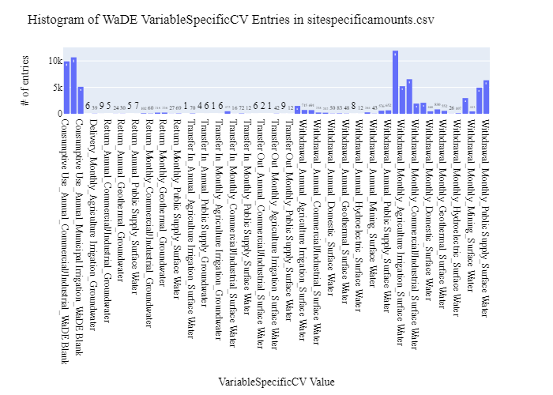

# UT Site-Specific Public Supply Time Series Data Preparation for WaDE
This readme details the process that was applied by the staff of the [Western States Water Council (WSWC)](http://wade.westernstateswater.org/) to extracting site-specific public supply time series data made available by the [Utah Division of Water Rights (UDWRi)](https://water.utah.gov/), for inclusion into the Water Data Exchange (WaDE) project.  WaDE enables states to share data with each other and the public in a more streamlined and consistent way.  WaDE is not intended to replace the states data or become the source for that data but rather to enable regional analysis to inform policy decisions and for planning purposes. 

## Overview of Source Data Utilized
The following data was used for water allocations...

Name | Description | Download Link | Metadata Glossary Link
---------- | ---------- | ------------ | ------------
**Water Use Data Portal** | M&I data, and broken up into System** and Source information.| [link](https://waterrights.utah.gov/asp_apps/waterUseData/setFilters.asp) | not provided
**Utah Culinary Water Suppliers** | Polygon location data paired with the M&I System informationU data to location data.| [link]( https://dwre-utahdnr.opendata.arcgis.com/datasets/utahDNR::culinarywaterserviceareas/about) | [link](https://www.arcgis.com/sharing/rest/content/items/dc62a286013f447e88fc45480077c944/info/metadata/metadata.xml?format=default&output=html)

Please note that the UDWRe has this webpage for Municipal and Industrial Water Use Data.  The page has helpful notes at the bottom that explain the context of the data.  We didn’t use this data because the Division of Water Rights data source above compiles all the years data together which is easier for WaDE use [link](https://dwre-utahdnr.opendata.arcgis.com/pages/municipal-and-industrial-data)

Adam Clark summarized:
>The Utah Culinary Water Service Areas spatial database is a combination of work and collaboration between the Division of Water Resources (UDWRe) and the Division of Water Rights (UDWRi)) within the Department of Natural Resources, and the Division of Drinking Water (UDDW) within the Department of Environmental Quality. Water Resources is the data steward/creator, but receives input from the other divisions on systems.  Water Rights and Drinking Water both maintain separate non-spatial databases of water systems.  Water Rights is mostly focused on water usage and sources, while Drinking Water is more focused on compliance and water quality.*  While all three divisions share attributes in some ways, they differ in others.  If you were to join their own databases, you would find that the number of systems differs between all three.  The Utah Culinary Water Service Areas spatial database is the Division of Water Resources’ master database that includes all systems, past and present.  It also includes large and small systems, non-public systems, and self-supplied industry.  You will find three columns of system IDs, because all three divisions use different ID systems for tracking/updating.  You can think of the spatial database as a bridge or hybrid between the other two.*  Feel free to use Water Rights' query service to get more information on systems.  Just realize that it will not have information on all of the systems included in the spatial database.  Water Rights uses our feature service in their website to show boundaries for systems, but I guarantee that many of the systems in the service are not used.

Input files used are as follows...
- water_use_data_Source.zip, source data from Water Use Data Portal
- water_use_data_System.zip, system data from Water Use Data Portal
- CulinaryWaterServiceArea.zip, shp file of related system geometry
 

## Storage for WaDE 2.0 Source and Processed Water Data
The 1) raw input data shared by the state / state agency / data provider (excel, csv, shapefiles, PDF, etc), & the 2) csv processed input data ready to load into the WaDE database, can both be found within the WaDE sponsored Google Drive.  Please contact WaDE staff if unavailable or if you have any questions about the data.
- UT Site-Specific Public Supply Time Series Data: [link](https://drive.google.com/drive/folders/1RMxFNywr3nWWzx9fVlBIfdL3-aGtTUeW?usp=drive_link)

## Summary of Data Prep
The following text summarizes the process used by the WSWC staff to prepare and share UT's site-specific public supply time series data for inclusion into the Water Data Exchange (WaDE 2.0) project.  For a complete mapping outline, see *UTssps_Public Supply Water Use Schema Mapping to WaDE.xlsx*.  Several WaDE csv input files will be created in order to extract the UT's site-specific public supply time series data from the above mentioned input.  Each of these WaDE csv input files was created using the [Python](https://www.python.org/) native language, built and ran within [Jupyter Notebooks](https://jupyter.org/) environment.  Those python files include the following...

- **1_UTssps_PreProcessAllocationData.ipynb**: used to pre-processes the native date into a WaDE format friendly format.  All datatype conversions occur here.
- **2_UTssps_CreateWaDEInputFiles.ipynb**: used to create the WaDE input csv files: methods.csv, variables.csv, organizations.csv, watersources.csv, sites.csv, sitespecificamounts.csv, podsitetopousiterelationships.csv.
- **3_UTssps_WaDEDataAssessmentScript.ipynb**: used to evaluate the WaDE input csv files.

***
### 0) Code File: 1_UTssps_PreProcessAllocationData.ipynb
Purpose: Pre-process the state agency's input data files and merge them into one master file for simple dataframe creation and extraction.

#### Inputs: 
- water_use_data_Source.zip
- water_use_data_System.zip
- CulinaryWaterServiceArea.zip

#### Outputs:
 - Pssps_xxMain.zip
 - geometry.zip

#### Operation and Steps:
- Read in data and store in temporary dataframes corresponding to source, system, and system shp files.
- Remove special characters from **Source Name** **System Name** inputs in both source & system data respectively data
- For Source data (we will treat this like POD)...
  - Pair system **System Name**, **County** inputs from system data via **System ID**
  - Create a filler blank value for **Method of Measurement** input.
  - Assign high level overview of water source type from **Source Type** input.
  - Assign WaDE appropriate values from inputs bu iterating through source data using a amount (Jan-Dec, Total), aggregation type (Monthly vs Annual), start and end date lists.
- For System data (will will treat this like POU)...
  - Pair CulinaryWaterServiceArea shp info via **WRID** to **System ID** inputs.
  - Assign WaDE appropriate values from inputs bu iterating through source data using a ben use ("Domestic", "Commercial", "Industrial", "Institutional"), and amount ("Domestic Use", "Commercial Use", "Industrial Use", "Institutional Use") lists.
 - Concatenate WaDE Source & System dataframes together into single long dataframe.
 - Check and clean data types.
 - Generate WaDE specific *WaterSourceNativeID* & *SiteNativeID** (if missing) using inputs for unique inputs.
 - Export output dataframe as new csv file, *Pssps_Main.zip* & *P_Geometry.zip*.

***
## Code File: 2_UTssps_CreateWaDEInputFiles.ipynb
Purpose: generate WaDE csv input files (methods.csv, variables.csv, organizations.csv, watersources.csv, sites.csv, sitespecificamounts.csv, podsitetopousiterelationships.csv).

#### Inputs:
- Pssps_Main.zip

#### Outputs:
- methods.csv  `Create by hand.`
- variables.csv  `Create by hand.`
- organizations.csv  `Create by hand.`
- watersources.csv
- sites.csv
- sitespecificamounts.csv
- podsitetopousiterelationships.csv

## 1) Method Information
Purpose: generate legend of granular methods used on data collection.

#### Operation and Steps:
- Generate single output dataframe *outdf*.
- Populate output dataframe with *WaDE Method* specific columns.
- Assign state info to the *WaDE Method* specific columns (this was hardcoded by hand for simplicity).
- Assign method UUID identifier to each (unique) row.
- Perform error check on output dataframe.
- Export output dataframe *methods.csv*.

#### Sample Output (WARNING: not all fields shown):
|    | MethodUUID   | ApplicableResourceTypeCV    | DataConfidenceValue   | DataCoverageValue   | DataQualityValueCV   | MethodName   | MethodNEMILink   | MethodTypeCV   | WaDEDataMappingUrl                                                                                           |
|---:|:-------------|:----------------------------|:----------------------|:--------------------|:---------------------|:-------------|:-----------------|:---------------|:-------------------------------------------------------------------------------------------------------------|
|  0 | UTssps_M1    | Surface Water & Groundwater |                       |                     |                      | WaDE Blank   |                  | Estimated      | https://github.com/WSWCWaterDataExchange/MappingStatesDataToWaDE2.0/tree/master/Utah/SS_PublicSupplyWaterUse |

## 2) Variables Information
Purpose: generate legend of granular variables specific to each state.

#### Operation and Steps:
- Generate single output dataframe *outdf*.
- Populate output dataframe with *WaDE Variable* specific columns.
- Assign state info to the *WaDE Variable* specific columns (this was hardcoded by hand for simplicity).
- Assign variable UUID identifier to each (unique) row.
- Perform error check on output dataframe.
- Export output dataframe *variables.csv*.

#### Sample Output (WARNING: not all fields shown):
|    | VariableSpecificUUID   |   AggregationInterval | AggregationIntervalUnitCV   | AggregationStatisticCV   | AmountUnitCV   | MaximumAmountUnitCV   |   ReportYearStartMonth | ReportYearTypeCV   | VariableCV      | VariableSpecificCV                                      |
|---:|:-----------------------|----------------------:|:----------------------------|:-------------------------|:---------------|:----------------------|-----------------------:|:-------------------|:----------------|:--------------------------------------------------------|
|  0 | UTssps_V1              |                     1 | Annual                      | Average                  | G              | G                     |                      1 | CalendarYear       | Consumptive Use | Consumptive Use_Annual_Commercial/Industrial_WaDE Blank |

## 3) Organization  Information
Purpose: generate organization directory, including names, email addresses, and website hyperlinks for organization supplying data source.

#### Operation and Steps:
- Generate single output dataframe *outdf*.
- Populate output dataframe with *WaDE Organizations* specific columns.
- Assign state info to the *WaDE Organizations* specific columns (this was hardcoded by hand for simplicity).
- Assign organization UUID identifier to each (unique) row.
- Perform error check on output dataframe.
- Export output dataframe *organizations.csv*.

#### Sample Output (WARNING: not all fields shown):
|    | OrganizationUUID   | OrganizationContactEmail   | OrganizationContactName                                   | OrganizationName              | OrganizationPhoneNumber   | OrganizationPurview                                                                                                                                                                                                    | OrganizationWebsite           | State   |
|---:|:-------------------|:---------------------------|:----------------------------------------------------------|:------------------------------|:--------------------------|:-----------------------------------------------------------------------------------------------------------------------------------------------------------------------------------------------------------------------|:------------------------------|:--------|
|  0 | UTssps_O1          | jreese@utah.gov            | Jim Reese (Assistant State Engineer - Technical Services) | Utah Division of Water Rights | 801-538-7240              | The Utah Division of Water Rights (DWRi) is an agency of Utah State Government within the Department of Natural Resources that administers the appropriation and distribution of the State's valuable water resources. | https://waterrights.utah.gov/ | UT      |

## 4) Water Source Information
Purpose: generate a list of water sources specific to a water right.

#### Operation and Steps:
- Read the input file and generate single output dataframe *outdf*.
- Populate output dataframe with *WaDE WaterSources* specific columns.
- Assign agency info to the *WaDE WaterSources* specific columns.  See *UTssps_Public Supply Water Use Schema Mapping to WaDE.xlsx* for specific details.  Items of note are as follows...
    - *WaterSourceUUID* = "UTssps_WS" + create unique ID using *WaterSourceNativeID* inputs
    - *WaterQualityIndicatorCV* = "Fresh"
    - *WaterSourceName* = ""
    - *WaterSourceNativeID* = create unique IDs 
    - *WaterSourceTypeCV* = **Source Type** for Source Data, "WaDE Blank" for System Data.
- Consolidate output dataframe into water source specific information only by dropping duplicate entries, drop by WaDE specific *WaterSourceName* & *WaterSourceTypeCV* fields.
- Assign water source UUID identifier to each (unique) row.
- Perform error check on output dataframe.
- Export output dataframe *WaterSources.csv*.

#### Sample Output (WARNING: not all fields shown):
|    | WaterSourceUUID   | Geometry   | GNISFeatureNameCV   | WaterQualityIndicatorCV   | WaterSourceName   | WaterSourceNativeID   | WaterSourceTypeCV   |
|---:|:------------------|:-----------|:--------------------|:--------------------------|:------------------|:----------------------|:--------------------|
|  0 | UTssps_WSwadeId1  |            |                     | Fresh                     | Wade Blank        | wadeId1               | Surface Water       |

Any data fields that are missing required values and dropped from the WaDE-ready dataset are instead saved in a separate csv file (e.g. *watersources_missing.csv*) for review.  This allows for future inspection and ease of inspection on missing items.  Mandatory fields for the water sources include the following...
- WaterSourceUUID
- WaterQualityIndicatorCV
- WaterSourceTypeCV

## 5) Site Information
Purpose: generate a list of sites information.

#### Operation and Steps:
- Read the input file and generate single output dataframe *outdf*.
- Populate output dataframe with *WaDE Site* specific columns.
- Assign agency info to the *WaDE Site* specific columns.  See *UTssps_Public Supply Water Use Schema Mapping to WaDE.xlsx* for specific details.  Items of note are as follows...
    - *SiteUUID* = "UTssps_S" + create unique ID using *SiteNativeID* inputs
    - *WaterSourceUUIDs* = Extract *WaterSourceUUID* from waterSources.csv input csv file. See code for specific implementation of extraction.
    - *CoordinateAccuracy* = ""
    - *CoordinateMethodCV* = ""
    - *Country* = **County** input.
    - *EPSGCodeCV* = "4326"
    - *Geometry* = For system data, extract geometry from shp file input.
    - *GNISCodeCV* = ""
    - *HUC12* = ""
    - *HUC8* = ""
    - *Latitude* = **Lat NAD83** for Source data, create custom center value for System data.
    - *Longitude* = **Lon NAD83** for Source data, create custom center value for System data.
    - *NHDNetworkStatusCV* = ""
    - *NHDProductCV* = ""
    - *PODorPOUSite* = "POD" for Source data, "POU" for System data.
    - *SiteName* = **Source Name** for Source data, **System Name** for System data.
    - *SiteNativeID* = **Source ID** for Source data, **System ID** for System data.
    - *SiteTypeCV* = **Source Type** for both Source and System data.
    - *StateCV* = "UT"
    - *USGSSiteID* = ""
- Consolidate output dataframe into site specific information only by dropping duplicate entries, drop by WaDE specific *SiteNativeID*, *SiteName*, *SiteTypeCV*, *Longitude* & *Latitude* fields.
- Assign site UUID identifier to each (unique) row.
- Perform error check on output dataframe.
- Export output dataframe *sites.csv*.

#### Sample Output (WARNING: not all fields shown):
|    | SiteUUID           | RegulatoryOverlayUUIDs   | WaterSourceUUIDs   | CoordinateAccuracy   | CoordinateMethodCV   | County    |   EPSGCodeCV | GNISCodeCV   | HUC12   | HUC8   |   Latitude |   Longitude | NHDNetworkStatusCV   | NHDProductCV   | PODorPOUSite   | SiteName   | SiteNativeID   | SitePoint   | SiteTypeCV   | StateCV   | USGSSiteID   |
|---:|:-------------------|:-------------------------|:-------------------|:---------------------|:---------------------|:----------|-------------:|:-------------|:--------|:-------|-----------:|------------:|:---------------------|:---------------|:---------------|:-----------|:---------------|:------------|:-------------|:----------|:-------------|
|  0 | UTssps_Sd100010001 |                          | UTssps_WSwadeId2   | WaDE Blank           | WaDE Blank           | Salt Lake |         4326 |              |         |        |    40.6652 |    -111.931 |                      |                | POD            | Well       | d100010001     |             | Well         | UT        |              |

Any data fields that are missing required values and dropped from the WaDE-ready dataset are instead saved in a separate csv file (e.g. *sites_missing.csv*) for review.  This allows for future inspection and ease of inspection on missing items.  Mandatory fields for the sites include the following...
- SiteUUID 
- CoordinateMethodCV
- EPSGCodeCV
- SiteName

## 6) SiteSpecificAmounts Information
Purpose: generate master sheet of site-specific amount information to import into WaDE 2.0.

#### Operation and Steps:
- Read the input files and generate single output dataframe *outdf*.
- Populate output dataframe with *WaDE site-specific amount* specific columns.
- Assign agency info to the *WaDE site-specific amount* specific columns.  See *UTssps_Public Supply Water Use Schema Mapping to WaDE.xlsx* for specific details.  Items of note are as follows...
    - Extract *MethodUUID*, *VariableSpecificUUID*, *OrganizationUUID*, *WaterSourceUUID*, & *SiteUUID* from respective input csv files. See code for specific implementation of extraction.
    - *Amount* = extract from amount columns using iterative lists, see above *1_UTssps_PreProcessAllocationData.ipynb* for specifics. 
    - *AssociatedNativeAllocationIDs* = ""
    - *BeneficialUseCategory* = **Use Type** for Source data,"Domestic, Commercial, Industrial, Institutional" for System data to match corresponding amount data.
    - *CommunityWaterSupplySystem* = ""
    - *CropTypeCV* = ""
    - *CustomerTypeCV* = ""
    - *DataPublicationDate* = ""
    - *DataPublicationDOI* = ""
    - *Geometry* = ""
    - *IrrigatedAcreage* = ""
    - *IrrigationMethodCV* = ""
    - *PopulationServed* = **Population** input for System data only.
    - *PowerGeneratedGWh* = ""
    - *PowerType* = ""
    - *PrimaryUseCategory* = ""
    - *ReportYearCV* = **Year** for Source data, **History Year** for System data.
    - *SDWISIdentifier* = ""
    - *TimeframeEnd* = For monthly use corresponding correct end dates per month, pair with **Year** for Source data, **History Year** for System data.  For Annual use "12/31".
    - *TimeframeStart* = For monthly use corresponding correct start dates per month, pair with **Year** for Source data, **History Year** for System data.  For Annual use "01/01".
																						
- Perform error check on output dataframe.
- Export output dataframe *sitespecificamounts.csv*.

#### Sample Output (WARNING: not all fields shown):
|    | MethodUUID   | OrganizationUUID   | SiteUUID          | VariableSpecificUUID   | WaterSourceUUID   |    Amount | AllocationCropDutyAmount   | AssociatedNativeAllocationIDs   | BeneficialUseCategory   | CommunityWaterSupplySystem                   | CropTypeCV   | CustomerTypeCV   | DataPublicationDate   | DataPublicationDOI   | Geometry   | IrrigatedAcreage   | IrrigationMethodCV   |   PopulationServed | PowerGeneratedGWh   | PowerType   | PrimaryUseCategory   |   ReportYearCV | SDWISIdentifier   | TimeframeEnd   | TimeframeStart   |
|---:|:-------------|:-------------------|:------------------|:-----------------------|:------------------|----------:|:---------------------------|:--------------------------------|:------------------------|:---------------------------------------------|:-------------|:-----------------|:----------------------|:---------------------|:-----------|:-------------------|:---------------------|-------------------:|:--------------------|:------------|:---------------------|---------------:|:------------------|:---------------|:-----------------|
|  0 | UTssps_M2    | UTssps_O1          | UTssps_Sd10100017 | UTssps_V81             | UTssps_WSwadeId1  | 1.798e+06 |                            |                                 | Water Supplier          | Provo City Water Resources Division Culinary |              |                  | 03/08/2024            |                      |            |                    |                      |                  0 |                     |             | Public Supply        |           2019 |                   | 2019-01-31     | 2019-01-01       |

Any data fields that are missing required values and dropped from the WaDE-ready dataset are instead saved in a separate csv file (e.g. *sitespecificamounts_missing.csv*) for review.  This allows for future inspection and ease of inspection on missing items.  Mandatory fields for the site-specific amount include the following...
- MethodUUID
- VariableSpecificUUID
- OrganizationUUID
- SiteUUID
- BeneficialUseCategory
- Amount
- DataPublicationDate

### 7) POD Site -To- POU Polygon Relationships
Purpose: generate linking element between POD and POU sites that share the same water right.
Note: podsitetopousiterelationships.csv output only needed if both POD and POU data is present,  `otherwise produces empty file.`

#### Operation and Steps:
- Read the sites.csv & waterallocations.csv input files.
- Create three temporary dataframes: one for waterallocations, & two for site info that will store POD and POU data separately.
- For the temporary POD dataframe...
  - Read in site.csv data from sites.csv with a _PODSiteUUID_ field = POD only.
  - Create _PODSiteUUID_ field = _SiteUUID_.
- For the temporary POU dataframe
  - Read in site.csv data from sites.csv with a _PODSiteUUID_ field = POU only.
  - Create _POUSiteUUID_ field = _SiteUUID_.
- For the temporary waterallocations dataframe, explode _SiteUUID_ field to create unique rows.
- Left-merge POD & POU dataframes to the waterallocations dataframe via _SiteUUID_ field.
- Consolidate waterallocations dataframe by grouping entries by _AllocationNativeID_ filed.
- Explode the consolidated waterallocations dataframe again using the _PODSiteUUID_ field, and again for the _POUSiteUUID_ field to create unique rows.
- Perform error check on waterallocations dataframe (check for NaN values)
- If waterallocations is not empty, export output dataframe _podsitetopousiterelationships.csv_.

***
## Source Data & WaDE Complied Data Assessment
The following info is from a data assessment evaluation of the completed data...

Dataset | Num of Source Entries (rows)
---------- | ---------- 
**Water Use Data Portal - Source** | 8,836
**Water Use Data Portal - System** | 22,514

Dataset  | Num of Identified PODs | Num of Identified POUs | Num of Identified Water Use Records
**Compiled WaDE Data** | 1,312 | 555 | 76,715

Assessment of Removed Source Records | Count | Action
---------- | ---------- | ----------
Unused Site Record                      | 2,900 | removed from sites.csv input
Incomplete or bad entry for Latitude     | 656 | removed from sites.csv input
Negative, blank, or 0 Amount values     | 109,610 | removed from sitespecificamounts.csv input
Incomplete or bad entry for SiteUUID    | 17,875 | removed from sitespecificamounts.csv input

**Figure 1:** Distribution of POD vs POU Sites within the sites.csv

**Figure 2:** Distribution Sites by WaterSourceTypeCV within the sites.csv

**Figure 3:** Distribution of VariableSpecificCV WaDE Values within the sitespecificamounts.csv

**Figure 4:** Distribution of Identified Beneficial Uses within the sitespecificamounts.csv

**Figure 5:** Distribution & Range of Amount (CFS) within the sitespecificamounts.csv

**Figure 6:** Map of Identified Points within the sites.csv

**Figure 7:** Map of Identified Polygons within the sites.csv

***
## Staff Contributions
Data created here was a contribution between the [Western States Water Council (WSWC)](http://wade.westernstateswater.org/) and the [Utah Division of Water Rights (UDWRi)](https://water.utah.gov/).

WSWC Staff
- Adel Abdallah <adelabdallah@wswc.utah.gov>
- Ryan James <rjames@wswc.utah.gov>

UDWRi Staff
- Jim Reese <jreese@utah.gov>

UDWRe Staff
- Jessie Pierson <jpierson@utah.gov>
- Tom Moore <tmoore@utah.gov>
- Aaron Austin <aaronaustin@utah.gov>
- Craig Miller <craigmiller@utah.gov>
- Leila Ahmadi <lahmadi@utah.gov>