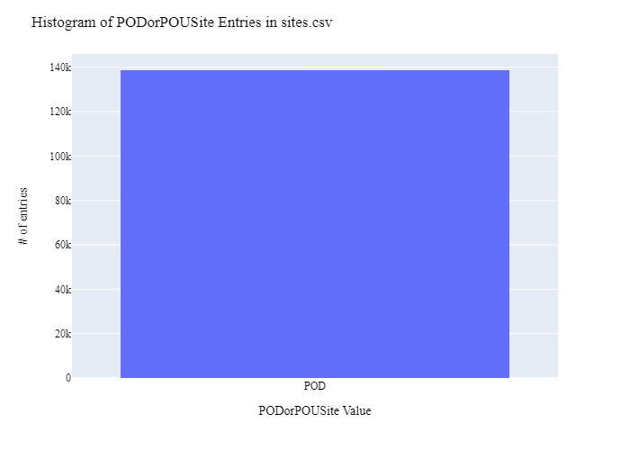

# Wyoming State Geological Survey Water Rights (Allocation) Data Preparation for WaDE
This readme details the process that was applied by the staff of the [Western States Water Council (WSWC)](http://wade.westernstateswater.org/) to extracting water rights data made available by the [Wyoming State Geological Survey ](https://www.wsgs.WSGSo.gov/), for inclusion into the Water Data Exchange (WaDE) project.  WaDE enables states to share data with each other and the public in a more streamlined and consistent way. WaDE is not intended to replace the states data or become the source for that data but rather to enable regional analysis to inform policy decisions and for planning purposes. 

## Overview of Source Data Utilized
The following data was used for water allocations...

Name | Description | Download Link | Metadata Glossary Link
---------- | ---------- | ------------ | ------------
**Well-Spring-Permits** | Place of Diversion| [link](https://portal.wsgs.WSGSo.gov/arcgis/apps/webappviewer/index.html?id=181c32a872a346bfae3579a62230a65a) | [link](https://drive.google.com/file/d/14cvl9vttUfSafINzGRotkuUVi5WlShFi/view)

This shapefile was downloaded to be used as input.  Input files used are as follows...
- well-spring-permits.zip
You then need to convert that zipped shape file to a csv. A easy free way is to upload the shape file to mapshaper.org(https://mapshaper.org/) and then export it as a csv
which is how we transferred the data into a csv file. 
New input files:
- SEOSprings09012023.csv
- SEOWells09012023.csv

## Storage for WaDE 2.0 Source and Processed Water Data
The 1) raw input data shared by the state / state agency / data provider (excel, csv, shapefiles, PDF, etc), & the 2) csv processed input data ready to load into the WaDE database, can both be found within the WaDE sponsored Google Drive.  Please contact WaDE staff if unavailable or if you have any questions about the data.
- Wyoming State Geological Survey Water Rights Allocation Data: https://drive.google.com/drive/folders/1_2lK9V4mnuNW-KZ8wmhCiXIUk-DWVihX

## Summary of Data Prep
The following text summarizes the process used by the WSWC staff to prepare and share water rights data for inclusion into the Water Data Exchange (WaDE 2.0) project.  For a complete mapping outline, see *WSGSwr_Allocation Schema Mapping to WaDE.xlsx*.  Several WaDE csv input files will be created in order to extract the water rights data from the above mentioned input.  Each of these WaDE csv input files was created using the [Python](https://www.python.org/) native language, built and ran within [Jupyter Notebooks](https://jupyter.org/) environment.  Those python files include the following...

- **1_WSGSwr_PreProcessAllocationData.ipynb**: used to pre-processes the native date into a WaDE format friendly format.  All datatype conversions occur here.
- **2_WSGSwr_CreateWaDEInputFiles.ipynb**: used to create the WaDE input csv files: methods.csv, variables.csv, organizations.csv, watersources.csv, sites.csv, waterallocations.csv, podsitetopousiterelationships.csv.
- **3_WSGSwr_WaDEDataAssessmentScript.ipynb**: used to evaluate the WaDE input csv files.

***
## Code File: 1_WSGSwr_PreProcessAllocationData.ipynb
Purpose: Pre-process the input data files and merge them into one master file for simple dataframe creation and extraction.

#### Input: 
- SEOSprings09012023.csv
- SEOWells09012023.csv

#### Outputs:
 - Pwr_wsgsMain.zip

#### Operation and Steps:
Using Jupyter Notebook in Python(which is what this is written in and with) is a simple way to run this operation.
- Read in the 2 input files. Create temporary POD dataframes and concatenate them together to have one dataframe.
- Generate WaDE specific field in_WaterQualityIndicatorCV from schema source field (see preprocess code for specific dictionary used).
- Generate WaDE specific field in_WaterSourceTypeCV from schema source field (see preprocess code for specific dictionary used).
- Generate WaDE specific field in_EPSGCodeCV from schema source field (see preprocess code for specific dictionary used).
- Generate WaDE specific field in_Latitude from schema source field (see preprocess code for specific dictionary used).
- Generate WaDE specific field in_Longitude from schema source field (see preprocess code for specific dictionary used).
- Generate WaDE specific field in_PODorPOUSite from schema source field (see preprocess code for specific dictionary used).
- Generate WaDE specific field in_SiteName from schema source field (see preprocess code for specific dictionary used).
- Generate WaDE specific field in_SiteNativeID from schema source field (see preprocess code for specific dictionary used).
- Generate WaDE specific field in_SiteTypeCV from schema source field (see preprocess code for specific dictionary used).
- Generate WaDE specific field in_StateCV from schema source field (see preprocess code for specific dictionary used).
- Generate WaDE specific field in_AllocationFlow_CFS from schema source field (see preprocess code for specific dictionary used).
- Generate WaDE specific field in_AllocationLegalStatusCV from schema source field (see preprocess code for specific dictionary used).
- Generate WaDE specific field in_AllocationNativeID from schema source field (see preprocess code for specific dictionary used).
- Generate WaDE specific field in_AllocationPriorityDate from schema source field (see preprocess code for specific dictionary used).
- Generate WaDE specific field in_BeneficialUseCategory from schema source field (see preprocess code for specific dictionary used).
- Generate WaDE specific field in_DataPublicationDate from schema source field (see preprocess code for specific dictionary used).
- Generate WaDE specific field in_ExemptOfVolumeFlowPriority from schema source field (see preprocess code for specific dictionary used).
- Generate WaDE specific field in_WaterAllocationNativeURL from schema source field (see preprocess code for specific dictionary used).
- Inspect output dataframe for additional errors / datatypes.

***
## Code File: 2_WSGSwr_CreateWaDEInputFiles.ipynb
Purpose: generate WaDE csv input files (methods.csv, variables.csv, organizations.csv, watersources.csv, sites.csv, waterallocations.csv, podsitetopousiterelationships.csv).

#### Inputs:
- Pwr_wsgsMain.zip

#### Outputs:
- methods.csv  `Create by hand.`
- variables.csv  `Create by hand.`
- organizations.csv  `Create by hand.`
- watersources.csv
- sites.csv
- waterallocations.csv
- podsitetopousiterelationships.csv

## 1) Method Information
Purpose: generate legend of granular methods used on data collection.

#### Operation and Steps:
- Generate single output dataframe *outdf*.
- Populate output dataframe with *WaDE Method* specific columns.
- Assign agency info to the *WaDE Method* specific columns (this was hardcoded by hand for simplicity).
- Assign method UUID identifier to each (unique) row.
- Perform error check on output dataframe.
- Export output dataframe *methods.csv*.

#### Sample Output (WARNING: not all fields shown):
MethodUUID | ApplicableResourceTypeCV | MethodName | MethodNEMILink | MethodTypeCV
---------- | ---------- | ------------ | ------------ | ------------
WSGSwr_M1 | Groundwater | Wyoming State Geological Survey | https://www.wsgs.WSGSo.gov/ | Legal Processes

## 2) Variables Information
Purpose: generate legend of granular variables specific to each state.

#### Operation and Steps:
- Generate single output dataframe *outdf*.
- Populate output dataframe with *WaDE Variable* specific columns.
- Assign agency info to the *WaDE Variable* specific columns (this was hardcoded by hand for simplicity).
- Assign variable UUID identifier to each (unique) row.
- Perform error check on output dataframe.
- Export output dataframe *variables.csv*.

#### Sample Output (WARNING: not all fields shown):
VariableSpecificUUID | AggregationInterval | AggregationIntervalUnitCV | AggregationStatisticCV | AmountUnitCV | VariableCV | VariableSpecificCV 
---------- | ---------- | ------------ | ------------ | ------------ | ------------ | ------------
WSGSwr_V1 | WaDE Unspecified | WaDE Unspecified | WaDE Unspecified | WaDE Unspecified | Allocation | Allocation

## 3) Organization Information
Purpose: generate organization directory, including names, email addresses, and website hyperlinks for organization supplying data source.

#### Operation and Steps:
- Generate single output dataframe *outdf*.
- Populate output dataframe with *WaDE Organizations* specific columns.
- Assign agency info to the *WaDE Organizations* specific columns (this was hardcoded by hand for simplicity).
- Assign organization UUID identifier to each (unique) row.
- Perform error check on output dataframe.
- Export output dataframe *organizations.csv*.

#### Sample Output (WARNING: not all fields shown):
OrganizationUUID | OrganizationName | OrganizationContactName | OrganizationWebsite | State
---------- | ---------- | ------------ | ------------ | ------------
WSGSwr_O1 | Wyoming State Geological Survey | Jim Stafford | https://www.wsgs.WSGSo.gov/ | WSGS 

## 4) Water Source Information
Purpose: generate a list of water sources specific to a water right.

#### Operation and Steps:
- Read the input file and generate single output dataframe *outdf*.
- Break apart AquiferCod entries at Hyphen to get site name and NativeID.
- Populate output dataframe with *WaDE WaterSources* specific columns.
- Assign agency info to the *WaDE WaterSources* specific columns.  See *WSGSwr_Allocation Schema Mapping_WaDE.xlsx* for specific details.  Items of note are as follows...
    - *WaterSourceUUID* = ""WSGSwr_WS" + counter"
    - *WaterQualityIndicatorCV* = "Fresh"
    - *WaterSourceName* = ""
    - *WaterSourceNativeID* = ""
    - *WaterSourceTypeCV* = "Default: Groundwater, unless "Uses" dictate otherwise. "
- Consolidate output dataframe into water source specific information only by dropping duplicate entries, drop by WaDE specific *WaterSourceName* & *WaterSourceTypeCV* fields.
- Assign water source UUID identifier to each (unique) row.
- Perform error check on output dataframe.
- Export output dataframe *WaterSources.csv*.

#### Sample Output (WARNING: not all fields shown):
WaterSourceUUID | WaterQualityIndicatorCV | WaterSourceName | WaterSourceNativeID | WaterSourceTypeCV
---------- | ---------- | ------------ | ------------ | ------------
WSGSwr_WSwadeID1 | Fresh | Wade Blank| wadeID1 | Groundwater

Any data fields that are missing required values and dropped from the WaDE-ready dataset are instead saved in a separate csv file (e.g. *watersources_missing.csv*) for review.  This allows for future inspection and ease of inspection on missing items.  Mandatory fields for the water sources include the following...
- WaterSourceUUID
- WaterQualityIndicatorCV
- WaterSourceTypeCV

## 5) Site Information
Purpose: generate a list of sites information.

#### Operation and Steps:
- Read the input file and generate single output dataframe *outdf*.
- Populate output dataframe with *WaDE Site* specific columns.
- Assign agency info to the *WaDE Site* specific columns.  See *WSGSwr_Allocation Schema Mapping_WaDE.xlsx* for specific details.  Items of note are as follows...
    - *SiteUUID* = ""WSGSwr_S" + counter 
    - *WaterSourceUUIDs* = Extract *WaterSourceUUID* from waterSources.csv input csv file. See code for specific implementation of extraction.
    - *CoordinateAccuracy* = ""
    - *CoordinateMethodCV* = "Digitized"
    - *County* = ""
    - *EPSGCodeCV* = "4326"
    - *Geometry* = ""
    - *GNISCodeCV* = ""
    - *HUC12* = ""
    - *HUC8* = ""
    - *Latitude* = "Latitude"
    - *Longitude* = "Longitude"
    - *NHDNetworkStatusCV* = ""
    - *NHDProductCV* = ""
    - *PODorPOUSite* = "POD"
    - *SiteName* = ""
    - *SiteNativeID* = "WR_Number"
    - *SiteTypeCV* = "Facility_t"
    - *StateCV* = "WSGS"																			
    - *USGSSiteID* = ""
- Consolidate output dataframe into site specific information only by dropping duplicate entries, drop by WaDE specific *SiteNativeID*, *SiteName*, *SiteTypeCV*, *Longitude* & *Latitude* fields.
- Assign site UUID identifier to each (unique) row.
- Perform error check on output dataframe.
- Export output dataframe *sites.csv*.

#### Sample Output (WARNING: not all fields shown):
SiteUUID | WaterSourceUUID | CoordinateMethodCV | County | Latitude | Longitude | PODorPOUSite| SiteName | SiteNativeID | SiteTypeCV
---------- | ---------- | ---------- | ------------ | ------------ | ------------ | ------------ | ------------ | ------------ | ------------
WSGSwr_SPODA10G | WSGSwr_WSwadeID1 | Digitized | WaDE Blank | 43.0416 | -108.51321 | POD | WaDE Blank | PODA1.0G | Well

Any data fields that are missing required values and dropped from the WaDE-ready dataset are instead saved in a separate csv file (e.g. *sites_missing.csv*) for review.  This allows for future inspection and ease of inspection on missing items.  Mandatory fields for the sites include the following...
- SiteUUID 
- CoordinateMethodCV
- EPSGCodeCV
- SiteName

## 6) AllocationsAmounts Information
Purpose: generate master sheet of water allocations to import into WaDE 2.0.

#### Operation and Steps:
- Read the input files and generate single output dataframe *outdf*.
- Populate output dataframe with *WaDE Water Allocations* specific columns.
- Assign agency info to the *WaDE Water Allocations* specific columns.  See *WSGSwr_Allocation Schema Mapping_WaDE.xlsx* for specific details.  Items of note are as follows...
    - Extract *MethodUUID*, *VariableSpecificUUID*, *OrganizationUUID*, & *SiteUUID* from respective input csv files. See code for specific implementation of extraction.
    - *AllocationApplicationDate* = ""
    - *AllocationAssociatedConsumptiveUseSiteIDs* = ""
    - *AllocationAssociatedWithdrawalSiteIDs* = ""
    - *AllocationBasisCV* = ""
    - *AllocationChangeApplicationIndicator* = ""
    - *AllocationCommunityWaterSupplySystem* = ""
    - *AllocationCropDutyAmount* = ""
    - *AllocationExpirationDate* = ""
    - *AllocationFlow_CFS* = "Total_Flow"
    - *AllocationLegalStatusCV* = ""
    - *AllocationNativeID* = "PermitNumb"
    - *AllocationOwner* =  "combine: FirstName, LastName"
    - *AllocationPriorityDate* = "PriorityDa"
    - *AllocationSDWISIdentifierCV* = ""
    - *AllocationTimeframeEnd* = ""
    - *AllocationTimeframeStart* = ""
    - *AllocationTypeCV* = ""
    - *AllocationVolume_AF* = ""
    - *BeneficialUseCategory* = "Uses"
    - *CommunityWaterSupplySystem* = ""
    - *CropTypeCV* = ""
    - *CustomerTypeCV* = ""
    - *DataPublicationDate* = "9/15/2023"
    - *DataPublicationDOI* = ""
    - *ExemptOfVolumeFlowPriority* = "1"
    - *GeneratedPowerCapacityMW* = ""
    - *IrrigatedAcreage* = ""
    - *IrrigationMethodCV* = ""
    - *LegacyAllocationIDs* = ""
    - *OwnerClassificationCV* = ""
    - *PopulationServed* = ""
    - *PowerType* = ""
    - *PrimaryBeneficialUseCategory* = ""
    - *WaterAllocationNativeURL* = "https://www.wsgs.WSGSo.gov/"																							
- Consolidate output dataframe into water allocations specific information only by grouping entries by *AllocationNativeID* filed.
- Perform error check on output dataframe.
- Export output dataframe *waterallocations.csv*.

#### Sample Output (WARNING: not all fields shown):
AllocationUUID | MethodUUID | OrganizationUUID | SiteUUID | VariableSpecificUUID | AllocationFlow_CFS | AllocationLegalStatusCV | AllocationNativeID | AllocationPriorityDate | BeneficialUseCategory
---------- | ---------- | ---------- | ---------- | ---------- | ---------- | ---------- | ---------- | ---------- | ----------
WSGSwr_WR10000 | WSGSwr_M1 | WSGSwr_O1 | WSGSwr_SPODOR22556 | WSGSwr_V1 | 1 | WaDE Blank | 1 | 1886-02-20 | Irrigation Surface water

Any data fields that are missing required values and dropped from the WaDE-ready dataset are instead saved in a separate csv file (e.g. *waterallocations_missing.csv*) for review.  This allows for future inspection and ease of inspection on missing items.  Mandatory fields for the water allocations include the following...
- MethodUUID
- VariableSpecificUUID
- OrganizationUUID
- SiteUUID
- AllocationPriorityDate
- BeneficialUseCategory
- AllocationAmount or AllocationMaximum
- DataPublicationDate

***
## Source Data & WaDE Complied Data Assessment
The following info is from a data assessment evaluation of the completed data...

Dataset | Num of Source Entries (rows)
---------- | ---------- 
**Well-Spring-Permits**  | 223,796

Dataset | Num of Identified PODs | Num of Identified POUs | Num of Identified Water Right Records
---------- | ------------ | ------------ | ------------
**Compiled WaDE Data** | 138,655 | 0 | 138,655

Assessment of Removed Source Records | Count | Action
---------- | ---------- | ----------
"what was removed" | "count of entries removed" | "action taken (il.e., removed from sites.csv)"

**Figure 1:** Distribution of POD vs POU Sites within the sites.csv

**Figure 2:** Distribution Sites by WaterSourceTypeCV within the sites.csv

**Figure 3:** Distribution of Identified Water Right Records by WaDE Categorized Primary Beneficial Uses within the waterallocations.csv

**Figure 4a:** Range of Priority Date of Identified Water Right Records within the waterallocations.csv

**Figure 4b:** Cumulative distribution of Priority Date of Identified Water Right Records within the waterallocations.csv

**Figure 5:** Distribution & Range of Flow (CFS) of Identified Water Right Records within the waterallocations.csv

**Figure 6:** Distribution & Range of Volume (AF) of Identified Water Right Records within the waterallocations.csv
    - No Volume value provided with this data.
<!--  -->

**Figure 7:** Map of Identified Points within the sites.csv

**Figure 8:** Map of Identified Polygons within the sites.csv
    - no geometry data provided.
<!--  -->

***
## Staff Contributions
Data created here was a contribution between the [Western States Water Council (WSWC)](http://wade.westernstateswater.org/) and the [Wyoming State Geological Survey](https://www.wsgs.WSGSo.gov/).

WSWC Staff
- Adel Abdallah (Project Manager) <adelabdallah@wswc.utah.gov>
- Ryan James (Data Analysis) <rjames@wswc.utah.gov>

Wyoming State Geological Survey Staff
- Jim Stafford  
  